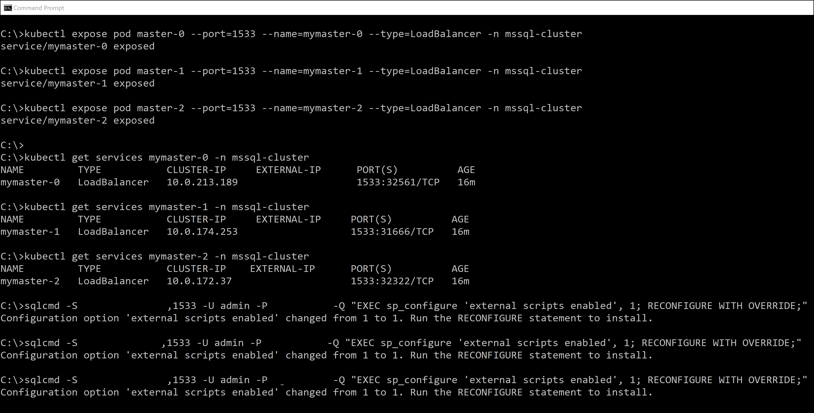

# Run Python and R scripts with Machine Learning Services on SQL Server Big Data Clusters

[!INCLUDE[SQL Server 2019](../includes/applies-to-version/sqlserver2019.md)]

You can run Python and R scripts on the master instance of [SQL Server Big Data Clusters](big-data-cluster-overview.md) with [Machine Learning Services](../machine-learning/index.yml).

> [!NOTE]
> You can also run Java code on the master instance with [SQL Server Language Extensions](../language-extensions/language-extensions-overview.md). Following the steps below will also enable Language Extensions.

## Enable Machine Learning Services

Machine Learning Services is installed by default on Big Data Clusters and does not require separate installation.

To enable Machine Learning Services, run this statement on the master instance:

```sql
EXEC sp_configure 'external scripts enabled', 1
RECONFIGURE WITH OVERRIDE
GO
```

You are now ready to run Python and R scripts on the master instance of Big Data Clusters. See the quickstarts under [Next steps](#next-steps) to run your first script.

>[!NOTE]
>The configuration setting cannot be set on an availability group listener connection. If Big Data Clusters is deployed with high availability, the set `external scripts enabled` on each replica. See [Enable on cluster with high availability](#enable-on-cluster-with-high-availability).

## Enable on cluster with high availability

When you [Deploy SQL Server Big Data Cluster with high availability](deployment-high-availability.md), the deployment creates an availability group for the master instance. To enable Machine Learning Services, set `external scripts enabled` on each instance of the availability group. For a Big Data Cluster, you need to run `sp_configure` on each replica of the SQL Server master instance

The following section describes how to enable external scripts on each instance.

### Create an external load balancer for each instance

For each replica on the availability group, create a load balancer to allow you to connect to the instance. 

`kubectl expose pod <pod-name> --port=<connection port number> --name=<load-balancer-name> --type=LoadBalancer -n <kubernetes namespace>`

The examples in this article use the following values:

- `<pod-name>`: `master-#`
- `<connection port number>`: `1533`
- `<load-balancer-name>`: `mymaster-#`
- `<kubernetes namespace>`: `mssql-cluster`

Update the following script for your environment, and run the commands:

```bash
kubectl expose pod master-0 --port=1533 --name=mymaster-0 --type=LoadBalancer -n mssql-cluster 
kubectl expose pod master-1 --port=1533 --name=mymaster-1 --type=LoadBalancer -n mssql-cluster
kubectl expose pod master-2 --port=1533 --name=mymaster-2 --type=LoadBalancer -n mssql-cluster 
```

`kubectl` returns the following output.

```bash
service/mymaster-0 exposed
service/mymaster-1 exposed
service/mymaster-2 exposed
```

Each load balancer is a master replica endpoint.

### Enable script execution on each replica

1. Get the IP address for the master replica endpoint.

   The following command returns the external IP address for the replica endpoint. 

   `kubectl get services <load-balancer-name> -n <kubernetes namespace>`

   To get the external IP address for each replica in this scenario, run the following commands:

   ```bash
   kubectl get services mymaster-0 -n mssql-cluster
   kubectl get services mymaster-1 -n mssql-cluster
   kubectl get services mymaster-2 -n mssql-cluster
   ```

   >[!NOTE]
   > It may take a little time before the external IP address is available. Run the preceding script periodically until each endpoint returns an external IP address.

1. Connect to the master replica endpoint and enable script execution.

    Run this statement:

    ```sql
    EXEC sp_configure 'external scripts enabled', 1
    RECONFIGURE WITH OVERRIDE
    GO
    ```

   For example, you can run the preceding command with `sqlcmd`. The following example connects to the master replica endpoint and enables script execution. Update the values in the script with for your environment.

   ```bash
   sqlcmd -S <IP address>,1533 -U <user name> -P <password> -Q "EXEC sp_configure 'external scripts enabled', 1; RECONFIGURE WITH OVERRIDE;"
   ```

   Repeat the step for each replica.

### Demonstration

The following image demonstrates this process.

[](media/machine-learning-services/example-kube-enable-scripts.png#lightbox)

You are now ready to run Python and R scripts on the master instance of Big Data Clusters. See the quickstarts under [Next steps](#next-steps) to run your first script.

### Delete the master replica endpoints

On the Kubernetes cluster, delete the endpoint for each replica. The endpoint is exposed in Kubernetes as a load-balancing service.

The following command deletes load-balancing service.

`kubectl delete svc <load-balancer-name> -n mssql-cluster`

For the examples in this article, run the following commands.

```bash
kubectl delete svc mymaster-0 -n mssql-cluster
kubectl delete svc mymaster-1 -n mssql-cluster
kubectl delete svc mymaster-2 -n mssql-cluster
```

## Next steps

+ [Run simple Python scripts](../machine-learning/tutorials/quickstart-python-create-script.md?toc=/sql/toc.json)
+ [Train and score a predictive model in Python](../machine-learning/tutorials/quickstart-python-train-score-model.md?toc=/sql/toc.json)
+ [Run simple R scripts](../machine-learning/tutorials/quickstart-r-create-script.md?toc=/sql/toc.json)
+ [Train and score a predictive model in R](../machine-learning/tutorials/quickstart-r-train-score-model.md?toc=/sql/toc.json)
