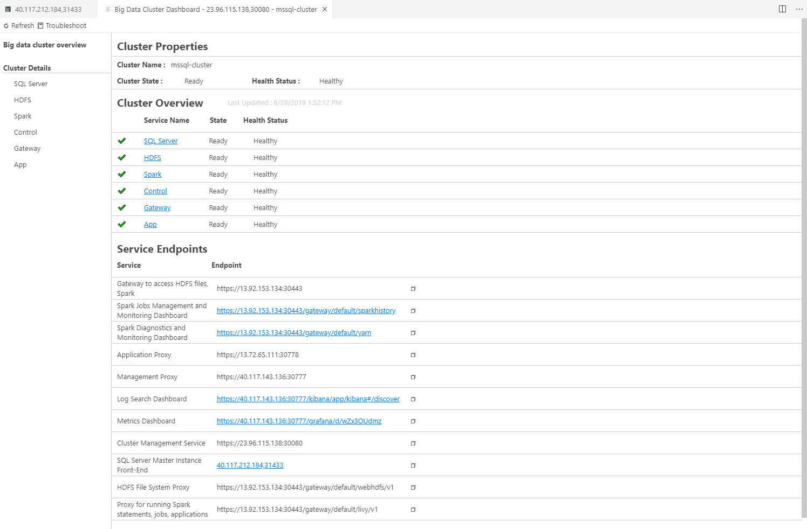

# Manage big data clusters for SQL Server controller dashboard

[!INCLUDE[SQL Server 2019](../includes/applies-to-version/sqlserver2019.md)]

[!INCLUDE[big-data-clusters-banner-retirement](../includes/bdc-banner-retirement.md)]

In addition to **azdata** and the cluster status notebook, there is another way to view the status of a SQL Server Big Data Cluster. You can now add the SQL Server Big Data Cluster controller through the **Connections** viewlet. This enables you to have a dashboard to view the cluster health.

## Prerequisites

The following prerequisites are required to launch the notebook:

* Latest version of [Azure Data Studio](../azure-data-studio/download-azure-data-studio.md)
* [[!INCLUDE[sql-server-2019](../includes/sssql19-md.md)] extension installed in Azure Data Studio](../azure-data-studio/data-virtualization-extension.md)

In addition to above, SQL Server 2019 Big Data Cluster also requires:

* **azdata**
    - [Windows installer](../azdata/install/deploy-install-azdata-installer.md)
    - [Linux package manager](../azdata/install/deploy-install-azdata-linux-package.md)
* [kubectl](https://kubernetes.io/docs/tasks/tools/install-kubectl/#install-kubectl-binary-using-native-package-management)
* [Azure CLI](/cli/azure/install-azure-cli)

## Add SQL Server Big Data Cluster controller

1. Click on the Connections view on the left pane.
2. At the bottom of the Connections view, click **SQL Server Big Data Clusters** to expand it.
3. Click **Add SQL Server big data cluster controller**, this will launch a new dialog.

## Add New Controller

1. Add your cluster name.
2. Add your Cluster Management Service URL. This can be found on the Service Endpoints table in your BDC dashboard, or ask your cluster admin.
3. Add your username and password.

## Launch controller dashboard

1. When you successfully add your controller, you can view it under SQL Server Big Data Clusters.
2. To launch the dashboard, right click on the controller and click **Manage**.

## Controller Dashboard

1. On the Controller dashboard, there are 3 main components:

    - **Toolbar** on top which contain actions for the dashboard.
    - **Nav pane** on left which changes to the different views on the dashboard.
    - **View** covering the majority of the page.

2. On the **Big data cluster overview** page, you can see:

    - **Cluster Properties** to see information about your cluster.
    - **Cluster Overview** to see high level overview of all the cluster components, and which ones are unhealthy
    - **Service Endpoints** to copy or access to different services within your SQL Server Big Data Cluster.

3. On the **Nav pane,** you can see the list of services and click on one to view additional cluster details. This is the same views when you click on a service in **Cluster Overview.**

4. Each view under **Cluster Details** consist of the same UI components:

    - **Health Status Details** which share the state and health status of the component.
    - **Metrics and Logs** to view additional metrics and logs through Grafana and Kibana.

1. If you view a component that is unhealthy, click on **Troubleshoot** on the toolbar to launch a Jupyter Book containing a notebook to help diagnose the issue.

## Next Steps

For more information about the controller, see [our controller documentation](concept-controller.md).