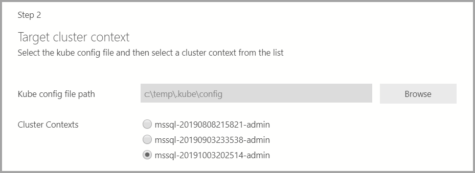
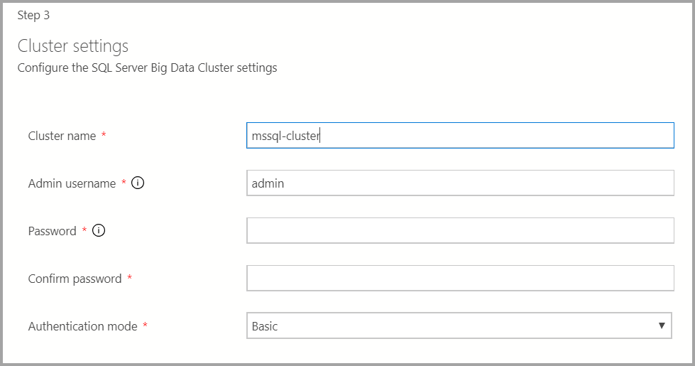
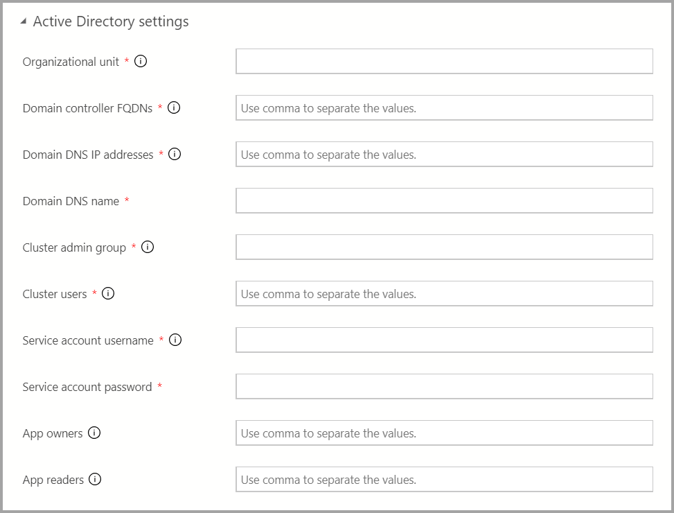
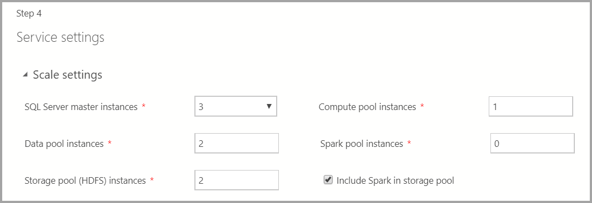
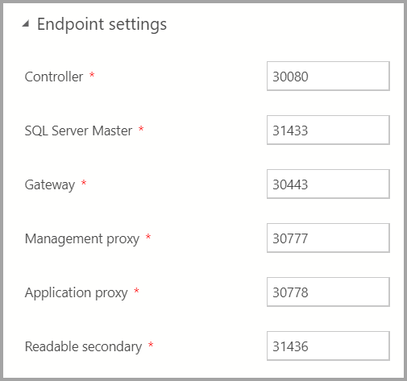
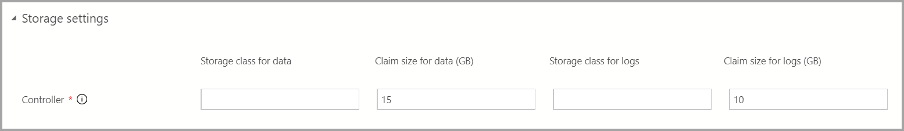
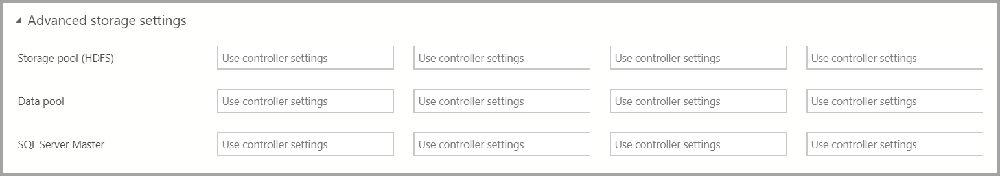
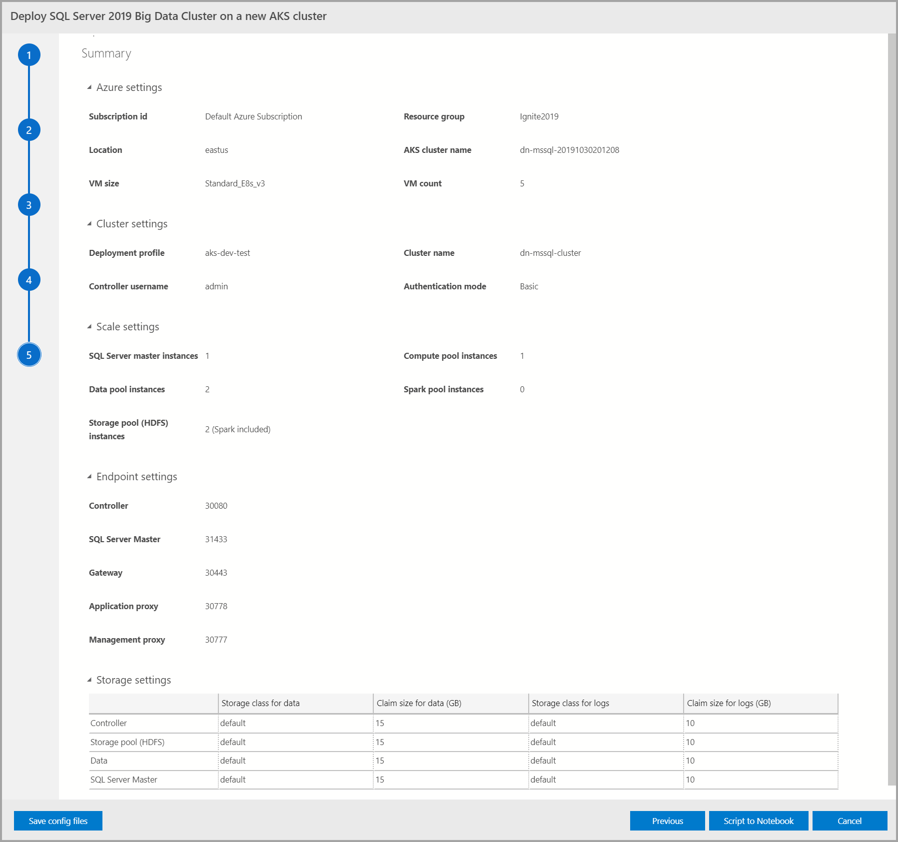

# Deploy SQL Server big data cluster with Azure Data Studio notebook

[!INCLUDE[SQL Server 2019](../includes/applies-to-version/sqlserver2019.md)]

[!INCLUDE[big-data-clusters-banner-retirement](../includes/bdc-banner-retirement.md)]

SQL Server provides an extension for Azure Data Studio that includes deployment notebooks. A deployment notebook includes documentation and code that you can use in Azure Data Studio to create a SQL Server big data cluster.

Implemented initially as an open-source project, [notebooks](../azure-data-studio/notebooks/notebooks-guidance.md) have been implemented into [Azure Data Studio](../azure-data-studio/download-azure-data-studio.md). You can use markdown for text in the text cells and one of the available kernels to write code in the code cells.

You can use notebooks to deploy [!INCLUDE[big-data-clusters-nover](../includes/ssbigdataclusters-ss-nover.md)].

## Prerequisites

Following prerequisites are required to also launch the notebook:

* Latest version of [Azure Data Studio Insiders build](https://github.com/microsoft/azuredatastudio#try-out-the-latest-insiders-build-from-master) installed

In addition to above, deploying a big data cluster also requires:

* [azdata](../azdata/install/deploy-install-azdata.md)
* [kubectl](https://kubernetes.io/docs/tasks/tools/install-kubectl/#install-kubectl-binary-using-native-package-management)
* [Azure CLI (if deploying in Azure)](/cli/azure/install-azure-cli)

## Launch the notebook

1. Launch Azure Data Studio.

2. On the **Connections** tab, select the ellipses (**...**), then select **Deploy SQL Server...**.

   

3. From the deployment options, select **SQL Server Big Data Cluster**.

4. From the **Deployment Target**, under **Options**, select either **New Azure Kubernetes Cluster** or **Existing Azure Kubernetes Service cluster**.

5. Accept the Privacy and license terms.

6. This dialog also checks whether the required tools for the chosen type of SQL deployment exist on the host. The **Select** button isn't enabled until the tools check is successful.

7. Select the **Select** button. This action launches the deployment experience.

## Set deployment configuration template

You can customize the settings of the deployment profile by following the instructions below.

### Target configuration template

Select the target configuration template from the available templates. The available profiles are filtered depending on the type of deployment target that's chosen in the previous dialog.

   

### Azure settings

If the deployment target is a new [Azure Kubernetes Service (AKS)](/azure/aks/), additional information such as Azure Subscription ID, resource group, AKS cluster name, VM count, size, and other additional information are required to create the AKS cluster.

   

If the deployment target is an existing Kubernetes cluster, the wizard prompts for the path to the *kube* config file to import the Kubernetes cluster settings. Ensure the appropriate cluster context is selected where the SQL Server 2019 Big Data Cluster can be deployed.

   

### Cluster, docker, and AD settings

1. Enter the cluster name for the big data cluster, an admin username, and password. This same account is used for the controller and SQL Server.

   

2. Enter the Docker settings as appropriate.

   > [!IMPORTANT]
   > Make sure image tag field is latest: __2019-CU13-ubuntu-20.04__

   

3. If the AD authentication is available, enter the AD settings.

   

### Service settings

This screen has inputs for various settings such as **Scale**, **Endpoints**, **Storage**, and other **Advanced storage settings**. Enter the appropriate values and select **Next**.

#### Scale settings

Enter the number of instances of each of the components in the big data cluster.

A Spark Instance can be included along with HDFS. It's included in the storage pool or on its own in the Spark pool.

   

For additional information on each of these components, you can refer to [master instance](concept-master-instance.md), [data pool](concept-data-pool.md), [storage pool](concept-storage-pool.md), or [compute pool](concept-compute-pool.md).

#### Endpoint settings

The default endpoints have been pre-filled. However, they can be changed as appropriate.

   

#### Storage settings

The storage settings include storage class and claim size for Data and Logs. The settings can be applied across Storage, Data, and SQL Server master pool.

   

#### Advanced storage settings

You can add additional storage settings under **Advanced storage settings**

* Storage pool (HDFS)
* Data pool
* SQL Server Master

   

### Summary

This screen summarizes all the input that was provided to deploy the big data cluster. The config files can be downloaded via the **Save config files** button. Select **Script to Notebook** to script out the entire deployment configuration to a notebook. Once the notebook is open, select **Run Cells** to start deploying the big data cluster to the selected target.

   

## Next steps

For more information about deployment, see [deployment guidance for SQL Server Big Data Clusters](deployment-guidance.md).
