# How to use notebooks in SQL Server 2019 preview

This article describes how to launch Jupyter Notebooks on a big data cluster and how to start authoring your own notebooks. It also shows how to submit jobs against the cluster.

## Prerequisites

To use notebooks, you must install the following prerequisites:

- [A SQL Server 2019 big data cluster](deployment-guidance.md)
- [SQL Server 2019 big data tools](deploy-big-data-tools.md):
   - **Azure Data Studio**
   - **SQL Server 2019 extension**
   - **kubectl**

[!INCLUDE [Limited public preview note](../includes/big-data-cluster-preview-note.md)]

## Connect to the SQL Server big data cluster end point

You can connect to different end points in the cluster. You can connect to the Microsoft SQL Server connection type or to the SQL Server big data cluster end point.
In Azure Data Studio (preview), press F1, and click **New Connection** and you can connect to your SQL Server big data cluster end point.

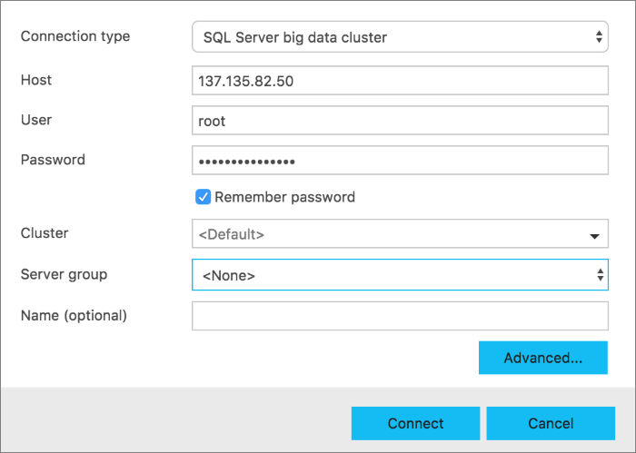

## Browse HDFS

Once you connect, you will be able to browse your HDFS folder. SQL Server starts WebHDFS is started when the deployment is completed. With WebHDFS, you can **Refresh**, add **New Directory**, **Upload** files, and **Delete**.

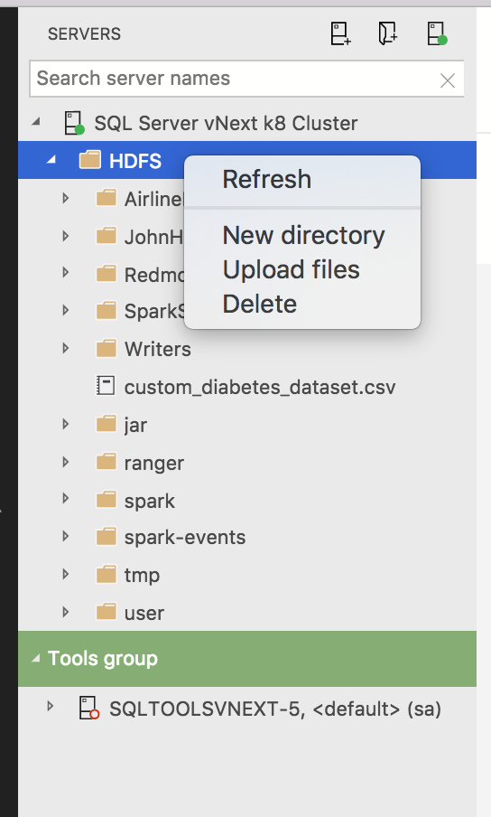

These simple operations let you bring your own data into HDFS.

## Launch new Notebooks

>[!NOTE]
>If you have multiple Python processes running in your environment, first delete the `.scaleoutdata` folder under your installed directory. This should trigger the `Reinstall Notebook dependencies` task in Azure Data Studio. It will take few minutes for all the dependencies to be installed.

If there are issues installing notebook dependencies, click on Ctrl+Shift+P or for Macintosh Cmd+Shift+P, and type `Reinstall Notebook dependencies` in the command palette.


There are multiple ways to launch a new notebook.

1. From the **Manage Dashboard**. After making a new connection, you will see a dashboard. Click **New Notebook** task from the dashboard.
  
    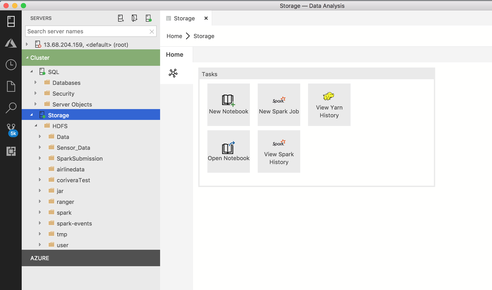

1. Right-click the HDFS/Spark connection and click **New Notebook** in the context menu.

    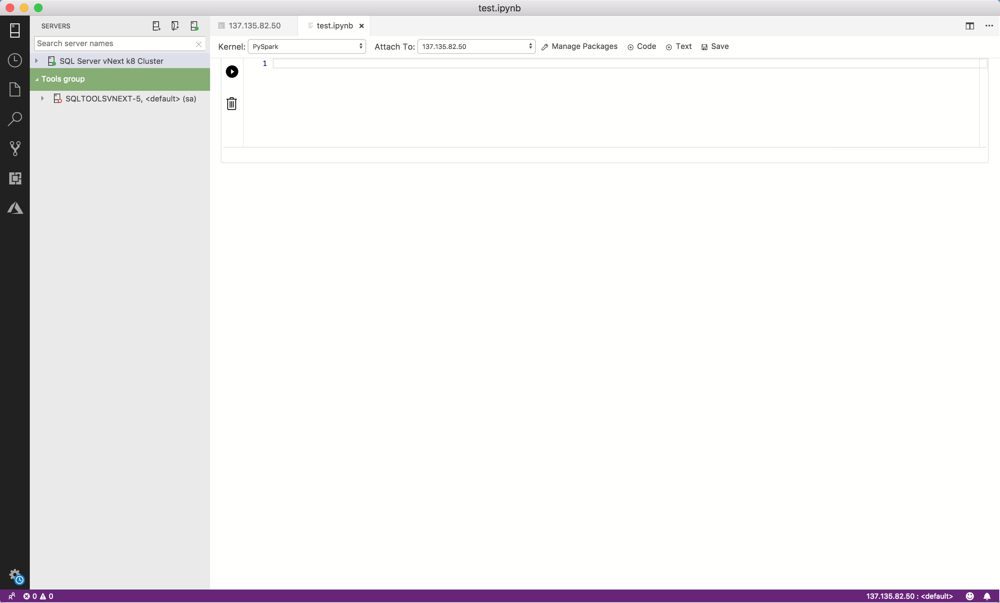

    A new file named `Notebook-0.ipynb` opens.

    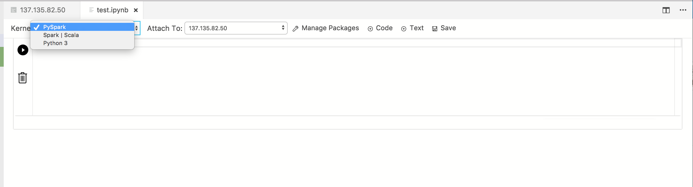

When you open the notebook from the command pallet, the notebook opens as `Untitled-0.ipynb`.

## Supported kernels and attach to context

The Notebook Installation supports PySpark and Spark, Spark Magic kernels, which allow you to write Python and Scala code using Spark. Optionally, you can  choose Python for local development purposes.

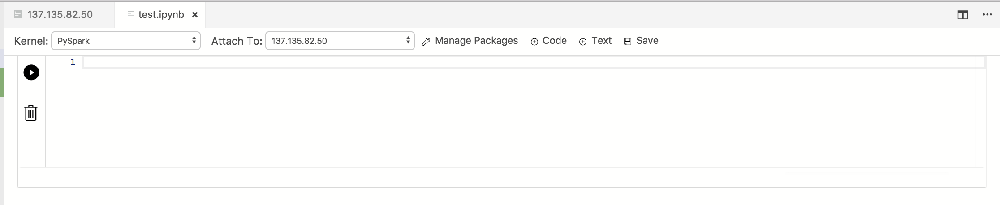

When you select one of these kernels, the installation configures that kernel in the virtual environment and you can start writing code in the supported language.

|Kernel|Description
|:-----|:-----
|PySpark3 and PySpark Kernel| Write Python code using Spark compute from the cluster.
|Spark Kernel|Write Scala and R code using Spark compute from the cluster.
|Python Kernel|Write Python code for local development.

`Attach to` provides the context for the Kernel to attach. When you are connected to the SQL Server big data cluster end point, the default `Attach to` is that end point of the cluster.

When you are not connected to the SQL Server big data cluster end point, the default Kernel is Python and `Attach to` is `localhost`.

## Hello world in different contexts

### Pyspark3/PySpark kernel

Choose the PySpark Kernel and in the cell type in the following code.

Click **Run**.

The Spark Application is started and returns the following output:

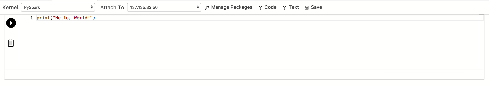

### Spark kernel | Scala language

Choose the Spark|Scala Kernel and in the cell type in the following code.

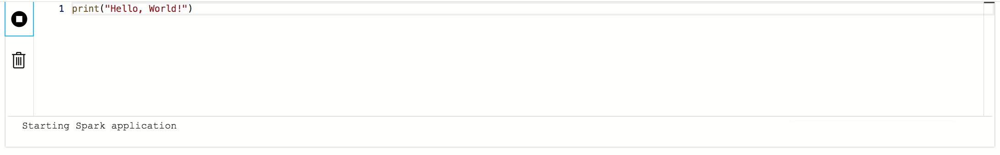

Add a new code cell by clicking the **+Code** command in the toolbar.

Now, choose the Spark | Scala in the dropdown for the kernels and in the cell type/paste in –

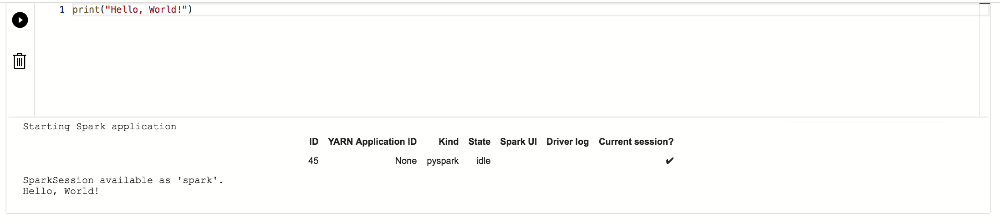

You can also view the "Cell Options" when you click on the options icon below –

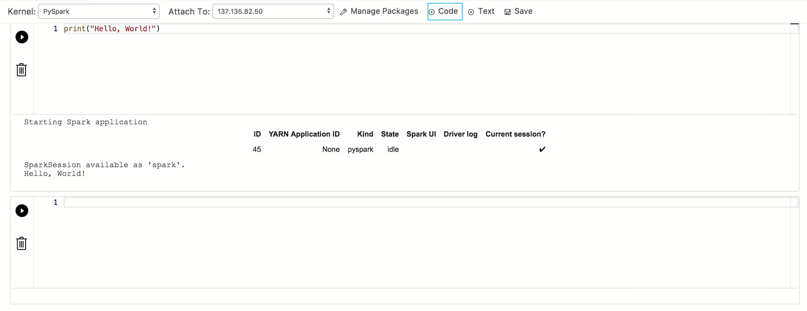

### Spark kernel | R language

Choose the Spark | R in the dropdown for the kernels. In the cell, type or paste in the code. Click **Run** to see the following output.

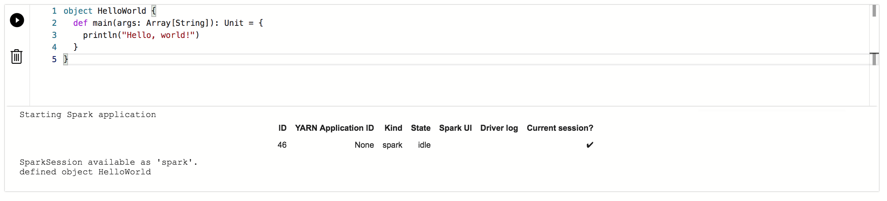

### Local Python kernel

Choose the local Python Kernel and in the cell type in -

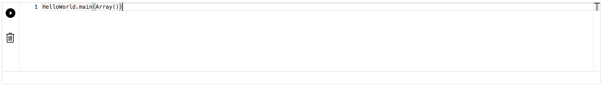

### Markdown text

Add a new text cell by clicking the **+Text** command in the toolbar.


Double-click inside the text cell to change to edit view 

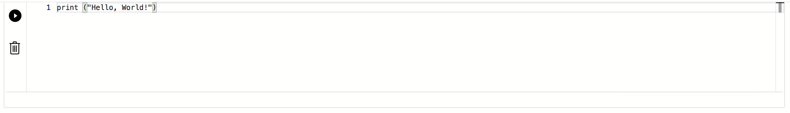

The cell changes to edit mode

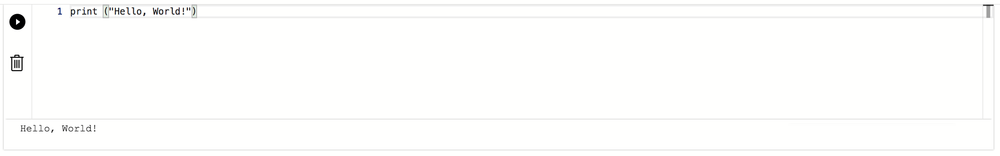

Now type markdown and you will see the preview at the same time

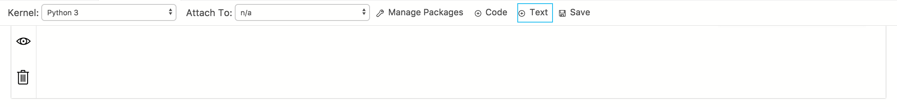

Click **Run**. The Spark application starts creates the Spark session as **spark** and defines the **HelloWorld** object.

The Notebook should look similar to the following image.

Clicking outside the text cell will change to preview mode and hides the markdown.

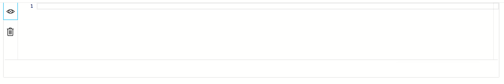


## Manage Packages
One of the things we optimized for local Python development was to include the ability to install packages which customers would need for their scenarios. By default, we include the common packages like `pandas`, `numpy` etc., but if you are expecting a package that is not included then write the following code in the notebook cell: 

```python
import <package-name>
```

When you run this command, `Module not found` is returned. If your package exists, then you will not get the error.

If it returns a `Module not Found` error, then click on **Manage Packages** to launch the terminal with the path for your Virtualenv identified. You can now install packages locally. Use the following commands to install the packages:

```bash
./pip install <package-name>
```

After the package is installed, you should be able to go in the Notebook cell and type in following command:

```python
import <package-name>
```

To uninstall a package, use the following command from your terminal:

```bash
./pip uninstall <package-name>
```

## Next steps

To learn how to work with an existing notebook, see [How to manage notebooks in Azure Data Studio](notebooks-how-to-manage.md).