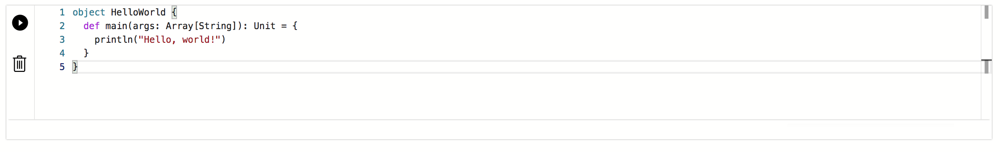
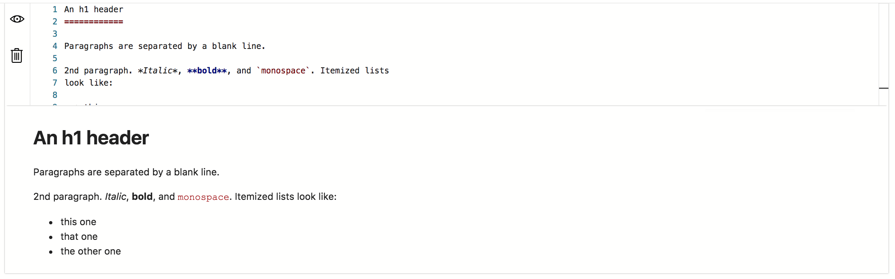
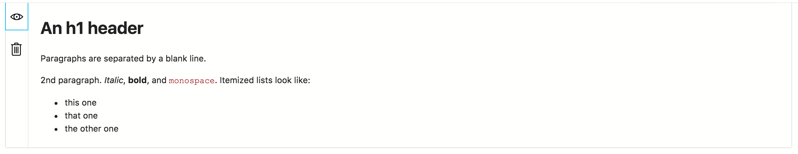
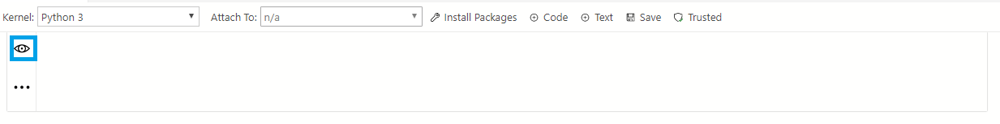
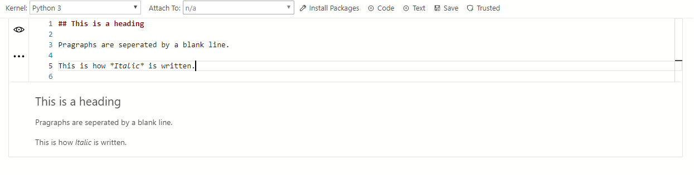

# How to use notebooks in SQL Server 2019 preview

This article describes how to launch Jupyter Notebooks on a big data cluster and how to start authoring your own Notebooks. It also shows how to submit jobs against the cluster.

## Prerequisites

To use notebooks, you must install the following prerequisites:

- [A SQL Server 2019 big data cluster](deployment-guidance.md)
- [SQL Server 2019 big data tools](deploy-big-data-tools.md):
   - **Azure Data Studio**
   - **SQL Server 2019 extension**
   - **kubectl**

[!INCLUDE [Limited public preview note](../includes/big-data-cluster-preview-note.md)]

## Connect to the Hadoop Gateway Knox end point

You can connect to different end points in the cluster. You can connect to the Microsoft SQL Server connection type or to the HDFS/Spark gateway end point.
In Azure Data Studio (preview), press F1, and click **New Connection** and you can connect to your HDFS/Spark gateway end point.


## Browse HDFS

Once you connect, you will be able to browse your HDFS folder. WebHDFS is started when the deployment is completed, and you will be able to **Refresh**, add **New Directory**, **Upload** files, and **Delete**.


These simple operations let you bring your own data into HDFS.

## Launch new Notebooks

>[!NOTE]
>If you have multiple Python processes running in your environment, first delete the `.scaleoutdata` folder under your installed directory. This should trigger the `Reinstall Notebook dependencies` task in Azure Data Studio. It will take few minutes for all the dependencies to be installed.

If there are issues installing notebook dependencies, click on Ctrl+Shift+P or for Macintosh Cmd+Shift+P, and type `Reinstall Notebook dependencies` in the command palette.


There are multiple ways to launch a new notebook.

1. From the **Manage Dashboard**. After making a new connection, you will see a dashboard. Click **New Notebook** task from the dashboard.

  

1. Right-click the HDFS/Spark connection and click **New Notebook** in the context menu.

  

  Provide a name of your Notebook, for example, `Test.ipynb`. Click **Save**.


## Supported kernels and attach to context

The Notebook Installation supports PySpark and Spark, Spark Magic kernels, which allow you to write Python and Scala code using Spark. Optionally, you can  choose Python for local development purposes.


When you select one of these kernels, we will install that kernel in the virtual environment and you can start writing code in the supported language.

|Kernel|Description
|:-----|:-----
|PySpark Kernel|For writing Python code using Spark compute from the cluster.
|Spark Kernel|For writing Scala code using Spark compute from the cluster.
|Python Kernel|For writing Python code for local development.

The `Attach to` provides the context for the Kernel to attach. When you are connected to the HDFS/Spark gateway (Knox) end point the default `Attach to` is that end point of the cluster.


## Hello world in different contexts

### Pyspark kernel

Choose the PySpark Kernel and in the cell type in the following code:


Click Run and you should see the Spark Application being started and you will see the following output:


The output should look something similar to the following image.


### Spark kernel
Add a new code cell by clicking the **+Code** command in the toolbar.



You can also view the "Cell Options" when you click on the options icon below -


Here are the options for every cell -

-

Now, choose the Spark Kernel in the dropdown for the kernels and in the cell type/paste in -


Click **Run** and you should see the Spark Application being started and this will create the Spark session as **spark** and will define the **HelloWorld** object.

The Notebook should look similar to the following image.


Once you define the object then in the next Notebook cell, type in the following code:


Click **Run** in the Notebook menu and you should see the "Hello, world!" in the output.


### Local python kernel
Choose the local Python Kernel and in the cell type in -


You should see the following output:



### Markdown Text
Add a new text cell by clicking the **+Text** command in the toolbar.



Click on the preview icon to add your markdown



Click on the preview icon again to toggle to see just the markdown



## Manage Packages
One of the things we optimized for local Python development was to include the ability to install packages which customers would need for their scenarios. By default, we include the common packages like pandas, numpy etc., but if you are expecting a package that is not included then write the following code in the Notebook cell: 

```python
import <package-name>
```

When you run this command, you will get a `Module not found` error. If your package exists, then you will not get the error.

If you find a `Module not Found` error, then click on **Manage Packages** to launch the terminal with the path for your Virtualenv identified. You can now install packages locally. Use the following commands to install the packages:

```bash
./pip install <package-name>
```

After the package is installed, you should be able to go in the Notebook cell and type in following command:

```python
import <package-name>
```

Now when you run the cell, you should no longer get the `Module not found` error.

To uninstall a package, use the following command from your terminal:

```bash
./pip uninstall <package-name>
```

## Next steps

To learn how to work with an existing notebook, see [How to manage notebooks in Azure Data Studio](notebooks-how-to-manage.md).