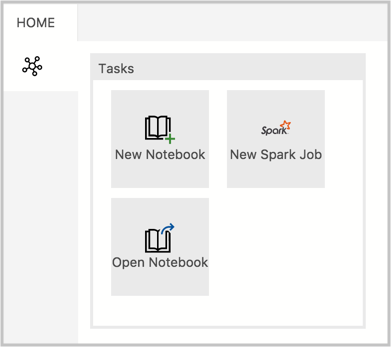
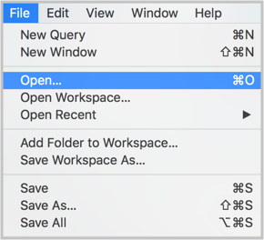

# How to manage notebooks in Azure Data Studio

This article shows you how to open and save notebook files in Azure Data Studio with SQL Server 2019 preview. It also demonstrates how to change your connection to your SQL Server big data cluster.

## Prerequisites

This article assumes that you already have a notebook that you want to use in Azure Data Studio. If you want to create a notebook, see [How to use notebooks in SQL Server 2019 preview](notebooks-guidance.md). To use notebooks in Azure Data Studio, you must meet the following prerequisites:

- [Deploy a big data cluster](quickstart-big-data-cluster-deploy.md).
- [SQL Server 2019 big data tools](deploy-big-data-tools.md):
   - **Azure Data Studio**
   - **SQL Server 2019 extension**
   - **kubectl**

## Open a notebook

There are several ways to open the **Open Notebook** dialog. You can use the File menu, the Dashboard, and the Command Palette. The following sections describe each method.

### File menu

Select **File Open** from the File menu Ctrl+O (in Windows) and Cmd+O (in Mac).

 

### Dashboard

Click **Open Notebook** in the dashboard to open the File Open dialog.

 

### Command Palette

Use command **File: Open** from command palette by typing Ctrl+Shift+P (in Windows) and Cmd+Shift+P (in Mac).

## Save a notebook

There is currently one way to save a notebook. You must select **Save** from the notebook toolbar.

> [!NOTE]
> The following methods currently do not save changes to notebooks:
>
> - **File Save**, **File Save As...** and **File Save All** commands from the File menu.
> - **File: Save** commands entered in the command palette.

## Change the big data cluster

To change the SQL Server big data cluster for a notebook:

1. Click the **Attach to** menu from the notebook toolbar.

   

2. Click a server from the **Attach to** menu.

   

## Next steps

For more information about notebooks in Azure Data Studio, see [How to use notebooks in SQL Server 2019 preview](notebooks-guidance.md).