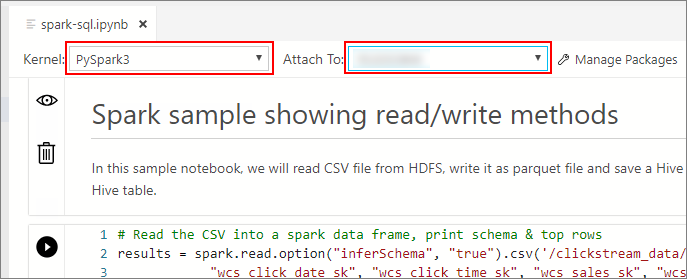

# Run a sample notebook by using Spark

[!INCLUDE[SQL Server 2019](../includes/applies-to-version/sqlserver2019.md)]

[!INCLUDE[big-data-clusters-banner-retirement](../includes/bdc-banner-retirement.md)]

This tutorial demonstrates how to load and run a notebook in Azure Data Studio on a SQL Server 2019 big data cluster. This allows data scientists and data engineers to run Python, R, or Scala code against the cluster.

> [!TIP]
> If you prefer, you can download and run a script for the commands in this tutorial. For instructions, see the [Spark samples](https://github.com/Microsoft/sql-server-samples/tree/master/samples/features/sql-big-data-cluster/spark) on GitHub.

## <a id="prereqs"></a> Prerequisites

- [Big data tools](deploy-big-data-tools.md)
   - **kubectl**
   - **Azure Data Studio**
   - **SQL Server 2019 extension**
- [Load sample data into your big data cluster](tutorial-load-sample-data.md)

## Download the sample notebook file

Use the following instructions to load the sample notebook file **spark-sql.ipynb** into Azure Data Studio.

1. Open a bash command prompt (Linux) or Windows PowerShell.

1. Navigate to a directory where you want to download the sample notebook file to.

1. Run the following **curl** command to download the notebook file from GitHub:

   ```bash
   curl https://raw.githubusercontent.com/Microsoft/sql-server-samples/master/samples/features/sql-big-data-cluster/spark/data-loading/transform-csv-files.ipynb -o transform-csv-files.ipynb
   ```

## Open the notebook

The following steps show how to open the notebook file in Azure Data Studio:

1. In Azure Data Studio, connect to the master instance of your big data cluster. For more information, see [Connect to a big data cluster](connect-to-big-data-cluster.md).

1. Double-click on the HDFS/Spark gateway connection in the **Servers** window. Then select **Open Notebook**.

   

1. Wait for the **Kernel** and the target context (**Attach to**) to be populated. Set the **Kernel** to **PySpark3**, and set **Attach to** to the IP address of your big data cluster endpoint.

   

> [!IMPORTANT]
> In Azure Data Studio, all Spark notebook types (Scala Spark, PySpark and SparkR) conventionally define some important Spark session related variables upon first cell execution. Those variables are: `spark`, `sc`, and `sqlContext`. When copying logic out of notebooks for batch submission (into a Python file to be run with `azdata bdc spark batch create` for example), make sure you define the variables accordingly.

## Run the notebook cells

You can run each notebook cell by pressing the play button to the left of the cell. The results are shown in the notebook after the cell finishes running.


Run each of the cells in the sample notebook in succession. For more information about using notebooks with [!INCLUDE[big-data-clusters-2019](../includes/ssbigdataclusters-ss-nover.md)], see the following resources:

- [How to use notebooks](../azure-data-studio/notebooks/notebooks-guidance.md)
- [How to manage notebooks in Azure Data Studio](notebooks-manage-bdc.md)

## Next steps

Learn more about notebooks:
> [!div class="nextstepaction"]
> [How to use notebooks](../azure-data-studio/notebooks/notebooks-guidance.md)