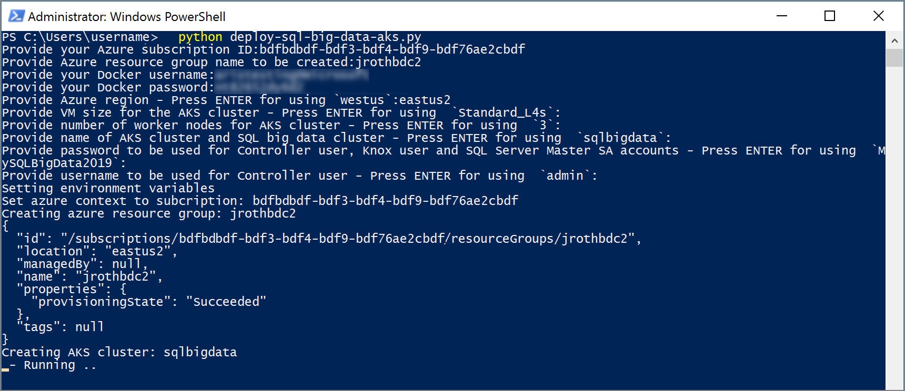

# Quickstart: Deploy SQL Server big data cluster on Azure Kubernetes Service (AKS)

In this quickstart, you use a sample deployment script to deploy SQL Server 2019 big data cluster (preview) to Azure Kubernetes Service (AKS). 

> [!TIP]
> AKS is only one option for hosting Kubernetes for your big data cluster. To learn about other deployment options as well as how to customize deployment options, see [How to deploy SQL Server big data clusters on Kubernetes](deployment-guidance.md).

The default big data cluster deployment used here consists of a SQL Master instance, one compute pool instance, two data pool instances, and two storage pool instances. Data is persisted using Kubernetes persistent volumes that use the AKS default storage classes. The default configuration used in this quickstart is suitable for dev/test environments.

[!INCLUDE [Limited public preview note](../includes/big-data-cluster-preview-note.md)]

## Prerequisites

- An Azure subscription.
- [Big data tools](deploy-big-data-tools.md):
   - **mssqlctl**
   - **kubectl**
   - **Azure Data Studio**
   - **SQL Server 2019 extension**
   - **Azure CLI**

## Log in to your Azure account

The script uses Azure CLI to automate the creation of an AKS cluster. Before running the script, you must log in to your Azure account with Azure CLI at least once. Run the following command from a command prompt.

```
az login
```

## Download the deployment script

This quickstart automates the creation of the big data cluster on AKS using a python script **deploy-sql-big-data-aks.py**. If you already installed python for **mssqlctl**, you should be able to run the script successfully in this quickstart. 

In a Windows PowerShell or Linux bash prompt, run the following command to download the deployment script from GitHub.

```
curl -o deploy-sql-big-data-aks.py "https://raw.githubusercontent.com/Microsoft/sql-server-samples/master/samples/features/sql-big-data-cluster/deployment/aks/deploy-sql-big-data-aks.py"
```

## Run the deployment script

Use the following steps to run the deployment script. This script will create an AKS service in Azure and then deploy a SQL Server 2019 big data cluster to AKS. You can also modify the script with other [environment variables](deployment-guidance.md#env) to create a custom deployment.

1. Run the script with the following command:

   ```
   python deploy-sql-big-data-aks.py
   ```

   > [!NOTE]
   > If you have both python3 and python2 on your client machine and in the path, you have to run the command using python3: `python3 deploy-sql-big-data-aks.py`.

1. When prompted, enter the following information:

   | Value | Description |
   |---|---|
   | **Azure subscription ID** | The Azure subscription ID to use for AKS. You can list all of your subscriptions and their IDs by running `az account list` from another command line. |
   | **Azure resource group** | The Azure resource group name to create for the AKS cluster. |
   | **Docker username** | The Docker username provided to you as part of the limited public preview. |
   | **Docker password** | The Docker password provided to you as part of the limited public preview. |
   | **Azure region** | The Azure region for the new AKS cluster (default **westus**). |
   | **Machine size** | The [machine size](https://docs.microsoft.com/azure/virtual-machines/windows/sizes) to use for nodes in the AKS cluster (default **Standard_L4s**). |
   | **Worker nodes** | The number of worker nodes in the AKS cluster (default **3**). |
   | **Cluster name** | The name of both the AKS cluster and the big data cluster. The name of your cluster must be only lower case alpha-numeric characters, and no spaces. (default **sqlbigdata**). |
   | **Password** | Password for the controller, HDFS/Spark gateway, and master instance (default **MySQLBigData2019**). |
   | **Controller user** | Username for the controller user (default: **admin**). |

   > [!IMPORTANT]
   > The default **Standard_L4s** machine size may not be available in every Azure region. If you do select a different machine size, make sure that the total number of disks that can be attached across the nodes in the cluster is greater than or equal to 21. Each persistent volume claim in the cluster requires an attached disk. Currently, big data cluster requires 21 persistent volume claims. For example, the [Standard_L4s](https://docs.microsoft.com/azure/virtual-machines/windows/sizes-storage#ls-series) machine size supports 16 attached disks, so three nodes means that 48 disks can be attached.

   > [!NOTE]
   > The `sa` account is a system administrator on the SQL Server master instance that gets created during setup. After creating deployment, the `MSSQL_SA_PASSWORD` environment variable is discoverable by running `echo $MSSQL_SA_PASSWORD` in the master instance container. For security purposes, change your `sa` password on the master instance after deployment. For more information, see [Change the SA password](../linux/quickstart-install-connect-docker.md#sapassword).

1. The script will start by creating an AKS cluster using the parameters you specified. This step takes several minutes.

   

## Monitor the status

After the script creates the AKS cluster, it proceeds to set necessary environment variables with the settings you specified earlier. It then calls **mssqlctl** to deploy the big data cluster on AKS.

The client command window will output the deployment status. During the deployment process, you should see a series of messages where it is waiting for the controller pod:

```output
2018-11-15 15:42:02.0209 UTC | INFO | Waiting for controller pod to be up...
```

After 10 to 20 minutes, you should be notified that the controller pod is running:

```output
2018-11-15 15:50:50.0300 UTC | INFO | Controller pod is running.
2018-11-15 15:50:50.0585 UTC | INFO | Controller Endpoint: https://111.111.111.111:30080
```

> [!IMPORTANT]
> The entire deployment can take a long time due to the time required to download the container images for the components of the big data cluster. However, it should not take several hours. If you are experiencing problems with your deployment, see the  [deployment troubleshooting](deployment-guidance.md#troubleshoot) section of the deployment guidance article.

## Inspect the cluster

At any time during deployment, you can use kubectl or the Cluster Administration Portal to inspect the status and details about the running big data cluster.

### Use kubectl

Open a new command window to use **kubectl** during the deployment process.

1. Run the following command to get a summary of the status of the whole cluster:

   ```
   kubectl get all -n <your-cluster-name>
   ```

1. Inspect the kubernetes services and their internal and external endpoints with the following **kubectl** command:

   ```
   kubectl get svc -n <your-cluster-name>
   ```

1. You can also inspect the status of the kubernetes pods with the following command:

   ```
   kubectl get pods -n <your-cluster-name>
   ```

1. Find out more information about a specific pod with the following command:

   ```
   kubectl describe pod <pod name> -n <your-cluster-name>
   ```

> [!TIP]
> For more details about how to monitor and troubleshoot a deployment, see the [deployment troubleshooting](deployment-guidance.md#troubleshoot) section of the deployment guidance article.

### Use the Cluster Administration Portal

Once the Controller pod is running, you can also use the Cluster Administration Portal to monitor the deployment. You can access the portal using the external IP address and port number for the `endpoint-service-proxy` (for example: **https://\<ip-address\>:30777/portal**). The credentials used to log into the portal match the values for **Controller user** and **Password** that you specified in the deployment script.

You can get the IP address of the **endpoint-service-proxy** service by running this command in a bash or cmd window:

```bash
kubectl get svc endpoint-service-proxy -n <your-cluster-name>
```

> [!NOTE]
> In CTP 2.3, you will see a security warning when accessing the web page, because big data clusters is currently using auto-generated SSL certificates. Also, in CTP 2.3, it does not show the status of the SQL Server master instance.

## Connect to the cluster

When the deployment script finishes, the output notifies you of success:

```output
2018-11-15 16:10:25.0583 UTC | INFO | Cluster state: Ready
2018-11-15 16:10:25.0583 UTC | INFO | Cluster deployed successfully.
```

The SQL Server big data cluster is now deployed on AKS. You can now use Azure Data Studio to connect to the cluster. For more information, see [Connect to a SQL Server big data cluster with Azure Data Studio](connect-to-big-data-cluster.md).

## Clean up

If you are testing SQL Server big data clusters in Azure, you should delete the AKS cluster when finished to avoid unexpected charges. Do not remove the cluster if you intend to continue using it.

> [!WARNING]
> The following steps tears down the AKS cluster which removes the SQL Server big data cluster as well. If you have any databases or HDFS data that you want to keep, back that data up before deleting the cluster.

Run the following Azure CLI command to remove the big data cluster and the AKS service in Azure (replace `<resource group name>` with the **Azure resource group** you specified in the deployment script):

```azurecli
az group delete -n <resource group name>
```

## Next steps

The deployment script configured Azure Kubernetes Service and also deployed a SQL Server 2019 big data cluster. You can also choose to customize future deployments through manual installations. To learn more about how big data clusters are deployed as well as how to customize deployments, see [How to deploy SQL Server big data clusters on Kubernetes](deployment-guidance.md).

Now that the SQL Server big data cluster is deployed, you can load sample data and explore the tutorials:

> [!div class="nextstepaction"]
> [Tutorial: Load sample data into a SQL Server 2019 big data cluster](tutorial-load-sample-data.md)