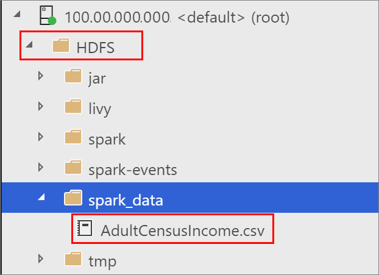

# How to read and write to SQL Server from Spark using the MSSQL Spark Connector

A key big data usage pattern is high volume data processing in Spark, followed by writing the data to SQL Server for access to line-of-business applications. These usage patterns benefit from a connector that utilizes key SQL optimizations and provides an efficient write mechanism.

With CTP2.5 Big Data Clusters provides a new MSSQL Spark connector that uses SQL Server bulk write APIs for a performant Spark to SQL write. This article provides an example of how to read and write to SQL Server from Spark by using the MSSQL Spark Connector. In this example, data is read from HDFS in a big data cluster, processed by Spark, and then written to the SQL Server master instance in the cluster using the new MSSQL Spark connector.

## MSSQL Spark Connector Interface

MSSQL Spark Connector is based on Spark data source APIs and provides a familiar Spark JDBC connector interface. For interface parameters refer [Apache Spark documentation](http://spark.apache.org/docs/latest/sql-data-sources-jdbc.html). The MSSQL Spark connector is referenced by the name **com.microsoft.sqlserver.jdbc.spark**.

The following table describes interface parameters that have changed or are new:

| Property name | Optional | Description |
|---|---|---|
| **isolationLevel** | Yes | This describes the isolation level of the connection. The default for MSSQLSpark Connector is **READ_COMMITTED** |

The connector uses SQL Server Bulk write APIs. Any bulk write parameters can be passed as optional parameters by the user and are passed as-is by the connector to the underlying API. For more information about bulk write operations, see [SQLServerBulkCopyOptions]( ../connect/jdbc/using-bulk-copy-with-the-jdbc-driver.md#sqlserverbulkcopyoptions).

## Prerequisites

- A [SQL Server big data cluster](deploy-get-started.md).

- [Azure Data Studio](../azure-data-studio/download.md).

## Create the target database

1. Open Azure Data Studio, and [connect to the SQL Server master instance of your big data cluster](connect-to-big-data-cluster.md).

1. Create a new query, and run the following command to create a sample database named **MyTestDatabase**.

   ```sql
   Create DATABASE MyTestDatabase
   GO
   ```

## Load sample data into HDFS

1. Download [AdultCensusIncome.csv](https://amldockerdatasets.azureedge.net/AdultCensusIncome.csv) to your local machine.

1. In Azure Data Studio, right-click on the HDFS folder in your big data cluster, and select **New directory**. Name the directory **spark_data**.

1. Right click on the **spark_data** directory, and select **Upload files**. Upload the **AdultCensusIncome.csv** file.

   

## Run the sample notebook

To demonstrate the use of the Microsoft Spark Connector with this data, you can download a sample notebook, open it in Azure Data Studio, and run each code block. For more information about working with notebooks, see [How to use notebooks in SQL Server 2019 preview](notebooks-guidance.md).

1. From a PowerShell or bash command line, run the following command to download the **spark_to_sql_mssql_connector.ipynb** sample notebook:

   ```PowerShell
   curl -o spark_to_sql_mssql_connector.ipynb "https://raw.githubusercontent.com/Microsoft/sql-server-samples/master/samples/features/sql-big-data-cluster/spark_to_sql_mssql_connector.ipynb"
   ```

1. In Azure Data Studio, open the sample notebook file. Verify that it is connected to your HDFS/Spark Gateway for your big data cluster.

1. Run each code cell in the sample to demonstrate Spark to SQL Server interactions with the MSSQL Spark Connector.

## Next steps

For more information about big data clusters, see [How to deploy SQL Server big data clusters on Kubernetes](deployment-guidance.md)