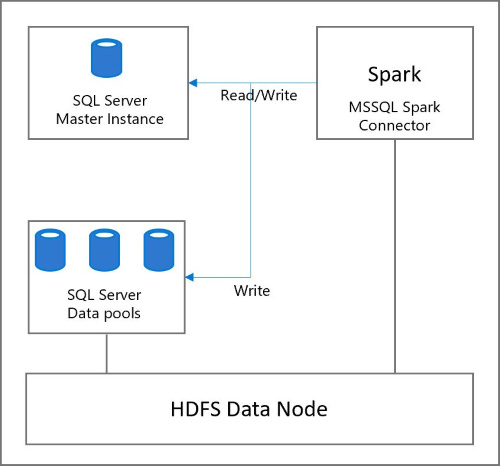

# How to read and write to SQL Server from Spark using the Apache Spark Connector for SQL Server and Azure SQL

A key big data usage pattern is high volume data processing in Spark, followed by writing the data to SQL Server for access to line-of-business applications. These usage patterns benefit from a connector that utilizes key SQL optimizations and provides an efficient write mechanism.

This article provides an overview of the Apache Spark Connector for SQL Server and Azure SQL interface and instantiating it for use with non-AD mode and AD-mode. Then, provides an example of how to use the Apache Spark Connector for SQL Server and Azure SQL to read and write to the following locations within a big data cluster:
1. The SQL Server master instance
1. The SQL Server data pool

   

## Apache Spark Connector for SQL Server and Azure SQL Interface

SQL Server 2019 provides the [**Apache Spark Connector for SQL Server and Azure SQL**](https://github.com/microsoft/sql-spark-connector) for big data clusters that uses SQL Server bulk write APIs for Spark to SQL writes. The Apache Spark Connector for SQL Server and Azure SQL is based on Spark data source APIs and provides a familiar Spark JDBC connector interface. For interface parameters refer [Apache Spark documentation](http://spark.apache.org/docs/latest/sql-data-sources-jdbc.html). The Apache Spark Connector for SQL Server and Azure SQL is referenced by the name **com.microsoft.sqlserver.jdbc.spark**. The Apache Spark Connector for SQL Server and Azure SQL supports two security modes to connect with SQL Server, non-Active Directory mode and Active Directory(AD)-mode:
### Non-AD Mode:
In non-AD mode security, each user has a username and password which need to be provided as parameters during the connector instantiation to perform read and/or writes.
An example connector instantiation for non-AD mode is below:
```python
# Note: '?' is a placeholder for a necessary user-specified value
connector_type = "com.microsoft.sqlserver.jdbc.spark" 

url = "jdbc:sqlserver://master-p-svc;databaseName=?;"
writer = df.write \ 
   .format(connector_type)\ 
   .mode("overwrite") 
   .option("url", url) \ 
   .option("user", ?) \ 
   .option("password",?) 
writer.save() 
```
### AD Mode:
In AD mode security, after a user has generated a key tab file, the user needs to provide the `principal` and `keytab` as parameters during the connector instantiation.

In this mode, the driver loads the keytab file to the respective executor containers. Then, the executors use the principal name and keytab to generate a token that is used to create a JDBC connector for read/write.

An example connector instantiation for AD mode is below:
```python
# Note: '?' is a placeholder for a necessary user-specified value
connector_type = "com.microsoft.sqlserver.jdbc.spark"

url = "jdbc:sqlserver://master-p-svc;databaseName=?;integratedSecurity=true;authenticationScheme=JavaKerberos;" 
writer = df.write \ 
   .format(connector_type)\ 
   .mode("overwrite") 
   .option("url", url) \ 
   .option("principal", ?) \ 
   .option("keytab", ?)   

writer.save() 
```

The following table describes interface parameters that have changed or are new:

| Property name | Optional | Description |
|---|---|---|
| **isolationLevel** | Yes | This describes the isolation level of the connection. The default for the connector is **READ_COMMITTED** |

The connector uses SQL Server Bulk write APIs. Any bulk write parameters can be passed as optional parameters by the user and are passed as-is by the connector to the underlying API. For more information about bulk write operations, see [SQLServerBulkCopyOptions]( ../connect/jdbc/using-bulk-copy-with-the-jdbc-driver.md#sqlserverbulkcopyoptions).

## Apache Spark Connector for SQL Server and Azure SQL Sample
The sample performs the following tasks:

- Read a file from HDFS and do some basic processing.
- Write the dataframe to a SQL Server master instance as a SQL table and then read the table to a dataframe.
- Write the dataframe to a SQL Server data pool as a SQL external table and then read the external table to a dataframe.
### Prerequisites

- A [SQL Server big data cluster](deploy-get-started.md).

- [Azure Data Studio](https://aka.ms/getazuredatastudio).

### Create the target database

1. Open Azure Data Studio, and [connect to the SQL Server master instance of your big data cluster](connect-to-big-data-cluster.md).

1. Create a new query, and run the following command to create a sample database named **MyTestDatabase**.

   ```sql
   Create DATABASE MyTestDatabase
   GO
   ```

### Load sample data into HDFS

1. Download [AdultCensusIncome.csv](https://amldockerdatasets.azureedge.net/AdultCensusIncome.csv) to your local machine.

1. Launch Azure Data Studio, and [connect to your big data cluster](connect-to-big-data-cluster.md).

1. Right-click on the HDFS folder in your big data cluster, and select **New directory**. Name the directory **spark_data**.

1. Right click on the **spark_data** directory, and select **Upload files**. Upload the **AdultCensusIncome.csv** file.

   

### Run the sample notebook

To demonstrate the use of the Apache Spark Connector for SQL Server and Azure SQL with this data in non-AD mode, you can download a sample notebook, open it in Azure Data Studio, and run each code block. For more information about working with notebooks, see [How to use notebooks with SQL Server](../azure-data-studio/notebooks-guidance.md).

1. From a PowerShell or bash command line, run the following command to download the **mssql_spark_connector_non_ad_pyspark.ipynb** sample notebook:

   ```PowerShell
   curl -o mssql_spark_connector.ipynb "https://raw.githubusercontent.com/microsoft/sql-server-samples/master/samples/features/sql-big-data-cluster/spark/data-virtualization/mssql_spark_connector_non_ad_pyspark.ipynb"
   ```

1. In Azure Data Studio, open the sample notebook file. Verify that it is connected to your HDFS/Spark Gateway for your big data cluster.

1. Run each code cell in the sample to see usage of the Apache Spark Connector for SQL Server and Azure SQL.

## Next steps

For more information about big data clusters, see [How to deploy [!INCLUDE[big-data-clusters-2019](../includes/ssbigdataclusters-ss-nover.md)] on Kubernetes](deployment-guidance.md)

Have feedback or feature recommendations for SQL Server Big Data Clusters? [Leave us a note at SQL Server Big Data Clusters Feedback](https://aka.ms/sql-server-bdc-feedback).
