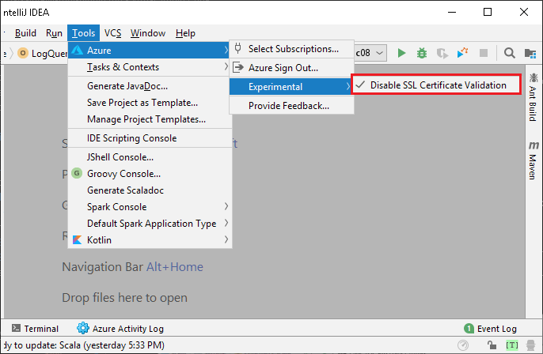
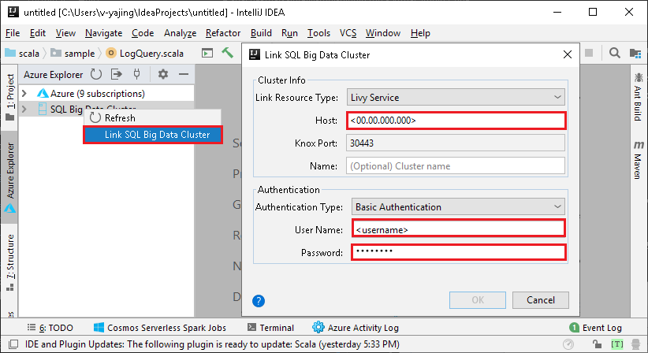
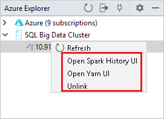
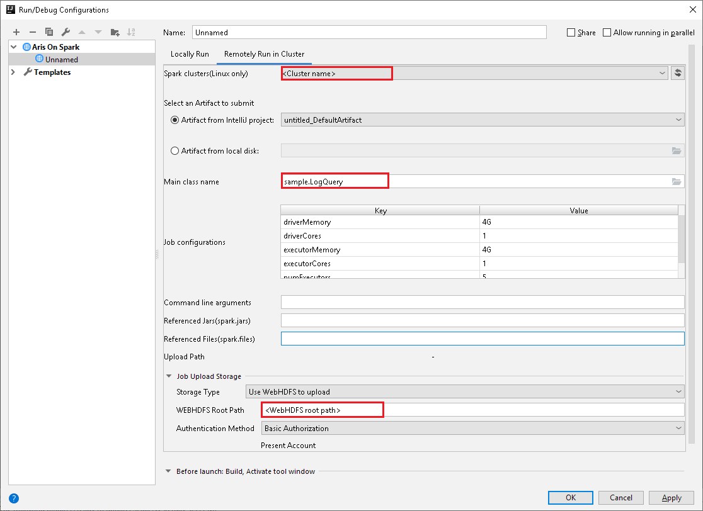

# Submit Spark jobs on SQL Server big data clusters in IntelliJ

One of the key scenarios for big data clusters is the ability to submit Spark jobs. The Spark job submission feature allows you to submit a local Jar or Py files with references to SQL big data cluster. It also enables you to execute a Jar or Py files, which are already located in the HDFS file system. 

## Prerequisites

- SQL Big Data cluster.
- Oracle Java Development Kit. You can install it from the [Oracle website](https://aka.ms/azure-jdks).
- IntelliJ IDEA. You can install it from the [JetBrains website](https://www.jetbrains.com/idea/download/).
- Azure Toolkit for IntelliJ extension. For installation instructions, see [Install Azure Toolkit for IntelliJ](https://docs.microsoft.com/azure/azure-toolkit-for-intellij-installation).

## Link SQL big data cluster
1. Open the IntelliJ IDEA tool.

2. If you are using self-signed certificate, please disable SSL certification validation from **Tools** menu, select **Azure**, **Experimental**, then **Disable SSL Certificate Validation**.

    

3. Open Azure Explorer from **View** menu, select **Tool Windows**, and then select **Azure Explorer**.
4. Right click on **SQL Big Data Cluster**, select **Link SQL Big Data Cluster**. Enter the **Host**, **User Name**, and **Password**, then click **OK**.

    

5. When the untrusted server's certificate dialog appears, click **Accept**. You can manage the certificate later, see [Server Certificates](https://www.jetbrains.com/help/idea/settings-tools-server-certificates.html).

6. The linked cluster lists under **SQL Big Data Cluster**. You could monitor spark job by opening the spark history UI and Yarn UI, you could also unlink, by right clicking on the cluster.

    

## Submit application to SQL big data cluster
After link a SQL big data cluster, you can submit application to it.

1. Set up the configuration in **Run/Debug Configurations** window, click +->**Aris On Spark**, select tab **Remotely Run in Cluster**, set the parameters as following, then click OK.

    

    

    * For **Spark clusters (Linux only)**, select the SQL Big Data cluster on which you want to run your application.

    * Select an artifact from the IntelliJ project, or select one from the hard drive.

    * **Main class name** field: The default value is the main class from the selected file. You can change the class by selecting the ellipsis(**...**)  and choosing another class.   

    * **Job Configurations** field:  The default values are set as picture shown above. You can change the value or add new key/value for your job submission. For more information: [Apache Livy REST API](http://livy.incubator.apache.org./docs/latest/rest-api.html)

      

    * **Command line arguments** field: You can enter the arguments values split by space for the main class if needed.

    * **Referenced Jars** and **Referenced Files** fields: You can enter the paths for the referenced Jars and files if any. For more information: [Apache Spark Configuration](https://spark.apache.org/docs/latest/configuration.html#runtime-environment) 

      

       > [!NOTE]  
       > To upload your Referenced JARs and Referenced Files, refer to: [How to upload resources to cluster](https://docs.microsoft.com/azure/storage/blobs/storage-quickstart-blobs-storage-explorer)
                         
    * **Upload Path**: You can indicate the storage location for the Jar or Scala project resources submission. There are several storage types supported: **Use Spark interactive session to upload** and **Use WebHDFS to upload**
    
2. Click **SparkJobRun** to submit your project to the selected cluster. The **Remote Spark Job in Cluster** tab displays the job execution progress at the bottom. You can stop the application by clicking the red button.  

    

## Next steps
For more information on SQL Server big data cluster and related scenarios, see [What is SQL Server big data cluster](big-data-cluster-overview.md)?
