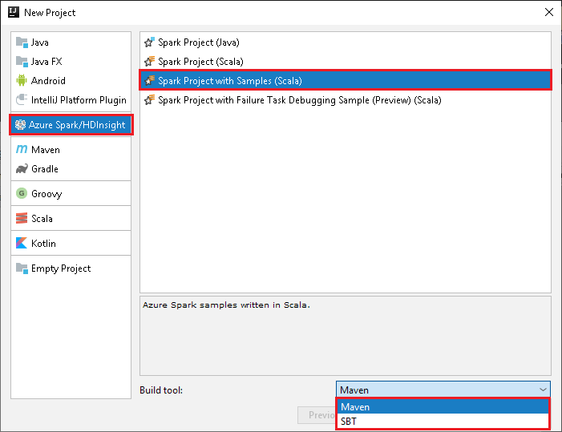

# Submit Spark jobs on SQL Server Big Data Clusters in IntelliJ

One of the key scenarios for SQL Server Big Data Clusters is the ability to submit Spark jobs. The Spark job submission feature allows you to submit a local Jar or Py files with references to SQL Server Big Data Clusters. It also enables you to execute a Jar or Py files, which are already located in the HDFS file system. 

## Prerequisites

- SQL Server Big Data Cluster.
- Oracle Java Development Kit. You can install it from the [Oracle website](https://aka.ms/azure-jdks).
- IntelliJ IDEA. You can install it from the [JetBrains website](https://www.jetbrains.com/idea/download/).
- Azure Toolkit for IntelliJ extension. For installation instructions, see [Install Azure Toolkit for IntelliJ](https://docs.microsoft.com/azure/azure-toolkit-for-intellij-installation).

## Link SQL Server Big Data Cluster
1. Open the IntelliJ IDEA tool.

2. If you are using self-signed certificate, please disable SSL certificate validation from **Tools** menu, select **Azure**, **Validate Spark Cluster SSL Certificate**, then **Disable**.

    

3. Open Azure Explorer from **View** menu, select **Tool Windows**, and then select **Azure Explorer**.
4. Right click on **SQL Server Big Data Cluster**, select **Link SQL Server Big Data Cluster**. Enter the **Server**, **User Name**, and **Password**, then click **OK**.

    

5. When the untrusted server's certificate dialog appears, click **Accept**. You can manage the certificate later, see [Server Certificates](https://www.jetbrains.com/help/idea/settings-tools-server-certificates.html).

6. The linked cluster lists under **SQL Server Big Data Cluster**. You could monitor spark job by opening the spark history UI and Yarn UI, you could also unlink, by right clicking on the cluster.

    

## Create a Spark Scala application from HDInsight template

1. Start IntelliJ IDEA, and then create a project. In the **New Project** dialog box, follow below steps: 

   a. Select **Azure Spark/HDInsight** > **Spark Project with Samples (Scala)**.

   b. In the **Build tool** list, select either of the following, according to your need:

      * **Maven**, for Scala project-creation wizard support
      * **SBT**, for managing the dependencies and building for the Scala project

    

2. Select **Next**.

3. The Scala project-creation wizard automatically detects whether you've installed the Scala plug-in. Select **Install**.

    

4. To download the Scala plug-in, select **OK**. Follow the instructions to restart IntelliJ. 

   

5. In the **New Project** window, do the following:  

    

   a. Enter a project name and location.

   b. In the **Project SDK** drop-down list, select **Java 1.8** for the Spark 2.x cluster, or select **Java 1.7** for the Spark 1.x cluster.

   c. In the **Spark version** drop-down list, Scala project creation wizard integrates the proper version for Spark SDK and Scala SDK. If the Spark cluster version is earlier than 2.0, select **Spark 1.x**. Otherwise, select **Spark2.x**. This example uses **Spark 2.0.2 (Scala 2.11.8)**.

6. Select **Finish**.

7. The Spark project automatically creates an artifact for you. To view the artifact, do the following:

   a. On the **File** menu, select **Project Structure**.

   b. In the **Project Structure** dialog box, select **Artifacts** to view the default artifact that is created. You can also create your own artifact by selecting the plus sign (**+**).

      
      

## Submit application to SQL Server Big Data Cluster
After link a SQL Server Big Data Cluster, you can submit application to it.

1. Set up the configuration in **Run/Debug Configurations** window, click +->**Apache Spark on SQL Server**, select tab **Remotely Run in Cluster**, set the parameters as following, then click OK.

    

    

    * For **Spark clusters (Linux only)**, select the cluster on which you want to run your application.

    * Select an artifact from the IntelliJ project, or select one from the hard drive.

    * **Main class name** field: The default value is the main class from the selected file. You can change the class by selecting the ellipsis(**...**)  and choosing another class.   

    * **Job Configurations** field:  The default values are set as picture shown above. You can change the value or add new key/value for your job submission. For more information: [Apache Livy REST API](http://livy.incubator.apache.org./docs/latest/rest-api.html)

      

    * **Command line arguments** field: You can enter the arguments values split by space for the main class if needed.

    * **Referenced Jars** and **Referenced Files** fields: You can enter the paths for the referenced Jars and files if any. For more information: [Apache Spark Configuration](https://spark.apache.org/docs/latest/configuration.html#runtime-environment) 

      

       > [!NOTE]  
       > To upload your Referenced JARs and Referenced Files, refer to: [How to upload resources to cluster](https://docs.microsoft.com/azure/storage/blobs/storage-quickstart-blobs-storage-explorer)
                         
    * **Upload Path**: You can indicate the storage location for the Jar or Scala project resources submission. There are several storage types supported: **Use Spark interactive session to upload** and **Use WebHDFS to upload**
    
2. Click **SparkJobRun** to submit your project to the selected cluster. The **Remote Spark Job in Cluster** tab displays the job execution progress at the bottom. You can stop the application by clicking the red button.  

    

## Next steps
For more information on SQL Server Big Data Cluster and related scenarios, see [What are SQL Server 2019 big data clusters](big-data-cluster-overview.md)?
