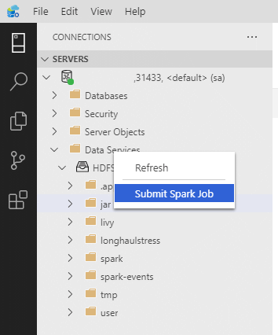

# Submit Spark jobs on [!INCLUDE[big-data-clusters-2019](../includes/ssbigdataclusters-ss-nover.md)] in Azure Data Studio

[!INCLUDE[SQL Server 2019](../includes/applies-to-version/sqlserver2019.md)]

[!INCLUDE[big-data-clusters-banner-retirement](../includes/bdc-banner-retirement.md)]

One of the key scenarios for big data clusters is the ability to submit Spark jobs for SQL Server. The Spark job submission feature allows you to submit a local Jar or Py files with references to SQL Server 2019 big data cluster. It also enables you to execute a Jar or Py files, which are already located in the HDFS file system. 

## Prerequisites

- [SQL Server 2019 big data tools](deploy-big-data-tools.md):
   - **Azure Data Studio**
   - **SQL Server 2019 extension**
   - **kubectl**

- [Connect Azure Data Studio to the HDFS/Spark gateway of your big data cluster](connect-to-big-data-cluster.md).

## Open Spark job submission dialog

There are several ways to open the Spark job submission dialog. The ways include Dashboard, Context Menu in Object Explorer, and Command Palette.

- To open the Spark job submission dialog, click **New Spark Job** in the dashboard.

    

- Or right-click on the cluster in Object Explorer and select **Submit Spark Job** from the context menu.

    

- To open the Spark job submission dialog with the Jar/Py fields pre-populated, right-click on a Jar/Py file in the Object Explorer and select **Submit Spark Job** from the context menu.  

    

- Use **Submit Spark Job** from the command palette by typing **Ctrl+Shift+P** (in Windows) and **Cmd+Shift+P** (in Mac).

    

    
  
 
## Submit Spark job 

The Spark job submission dialog is displayed as the following. Enter Job name, JAR/Py file path, main class, and other fields. The Jar/Py file source could be from Local or from HDFS. If the Spark job has reference Jars, Py files or additional files, click the **ADVANCED** tab and enter the corresponding file paths. Click **Submit** to submit Spark job.

## Monitor Spark job submission

After the Spark job is submitted, the Spark job submission and execution status information are displayed in the Task History on the left. Details on the progress and logs are also displayed in the **OUTPUT** window at the bottom.

- When the Spark job is in progress, the **Task History** panel and **OUTPUT** window refresh with the progress.

    

- When the Spark job successfully completes, the Spark UI and Yarn UI links appear in the **OUTPUT** window. Click the links for more information.

    

## Next steps

For more information on SQL Server big data cluster and related scenarios, see [Introducing [!INCLUDE[big-data-clusters-2019](../includes/ssbigdataclusters-ss-nover.md)]](big-data-cluster-overview.md).
