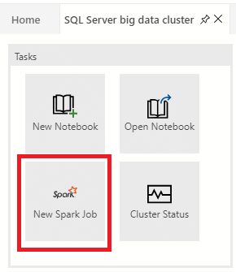
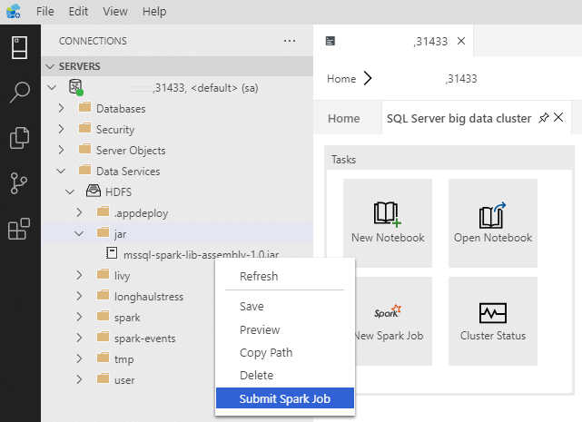
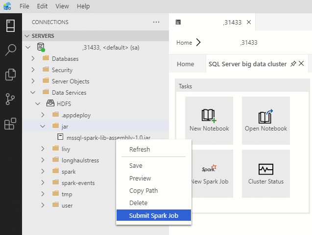
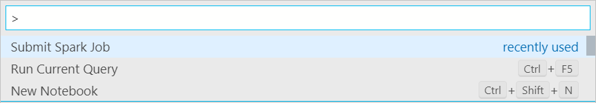
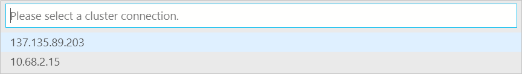
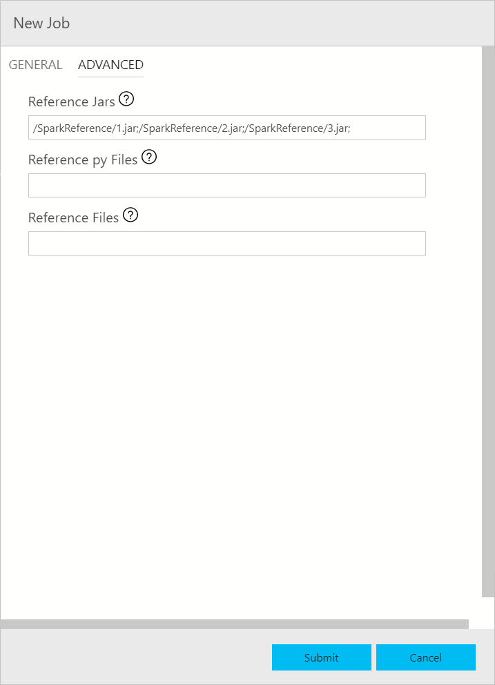
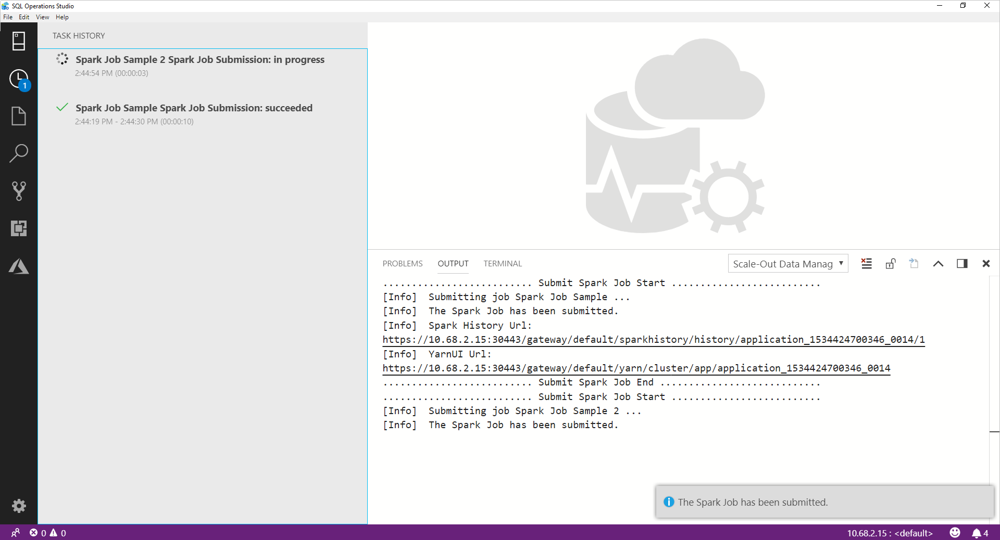
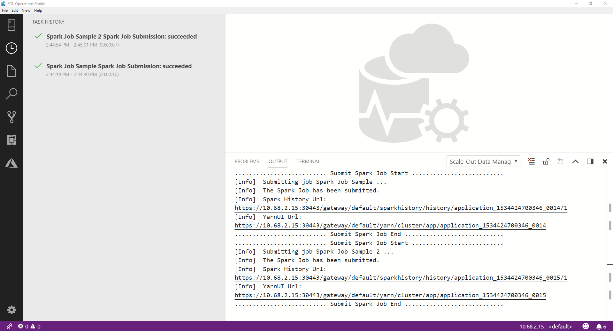

# Submit Spark jobs on SQL Server big data clusters in Azure Data Studio

One of the key scenarios for big data clusters is the ability to submit Spark jobs for SQL Server 2019 preview. The Spark job submission feature allows you to submit a local Jar or Py files with references to SQL Server 2019 big data cluster. It also enables you to execute a Jar or Py files, which are already located in the HDFS file system. 

## Prerequisites

- [SQL Server 2019 big data tools](deploy-big-data-tools.md):
   - **Azure Data Studio**
   - **SQL Server 2019 extension**
   - **kubectl**

- [Connect Azure Data Studio to the HDFS/Spark gateway of your big data cluster](connect-to-big-data-cluster.md).

## Open Spark job submission dialog
There are several ways to open Spark job submission dialog. The ways include Dashboard, Context Menu in Object Explorer, and Command Palate.

+ Click **New Spark Job** in the dashboard to open the Spark job submission dialog.

    
 
+ Right-click on the cluster in the Object Explorer and select **Submit Spark Job** from the context menu. Spark job submission dialog will open.  
 
    

+ Right-click on a Jar/Py file in the Object Explorer and select **Submit Spark Job** from the context menu. Spark job submission dialog with the Jar/Py field to be pre-populated will open. 
 
    

+ Use command **Submit Spark Job** from command palette by typing Ctrl+Shift+P (in Windows) and Cmd+Shift+P (in Mac).

    

    
  
 
## Submit Spark job 
The Spark job submission dialog is displayed as the following. Enter Job name, JAR/Py file path, main class, and other fields. The Jar / Py file source could be from Local or from HDFS. If the Spark job has reference Jars, Py files or additional files, click **ADVANCED** tab and enter the corresponding file paths. Click **Submit** to submit Spark job.
 

## Monitor Spark job submission
After the Spark job is submitted, the Spark job submission and execution status information are displayed in the Task History on the left. And details on the progress and logs are also displayed in the **OUTPUT** window at the bottom.
+ When Spark job is in progress, the **Task History** panel and **OUTPUT** window are refreshing with the progress.

+ When Spark job is in complete with success, you can see Spark UI and Yarn UI links in the **OUTPUT** window. You can click the links for more information.

## Next steps
For more information on SQL Server big data cluster and related scenarios, see [What is SQL Server big data cluster](big-data-cluster-overview.md)?

