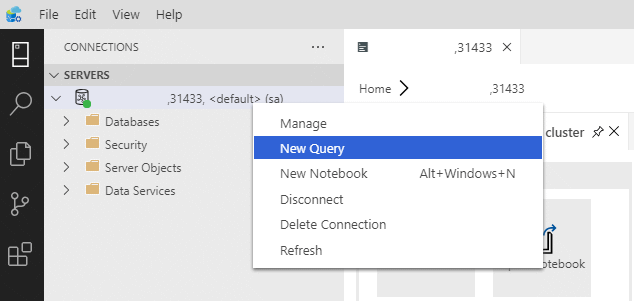
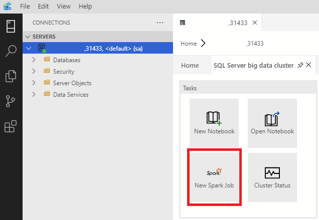
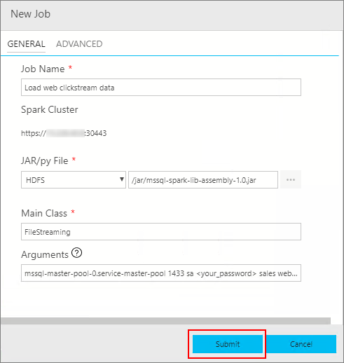
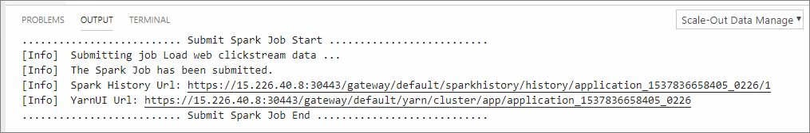

# Tutorial: Ingest data into a SQL Server data pool with Spark jobs

[!INCLUDE[tsql-appliesto-ssver15-xxxx-xxxx-xxx](../includes/tsql-appliesto-ssver15-xxxx-xxxx-xxx.md)]

This tutorial demonstrates how to use Spark jobs to load data into the [data pool](concept-data-pool.md) of a SQL Server 2019 big data cluster (preview). 

In this tutorial, you learn how to:

> [!div class="checklist"]
> * Create an external table in the data pool.
> * Create a Spark job to load data from HDFS.
> * Query the results in the external table.

> [!TIP]
> If you prefer, you can download and run a script for the commands in this tutorial. For instructions, see the [Data pools samples](https://github.com/Microsoft/sql-server-samples/tree/master/samples/features/sql-big-data-cluster/data-pool) on GitHub.

## <a id="prereqs"></a> Prerequisites

- [Big data tools](deploy-big-data-tools.md)
   - **kubectl**
   - **Azure Data Studio**
   - **SQL Server 2019 extension**
- [Load sample data into your big data cluster](tutorial-load-sample-data.md)

## Create an external table in the data pool

The following steps create an external table in the data pool named **web_clickstreams_spark_results**. This table can then be used as a location for ingesting data into the big data cluster.

1. In Azure Data Studio, connect to the SQL Server master instance of your big data cluster. For more information, see [Connect to the SQL Server master instance](connect-to-big-data-cluster.md#master).

1. Double-click on the connection in the **Servers** window to show the server dashboard for the SQL Server master instance. Select **New Query**.

   

1. Create an external data source to the data pool if it does not already exist.

   ```sql
   IF NOT EXISTS(SELECT * FROM sys.external_data_sources WHERE name = 'SqlDataPool')
     CREATE EXTERNAL DATA SOURCE SqlDataPool
     WITH (LOCATION = 'sqldatapool://service-mssql-controller:8080/datapools/default');
   ```

1. Create an external table named **web_clickstreams_spark_results** in the data pool.

   ```sql
   USE Sales
   GO
   IF NOT EXISTS(SELECT * FROM sys.external_tables WHERE name = 'web_clickstreams_spark_results')
      CREATE EXTERNAL TABLE [web_clickstreams_spark_results]
      ("wcs_click_date_sk" BIGINT , "wcs_click_time_sk" BIGINT , "wcs_sales_sk" BIGINT , "wcs_item_sk" BIGINT , "wcs_web_page_sk" BIGINT , "wcs_user_sk" BIGINT)
      WITH
      (
         DATA_SOURCE = SqlDataPool,
         DISTRIBUTION = ROUND_ROBIN
      );
   ```
  
1. In CTP 2.5, the creation of the data pool is asynchronous, but there is no way to determine when it completes yet. Wait for two minutes to make sure the data pool is created before continuing.

## Start a Spark streaming job

The next step is to create a Spark streaming job that loads web clickstream data from the storage pool (HDFS) into the external table you created in the data pool.

1. In Azure Data Studio, connect to the **HDFS/Spark gateway** of your big data cluster. For more information, see [Connect to the HDFS/Spark gateway](connect-to-big-data-cluster.md#hdfs).

1. Double-click on the HDFS/Spark gateway connection in the **Servers** window. Then select **New Spark Job**.

   

1. In the **New Job** window, enter a name in the **Job name** field.

1. In the **Jar/py File** drop-down, select **HDFS**. Then enter the following jar file path:

   ```text
   /jar/mssql-spark-lib-assembly-1.0.jar
   ```

1. In the **Main Class** field, enter `FileStreaming`.

1. In the **Arguments** field, enter the following text, specifying the password to the SQL Server master instance in the `<your_password>` placeholder. 

   ```text
   --server mssql-master-pool-0.service-master-pool --port 1433 --user sa --password <your_password> --database sales --table web_clickstreams_spark_results --source_dir hdfs:///clickstream_data --input_format csv --enable_checkpoint false --timeout 380000
   ```

   The following table describes each argument:

   | Argument | Description |
   |---|---|
   | server name | SQL Server use for reading the table schema |
   | port number | Port SQL Server is listening on (default 1433) |
   | username | SQL Server login user name |
   | password | SQL Server login password |
   | database name | Target database |
   | external table name | Table to use for results |
   | Source directory for streaming | This must be a full URI, such as "hdfs:///clickstream_data" |
   | input format | This can be "csv", "parquet", or "json" |
   | enable checkpoint | true or false |
   | timeout | time to run the job for in milliseconds before exiting |

1. Press **Submit** to submit the job.

   

## Query the data

The following steps show that the Spark streaming job loaded the data from HDFS into the data pool.

1. Before querying the ingested data, look at the task history output to see that the job completed.

   

1. Return to the SQL Server master instance query window that you opened at the beginning of this tutorial.

1. Run the following query to inspect the ingested data.

   ```sql
   USE Sales
   GO
   SELECT count(*) FROM [web_clickstreams_spark_results];
   SELECT TOP 10 * FROM [web_clickstreams_spark_results];
   ```

## Clean up

Use the following command to remove the database objects created in this tutorial.

```sql
DROP EXTERNAL TABLE [dbo].[web_clickstreams_spark_results];
```

## Next steps

Learn about how to run a sample notebook in Azure Data Studio:
> [!div class="nextstepaction"]
> [Run a sample notebook](tutorial-notebook-spark.md)
