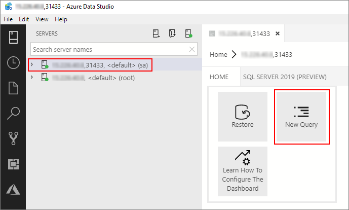

# Tutorial: Query Oracle from a SQL Server big data cluster

[!INCLUDE[tsql-appliesto-ssver15-xxxx-xxxx-xxx](../includes/tsql-appliesto-ssver15-xxxx-xxxx-xxx.md)]

This tutorial demonstrates how to Query Oracle data from a SQL Server 2019 big data cluster. To run this tutorial, you will need to have access to an Oracle server. If you do not have access, this tutorial can give you a sense of how data virtualization works for external data sources in SQL Server big data cluster.

In this tutorial, you learn how to:

> [!div class="checklist"]
> * Create an external table for data in an external Oracle database.
> * Join this data with high-value data in the master instance.

> [!TIP]
> If you prefer, you can download and run a script for the commands in this tutorial. For instructions, see the [Data virtualization samples](https://github.com/Microsoft/sql-server-samples/tree/master/samples/features/sql-big-data-cluster/data-virtualization) on GitHub.

## <a id="prereqs"></a> Prerequisites

- [Big data tools](deploy-big-data-tools.md)
   - **kubectl**
   - **Azure Data Studio**
   - **SQL Server 2019 extension**
- [Load sample data into your big data cluster](tutorial-load-sample-data.md)

## Create an Oracle table

The following steps create a sample table named `INVENTORY` in Oracle.

1. Connect to an Oracle instance and database that you want to use for this tutorial.

1. Run the following statement to create the `INVENTORY` table:

   ```sql
    CREATE TABLE "INVENTORY"
    (
        "INV_DATE" NUMBER(10,0) NOT NULL,
        "INV_ITEM" NUMBER(10,0) NOT NULL,
        "INV_WAREHOUSE" NUMBER(10,0) NOT NULL,
        "INV_QUANTITY_ON_HAND" NUMBER(10,0)
    );

    CREATE INDEX INV_ITEM ON HR.INVENTORY(INV_ITEM);
    ```

1. Import the contents of the **inventory.csv** file into this table. This file was created by the sample creation scripts in the [Prerequisites](#prereqs) section.

## Create an external data source

The first step is to create an external data source that can access your Oracle server.

1. In Azure Data Studio, connect to the SQL Server master instance of your big data cluster. For more information, see [Connect to the SQL Server master instance](connect-to-big-data-cluster.md#master).

1. Double-click on the connection in the **Servers** window to show the server dashboard for the SQL Server master instance. Select **New Query**.

   

1. Run the following Transact-SQL command to change the context to the **Sales** database in the master instance.

   ```sql
   USE Sales
   GO
   ```

1. Create a database scoped credential to connect to the Oracle server. Provide appropriate credentials to your Oracle server in the following statement.

   ```sql
   CREATE DATABASE SCOPED CREDENTIAL [OracleCredential]
   WITH IDENTITY = '<oracle_user,nvarchar(100),SYSTEM>', SECRET = '<oracle_user_password,nvarchar(100),manager>';
   ```

1. Create an external data source that points to the Oracle server.

   ```sql
   CREATE EXTERNAL DATA SOURCE [OracleSalesSrvr]
   WITH (LOCATION = 'oracle://<oracle_server,nvarchar(100)>',CREDENTIAL = [OracleCredential]);
   ```

## Create an external table

Next, create an external table named **iventory_ora** over the `INVENTORY` table on the Oracle server.

```sql
CREATE EXTERNAL TABLE [inventory_ora]
    ([inv_date] DECIMAL(10,0) NOT NULL, [inv_item] DECIMAL(10,0) NOT NULL,
    [inv_warehouse] DECIMAL(10,0) NOT NULL, [inv_quantity_on_hand] DECIMAL(10,0))
WITH (DATA_SOURCE=[OracleSalesSrvr],
        LOCATION='<oracle_service_name,nvarchar(30),xe>.<oracle_schema,nvarchar(128),HR>.<oracle_table,nvarchar(128),INVENTORY>');
```

> [!NOTE]
> Table names and column names will use ANSI SQL quoted identifier while querying against Oracle. As a result, the names are case-sensitive. It is important to specify the name in the external table definition that matches the exact case of the table and column names in the Oracle metadata.

## Query the data

Run the following query to join the data in the `iventory_ora` external table with the tables in the local `Sales` database.

```sql
SELECT TOP(100) w.w_warehouse_name, i.inv_item, SUM(i.inv_quantity_on_hand) as total_quantity
  FROM [inventory_ora] as i
  JOIN item as it
    ON it.i_item_sk = i.inv_item
  JOIN warehouse as w
    ON w.w_warehouse_sk = i.inv_warehouse
 WHERE it.i_category = 'Books' and i.inv_item BETWEEN 1 and 18000 --> get items within specific range
 GROUP BY w.w_warehouse_name, i.inv_item;
```

## Clean up

Use the following command to remove the database objects created in this tutorial.

```sql
DROP EXTERNAL TABLE [inventory_ora];
DROP EXTERNAL DATA SOURCE [OracleSalesSrvr] ;
DROP DATABASE SCOPED CREDENTIAL [OracleCredential];
```

## Next steps

Learn how to ingest data into the data pool:
> [!div class="nextstepaction"]
> [Load data into the data pool](tutorial-data-pool-ingest-sql.md)
