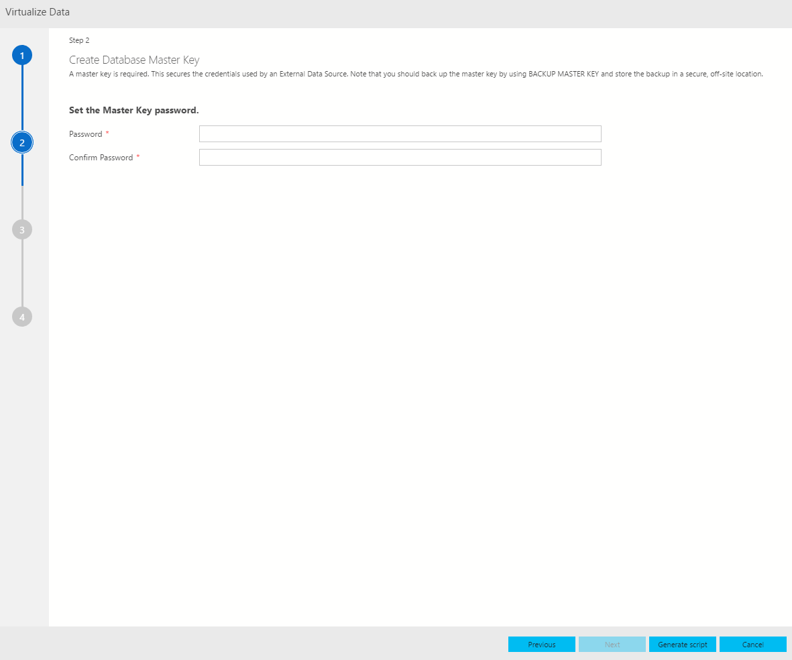

# Virtualize external data in SQL Server vNext

One of the key scenarios for SQL Server vNext is the ability to virtualize data such that the data can remain in it’s original location yet you can **virtualize** the data in a SQL Server instance so that it can be queried there like any other table in SQL Server. This will minimize the need for ETL processes.

## Launch the virtualize data wizard

Connect to the master instance using the IP address / port number (31433) obtained at the end of the [deployment script](quickstart-big-data-cluster-deploy.md). Expand your **Databases** node in the Object Explorer and select one of the databases where you would like to virtualize the data into from an existing SQL Server instance. Right-click on the Database and select **Virtualize Data** from the context menu. This launches the Virtualize Data wizard. You can also launch the Virtualize Data wizard from the command palette by typing Ctrl+Shift+P (in Windows) and Cmd+Shift+P (in Mac).

## Select a data source

Once you launch the wizard from one of the databases you can see that the Destination Database dropdown in the wizard is auto-filled with the database name you have just selected. You also have an option to change the Destination Database if you need to at this step. The External Data Source Type which is supported right now is SQL Server and we will soon expand this offering to support other data sources. By default, SQL Server is selected.  Other data source types such as Oracle, Teradata, MongoDB, etc. will be added here in the future.

Click Next to proceed to the next step in the wizard which sets the Database Master Key.

## Create database master key

In this step, we will let you create a database master key. Creating the master key is required as this secures the credentials used by an External Data Source. Please choose a strong password for your Master Key. You should also backup the master key by using BACKUP MASTER KEY and store the backup in a secure off-site location.

> [!IMPORTANT]
> If you already have a database master key which is set up then the next time when you launch the wizard it will not prompt you to type in the master key anymore and you can click Next to proceed to the next page in the wizard.

> [!NOTE]
> If you don’t choose a strong password, then the wizard will in the last step. This is a known issue which we will fix in upcoming release so that it is more intuitive.

## Enter the external data source credentials

In this step, please enter your data source and credential details. This step creates an external data source object and then uses the credentials for the database object to connect to the data source. Provide a name of the External Data Source (example: Test) and provide the external data source SQL Server Connection details - the Server Name and the Database name where you want your external data source to be created on that server.

The next step is to Configure Credential, so provide a Credential Name, this is the name of the Database scoped credential used to securely store the login information for the External Data Source you are creating (example: TestCred) and provide the username and password to connect to the data source.

## Summary

This step provides a summary of your selections. It provides the name of the Database scoped credential and the External Data Source objects which will be created in the destination database. In this step, you have the option to **Generate Script** which will script out in T-SQL the syntax to create the external data source or **Create** which will create the External Data Source object.

If you click Create you will be able to see the External Data Source object created in the Destination database.

If you click, **Generate Script** you will see the T-SQL query being generated for creating the External Data Source object.

> [!NOTE]
> Generate Script should be only visible in the last page of the wizard. Currently it shows in all pages.

## Next steps

For more information on SQL Server Big Data Cluster and related scenarios, see [What is SQL Server Big Data Cluster?](big-data-cluster-overview.md).