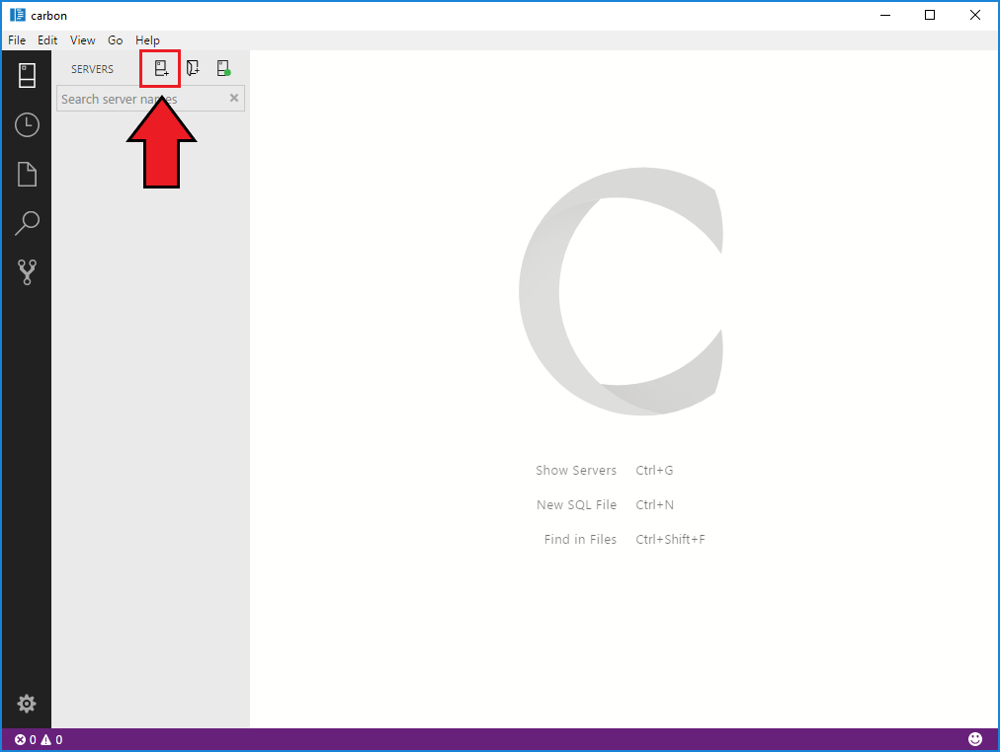

# How to connect to SQL Server using Carbon
This topic shows how to connect to SQL Server using Carbon.

## Prerequisites
To install Carbon follow [these directions](download.md).

Before starting this quickstart, you must have access to a running SQL Server instance. If you don't have it, [download SQL Server 2017 Developer Edition](https://go.microsoft.com/fwlink/?linkid=853016).

## Connect to a server

1. Click the **New Connection** icon on the top left.
   
   

2. For this tutorial, fill the fields as follows:

   **Connection Type:** Microsoft SQL Server
 
   **Server Name:** localhost

   **Authentication Type:** Windows Authentication <How do we address this??>

   **Database Name:** (leave it blank)

   **Server Group:** \<Default\>

   

## Connecting Windows Authentication

When connecting with **Windows Authentication**, the **User name**, and **Password** fields are disabled, and the credentials of the current Windows user are used to connect.

## Connecting with SQL Login

To connect using SQL Login, enter the server administrator's user name and password.

## Connection properties

   

   The following table describes the Connection properties.

   | Setting | Description |
   |-----|-----|
   | **Connection Type** | The SQL Server connection type. For this tutorial, use **Microsoft SQL Server**. |
   | **Server name** | The SQL Server instance name. For this tutorial, use **localhost** to connect to the local SQL Server instance on your machine. If connecting to a remote SQL Server, enter the name of the target SQL Server machine or its IP address. |
   | **Authentication Type** | Decide on the authentication type. For this tutorial, use the **Windows Authentication** selection. |
   | **User name** | Enter the name of a user with access to a database on the server. |
   | **Password (SQL Login)** | Enter the password for the specified user. | 
   | **[Optional] Database name** | The database that you want to use. For purposes of this tutorial, don't specify a database and press **ENTER** to continue. |
   | **Server Group** | The Server Group. For this tutorial, use **\<Default\>**.

## Advanced Connection Properties

Probably don't need to repeat the info from the UI. We should refine the strings if possible.

 | | Property | Description |
 |:---|:---|:---|
 |**Initialization**|  |  |
 || **Connection** | The SQL Server. |
 |**Security**|  |  |
 || **Connection** | The SQL Server. |
 |**Source**|  |  |
 || **Connection** | The SQL Server . |
 |**General**|  |  |
 || **Connection** | The SQL Server . |
 
  

## Next steps

