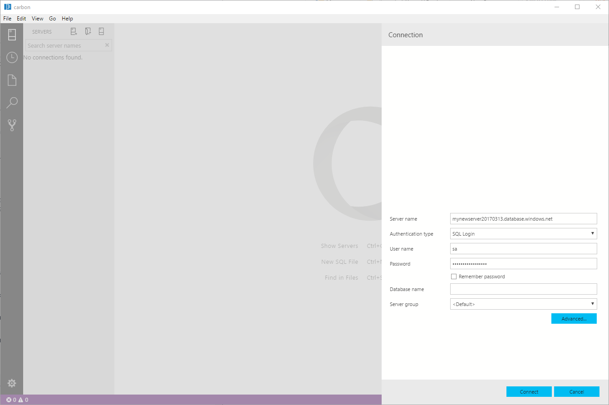
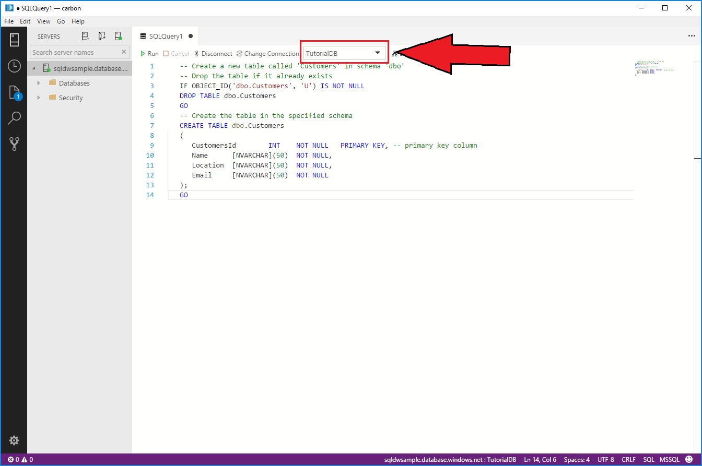

# Azure SQL Database: Use Carbon to connect and query data

This quickstart demonstrates how to use Carbon to connect to an Azure SQL database, and then use Transact-SQL statements to create, insert, and select data in the database.

## Prerequisites

This quickstart uses as its starting point the resources created in one of these quick starts:

- [Create DB - Portal](https://docs.microsoft.com/en-us/azure/sql-database/sql-database-get-started-portal)
- [Create DB - CLI](https://docs.microsoft.com/en-us/azure/sql-database/sql-database-get-started-cli.md)
- [Create DB - PowerShell](https://docs.microsoft.com/en-us/azure/sql-database/sql-database-get-started-powershell.md)

Before you start, install Carbon by following [these directions](download.md).

## Configure Carbon 

### **Mac OS**
For macOS, you need to install OpenSSL which is a prerequisite for DotNet Core that mssql extention uses. Open your terminal and enter the following commands to install **brew** and **OpenSSL**. 

```bash
ruby -e "$(curl -fsSL https://raw.githubusercontent.com/Homebrew/install/master/install)"
brew update
brew install openssl
mkdir -p /usr/local/lib
ln -s /usr/local/opt/openssl/lib/libcrypto.1.0.0.dylib /usr/local/lib/
ln -s /usr/local/opt/openssl/lib/libssl.1.0.0.dylib /usr/local/lib/
```

### **Linux (Ubuntu)**

No special configuration needed.

### **Windows**

No special configuration needed.

## SQL server connection information

Get the connection information needed to connect to the Azure SQL database. You will need the fully qualified server name, database name, and login information in the next procedures.

1. Log in to the [Azure portal](https://portal.azure.com/).

2. Select **SQL Databases** from the left-hand menu, and click your database on the **SQL databases** page. 

3. On the **Overview** page for your database, review the fully qualified server name as shown in the following image. You can hover over the server name to bring up the **Click to copy** option.

    


4. If you have forgotten the login information for your Azure SQL Database server, navigate to the SQL Database server page to view the server admin name and, if necessary, reset the password. 

## Connect to your database

Use Carbon to establish a connection to your Azure SQL Database server.

> [!IMPORTANT]
> Before continuing, make sure that you have your server, database, and login information ready. Once you begin entering the connection profile information, if you change your focus from Carbon, you have to restart creating the connection profile.
>

1. In Carbon, click the **New Connection** icon on the top left.
   
   

2. Follow the prompts to specify the connection properties for the new connection profile. After specifying each value, press **ENTER** to continue. 

   | Setting       | Suggested value | Description |
   | ------------ | ------------------ | ------------------------------------------------- | 
   | **Authentication** | SQL Login| SQL Authentication is the only authentication type that we have configured in this tutorial. |
   | **User name** | The server admin account | This is the account that you specified when you created the server. |
   | **Password (SQL Login)** | The password for your server admin account | This is the password that you specified when you created the server. |
   | **Save Password?** | Yes or No | Select Yes if you do not want to enter the password each time. |
   | **Database name** | *leave blank* | The name of the database to which to connect. |
   | **Server Group** | Select <Default> | A saved profile name speeds your connection on subsequent logins. |

     

3. If you are successfully connected, ignore this step. If you see the following screen, you will need to register your IP address. You can do this through Carbon by clicking add an account, logging in with your Azure credentials, and then adding your IP.

     

4. Verify your connection in the status bar.

## Create a tutorial database
1. Right click on your server in the object explorer and select **New Query.**

2. Copy the snippet below and paste in the query window. Click **Run** to execute the query.

   ```sql
   USE master
   GO
   IF NOT EXISTS (
      SELECT name
      FROM sys.databases
      WHERE name = N'TutorialDB'
   )
   CREATE DATABASE [TutorialDB]
   GO

   ALTER DATABASE [TutorialDB] SET QUERY_STORE=ON
   GO
   ```

## Create a table
1. Copy the snippet below and paste in the query window.
   ```sql
   -- Create a new table called 'Customers' in schema 'dbo'
   -- Drop the table if it already exists
   IF OBJECT_ID('dbo.Customers', 'U') IS NOT NULL
   DROP TABLE dbo.Customers
   GO
   -- Create the table in the specified schema
   CREATE TABLE dbo.Customers
   (
      CustomersId        INT    NOT NULL   PRIMARY KEY, -- primary key column
      Name      [NVARCHAR](50)  NOT NULL,
      Location  [NVARCHAR](50)  NOT NULL,
      Email     [NVARCHAR](50)  NOT NULL
   );
   GO
   ```

2. Change the context to **TutorialDB.** Click **Run** to execute the query.

   

## Insert rows
1. Copy the snippet below to insert four rows and and paste in the query window. Click **Run** to execute the query.
   ```sql
   -- Insert rows into table 'Customers'
   INSERT INTO dbo.Customers
      ([CustomersId],[Name],[Location],[Email])
   VALUES
      ( 1, N'Jared', N'Australia', N''),
      ( 2, N'Nikita', N'India', N'nikita@vsdata.io'),
      ( 3, N'Tom', N'Germany', N'tom@vsdata.io'),
      ( 4, N'Jake', N'United States', N'jake@vsdata.io')   
   GO   
   ```

## View the result
1. Copy the snippet below to view all the rows and paste in the query window. Click **Run** to execute the query.
   ```sql
   -- Select rows from table 'Customers'
   SELECT * FROM dbo.Customers;
   ```
   

## Save result as Excel
1. Right click on the results table and save as a **Excel** file. 

   

2. Save as **Results.xls**.

## View chart
View an existing, built-in widget through the dashboard.

## Clean up resources
> [!TIP]
> Other Quickstarts in this collection build upon this quick start. If you plan to continue on to work with subsequent quickstarts, **do not clean up the resources created in this quickstart**. If you do not plan to continue, use the following steps to delete resources created by this quickstart in the Azure portal.
Clean up the resources you created in the quickstart either by deleting the ...

To delete the entire resource group including the newly created server:
1.	Locate your resource group in the Azure portal. From the left-hand menu in the Azure portal, click **Resource groups** and then click the name of your resource group, such as our example **myresourcegroup**.
2.	On your resource group page, click **Delete**. Then type the name of your resource group, such as our example **myresourcegroup**, in the text box to confirm deletion, and then click **Delete**.

Or instead, to delete the newly created server:
1.	Locate your server in the Azure portal, if you do not have it open. From the left-hand menu in Azure portal, click **All resources**, and then search for the server you created.
2.	On the **Overview** page, click the **Delete** button on the top pane.
3.	Confirm the server name you want to delete.

## Next steps
> [!div class="nextstepaction"]
> [Apply modern code flow using Carbon](tutorial-modern-code-flow-sql-server.md)

> [!div class="nextstepaction"]
> [Monitor your SQL Server databases using Carbon](tutorial-monitoring-sql-server.md)

> [!div class="nextstepaction"]
> [Backup and restore your SQL Server databases using Carbon](tutorial-backup-restore-sql-server.md)