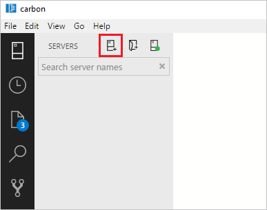
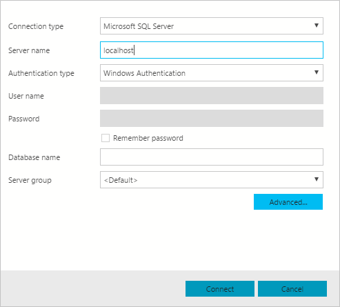
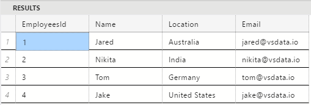
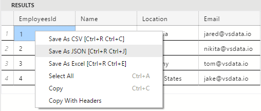

# Connect and query SQL Server using Carbon
This topic shows how to get started using Carbon to develop SQL Server databases, and this Quickstart should take about five minutes.

## Prerequisites
To install Carbon follow [these directions](download.md).

Before starting this quickstart, you must have access to a running SQL Server instance. If you don't have it, [download SQL Server 2017 Developer Edition](https://go.microsoft.com/fwlink/?linkid=853016).

## Connect to a server
1. Click the **New Connection** icon on the top left.
   
   

2. For this tutorial, fill the fields as follows:

   **Connection Type:** Microsoft SQL Server
 
   **Server Name:** localhost

   **Authentication Type:** Windows Authentication <How do we address this??>

   **Database Name:** (leave it blank)

   **Server Group:** \<Default\>

   

## Create a tutorial database
1. Right click on your server, **localhost**, in the object explorer and select **New Query.**


2. Copy the snippet below and paste in the query window. Click **Run** to execute the query.

   ```sql
   USE master
   GO
   IF NOT EXISTS (
      SELECT name
      FROM sys.databases
      WHERE name = N'TutorialDB'
   )
   CREATE DATABASE [TutorialDB]
   GO
   ```

## Create a table
1. Remove the contents of the query window.

2. Copy the snippet below and paste in the query window. Click **Run** to execute the query.
   ```sql
   -- Create a new table called 'Employees' in schema 'dbo'
   -- Drop the table if it already exists
   IF OBJECT_ID('TutorialDB.dbo.Employees', 'U') IS NOT NULL
   DROP TABLE TutorialDB.dbo.Employees
   GO
   -- Create the table in the specified schema
   CREATE TABLE TutorialDB.dbo.Employees
   (
      EmployeesId        INT    NOT NULL   PRIMARY KEY, -- primary key column
      Name      [NVARCHAR](50)  NOT NULL,
      Location  [NVARCHAR](50)  NOT NULL,
      Email     [NVARCHAR](50)  NOT NULL
   );
   GO
   ```

## Insert rows
1. Remove the contents of the query window.

2. Copy the snippet below to insert four rows and and paste in the query window. Click **Run** to execute the query.
   ```sql
   -- Insert rows into table 'Employees'
   INSERT INTO TutorialDB.dbo.Employees
      ([EmployeesId],[Name],[Location],[Email])
   VALUES
      ( 1, N'Jared', N'Australia', N'jared@vsdata.io'),
      ( 2, N'Nikita', N'India', N'nikita@vsdata.io'),
      ( 3, N'Tom', N'Germany', N'tom@vsdata.io'),
      ( 4, N'Jake', N'United States', N'jake@vsdata.io')   
   GO   
   -- Query the total count of employees
   SELECT COUNT(*) as EmployeeCount FROM TutorialDB.dbo.Employees;
   -- Query all employee information
   SELECT e.EmployeesId, e.Name, e.Location 
   FROM TutorialDB.dbo.Employees as e
   GO
   ```

## View the result in Object Explorer
1. Right click on the **localhost** server and click **Refresh**.

2. Click **Databases**, then **TutorialDB**, then **Tables**, then right click **dbo.Employees**. Click **Select Top 1000 Rows**.

   

## Save as result
1. Right click on the results table and save as a **JSON** file.

   

2. Save as **Results.json**.

## View chart
View built-in widgets through the dashboard.

## Next steps
> [!div class="nextstepaction"]
> [Apply modern code flow using Carbon](tutorial-modern-code-flow-sql-server.md)

> [!div class="nextstepaction"]
> [Monitor your SQL Server databases using Carbon](tutorial-monitoring-sql-server.md)

> [!div class="nextstepaction"]
> [Backup and restore your SQL Server databases using Carbon](tutorial-backup-restore-sql-server.md)

## Clean up resources
Clean up the resources you created in the quickstart either by deleting the ...

> [!TIP]
> Other Quickstarts in this collection build upon this quick start. If you plan to continue on to work with subsequent quickstarts, do not clean up the resources created in this quickstart. If you do not plan to continue, use the following steps to delete resources created by this quickstart in the Azure portal.

To delete the entire resource group including the newly created server:
1.	Locate your resource group in the Azure portal. From the left-hand menu in the Azure portal, click **Resource groups** and then click the name of your resource group, such as our example **myresourcegroup**.
2.	On your resource group page, click **Delete**. Then type the name of your resource group, such as our example **myresourcegroup**, in the text box to confirm deletion, and then click **Delete**.

Or instead, to delete the newly created server:
1.	Locate your server in the Azure portal, if you do not have it open. From the left-hand menu in Azure portal, click **All resources**, and then search for the server you created.
2.	On the **Overview** page, click the **Delete** button on the top pane.
3.	Confirm the server name you want to delete.

   The following table describes the Connection Profile properties.

   | Setting | Description |
   |-----|-----|
   | **Connection Type** | The SQL Server connection type. For this tutorial, use **Microsoft SQL Server**. |
   | **Server name** | The SQL Server instance name. For this tutorial, use **localhost** to connect to the local SQL Server instance on your machine. If connecting to a remote SQL Server, enter the name of the target SQL Server machine or its IP address. |
   | **Authentication Type** | Decide on the authentication type. For this tutorial, use the **Windows Authentication** selection. |
   | **User name** | Enter the name of a user with access to a database on the server. |
   | **Password (SQL Login)** | Enter the password for the specified user. | 
   | **[Optional] Database name** | The database that you want to use. For purposes of this tutorial, don't specify a database and press **ENTER** to continue. |
   | **Server Group** | The Server Group. For this tutorial, use **\<Default\>**.