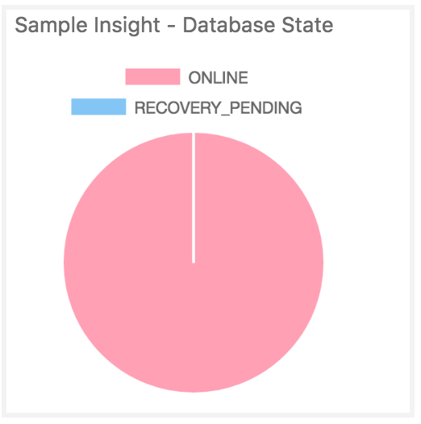
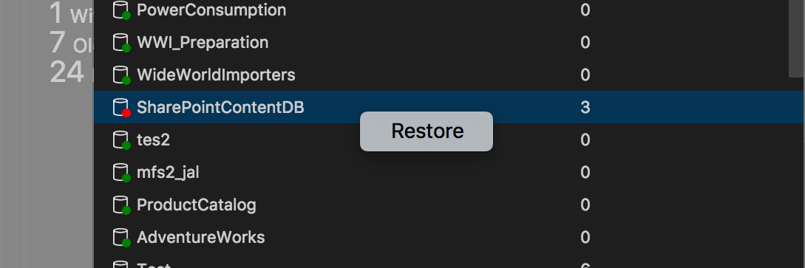

# Create Insight widgets in Carbon


1. Run your query in Carbon editor and get the query result in the result view.
2. On the result view, click ```view as chart``` icon button on the right of your result grid.
3. Choose a chart that fits or adjust your query.
3.5 Then click ```Create Dashboard Insight``` button to generate json settings for your insight.


## How to Configure a Dashboard using Sample Insight extensions

> Disclaimer: All sample configurations and SQL scripts used in this sample extension and this wiki page are for demonstration purposes only. Many SQL scripts in this sample refer to user blogs and user forums e.g. Stack Exchange. They are strictly for personal use and are included as a demonstration of how to build an insight extension using your own queries. All SQL scripts and configurations will not be published as a part of Carbon unless the original author contributes to or agrees to do so. All SQL scripts and configurations in this sample extension are subject to removal or replacement without any prior notice. All sample insight widgets are for test use only.

### Step 1. Install Carbon

Download and install Carbon by following the [installation guide](download.md).

#### Step 2. Download the Sample Insight Widget Extension

Download the Sample Insight Widget Extension

Unzip the file.

#### Step 3. Copy extension files to .carbon/extensions folder in the user's Home folder

Open Terminal windows on Linux or macOS and run following commands

```bash
cd sample_insight_widget_extension
cp -r * ~/.carbon/extensions
```

Or open PowerShell on Windows and run following commands

```PowerShell
cd sample_insight_widget_extension
cpi * ~/.carbon/extensions -force -recurse
```

#### Step 4. Restart Carbon and add Insight widgets to Dashboard

Restart Carbon.

Press ```F1``` to open command palette, type in ```settings``` and select ```Preferences: Open User Settings```.

In the root ```{ }```, type in the following widget configuration using Insight configuration IntelliSense. Use ```CTRL+space``` within ``` "widget":{} ``` section to list the name of available insight widgets from the sample insight widget extension.

```json
"dashboard.server.widgets": [
    {
        "name": "Title of insight widget1",
        "widget": {
            "name of server insight widget1": null
        }

    },
    {
        "name": "Title of insight widget2",
        "widget": {
            "name of server insight widget2": null
        }

    }
],
"dashboard.database.widgets": [
    {
        "name": "Title of insight widget1",
        "widget": {
            "name of database insight widget1": null
        }
    },
    {
        "name": "Title of insight widget2",
        "widget": {
            "name of database insight widget2": null
        }
    }
]
```

### Step 5. Use Workspace Settings

In addition to User Settings, Carbon supports Workspace Settings where the setting is applied only when Carbon opens a specific folder with ```.vscode/settings.json``` file exists. You can check in the workspace settings as a part of your project in source control, hence all team members can share the same workspace settings. To try out, run following commands:

```bash 
mkdir -p ./test_folder
cd ./test_folder
mkdir -p .vscode
```

Open Carbon in ./test_folder folder.

Create ```settings.json``` file in ```.vscode``` folder and type in ```dashboard.server.widgets``` and ```dashboard.database.widgets``` settings in the ```settings.json``` file as described in Step 4.

Open server and database dashboard to view insights for the workspace.

### sample settings.json file

Download Sample settings.json file. 

Copy the file to ```.vscode/settings.json``` file in any folder. 

Start Carbon and open the folder to apply the settings.


## How to Build an Insight Extension: Sample Walkthrough

This section walks through how to create a simple insight widget, insight detail and map a management action.

### Sample scenario

* Create a sample server insight widget: Draw a pie chart for the state of all databases in a SQL Server, let's call it 'database state widget'.

* Add an insight details flyout dialog: Show more state details for each database in the SQL Server.

* Add an insight action: Launch a management action, 'restore', for each database. 

    > Custom actions will be supported in near future. Stay tuned.

### Create a sample server insight widget


## Preparation for your first Insight widget extension

Open a Terminal or PowerShell windows and run following commands to create a project folder ```carbon_insight``` and necessary files in the folder.

```bash
cd ~
mkdir -p ~/carbon_insight
cd ~/carbon_insight
carbon .
```

In Carbon, click ```CTRL+SHIFT+E``` to open File Explorer. Create a new file called ```package.json``` and a new folder ```sql```. 

In the ```sql``` folder create two sql files. ```database_state.sql``` and ```database_state_details.sql```.

Or press ```CTRL+` ``` to open Integrated Terminal then run following commands:

```bash
touch package.json
mkdir -p sql
cd ./sql
touch database_state.sql
touch database_state_detail.sql
```

If you run Carbon on Windows and PowerShell for Integrated Terminal, run:

```powershell
echo $null >> package.json
mkdir -p sql
cd ./sql
echo $null >> database_state.sql
echo $null >> database_state_detail.sql
```

#### Step 3. Write the basic extension template in ```package.json```.

Open ```package.json``` file and copy-paste following JSON configuration. 

> It is a minimum template to define a VS Code extension (remember that Carbon is built-on VS Code?). For more detail of how to build a VS Code extension, see [Extending Visual Studio Code](https://code.visualstudio.com/docs/extensions/overview). 

You can change ```name```, ```version```, ```publisher``` with your preference.

```json
{
    "name": "myinsight",
    "version": "0.1.0",
    "publisher": "myname",
    "engines": {
        "vscode": "*"
    },
    "contributes": {
    }
}
```

#### Step 4. Bring your own SQL script for the Insight.

Open ```database_state.sql``` by double-clicking the file in Carbon's File Explorer(```CTRL+SHIFT+E```).

Type in the following SQL script and save.

```sql
select 
    ONLINE, RECOVERY_PENDING
from 
    (select state_desc, database_id from sys.databases) p
    pivot (count(database_id) for state_desc in (ONLINE, RECOVERY_PENDING)) as pvt;
```

Connect to a SQL Server, execute the query and check Carbon returns the query result. 


#### Step 5. Define an insight in package.json

Open ```package.json``` file in Carbon.

Using Insight configuration intellisense (use ```CTRL+space``` for suggestions), type in the following configuration within ```"contributes":{}``` section:

```json
{
    "name": "myinsight",
    "version": "0.1.0",
    "publisher": "myname",
    "engines": {
        "vscode": "*"
    },
    "contributes": {
        "insights": [
            {
                "id": "my-insight-database-state",
                "contrib": {
                    "queryFile": "./sql/database_state.sql",
                    "type": {
                        "chart": {
                            "chartType": "pie",
                            "dataDirection": "horizontal"
                        }
                    }
                }
            }
        ]
    }
}
```

#### Step 6. Copy (install) the insight widget extension to Carbon extensions folder

In the Integrated Terminal, run following commands on macOS or Linux:

```bash
cd ..
cp -rf ./carbon_insight ~/.carbon/extensions/
ls ~/.carbon/extensions
```

Or in PowerShell on Windows, run following commands:
``` PowerShell
cd ..
cpi ./carbon_insight ~/.carbon/extensions/ -force -recurse
ls ~/.carbon/extensions
```

#### Step 7. Restart Carbon

Restart Carbon to reload the newly added extension. 

For each new change to the extension, repeat the ```Step 6``` and ```Step 7``` to reload the extension. 


#### Step 8. Add the new insight widget to Dashboard.

Press ```F1``` to open command palette,  type in ```settings``` and select ```Preferences: Open User Settings```.

In the root ```{ }```, type in the following configuration using Insight configuration intellisense.

```json
"dashboard.server.widgets": [
    {
        "name": "Sample Insight - Database State",
        "widget": {
            "my-insight-database-state": null
        }
    }
]

```

#### Step 9. Check the result

Connect to a server. 

Click ```Manage``` context menu from the server node in OE to open Dashboard.

Click ```<server name>``` on the breadcrumb control on the top of Dashboard to navigate to the server from master database.

Dashboard displays following sample insight widget.




### Add an insight details flyout dialog

#### Step 1. Open ```database_state_detail.sql``` file and type in the following script:

```sql
SELECT name, [state], state_desc, user_access_desc FROM sys.databases;
```

#### Step 2. Open ```package.json``` file and type in the following ```detail``` configuration:

```json

"details": {
    "queryFile": "./sql/database_state_detail.sql",
    "label": {
        "column": "Database",
        "icon": "database",
        "state": [
            {
                "condition": {
                    "if": "equals",
                    "equals": "0"
                },
                "color": "green"
            },
            {
                "condition": {
                    "if":"notEquals",
                    "equals": "0"
                },
                "color": "red"
            }
        ]
    },
    "value": "state"
}
 
```

#### Step 3. Copy extension files and restart Carbon

In the Integrated Terminal, run following command on macOS or Linux:

```bash
cd ..
cp -rf ./carbon_insight ~/.carbon/extensions/
ls ~/.carbon/extensions
```

Or in PowerShell on Windows
``` PowerShell
cd ..
cpi ./carbon_insight ~/.carbon/extensions/ -force -recurse
ls ~/.carbon/extensions
```

#### Step 4. Open Insight details flyout dialog.

Click ```...``` ```Show Insight``` button on the insight widget. It will open following flyout dialog for more details from ```database_state_detail.sql``` query.


### Add an Insight action

#### Step 1. Open ```package.json``` and add ```actions``` configuration in the ```details``` section

```json
"details": {
...
                "color": "red"
            }
        ]
    },
    "value": "state",
    "actions": {
        "types": [
            "restore"
        ],
        "database": "${Database}",
    }
...
}
``` 

#### Step 2. Copy extension files and restart Carbon

In the Integrated Terminal, run following command on macOS or Linux:

```bash
cd ..
cp -rf ./carbon_insight ~/.carbon/extensions/
ls ~/.carbon/extensions
```

Or in PowerShell on Windows
``` PowerShell
cd ..
cpi ./carbon_insight ~/.carbon/extensions/ -force -recurse
ls ~/.carbon/extensions
```

#### Step 3. Launch a management action

Open the server dashboard. Start Insight details flyout dialog by clicking ```...``` ```Show Insight``` button on the widget.

On the flyout, right click on a database which will show Actions context menu with ```restore```.




Click ```restore``` context menu to launch Restore task.


## Next steps
- [Download and Install Carbon](download.md)
- [Connect to SQL Server](get-started-sql-server.md)