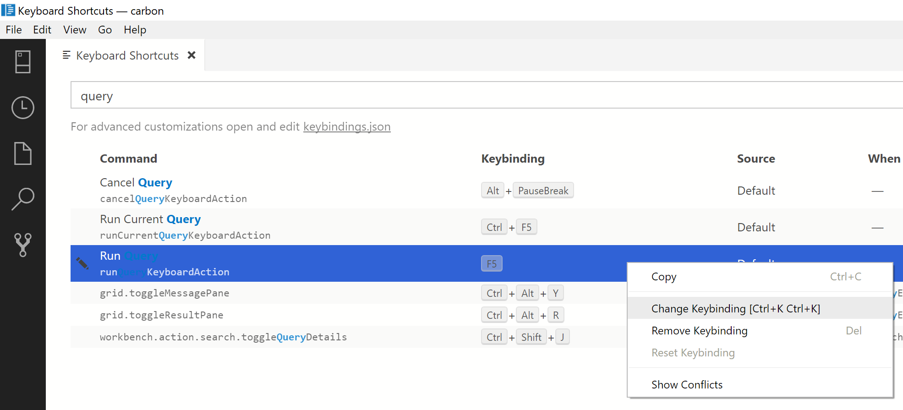
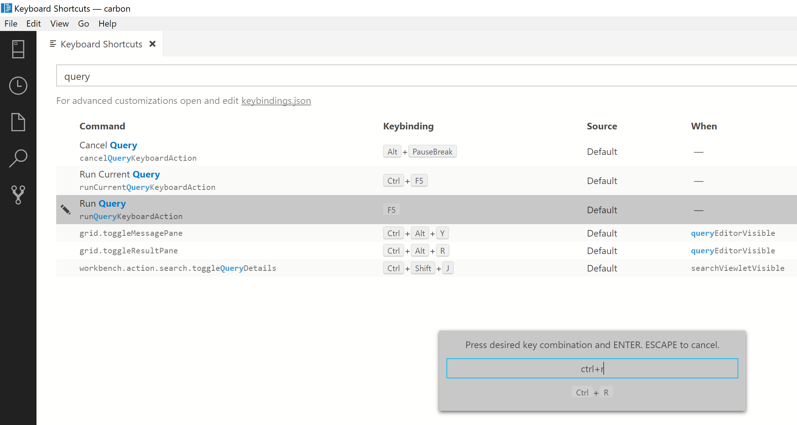
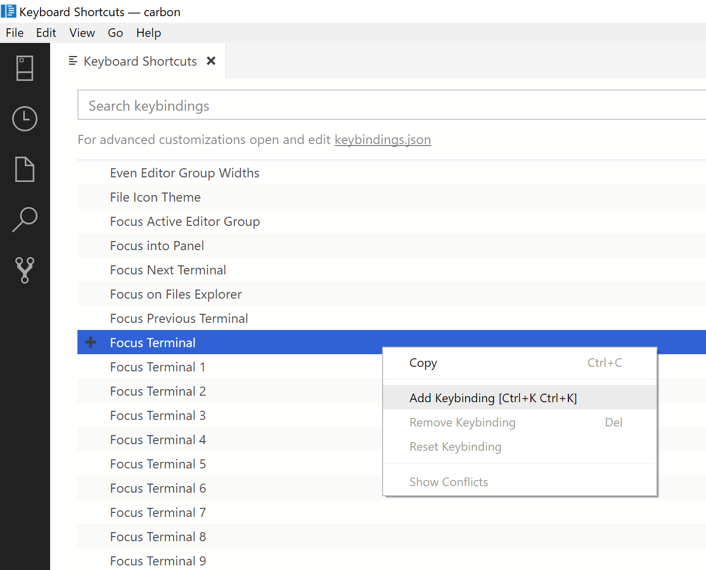

# Keyboard shortcuts in Carbon

This article provides the steps to quickly view, edit, and create keyboard shortcuts in Carbon.

Carbon inherits its key binding functionality from Visual Studio Code so for more detailed information, see [Key Bindings for Visual Studio Code](https://code.visualstudio.com/docs/getstarted/keybindings). Some features may not be available (for example, Keymap extensions are not supported in the Carbon preview).

## Open the Keyboard Shortcuts editor

To view all currently defined keyboard shortcuts:

Open the **Keyboard Shortcuts** editor from the **File** menu: **File** > **Preferences** > **Keyboard Shortcuts** (**??Carbon** > **Preferences** > **Keyboard Shortcuts** on Mac). ??LINUX

In addition to displaying current keybindings, the **Keyboard Shortcuts** editor lists the available commands that do not have keyboard shortcuts defined. The **Keyboard Shortcuts** editor enables you to easily change, remove, reset, and define new keybindings.  

## Edit existing keyboard shortcuts

To change the keybinding for an existing keyboard shortcut:

1. [Open the **Keyboard Shortcuts** editor](#open-the-keyboard-shortcuts-editor.md).
2. Locate the keyboard shortcut you want to change by using the search box or scrolling through the list.
   > [!TIP]
   > Search by key, by command, by source, etc. to return all relevant keyboard shortcuts.

1. Right-click the desired entry and select **Change Keybinding**

   

1. Press the desired combination of keys, then press **Enter** to save it. 

   

## Create new keyboard shortcut

1. [Open the **Keyboard Shortcuts** editor](#open-the-keyboard-shortcuts-editor.md).
2. Right-click a command that doesn't have any keybinding and select **Add Keybinding**.

   

1. Press the desired combination of keys, then press **Enter** to save it.

## Additional Resources
For information about Carbon, see [Carbon Overview](overview.md)
