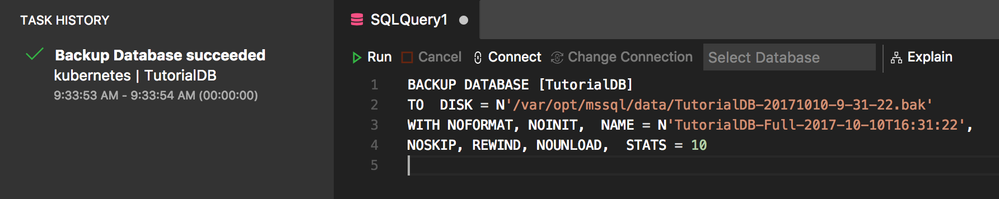
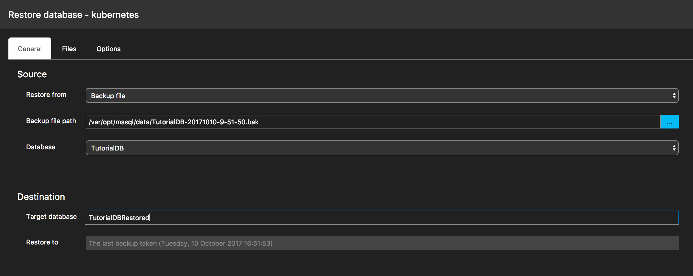

# Backup and Restore with Carbon
the page overview paragraph goes here.

In this tutorial, you use the Carbon to learn how to:
> [!div class="checklist"]
> * Backup a database using Backup dialog.
> * View the backup task status and script out the backup script.
> * Restore a database using Restore dialog.

If you don't have an Azure subscription, create a [free](https://azure.microsoft.com/free/) account before you begin.

## Prerequisites
Follow [Get Started with Carbon](./get-started-sql-server.md)

## Backup TutorialDB
[step overview]

1. Open TutorialdB Dashboard with ```Manage``` context menu from ```Servers viewlet```.

2. Open a backup dialog with ```Backup``` on the Tasks widget.

   

3. Click ```Backup``` and backup TutorialDB.

## View the backup status and build a bakcup script
[step overview]

1. Open ```Task History``` viewlet by clicking ```Task History``` icon on the Action bar.

   

2. Open the context menu for ```Backup Database succeeded``` task entry and click ```Script``` context menu from right-mouse-click.

3. View the backup script in the editor.

    

## Restore database from a backup file
[step overview]

1. Open Dashboard and click ```Restore``` Task.

2. Select ```Backup file``` for ```Restore from``` option. Select the latest backup file for TutorialDB using ```Select a file``` dialog to set ```Backup file path``` option.

3. Type in ```TutorialDB_Restored``` for ```Target database``` option under Destination section to restore the backup file by creating a new database.

   

4. Click ```Restore```

5. Click ```CTRL + T``` to open Task History viewlet to view the status of restore operation.

  

## Next Steps
In this tutorial, you learned how to:
> [!div class="checklist"]
> * Create something
> * Do something
> * Do something else
> * Finish something 

Next, try this tutorial: 
[Another Tutorial](doc-template-tutorial.md)
> [!div class="nextstepaction"]
> [What article is next in sequence](tutorial-monitoring-sql-server.md)