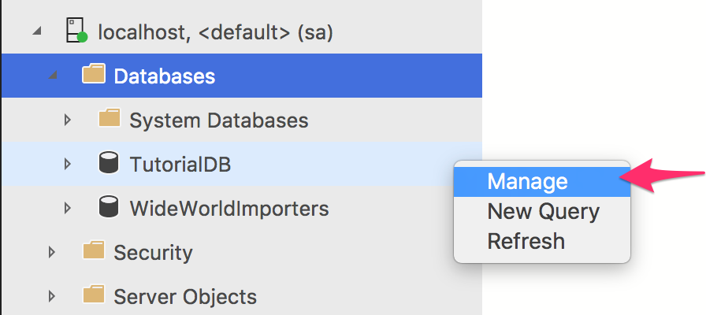
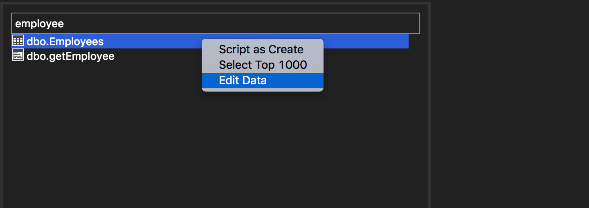
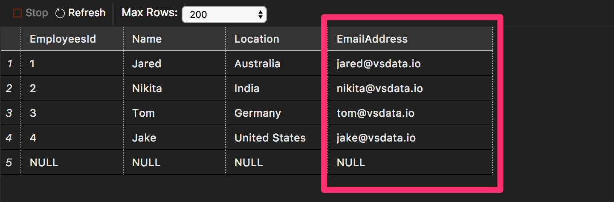
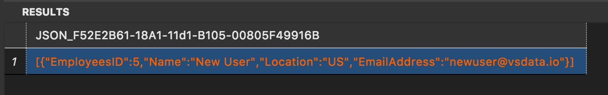

# Modernize T-SQL code flow with Carbon
Connect to a SQL Server instance and database, write T-SQL scripts, execute the scripts and view results are core tasks of developers and operators. In this tutorial, we will walkthrough the key functionalities of Carbon that can help develop and manage SQL Server and database easier and faster using T-SQL scripts in Carbon.

In this tutorial, you use the Carbon to learn to:
> [!div class="checklist"]
> * Quick search schema objects
> * Edit table data 
> * Writing T-SQL script using snippets
> * Learn about database object details using Peek Definition and Go to Definition


## Prerequisites
Follow [Get Started with Carbon](./get-started-sql-server.md)

## Quickly find a table and edit data
Carbon provides a quick database schema object search functionality using 'Explorer widget' in a dashboard and quickly launch a task based on an object type such as 'Edit data' for a table.

1. Open Servers viewlet with ```CTRL+G``` and expand ```Databases``` folder. Select ```TutorialDB```. 

2. Open TutorialDB Dashboard using ```Manage``` context menu with right-mouse-click.

   

3. Type ```Customer``` in Search widget as shown below.

4. Select ```dbo.Customer``` table from Search widget on the dashboard and run ```Edit data``` context menu with right-mouse-click.

   

5. Select ```Email``` column in the first row and type in ```jared@vsdata.io```.

6. Click Refresh. The result is shown in the screenshot below.

   

## Use T-SQL snippet and IntelliSense to create a procedure

1. Press 'CTRL + N' to open a new editor.

2. Type ```sql``` in the editor, then select ```sqlCreateStoredProcedure```. Press ```Tab```. Carbon creates a new stored procedure snippet.

   

3. Type ```GetCustomer```. All ```StoredProcedureName``` entries will change to the specified name. 
   

4. Press ```Tab``` and then type ```dbo``` for ```SchemaName``` entry.

5. Type in the following parameter definition.

   ```sql
   CREATE PROCEDURE dbo.GetCustomer
       @ID int
   ```

6. Using T-SQL Intellisense, type in the following SELECT statement in the body of procedure. Tip: Type in ```SELECT FROM dbo.Customers c``` first and type the rest as IntelliSense guides you. 

   ```sql
    SELECT  c.CustomersID, 
            c.Name, 
            c.Location, 
            c.Email
    FROM dbo.Customers c
    WHERE c.CustomersID = @ID
    FOR JSON PATH
   ```

   

7. Press ```F5``` and execute the statement.

## Use Peek Definition and Go to Definition 

1. Press 'CTRL + N' to open a new editor. 

2. Type and select ```sqlCreateStoredProcedure``` from the snippet suggestion list. Type in ```SetCustomer``` for ```StoredProcedureName``` and ```dbo``` for ```SchemaName```.
3. Specify following parameter:

   ```sql
   CREATE PROCEDURE dbo.SetCustomer
       @json_val nvarchar(max)
   ```

4. In the body of procedure, type in following:
   ```sql
   -- body of the stored procedure
   INSERT INTO dbo.Customers
   ```

5. Right-mouse-click on ```dbo.Customers``` and run ```Peek Definition```

   

6. By referencing the table defintion in the peek definition, complete the following insert statement.

   ```sql
   INSERT INTO dbo.Customers (CustomersID, Name, Location, Email)
       SELECT CustomersID, Name, Location, Email
       FROM OPENJSON (@json_val)
       WITH(   CustomersID int, 
               Name nvarchar(50), 
               Location nvarchar(50), 
               Email nvarchar(50)
   ```
7. The final statement should be:

   ```sql
   -- Create a new stored procedure called 'SetCustomer' in schema 'dbo'
   -- Drop the stored procedure if it already exists
   IF EXISTS (
   SELECT *
       FROM INFORMATION_SCHEMA.ROUTINES
       WHERE SPECIFIC_SCHEMA = N'dbo'
       AND SPECIFIC_NAME = N'SetCustomer'
   )
   DROP PROCEDURE dbo.SetCustomer
   GO
   -- Create the stored procedure in the specified schema
   CREATE PROCEDURE dbo.SetCustomer
       @json_val nvarchar(max) 
   AS
       -- body of the stored procedure
       INSERT INTO dbo.Customers (CustomersID, Name, Location, Email)
       SELECT CustomersID, Name, Location, Email
       FROM OPENJSON (@json_val)
       WITH(   CustomersID int, 
               Name nvarchar(50), 
               Location nvarchar(50), 
               Email nvarchar(50)
       )
   GO
   ```

8. Press ```F5``` and execute the script.

## Save as Json

In this step, we will walkthrough how Save as JSON can make a developing and testing application login in stored procedures and using JSON as a data format in applications.

1. First, run ```SELECT TOP 1000 Rows``` from dbo.Customers table.

2. Select and highlight the first row in the result view.

3. Click ```Save as Json```. It opens the highlighted row in json format.

   

4. Select the json data and copy with ```CTRL+C```.

5. Open a new query for TutorialDB and paste the json data into the new query editor. 

6. Complete the following test script using the json data as a template in the previous step. Modify the values for ```CustomerID```, ```Name```, ```Location``` and ```Email```.

   ```sql
   -- example to execute the stored procedure we just created
   declare @json nvarchar(max) =
   N'[
       {
           "CustomersID": 5,
           "Name": "New User",
           "Location": "US",
           "Email": "newuser@vsdata.io"
       }
   ]'

   EXECUTE dbo.setCustomer @json_val = @json
   GO

   EXECUTE dbo.getCustomer @ID = 5
   ```

7. Press ```F5``` and execute the script. It will insert a new Customer and return the new Customer's information in json format. Click the result.

   

## Next Steps
In this tutorial, you learned how to:
> [!div class="checklist"]
> * Quick search schema objects
> * Edit table data 
> * Writing T-SQL script using snippets
> * Learn about database object details using Peek Definition and Go to Definition

Next, learn how to use X, try this tutorial: 
> [!div class="nextstepaction"]
> [What article is next in sequence](tutorial-monitoring-sql-server.md)