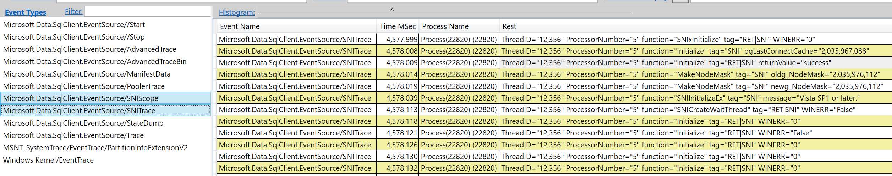
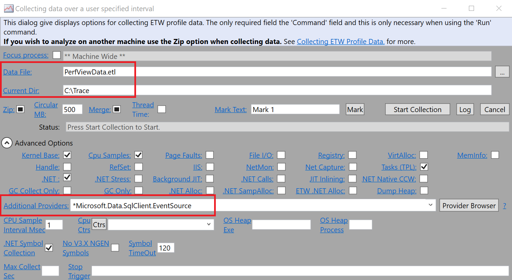

# Enable event tracing in SqlClient

[!INCLUDE [appliesto-netfx-netcore-netst-md](../../includes/appliesto-netfx-netcore-netst-md.md)]

[!INCLUDE [Driver_ADONET_Download](../../includes/driver_adonet_download.md)]

[Event Tracing for Windows (ETW)](/windows/win32/etw/event-tracing-portal) is an efficient, kernel-level, tracing facility that lets you log driver-defined events for debugging and testing purposes. SqlClient supports capturing ETW events at different informational levels. To begin capturing event traces, client applications should listen for events from SqlClient's EventSource implementation:

```
Microsoft.Data.SqlClient.EventSource
```

The current implementation supports the following Event Keywords:

| Keyword name | Value | Description |
| ------------ | ----- | ----------- |
| ExecutionTrace | 1 | Turns on capturing Start/Stop events before and after command execution. |
| Trace | 2 | Turns on capturing basic application flow trace events. |
| Scope | 4 | Turns on capturing enter and exit events |
| NotificationTrace | 8 | Turns on capturing `SqlNotification` trace events |
| NotificationScope | 16 | Turns on capturing `SqlNotification` scope enter and exit events |
| PoolerTrace | 32 | Turns on capturing connection pooling flow trace events. |
| PoolerScope | 64 | Turns on capturing connection pooling scope trace events. |
| AdvancedTrace | 128 | Turns on capturing advanced flow trace events. |
| AdvancedTraceBin  | 256 | Turns on capturing advanced flow trace events with additional information. |
| CorrelationTrace | 512 | Turns on capturing correlation flow trace events. |
| StateDump | 1024 | Turns on capturing full state dump of `SqlConnection` |
| SNITrace | 2048 | Turns on capturing flow trace events from Managed Networking implementation (only applicable in .NET Core) |
| SNIScope | 4096 | Turns on capturing scope events from Managed Networking implementation (only applicable in .NET Core) |

## Example

The following example enables event tracing for a data operation on the **AdventureWorks** sample database and displays the events in the console window.

[!code-csharp [SqlClientEventSource#1](~/../sqlclient/doc/samples/SqlClientEventSource.cs#1)]

## Event tracing support in Native SNI

**Microsoft.Data.SqlClient** provides event tracing support in **Microsoft.Data.SqlClient.SNI** and **Microsoft.Data.SqlClient.SNI.runtime** starting with v2.1. Events can be collected from the native DLLs using the [Xperf](/windows-hardware/test/wpt/) and [PerfView](https://github.com/microsoft/perfview) tools.

Starting with **Microsoft.Data.SqlClient** v3.0, event tracing can be enabled without any modifications in the client application using event collection tools.

With **Microsoft.Data.SqlClient** v2.1, event tracing needs to be enabled by configuring the `EventCommand` with an event source listener. The valid `EventCommand` values applicable to Native SNI are:

```cs

// Enables trace events:
EventSource.SendCommand(eventSource, (EventCommand)8192, null);

// Enables flow events:
EventSource.SendCommand(eventSource, (EventCommand)16384, null);

// Enables both trace and flow events:
EventSource.SendCommand(eventSource, (EventCommand)(8192 | 16384), null);
```

The following example enables event tracing in native SNI DLLs.

```cs
// Native SNI tracing example
using System;
using System.Diagnostics.Tracing;
using Microsoft.Data.SqlClient;

public class SqlClientListener : EventListener
{
    protected override void OnEventSourceCreated(EventSource eventSource)
    {
        if (eventSource.Name.Equals("Microsoft.Data.SqlClient.EventSource"))
        {
            // Enables both trace and flow events
            EventSource.SendCommand(eventSource, (EventCommand)(8192 | 16384), null);
        }
    }
}

class Program
{
    static string connectionString = @"Data Source = localhost; Initial Catalog = AdventureWorks;Integrated Security=true;";

    static void Main(string[] args)
    {
        // Event source listener configuration is not required in v3.0 onwards.
        using (SqlClientListener listener = new SqlClientListener())
        using (SqlConnection connection = new SqlConnection(connectionString))
        {
            connection.Open();
        }
    }
}
```

## Use Xperf to collect traces

1. Start tracing using the following command.

   ```powershell
   xperf -start trace -f myTrace.etl -on *Microsoft.Data.SqlClient.EventSource
   ```

2. Run the native SNI tracing example to connect to SQL Server.

3. Stop tracing using the following command line.

   ```powershell
   xperf -stop trace
   ```

4. Use [PerfView](https://github.com/microsoft/perfview) to open the myTrace.etl file specified in Step 1. The SNI tracing log can be found with `Microsoft.Data.SqlClient.EventSource/SNIScope` and `Microsoft.Data.SqlClient.EventSource/SNITrace` event names.

   

## Use PerfView to collect traces

1. Start [PerfView](https://github.com/microsoft/perfview) and run `Collect > Collect` from the menu bar.

2. Configure the trace file name, output path, and provider name.

   

3. Start collection.

4. Run the native SNI tracing example to connect to SQL Server.

5. Stop collection from PerfView. It takes a while to generate the PerfViewData.etl file according to the configuration in Step 2.

6. Open the `etl` file in PerfView. The SNI tracing log can be found with `Microsoft.Data.SqlClient.EventSource/SNIScope` and `Microsoft.Data.SqlClient.EventSource/SNITrace` event names.

## Use PerfCollect to collect traces

On Linux, PerfCollect can be used to capture traces. PerfCollect is a bash script that uses .NET tools to collect traces for .NET applications. For more information about PerfCollect, see [Performance Tracing on Linux](https://github.com/dotnet/coreclr/blob/master/Documentation/project-docs/linux-performance-tracing.md) The traces created by PerfCollect can be viewed in [PerfView](https://github.com/microsoft/perfview).

1. If not already installed, install curl (Ubuntu commands are provided):

   ```bash
   sudo apt-get update
   sudo apt-get install curl
   ```

1. Install PerfCollect:

   ```bash
   sudo curl –OL http://aka.ms/perfcollect
   sudo chmod +x perfcollect
   sudo ./perfcollect install
   ```

1. Define environment variables for PerfCollect:

   ```bash
   export COMPles_perfMapEnab;ed=1
   export COMPlus_EnableEventLog=1
   ```

1. Collect logs:

   ```bash
   sudo ./perfcollect collect <trace file name>
   ```

Run the application separately and let it run as long as needed to reproduce the issue. If it's a high CPU issue, 5-10 seconds is usually enough. Press CTRL+C to stop tracing.

Copy the trace file to another system and view it in [PerfView](https://github.com/microsoft/perfview).

## External resources

For another set of examples on how to trace Microsoft.Data.SqlClient cross-platform, see the [CSS SQL Networking Tools wiki](https://github.com/microsoft/CSS_SQL_Networking_Tools/wiki/Collect-a-.NET-Core-SQL-Driver-Trace).

For more information about event tracing, see the following resources.

|Resource|Description|
|--------------|-----------------|
|[EventSource Class](/dotnet/api/system.diagnostics.tracing.eventsource)|Used to create ETW events.|
|[EventListener Class](/dotnet/api/system.diagnostics.tracing.eventlistener)|Provides methods for enabling and disabling events from event sources.|
