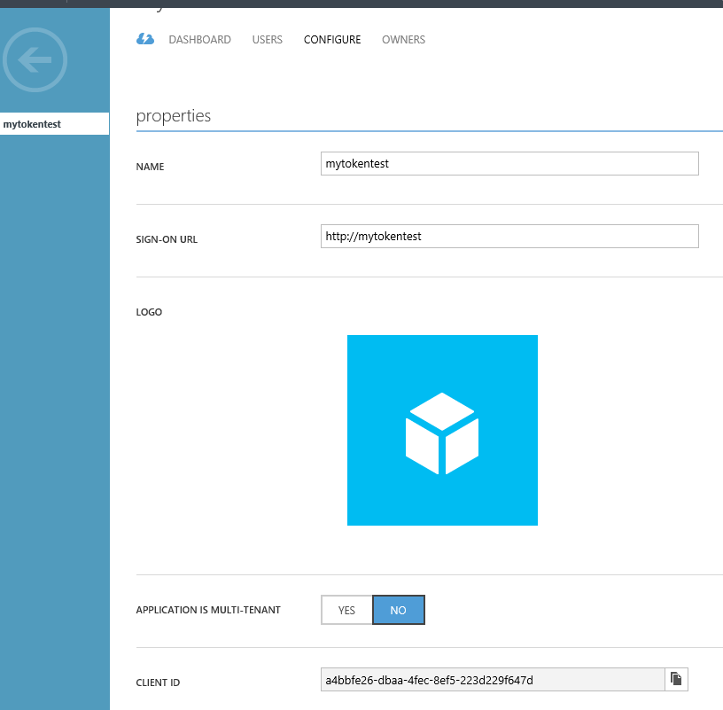

# Connect using Azure Active Directory authentication

[!INCLUDE[Driver_JDBC_Download](../../includes/driver_jdbc_download.md)]

This article provides information on how to develop Java applications that use the Azure Active Directory authentication feature with the Microsoft JDBC Driver for SQL Server.

You can use Azure Active Directory (Azure AD) authentication, which is a mechanism to connect to Azure SQL Database using identities in Azure Active Directory. Use Azure Active Directory authentication to centrally manage identities of database users and as an alternative to SQL Server authentication. The JDBC driver allows you to specify your Azure Active Directory credentials in the JDBC connection string to connect to Azure SQL Database. For information on how to configure Azure Active Directory authentication visit [Connecting to SQL Database By Using Azure Active Directory Authentication](/azure/azure-sql/database/authentication-aad-overview).

Connection properties to support Azure Active Directory authentication in the Microsoft JDBC Driver for SQL Server are:

- **authentication**:  Use this property to indicate which SQL authentication method to use for the connection.
  Possible values are:
  - **ActiveDirectoryMSI**
    - Since driver version **v8.3.1**, `authentication=ActiveDirectoryMSI` can be used to connect to an Azure SQL Database/Synapse Analytics from an Azure Resource with "Identity" support enabled. Optionally, **msiClientId** can be specified in the Connection/DataSource properties along with this authentication mode. `msiClientId` must contain the Client ID of a Managed Identity to be used to acquire the **accessToken** for establishing the connection.
  - **ActiveDirectoryIntegrated**
    - Since driver version **v6.0**, `authentication=ActiveDirectoryIntegrated` can be used to connect to an Azure SQL Database/Synapse Analytics via integrated authentication. To use this authentication mode, you must federate the on-premises Active Directory Federation Services (ADFS) with Azure Active Directory in the cloud. Once it's set up, you can connect by either adding the native library 'mssql-jdbc_auth-\<version>-\<arch>.dll' to the application class path on Windows, or by setting up a Kerberos ticket for cross-platform authentication support. You're able to access Azure SQL Database/Azure Synapse Analytics without prompted for credentials when you're logged in to a domain joined machine.
  - **ActiveDirectoryPassword**
    - Since driver version **v6.0**, `authentication=ActiveDirectoryPassword` can be used to connect to an Azure SQL Database/Synapse Analytics with Azure AD user name and password.
  - **ActiveDirectoryInteractive**
    - Since driver version **v9.2**, `authentication=ActiveDirectoryInteractive` can be used to connect to an Azure SQL Database/Synapse Analytics via interactive authentication flow (multi-factor authentication).
  - **ActiveDirectoryServicePrincipal**
    - Since driver version **v9.2**, `authentication=ActiveDirectoryServicePrincipal` can be used to connect to an Azure SQL Database/Synapse Analytics by specifying the application/client ID in the userName property and secret of a service principal identity in the password property.
  - **SqlPassword**
    - Use `authentication=SqlPassword` to connect to a SQL Server using userName/user and password properties.
  - **NotSpecified**
    - Use `authentication=NotSpecified` or leave it as the default when none of these authentication methods are needed.
  - **accessToken**: Use this connection property to connect to a SQL Database with access token. accessToken can only be set using the Properties parameter of the getConnection() method in the DriverManager class. It can't be used in the connection URL.

For more information, see the authentication property on the [Setting the Connection Properties](setting-the-connection-properties.md) page.

## Client setup requirements

For **ActiveDirectoryMSI** authentication, the below components must be installed on the client machine:

- Java 8 or above
- Microsoft JDBC Driver 7.2 (or higher) for SQL Server
- Client Environment must be an Azure Resource and must have "Identity" feature support enabled. Azure Virtual Machine, Azure App Service, and Azure Function App environments are supported by the JDBC driver.
- A contained database user that represents your Azure Resource's System Assigned Managed Identity or User Assigned Managed Identity, or one of the groups your Managed Identity belongs to, must exist in the target database, and must have the CONNECT permission.

For other authentication modes, the below components must be installed on the client machine:

- Java 8 or above
- Microsoft JDBC Driver 6.0 (or higher) for SQL Server
- If you're using the access token-based authentication mode, you need either [Microsoft Authentication Library  (MSAL) for Java](https://github.com/AzureAD/microsoft-authentication-library-for-java) and its dependencies for JDBC Driver 9.1 and above, or [Microsoft Azure Active Directory Authentication Library (ADAL) for Java](https://github.com/AzureAD/azure-activedirectory-library-for-java) and its dependencies for driver versions before JDBC Driver 9.1, to run the examples from this article. For more information, see the [Connect using access token](#connect-using-access-token) section.
- If you're using the **ActiveDirectoryPassword** authentication mode, you need either [Microsoft Authentication Library (MSAL) for Java](https://github.com/AzureAD/microsoft-authentication-library-for-java) and its dependencies for JDBC Driver 9.1 and above, or [Microsoft Azure Active Directory Authentication Library (ADAL) for Java](https://github.com/AzureAD/azure-activedirectory-library-for-java) and its dependencies for driver versions before JDBC Driver 9.1. For more information, see the [Connect using ActiveDirectoryPassword authentication mode](#connect-using-activedirectorypassword-authentication-mode) section.
- If you're using the **ActiveDirectoryIntegrated** mode, you need either [Microsoft Authentication Library (MSAL) for Java](https://github.com/AzureAD/microsoft-authentication-library-for-java) and its dependencies for JDBC Driver 9.1 and above, or [Microsoft Azure Active Directory Authentication Library (ADAL) for Java](https://github.com/AzureAD/azure-activedirectory-library-for-java) and its dependencies for driver versions before JDBC Driver 9.1. For more information, see the [Connect using ActiveDirectoryIntegrated authentication mode](#connect-using-activedirectoryintegrated-authentication-mode) section.
- If you're using the **ActiveDirectoryInteractive** mode, you need either [Microsoft Authentication Library (MSAL) for Java](https://github.com/AzureAD/microsoft-authentication-library-for-java) and its dependencies for JDBC Driver 9.1 and above, or [Microsoft Azure Active Directory Authentication Library (ADAL) for Java](https://github.com/AzureAD/azure-activedirectory-library-for-java) and its dependencies for driver versions before JDBC Driver 9.1. For more information, see the [Connect using ActiveDirectoryInteractive authentication mode](#connect-using-activedirectoryinteractive-authentication-mode) section.
- If you're using the **ActiveDirectoryServicePrincipal** mode, you need either [Microsoft Authentication Library (MSAL) for Java](https://github.com/AzureAD/microsoft-authentication-library-for-java) and its dependencies for JDBC Driver 9.1 and above, or [Microsoft Azure Active Directory Authentication Library (ADAL) for Java](https://github.com/AzureAD/azure-activedirectory-library-for-java) and its dependencies. For more information, see the [Connect using ActiveDirectoryServicePrincipal authentication mode](#connect-using-activedirectoryserviceprincipal-authentication-mode) section.

## Connect using ActiveDirectoryMSI authentication mode

The following example shows how to use `authentication=ActiveDirectoryMSI` mode. Run this example from inside an Azure Resource, e,g an Azure Virtual Machine, App Service, or a Function App that is federated with Azure Active Directory.

Replace the server/database name with your server/database name in the following lines to run the example:

```java
ds.setServerName("aad-managed-demo.database.windows.net"); // replace 'aad-managed-demo' with your server name
ds.setDatabaseName("demo"); // replace with your database name
//Optional
ds.setMSIClientId("94de34e9-8e8c-470a-96df-08110924b814"); // Replace with Client ID of User-Assigned Managed Identity to be used
```

The example to use ActiveDirectoryMSI authentication mode:

```java
import java.sql.Connection;
import java.sql.ResultSet;
import java.sql.Statement;

import com.microsoft.sqlserver.jdbc.SQLServerDataSource;

public class AAD_MSI {
    public static void main(String[] args) throws Exception {

        SQLServerDataSource ds = new SQLServerDataSource();
        ds.setServerName("aad-managed-demo.database.windows.net"); // Replace with your server name
        ds.setDatabaseName("demo"); // Replace with your database name
        ds.setAuthentication("ActiveDirectoryMSI");
        // Optional
        ds.setMSIClientId("94de34e9-8e8c-470a-96df-08110924b814"); // Replace with Client ID of User-Assigned Managed Identity to be used

        try (Connection connection = ds.getConnection();
                Statement stmt = connection.createStatement();
                ResultSet rs = stmt.executeQuery("SELECT SUSER_SNAME()")) {
            if (rs.next()) {
                System.out.println("You have successfully logged on as: " + rs.getString(1));
            }
        }
    }
}
```

This example on an Azure Virtual Machine fetches an access token from _System Assigned Managed Identity_ or _User Assigned Managed Identity_ (if **msiClientId** is specified) and establishes a connection using the fetched access token. If a connection is established, you should see the following message:

```output
You have successfully logged on as: <your Managed Identity username>
```

## Connect using ActiveDirectoryIntegrated authentication mode

There are two ways to use ActiveDirectoryIntegrated authentication in the Microsoft JDBC Driver for SQL Server:

- On Windows, mssql-jdbc_auth-\<version>-\<arch>.dll from the [downloaded package](download-microsoft-jdbc-driver-for-sql-server.md) can be copied to a location in the system path.
- If you can't use the DLL, starting with version 6.4, you can configure a Kerberos ticket. This method is supported on multiple platforms (Windows, Linux, and macOS). For more information, see [Set Kerberos ticket on Windows, Linux And macOS](#set-kerberos-ticket-on-windows-linux-and-macos).

> [!NOTE]
> If you are using an older version of the driver, check this [link](feature-dependencies-of-microsoft-jdbc-driver-for-sql-server.md) for the respective dependencies that are required to use this authentication mode.

The following example shows how to use `authentication=ActiveDirectoryIntegrated` mode. Run this example on a domain joined machine that is federated with Azure Active Directory. A contained database user that represents your Azure AD user, or one of the groups you belong to, must exist in the database, and must have the CONNECT permission.

To build and run the example, on the client machine where you run the example, download the [Microsoft Authentication Library (MSAL) for Java](https://github.com/AzureAD/microsoft-authentication-library-for-java) and its dependencies for JDBC Driver 9.1 and above, or [Microsoft Azure Active Directory Authentication Library (ADAL) for Java](https://github.com/AzureAD/azure-activedirectory-library-for-java) and its dependencies for driver versions before JDBC Driver 9.1, and include them in the Java build path.

Replace the server/database name with your server/database name in the following lines before executing the example:

```java
ds.setServerName("aad-managed-demo.database.windows.net"); // replace 'aad-managed-demo' with your server name
ds.setDatabaseName("demo"); // replace with your database name
```

The example to use ActiveDirectoryIntegrated authentication mode:

```java
import java.sql.Connection;
import java.sql.ResultSet;
import java.sql.Statement;

import com.microsoft.sqlserver.jdbc.SQLServerDataSource;

public class AADIntegrated {
    public static void main(String[] args) throws Exception {

        SQLServerDataSource ds = new SQLServerDataSource();
        ds.setServerName("aad-managed-demo.database.windows.net"); // Replace with your server name
        ds.setDatabaseName("demo"); // Replace with your database name
        ds.setAuthentication("ActiveDirectoryIntegrated");

        try (Connection connection = ds.getConnection();
                Statement stmt = connection.createStatement();
                ResultSet rs = stmt.executeQuery("SELECT SUSER_SNAME()")) {
            if (rs.next()) {
                System.out.println("You have successfully logged on as: " + rs.getString(1));
            }
        }
    }
}
```

Running this example on a client machine automatically uses your Kerberos ticket and no password is required. If a connection is established, you should see the following message:

```output
You have successfully logged on as: <your domain user name>
```

### Set Kerberos ticket on Windows, Linux And macOS

You must up a Kerberos ticket to link your current user to a Windows domain account. A summary of key steps is included below.

#### Windows

> [!NOTE]
> On Windows, mssql-jdbc_auth-\<version>-\<arch>.dll from the [downloaded package](download-microsoft-jdbc-driver-for-sql-server.md) can be used instead of these Kerberos configuration steps. These steps are only required if you can't use the DLL.

JDK comes with `kinit`, which you can use to get a TGT from Key Distribution Center (KDC) on a domain joined machine that is federated with Azure Active Directory.

##### Step 1: Ticket granting ticket retrieval

- **Run on**: Windows
- **Action**:
  - Use the command `kinit username@DOMAIN.COMPANY.COM` to get a TGT from KDC, then it prompts you for your domain password.
  - Use `klist` to see the available tickets. If the kinit was successful, you should see a ticket from krbtgt/DOMAIN.COMPANY.COM@ DOMAIN.COMPANY.COM.

  > [!NOTE]
  > You might have to specify a `.ini` file with `-Djava.security.krb5.conf` for your application to locate KDC.

#### Linux and macOS

##### Requirements

Access to a Windows domain-joined machine to query your Kerberos Domain Controller.

##### Step 1: Find Kerberos KDC

- **Run on**: Windows command line
- **Action**: `nltest /dsgetdc:DOMAIN.COMPANY.COM` (where "DOMAIN.COMPANY.COM" maps to your domain's name)
- **Sample Output**

  ```output
  DC: \\co1-red-dc-33.domain.company.com
  Address: \\2111:4444:2111:33:1111:ecff:ffff:3333
  ...
  The command completed successfully
  ```

- **Information to extract**
  The DC name, in this case `co1-red-dc-33.domain.company.com`

##### Step 2: Configuring KDC in krb5.conf

- **Run on**: Linux/macOS
- **Action**: Edit the /etc/krb5.conf in an editor of your choice. Configure the following keys

  ```bash
  [libdefaults]
    default_realm = DOMAIN.COMPANY.COM

  [realms]
  DOMAIN.COMPANY.COM = {
     kdc = co1-red-dc-28.domain.company.com
  }
  ```

  Then save the krb5.conf file and exit

  > [!NOTE]
  > Domain must be in ALL CAPS.

##### Step 3: Test the ticket granting ticket retrieval

- **Run on**: Linux/macOS
- **Action**:
  - Use the command `kinit username@DOMAIN.COMPANY.COM` to get a TGT from KDC, then it prompts you for your domain password.
  - Use `klist` to see the available tickets. If the kinit was successful, you should see a ticket from krbtgt/DOMAIN.COMPANY.COM@ DOMAIN.COMPANY.COM.

## Connect using ActiveDirectoryPassword authentication mode

The following example shows how to use `authentication=ActiveDirectoryPassword` mode.

To build and run the example:

1. On the client machine where you run the example, download the [Microsoft Authentication Library (MSAL) for Java](https://github.com/AzureAD/microsoft-authentication-library-for-java) and its dependencies for JDBC Driver 9.1 and above, or [Microsoft Azure Active Directory Authentication Library (ADAL) for Java](https://github.com/AzureAD/azure-activedirectory-library-for-java) and its dependencies for driver versions before JDBC Driver 9.1, and include them in the Java build path.
1. Locate the following lines of code and replace the server/database name with your server/database name.

    ```java
    ds.setServerName("aad-managed-demo.database.windows.net"); // replace 'aad-managed-demo' with your server name
    ds.setDatabaseName("demo"); // replace with your database name
    ```

1. Locate the following lines of code. Replace user name with the name of the Azure AD user that you want to connect as.

    ```java
    ds.setUser("bob@cqclinic.onmicrosoft.com"); // replace with your user name
    ds.setPassword("password");     // replace with your password
    ```

The example to use ActiveDirectoryPassword authentication mode:

```java
import java.sql.Connection;
import java.sql.ResultSet;
import java.sql.Statement;

import com.microsoft.sqlserver.jdbc.SQLServerDataSource;

public class AADUserPassword {

    public static void main(String[] args) throws Exception{

        SQLServerDataSource ds = new SQLServerDataSource();
        ds.setServerName("aad-managed-demo.database.windows.net"); // Replace with your server name
        ds.setDatabaseName("demo"); // Replace with your database
        ds.setUser("bob@cqclinic.onmicrosoft.com"); // Replace with your user name
        ds.setPassword("password"); // Replace with your password
        ds.setAuthentication("ActiveDirectoryPassword");

        try (Connection connection = ds.getConnection();
                Statement stmt = connection.createStatement();
                ResultSet rs = stmt.executeQuery("SELECT SUSER_SNAME()")) {
            if (rs.next()) {
                System.out.println("You have successfully logged on as: " + rs.getString(1));
            }
        }
    }
}
```

If connection is established, you should see the following message as output:

```output
You have successfully logged on as: <your user name>
```

> [!NOTE]
> A contained user database must exist and a contained database user that represents the specified Azure AD user or one of the groups, the specified Azure AD user belongs to, must exist in the database, and must have the CONNECT permission (except for Azure Active Directory server admin or group)

## Connect using ActiveDirectoryInteractive authentication mode

The following example shows how to use `authentication=ActiveDirectoryInteractive` mode.

To build and run the example:

1. On the client machine where you run the example, download the [Microsoft Authentication Library (MSAL) for Java](https://github.com/AzureAD/microsoft-authentication-library-for-java) and its dependencies for JDBC Driver 9.1 and above, or [Microsoft Azure Active Directory Authentication Library (ADAL) for Java](https://github.com/AzureAD/azure-activedirectory-library-for-java) and its dependencies for driver versions before JDBC Driver 9.1, and include them in the Java build path
2. Locate the following lines of code and replace the server/database name with your server/database name.

    ```java
    ds.setServerName("aad-managed-demo.database.windows.net"); // replace 'aad-managed-demo' with your server name
    ds.setDatabaseName("demo"); // replace with your database name
    ```

3. Locate the following lines of code. Replace user name with the name of the Azure AD user that you want to connect as.

    ```java
    ds.setUser("bob@cqclinic.onmicrosoft.com"); // replace with your user name
    ```

The example to use ActiveDirectoryInteractive authentication mode:

```java
import java.sql.Connection;
import java.sql.ResultSet;
import java.sql.Statement;

import com.microsoft.sqlserver.jdbc.SQLServerDataSource;

public class AADInteractive {
    public static void main(String[] args) throws Exception{

        SQLServerDataSource ds = new SQLServerDataSource();
        ds.setServerName("aad-managed-demo.database.windows.net"); // Replace with your server name
        ds.setDatabaseName("demo"); // Replace with your database
        ds.setAuthentication("ActiveDirectoryInteractive");

        // Optional login hint
        ds.setUser("bob@cqclinic.onmicrosoft.com"); // Replace with your user name

        try (Connection connection = ds.getConnection();
                Statement stmt = connection.createStatement();
                ResultSet rs = stmt.executeQuery("SELECT SUSER_SNAME()")) {
            if (rs.next()) {
                System.out.println("You have successfully logged on as: " + rs.getString(1));
            }
        }
    }
}
```

When you run the program, a browser is displayed to authenticate the user. Exactly what you see depends on how your Azure AD has been configured. It might or might not include multi-factor authentication prompts for username, password, PIN, or second device authentication via a phone. If multiple interactive authentication requests are done in the same program, later requests might not even prompt you if the authentication library can reuse a previously cached authentication token.

For information about how to configure Azure AD to require Multi-Factor Authentication, see [Getting started with Azure AD Multi-Factor Authentication in the cloud](/azure/active-directory/authentication/howto-mfa-getstarted).

For screenshots of these dialog boxes, see [Configure multi-factor authentication for SQL Server Management Studio and Azure AD](/azure/azure-sql/database/authentication-mfa-ssms-configure).

If user authentication is completed successfully, you should see the following message in the browser:

```output
Authentication complete. You can close the browser and return to the application.
```

This message only indicates that user authentication was successful but not necessarily a successful connection to the server. Upon return to the application, if a connection is established to the server, you should see the following message as output:

```output
You have successfully logged on as: <your user name>
```

> [!NOTE]
> A contained user database must exist and a contained database user that represents the specified Azure AD user or one of the groups the specified Azure AD user belongs to, must exist in the database and must have the CONNECT permission (except for an Azure Active Directory server admin or group)

## Connect using ActiveDirectoryServicePrincipal authentication mode

The following example shows how to use `authentication=ActiveDirectoryServicePrincipal` mode.

To build and run the example:

1. On the client machine where you run the example, download the [Microsoft Authentication Library (MSAL) for Java](https://github.com/AzureAD/microsoft-authentication-library-for-java) and its dependencies for JDBC Driver 9.1 and above, or [Microsoft Azure Active Directory Authentication Library (ADAL) for Java](https://github.com/AzureAD/azure-activedirectory-library-for-java) and its dependencies for driver versions before JDBC Driver 9.1, and include them in the Java build path

2. Locate the following lines of code and replace the server/database name with your server/database name.

    ```java
    ds.setServerName("aad-managed-demo.database.windows.net"); // replace 'aad-managed-demo' with your server name
    ds.setDatabaseName("demo"); // replace with your database name
    ```

3. Locate the following lines of code. Replace the value of `principalId` with the Application ID / Client ID of the Azure AD service principal that you want to connect as. Replace the value of `principalSecret` with the secret.

    ```java
    String principalId = "1846943b-ad04-4808-aa13-4702d908b5c1"; // Replace with your AAD service principal ID.
    String principalSecret = "..."; // Replace with your AAD principal secret.
    ```

4. Set the principalId and principal Secret using `setUser` and `setPassword` in version 10.2 and up, and `setAADSecurePrincipalId` and `setAADSecurePrincipalSecret` in version 9.4 and below.

The example to use ActiveDirectoryInteractive authentication mode:

```java
import java.sql.Connection;
import java.sql.ResultSet;
import java.sql.Statement;

import com.microsoft.sqlserver.jdbc.SQLServerDataSource;

public class AADServicePrincipal {
    public static void main(String[] args) throws Exception{
        String principalId = "1846943b-ad04-4808-aa13-4702d908b5c1"; // Replace with your AAD service principal ID.
        String principalSecret = "..."; // Replace with your AAD principal secret.

        SQLServerDataSource ds = new SQLServerDataSource();
        ds.setServerName("aad-managed-demo.database.windows.net"); // Replace with your server name
        ds.setDatabaseName("demo"); // Replace with your database
        ds.setAuthentication("ActiveDirectoryServicePrincipal");
        ds.setUser(principalId); // setAADSecurePrincipalId for JDBC Driver 9.4 and below
        ds.setPassword(principalSecret); // setAADSecurePrincipalSecret for JDBC Driver 9.4 and below 

        try (Connection connection = ds.getConnection();
                Statement stmt = connection.createStatement();
                ResultSet rs = stmt.executeQuery("SELECT SUSER_SNAME()")) {
            if (rs.next()) {
                System.out.println("You have successfully logged on as: " + rs.getString(1));
            }
        }
    }
}
```

If a connection is established, you should see the following message as output:

```output
You have successfully logged on as: <your app/client ID>
```

> [!NOTE]
> A contained user database must exist and a contained database user that represents the specified Azure AD principal or one of the groups the specified Azure AD principal belongs to, must exist in the database and must have the CONNECT permission (except for an Azure Active Directory server admin or group)

## Connect using access token

Applications/services can retrieve an access token from the Azure Active Directory and use that to connect to Azure SQL Database/Synapse Analytics.

> [!NOTE]
> **accessToken** can only be set using the Properties parameter of the getConnection() method in the DriverManager class. It can't be used in the connection string.

The following example contains a simple Java application that connects to Azure SQL Database/Synapse Analytics using access token-based authentication.

To build and run the example:

1. Create an application account in Azure Active Directory for your service.
    1. Sign in to the Azure portal.
    2. Select Azure Active Directory in the left-hand navigation.
    3. Select the "App registrations" tab.
    4. In the drawer, select "New application registration".
    5. Enter mytokentest as a friendly name for the application, select "Web App/API".
    6. Don't need SIGN-ON URL, provide anything: "https://mytokentest".
    7. Select "Create" at the bottom.
    8. While still in the Azure portal, select the "Settings" tab of your application, and open the "Properties" tab.
    9. Find the "Application ID" (also known as Client ID) value and copy it. You need this value later to configure your application (for example, 1846943b-ad04-4808-aa13-4702d908b5c1).
    10. Under section "Keys", create a key to fill in the name field, select the duration of the key, and save the configuration (leave the value field empty). After you save, the value field should be filled automatically. Copy the generated value. This value is the client Secret.
    11. Select Azure Active Directory on the left side panel. Under "App Registrations", find the "End points" tab. Copy the URL under "OATH 2.0 TOKEN ENDPOINT", this URL is your STS URL.

    
2. Sign in to your Azure SQL Server user database as an Azure Active Directory admin and use a T-SQL command, provision a contained database user for your application principal. For more information on how to create an Azure Active Directory admin and a contained database user, see the [Connecting to SQL Database or Azure Synapse Analytics By Using Azure Active Directory authentication](/azure/azure-sql/database/authentication-aad-overview).

    ```sql
    CREATE USER [mytokentest] FROM EXTERNAL PROVIDER
    ```

3. On the client machine where you run the example, download the [Microsoft Authentication Library (MSAL) for Java](https://github.com/AzureAD/microsoft-authentication-library-for-java) library and its dependencies for JDBC Driver 9.1 and above, or [Microsoft Azure Active Directory Authentication Library (ADAL) for Java](https://github.com/AzureAD/azure-activedirectory-library-for-java) and its dependencies for driver versions before JDBC Driver 9.1, and include them in the Java build path. The microsoft-authentication-library-for-java is only required to run this specific example. The example uses the APIs from this library to retrieve the access token from Azure AD. If you already have an access token, you can skip this step and remove the section in the example that retrieves an access token.

In the following example, replace the STS URL, Client ID, Client Secret, server and database name with your values.

```java
import java.sql.Connection;
import java.sql.ResultSet;
import java.sql.Statement;
import java.util.concurrent.Executors;
import java.util.concurrent.Future;
import com.microsoft.sqlserver.jdbc.SQLServerDataSource;

// The azure-activedirectory-library-for-java is needed to retrieve the access token from the AD.
import com.microsoft.aad.msal4j.ClientCredentialFactory;
import com.microsoft.aad.msal4j.ClientCredentialParameters;
import com.microsoft.aad.msal4j.ConfidentialClientApplication;
import com.microsoft.aad.msal4j.IAuthenticationResult;
import com.microsoft.aad.msal4j.IClientCredential;

public class AADTokenBased {

    public static void main(String[] args) throws Exception {

        // Retrieve the access token from the AD.
        String spn = "https://database.windows.net/";
        String stsurl = "https://login.microsoftonline.com/..."; // Replace with your STS URL.
        String clientId = "1846943b-ad04-4808-aa13-4702d908b5c1"; // Replace with your client ID.
        String clientSecret = "..."; // Replace with your client secret.

        String scope = spn +  "/.default";
        Set<String> scopes = new HashSet<>();
        scopes.add(scope);

        ExecutorService executorService = Executors.newSingleThreadExecutor();
        IClientCredential credential = ClientCredentialFactory.createFromSecret(clientSecret);
        ConfidentialClientApplication clientApplication = ConfidentialClientApplication
            .builder(clientId, credential).executorService(executorService).authority(stsurl).build();
        CompletableFuture<IAuthenticationResult> future = clientApplication
            .acquireToken(ClientCredentialParameters.builder(scopes).build());

        IAuthenticationResult authenticationResult = future.get();
        String accessToken = authenticationResult.accessToken();

        System.out.println("Access Token: " + accessToken);

        // Connect with the access token.
        SQLServerDataSource ds = new SQLServerDataSource();

        ds.setServerName("aad-managed-demo.database.windows.net"); // Replace with your server name.
        ds.setDatabaseName("demo"); // Replace with your database name.
        ds.setAccessToken(accessToken);

        try (Connection connection = ds.getConnection();
                Statement stmt = connection.createStatement();
                ResultSet rs = stmt.executeQuery("SELECT SUSER_SNAME()")) {
            if (rs.next()) {
                System.out.println("You have successfully logged on as: " + rs.getString(1));
            }
        }
    }
}
```

If the connection is successful, you should see the following message as output:

```bash
Access Token: <your access token>
You have successfully logged on as: <your client ID>
```

## Next steps

Learn more about related concepts in the following articles:

- [Connecting to SQL Database By Using Azure Active Directory Authentication](/azure/azure-sql/database/authentication-aad-overview)
- [Microsoft Authentication Library (MSAL) for Java](https://github.com/AzureAD/microsoft-authentication-library-for-java) 
- [Microsoft Azure Active Directory Authentication Library (ADAL) for Java](https://github.com/AzureAD/azure-activedirectory-library-for-java)
- [Connecting to SQL Database or Azure Synapse Analytics By Using Azure Active Directory authentication](/azure/azure-sql/database/authentication-aad-overview)
- [Troubleshoot connection issues to Azure SQL Database](/azure/sql-database/sql-database-troubleshoot-common-connection-issues)  
