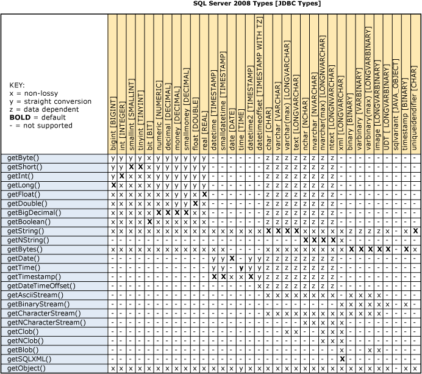
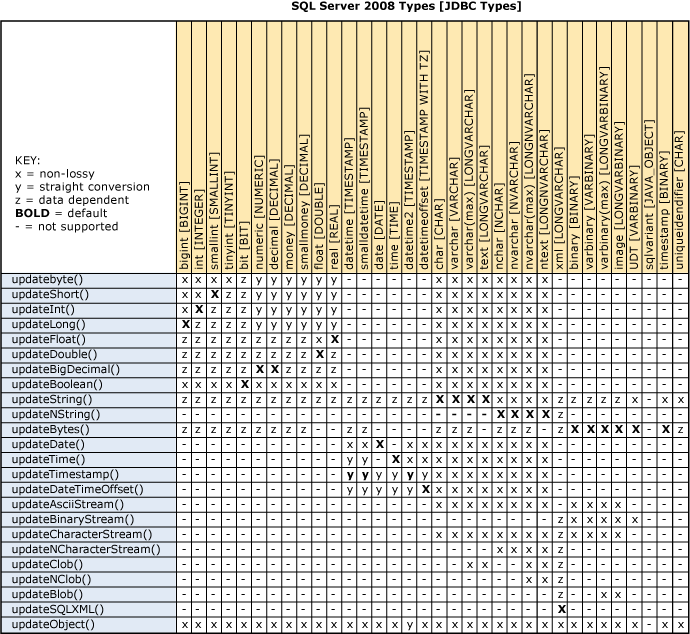
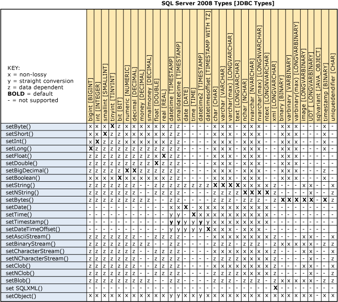
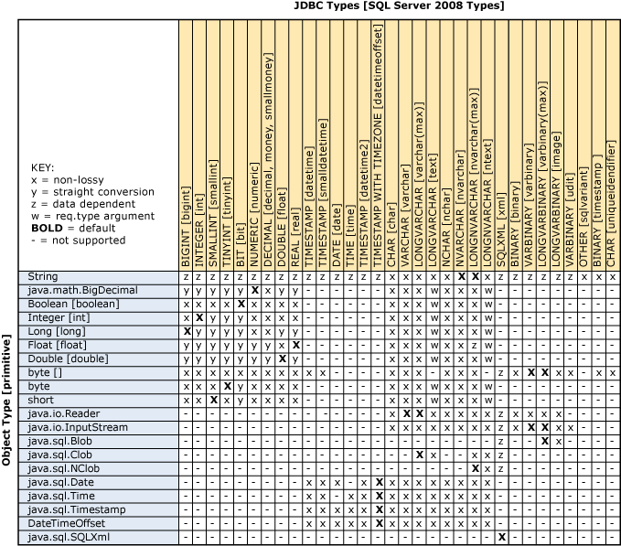

# Understanding data type conversions

[!INCLUDE[Driver_JDBC_Download](../../includes/driver_jdbc_download.md)]

To facilitate the conversion of Java programming language data types to [!INCLUDE[ssNoVersion](../../includes/ssnoversion-md.md)] data types, the [!INCLUDE[jdbcNoVersion](../../includes/jdbcnoversion_md.md)] provides data type conversions as required by the JDBC specification. For added flexibility, all types are convertible to and from **Object**, **String**, and **byte[]** data types.

## Getter method conversions

Based on the [!INCLUDE[ssNoVersion](../../includes/ssnoversion-md.md)] data types, the following chart contains the JDBC driver's conversion map for the get\<Type>() methods of the [SQLServerResultSet](../../connect/jdbc/reference/sqlserverresultset-class.md) class, and the supported conversions for the get\<Type> methods of the [SQLServerCallableStatement](../../connect/jdbc/reference/sqlservercallablestatement-class.md) class.



There are three categories of conversions that are supported by the JDBC driver's getter methods:

- **Non-Lossy (x)**: Conversions for cases where the getter type is the same or smaller than the underlying server type. For example, when calling getBigDecimal on an underlying server decimal column, no conversion is necessary.

- **Converted (y)**: Conversions from numeric server types to Java language types where the conversion is regular and follows Java language conversion rules. For these conversions, precision is always truncated-never rounded-and overflow is handled as modulo of the destination type, which is smaller. For example, calling getInt on an underlying **decimal** column that contains "1.9999" will return "1", or if the underlying **decimal** value is "3000000000" then the **int** value overflows to "-1294967296".

- **Data Dependent (z)**: Conversions from underlying character types to numeric types require that the character types contain values that can be converted into that type. No other conversions are performed. If the value is too large for the getter type, the value isn't valid. For example, if getInt is called on a varchar(50) column that contains "53", the value is returned as an **int**; but if the underlying value is "xyz" or "3000000000", an error is thrown.

If getString is called on a **binary**, **varbinary**, **varbinary(max)**, or **image** column data type, the value is returned as a hexadecimal string value.

## Updater method conversions

For the Java typed data passed to the update\<Type>() methods of the [SQLServerResultSet](../../connect/jdbc/reference/sqlserverresultset-class.md) class, the following conversions apply.



There are three categories of conversions supported by the JDBC driver's updater methods:

- **Non-Lossy (x)**: Conversions for cases where the updater type is the same or smaller than the underlying server type. For example, when calling updateBigDecimal on an underlying server decimal column, no conversion is necessary.

- **Converted (y)**: Conversions from numeric server types to Java language types where the conversion is regular and follows Java language conversion rules. For these conversions, precision is always truncated (never rounded) and overflow is handled as modulo of the destination (the smaller) type. For example, calling updateDecimal on an underlying **int** column that contains "1.9999" will return "1", or if the underlying **decimal** value is "3000000000" then the **int** value overflows to "-1294967296".

- **Data Dependent (z)**: Conversions from underlying source data types to destination data types require that the contained values can be converted into the destination types. No other conversions are performed. If the value is too large for the getter type, the value isn't valid. For example, if updateString is called on an int column that contains "53", the update succeeds; but if the underlying String value is "foo" or "3000000000", an error is thrown.

When updateString is called on a **binary**, **varbinary**, **varbinary(max)**, or **image** column data type, it handles the String value as a hexadecimal string value.

When the [!INCLUDE[ssNoVersion](../../includes/ssnoversion-md.md)] column data type is **XML**, the data value must be a valid **XML**. When calling updateBytes, updateBinaryStream, or updateBlob methods, the data value should be the hexadecimal string representation of the XML characters. For example:

```xml
<hello>world</hello> = 0x3C68656C6C6F3E776F726C643C2F68656C6C6F3E
```

Note that a byte-order mark (BOM) is required if the XML characters are in specific character encodings.

## Setter method conversions

For the Java typed data passed to the set\<Type>() methods of the [SQLServerPreparedStatement](../../connect/jdbc/reference/sqlserverpreparedstatement-class.md) class and the [SQLServerCallableStatement](../../connect/jdbc/reference/sqlservercallablestatement-class.md) class, the following conversions apply.



The server tries any conversions and returns errors on failure.

In the case of the **String** data type, if the value exceeds the length of **VARCHAR**, it maps to **LONGVARCHAR**. Similarly, **NVARCHAR** maps to **LONGNVARCHAR** if the value exceeds the supported length of **NVARCHAR**. The same is true for **byte[]**. Values longer than **VARBINARY** become **LONGVARBINARY**.

There are two categories of conversions that are supported by the JDBC driver's setter methods:

- **Non-Lossy (x)**: Conversions for numeric cases where the setter type is the same or smaller than the underlying server type. For example, when calling setBigDecimal on an underlying server **decimal** column, no conversion is necessary. For numeric to character cases, the Java **numeric** data type is converted to a **String**. For example, calling setDouble with a value of "53" on a varchar(50) column produces a character value "53" in that destination column.

- **Converted (y)**: Conversions from a Java **numeric** type to an underlying server **numeric** type that is smaller. This conversion is regular and follows [!INCLUDE[ssNoVersion](../../includes/ssnoversion-md.md)] conversion conventions. Precision is always truncated (never rounded) and overflow throws an unsupported conversion error. For example, using updateDecimal with a value of "1.9999" on an underlying integer column results in a "1" in the destination column; but if "3000000000" is passed, the driver throws an error.

- **Data Dependent (z)**: Conversions from a Java **String** type to the underlying [!INCLUDE[ssNoVersion](../../includes/ssnoversion-md.md)] data type depends on the following conditions: The driver sends the **String** value to [!INCLUDE[ssNoVersion](../../includes/ssnoversion-md.md)] and [!INCLUDE[ssNoVersion](../../includes/ssnoversion-md.md)] performs conversions, if necessary. If the sendStringParametersAsUnicode is set to true and the underlying [!INCLUDE[ssNoVersion](../../includes/ssnoversion-md.md)] data type is **image**, [!INCLUDE[ssNoVersion](../../includes/ssnoversion-md.md)] doesn't allow converting **nvarchar** to **image** and throws an SQLServerException. If the sendStringParametersAsUnicode is set to false and the underlying [!INCLUDE[ssNoVersion](../../includes/ssnoversion-md.md)] data type is **image**, [!INCLUDE[ssNoVersion](../../includes/ssnoversion-md.md)] allows converting **varchar** to **image** and doesn't throw an exception.

[!INCLUDE[ssNoVersion](../../includes/ssnoversion-md.md)] performs the conversions and passes errors back to the JDBC driver when there are problems.

When the [!INCLUDE[ssNoVersion](../../includes/ssnoversion-md.md)] column data type is **XML**, the data value must be a valid **XML**. When calling updateBytes, updateBinaryStream, or updateBlob methods, the data value should be the hexadecimal string representation of the XML characters. For example:

```xml
<hello>world</hello> = 0x3C68656C6C6F3E776F726C643C2F68656C6C6F3E
```

Note that a byte-order mark (BOM) is required if the XML characters are in specific character encodings.

## Conversions on setObject

> [!NOTE]  
> Microsoft JDBC Drivers 4.2 (and higher) for SQL Server supports JDBC 4.1 and 4.2. For more detail on 4.1 and 4.2 datatype mappings and conversions see [JDBC 4.1 compliance for the JDBC Driver](../../connect/jdbc/jdbc-4-1-compliance-for-the-jdbc-driver.md) and [JDBC 4.2 compliance for the JDBC Driver](../../connect/jdbc/jdbc-4-2-compliance-for-the-jdbc-driver.md), in addition to the information below.

For the Java typed data passed to the setObject(\<Type>) methods of the [SQLServerPreparedStatement](../../connect/jdbc/reference/sqlserverpreparedstatement-class.md) class, the following conversions apply.



The setObject method with no specified target type uses the default mapping. In the case of the **String** data type, if the value exceeds the length of **VARCHAR**, it maps to **LONGVARCHAR**. Similarly, **NVARCHAR** maps to **LONGNVARCHAR** if the value exceeds the supported length of **NVARCHAR**. The same is true for **byte[]**. Values longer than **VARBINARY** become **LONGVARBINARY**.

There are three categories of conversions that are supported by the JDBC driver's setObject methods:

- **Non-Lossy (x)**: Conversions for numeric cases where the setter type is the same or smaller than the underlying server type. For example, when calling setBigDecimal on an underlying server **decimal** column, no conversion is necessary. For numeric to character cases, the Java **numeric** data type is converted to a **String**. For example, calling setDouble with a value of "53" on a varchar(50) column will produce a character value "53" in that destination column.

- **Converted (y)**: Conversions from a Java **numeric** type to an underlying server **numeric** type that is smaller. This conversion is regular and follows [!INCLUDE[ssNoVersion](../../includes/ssnoversion-md.md)] conversion conventions. Precision is always truncated-never rounded-and overflow throws an unsupported conversion error. For example, using updateDecimal with a value of "1.9999" on an underlying integer column results in a "1" in the destination column; but if "3000000000" is passed, the driver throws an error.

- **Data Dependent (z)**: Conversions from a Java **String** type to the underlying [!INCLUDE[ssNoVersion](../../includes/ssnoversion-md.md)] data type depends on the following conditions: The driver sends the **String** value to [!INCLUDE[ssNoVersion](../../includes/ssnoversion-md.md)] and [!INCLUDE[ssNoVersion](../../includes/ssnoversion-md.md)] performs conversions, if necessary. If the sendStringParametersAsUnicode connection property is set to true and the underlying [!INCLUDE[ssNoVersion](../../includes/ssnoversion-md.md)] data type is **image**, [!INCLUDE[ssNoVersion](../../includes/ssnoversion-md.md)] doesn't allow converting **nvarchar** to **image** and throws an SQLServerException. If the sendStringParametersAsUnicode is set to false and the underlying [!INCLUDE[ssNoVersion](../../includes/ssnoversion-md.md)] data type is **image**, [!INCLUDE[ssNoVersion](../../includes/ssnoversion-md.md)] allows converting **varchar** to **image** and doesn't throw an exception.

[!INCLUDE[ssNoVersion](../../includes/ssnoversion-md.md)] performs the bulk of the set conversions and passes errors back to the JDBC driver when there are problems. Client-side conversions are the exception and are performed only in the case of **date**, **time**, **timestamp**, **Boolean**, and **String** values.

When the [!INCLUDE[ssNoVersion](../../includes/ssnoversion-md.md)] column data type is **XML**, the data value must be a valid **XML**. When calling setObject(byte[], SQLXML), setObject(inputStream, SQLXML), or setObject(Blob, SQLXML) methods, the data value should be the hexadecimal string representation of the XML characters. For example:

```xml
<hello>world</hello> = 0x3C68656C6C6F3E776F726C643C2F68656C6C6F3E
```

Note that a byte-order mark (BOM) is required if the XML characters are in specific character encodings.

## See also

[Understanding the JDBC driver data types](../../connect/jdbc/understanding-the-jdbc-driver-data-types.md)
