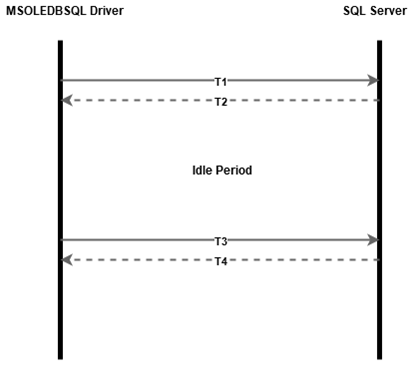

# Idle connection resiliency in the OLE DB Driver
[!INCLUDE[SQL Server Azure SQL Database](../../../includes/applies-to-version/sqlserver2014-asdb.md)]

[!INCLUDE[Driver_OLEDB_Download](../../../includes/driver_oledb_download.md)]

## Overview

Starting with Microsoft OLE DB Driver for SQL Server version [18.6.0](../release-notes-for-oledb-driver-for-sql-server.md#1860), connection resiliency allows the driver to automatically restore broken idle connections.

The following diagram explains how idle connection resiliency works in the OLE DB Driver:

1. At T1, a connection is made using [IDBInitialize::Initialize](/previous-versions/windows/desktop/ms718026(v=vs.85)).
2. There's a period of no communication between the driver and server between T2 and T3 resulting in an idle connection. During this time, the network connection can be interrupted. The interruption may be something like a network device closing an idle socket, or putting a device into standby for a brief period.
3. At T3, the client application tries to execute a command using the OLE DB driver (for example using [ICommand::Execute](/previous-versions/windows/desktop/ms718095(v=vs.85)). The driver detects that the connection is broken and transparently re-establishes the connection.

## Keywords and properties

|Keyword|Property|Values|Default|Description|
|--------|--------|--------|--------|--------|
|ConnectRetryCount|SSPROP_INIT_CONNECT_RETRY_COUNT|Integer Value between 0 and 255 (inclusive)|1|Controls the maximum number of reconnection attempts if the connection has been broken. By default, a single attempt is made to re-establish a connection when broken. A value of 0 means that no reconnection will be attempted.|
|ConnectRetryInterval|SSPROP_INIT_CONNECT_RETRY_INTERVAL|Integer between 1 and 60 (inclusive)|10|The time in seconds, between each connection retry attempt. This keyword is ignored if **ConnectRetryCount** is equal to 0.|

The following pages provide more information about setting these properties:

* [Using Connection String Keywords with OLE DB Driver for SQL Server](..\applications\using-connection-string-keywords-with-oledb-driver-for-sql-server.md)
* [Initialization and Authorization Properties](..\ole-db-data-source-objects\initialization-and-authorization-properties.md)

If an application establishes a connection with DBPROP_INIT_PROMPT and later tries to execute a statement over a broken connection, the OLE DB driver won't display the dialog box again.

When obtaining the connection status via the property **DBPROP_CONNECTIONSTATUS**:

* During recovery, the property will return **DBPROPVAL_CS_INITIALIZED**.
* If recovery failed, the property will return **DBPROPVAL_CS_COMMUNICATIONFAILURE**.

> [!NOTE]
> If the command timeout (DBPROP_COMMANDTIMEOUT in DBPROPSET_ROWSET) has been set to a non-zero value and the connection recovery takes longer than the command timeout, the connection will not be recovered.  

## Connection recovery with asynchronous execution

If using asynchronous execution and the connection needs to be recovered, the connection recovery will happen synchronously before the asynchronous call is executed. For more information about asynchronous execution, see [Performing Asynchronous Operations](.\performing-asynchronous-operations.md#execution-and-rowset-initialization).

## Expected errors

 If connection recovery fails, one of the following errors can occur:  
  
* The connection is broken and recovery is not possible. The client driver attempted to recover the connection one or more times and all attempts failed. Increase the value of ConnectRetryCount to increase the number of recovery attempts.  
* The server did not acknowledge a recovery attempt, connection recovery is not possible.  
* The server did not preserve the exact client TDS version requested during a recovery attempt, connection recovery is not possible.  
* The server did not preserve the exact server major version requested during a recovery attempt, connection recovery is not possible.  
* The connection is broken and recovery is not possible. The connection is marked by the server as unrecoverable. No attempt was made to restore the connection.  
* The connection is broken and recovery is not possible. The connection is marked by the client driver as unrecoverable. No attempt was made to restore the connection.  
* The server did not preserve SSL encryption during a recovery attempt, connection recovery is not possible.  
