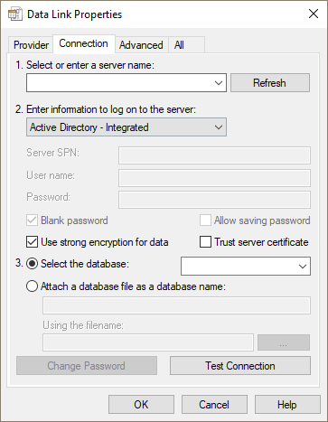
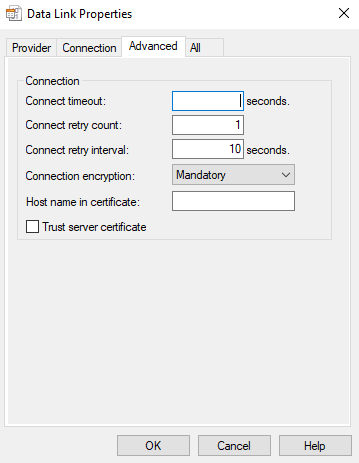

# Universal Data Link (UDL) Configuration
[!INCLUDE[appliesto-ss-asdb-asdw-pdw-md](../../../includes/appliesto-ss-asdb-asdw-pdw-md.md)]

[!INCLUDE[Driver_OLEDB_Download](../../../includes/driver_oledb_download.md)]

## Connection Tab
Use the Connection tab to specify how to connect to your data using the Microsoft OLE DB Driver for SQL Server.

The Connection tab is provider-specific and displays only the connection properties that are required by the Microsoft OLE DB Driver for SQL Server.

|Option|Description|
|---   |---        |
|Select or enter a server name|Select a server name from the drop-down list, or type the location of the server where the database you want to access is located. Selecting the database on the server is a separate action. Update the list by clicking "Refresh".
|Enter information to sign in to the server|You can select the following authentication options from this drop-down list: <ul><li>`Windows Authentication:` Authentication to SQL Server using the currently logged-in user's account</li><li>`SQL Server Authentication:` Authentication to SQL Server using login ID and password</li><li>`Active Directory - Integrated:` Integrated authentication using the currently logged-in user's account</li><li>`Active Directory - Password:` Active Directory authentication using login ID and password</li></ul>|
|Server SPN|If you use a trusted connection, you can specify a service principal name (SPN) for the server.|
|User name|Type the User ID to use for authentication when you sign in to the data source.|
|Password|Type the password to use for authentication when you sign in to the data source.|
|Blank password|When checked, enables the specified provider to use a blank password in the connection string.|
|Allow saving password|When checked, allows the password to be saved with the connection string. Whether the password is included in the connection string depends on the functionality of the calling application.   **NOTE:** If saved, the password is returned and saved unmasked and unencrypted.|
|Use strong encryption for data|When checked, data that is passed through the connection will be encrypted.|
|Trust server certificate|When checked, the server's certificate will be validated. Server's certificate must have the correct hostname of the server and issued by a trusted certificate authority.|
|Select the database|Select or type the database name that you want to access.|
|Attach a database file as a database name|Specifies the name of the primary file for an attachable database. This database is attached and used as the default database for the data source. In the first textbox under this section, type the database name to use for the attached database file.  Type the full path to the database file to be attached in text box labeled `Using the filename`, or click on the `...` button to browse for the database file.|
|Change Password|Displays Change SQL Server Password dialog. |
|Test Connection|Click to attempt a connection to the specified data source. If the connection fails, ensure that the settings are correct. For example, spelling errors and case sensitivity can cause failed connections.|

## Advanced Tab
Use the Advanced tab to view and set additional initialization properties.

|Option|Description|
|---   |---        |
| Connect timeout | Specifies the amount of time (in seconds) that the Microsoft OLE DB Driver for SQL Server waits for initialization to complete. If initialization times out, an error is returned and the connection is not created.|

> [!NOTE]  
>  For more general Data Link connection information, see the [Data Link API Overview](https://go.microsoft.com/fwlink/?linkid=2067432&clcid=0x409).