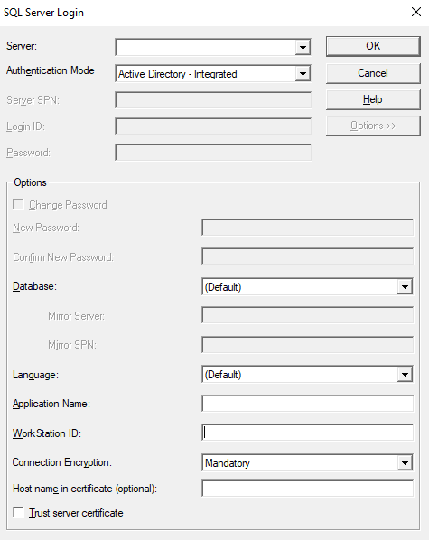

# SQL Server Login dialog box
[!INCLUDE [SQL Server](../../../includes/applies-to-version/sql-asdb-asdbmi-asa-pdw.md)]

[!INCLUDE[Driver_OLEDB_Download](../../../includes/driver_oledb_download.md)]

When you attempt to connect without specifying enough information, the OLE DB driver displays the **SQL Server Login** dialog box.

> [!NOTE]  
> SQL Server Login Dialog prompting behavior is controlled by the `DBPROP_INIT_PROMPT` initialization property. For more information, see:
> - [Initialization and Authorization Properties](../ole-db-data-source-objects/initialization-and-authorization-properties.md)
> - [OLE DB Programmer's Guide](/previous-versions/windows/desktop/ms714342(v=vs.85))

## Options
|Option|Description|
|---   |---        |
|Server|The name of an instance of SQL Server on your network. Select a server\instance name from the list, or type the server\instance name in the **Server** box. Optionally, you can create a server alias on the client computer using **SQL Server Configuration Manager**, and type that name in the **Server** box.   You can enter "(local)" when you are using the same computer as SQL Server. You can then connect to a local instance of SQL Server, even when running a non-networked version of SQL Server.  For more information about server names for different types of networks, see [SQL Server Installation](../../../database-engine/install-windows/install-sql-server.md).|
|Authentication Mode|You can select the following authentication options from the drop-down list: <ul><li>`Windows Authentication:` Authentication to SQL Server using the currently logged-in user's Windows account credentials.</li><li>`SQL Server Authentication:` Authentication using login ID and password.</li><li>`Active Directory - Integrated:` Integrated authentication with an Azure Active Directory identity. This mode can also be used for Windows authentication to SQL Server.</li><li>`Active Directory - Password:` User ID and password authentication with an Azure Active Directory identity.</li><li>`Active Directory - Universal with MFA support:` Interactive authentication with an Azure Active Directory identity. This mode supports Azure Active Directory Multi-Factor Authentication (MFA).</li><li>`Active Directory - Service Principal:` Authentication with an Azure Active Directory service principal. **Login ID** should be set to the application (client) ID. **Password** should be set to the application (client) secret.</li></ul>|
|Server SPN|If you use a trusted connection, you can specify a service principal name (SPN) for the server.|
|Login ID|Specifies the login ID to use for the connection. The Login ID text box is only enabled if `Authentication Mode` is set to `SQL Server Authentication`, `Active Directory - Password`, `Active Directory - Universal with MFA support`, or `Active Directory - Service Principal`.|
|Password|Specifies the password used for the connection. The password text box is only enabled if `Authentication Mode` is set to `SQL Server Authentication`, `Active Directory - Password`, or `Active Directory - Service Principal`.|
|Options|Displays or hides the **Options** group. The **Options** button is enabled if **Server** has a value.|
|Change Password|When checked, enables **New Password** and **Confirm New Password** text boxes.|
|New Password|Specifies the new password.|
|Confirm New Password|Specifies the new password a second time, for confirmation.|
|Database|Select or type the default database to use on the connection. This setting overrides the default database specified for the login on the server. If no database is specified, the connection uses the default database specified for the login on the server.|
|Mirror Server|Specifies the name of the failover partner of the database to be mirrored.|
|Mirror SPN|Optionally, you can specify an SPN for the mirror server. The SPN for the mirror server is used for mutual authentication between client and server.|
|Language|Specifies the national language to use for SQL Server system messages. The computer running SQL Server must have the language installed. This setting overrides the default language specified for the login on the server. If no language is specified, the connection uses the default language specified for the login on the server.|
|Application Name|Specifies the application name to be stored in the **program_name** column in the row for this connection in **sys.sysprocesses**.|
|Workstation ID|Specifies the workstation ID to be stored in the **hostname** column in the row for this connection in **sys.sysprocesses**.|
|Connection encryption|When `Mandatory` or `Strict`, data that is passed through the connection will be encrypted. The `Strict` option additionally encrypts the PRELOGIN packets. This option is only available for versions 19.x.x.|
|Use strong encryption for data|When checked, data that is passed through the connection will be encrypted. This option is only available for versions 18.x.x.|
|Trust server certificate|When unchecked, the server's certificate will be validated. Server's certificate must have the correct hostname of the server and issued by a trusted certificate authority.|
|Server certificate|Specifies the path to a certificate file to match against the SQL Server TLS/SSL certificate. This option can only be used when `Strict` encryption is enabled.  Type the full path to the certificate file in the text box labeled `Server certificate`, or click on the `...` button to browse for the certificate file. This option is only available in versions 19.2+.|
|Host name in certificate|The host name to be used in validating the SQL Server TLS/SSL certificate. If not set, the driver uses the server name on the connection URL as the host name to validate the SQL Server TLS/SSL certificate. This option is only available in versions 19+.|

> [!NOTE]  
> When using `Windows Authentication` or `SQL Server Authentication` modes, **Trust server certificate** is considered only when the **Use strong encryption for data** option is enabled.

## Next steps
- [Authenticate to Azure Active Directory](../features/using-azure-active-directory.md) using the OLE DB driver.
- Set connection information using [Universal Data Link (UDL)](data-link-pages.md).