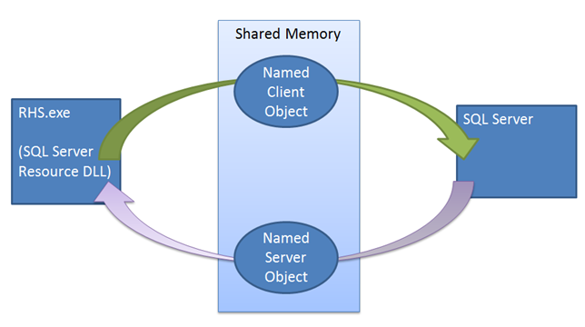
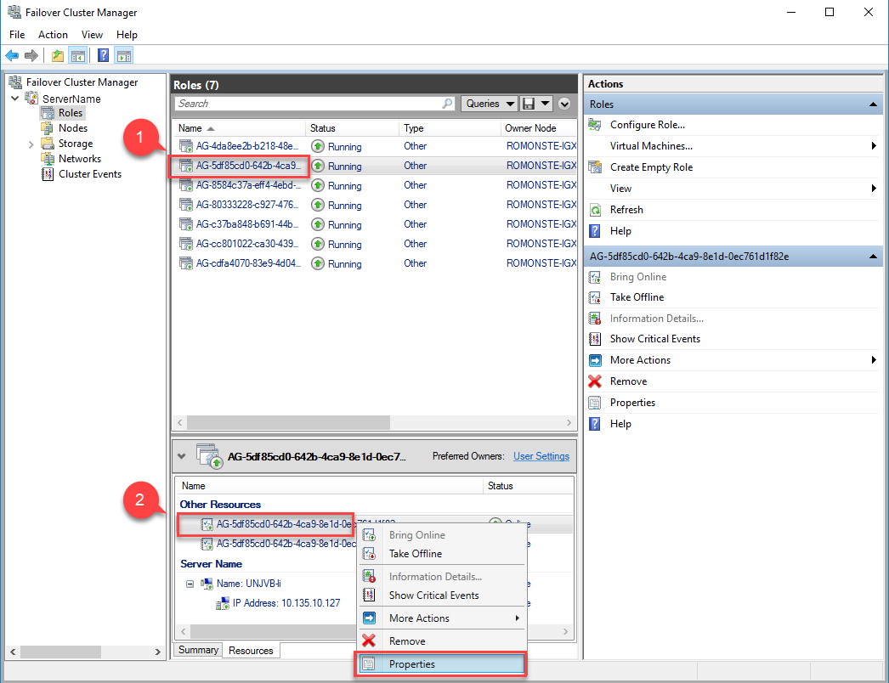
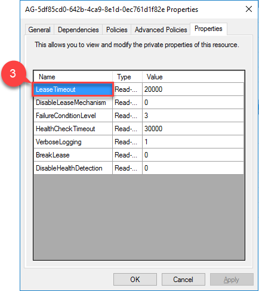

# Mechanics and Guidelines of Lease, Cluster, and Health Check Timeouts

Differences in hardware, software, and cluster configurations as well as different application requirements for uptime and performance require specific configuration for lease, cluster, and health check timeout values. Certain applications and workloads might require more aggressive monitoring to limit downtime following hard failures as much as possible, but other may want to have more tolerance to transient network issues and waits from high resource usage and are okay with slower failovers.

Multiple services on each node work to detect failures. The cluster service could detect quorum loss, the resource DLL could detect an issue surfaced by Always On health detection, or manual failover may be initiated directly on the primary instance. The cluster service, the resource host, and the SQL Server instance synchronize with each other via RPC, shared memory and T-SQL. In most scenarios, these services successfully communicate, however, we cannot depend on this to be 100% reliable even between services on the same machine. Furthermore, we need to be able to withstand system wide events like network and disk failures which may prevent communication or interrupt functionality. With many failure cases and without fully dependable communication between services, we depend on various failover detection mechanisms to detect and respond to failures independently of each other so the cluster state is always consistent for all nodes. 

## Cluster Node and Resource detection

Each node in the cluster runs a single cluster service which operates the failover cluster and monitors all cluster resources. The resource
host operates as a separate process and is the interface between the cluster service and cluster resources. The resource host performs
operations on cluster resources when called upon by the cluster service. Cluster aware applications like SQL Server provide custom interfaces to
the resource monitor via resource DLLs. The resource DLL implement. online and offline operations and health monitoring for custom
resources. The resource host is a child process of the cluster service
and is killed whenever the cluster service is killed.

In the case of SQL Server, the Availability Group resource DLL
determines health of the Availability Group based on the AG lease
mechanism and Always On health detection. The AG resource DLL exposes
the health of the resource through the IsAlive operation, polled by the
resource monitor at the cluster heartbeat interval, dictated by the
cluster-wide values ***CrossSubnetDelay*** and ***SameSubnetDelay***. On
a primary node, the cluster service initiates failovers whenever the
IsAlive call to the resource DLL returns that the AG is not healthy.

The cluster service sends heartbeats to other nodes in the cluster and
acknowledges heartbeats received from others. When a node detects a
communication failure from a series of unacknowledged heartbeats, it
broadcasts a message causing all reachable nodes to reconcile their
views of cluster node health. This event, called a regroup event,
maintains consistency of the cluster state across nodes. Following a
regroup event, if quorum is lost than all cluster resources including
Availability Groups in this partition are taken offline, transitioning
all nodes in this partition to a resolving state. If a partition exists
which holds a quorum, the AG will be assigned to one node in the
partition and become the primary while all other nodes will be
secondaries.

## Always On Health Detection

The Always On resource DLL monitors the status of internal SQL Server
components. ***sp\_server\_diagnostics*** reports the health of these
components SQL Server on an interval controlled by
***HealthCheckTimeout***. ***Sp\_server\_diagnostics*** reports health
status of 5 instance level components: system, resource,
query\_processing, io\_subsystem and events. It also reports the health
of each Availability Group. Upon each update, the resource DLL updates
the health status of the AG resource based upon the failure level of the
AG. When data is returned by sp\_server\_diagnostics, it shows each
component as either in a clean, warning, error or unknown state with
some XML data describing the state of the component. For health
detection, the resource DLL only takes action if a component is in an
error state.

If health detection fails to report an update to the resource DLL for
multiple intervals then the AG is determined unhealthy and will report
failures on IsAlive calls.

## Lease Mechanism 

Unlike other failover mechanisms, The SQL server instance plays an
active role in the lease mechanism. When bringing the Availability Group
online as the primary, the SQL Server instance spawns a dedicated lease
worker thread for the Availability Group. The lease worker shares a
small region of memory with the resource host containing lease renewal
and lease stop events. The lease worker and resource host work in a
circular fashion, signaling their respective lease renewal event and
then sleeping, waiting for the other party to signal its own lease
renewal event or the stop event. Both the resource host and the SQL
Server lease thread maintain a time to live value which is updated each
time the thread wakes up after being signaled by the other thread. If
the time to live is reached while waiting for the signal, the lease
expires and then replica transitions to the resolving state for that
specific Availability Group. If the lease stop event is signaled, then
the replica transitions to a resolving role.

   
The lease mechanism enforces synchronization between SQL Server and Windows Server
Failover Cluster. When a failover command is issued the cluster service
makes an offline call to the resource DLL of the current primary. The
resource DLL first attempts to offline the AG using a stored procedure.
If this stored procedure fails or times out the failure is reported back
to the cluster service which then issues a terminate command. The
terminate again attempts to execute the same stored procedure, but the
cluster this time does not wait for the resource DLL to report success
or failure before bringing the AG online on a new replica. If this
second procedure call fails then the current primary then the resource
host will have to rely on the lease mechanism to take the instance
offline. When the resource DLL is called to take the AG offline, the
resource DLL signals the lease stop event, waking up the SQL Server
lease worker thread to offline the Availability Group. Even if this stop
event is not signaled, the lease will expire, and the replica will
transition to the resolving state.

The lease is primarily a synchronization mechanism between the primary
instance and the cluster, but it can also create failure conditions
where there was otherwise no need to failover. High CPU or tempdb
pressure can starve the lease worker thread, preventing lease renewal
from the SQL instance and causing a failover.

## Guidelines for Cluster Timeout Values

It is important to consider the tradeoffs and understand the
consequences of using less aggressive monitoring of your SQL Server
cluster. Increasing cluster timeout values will increase our ability to
tolerate transient network issues but will slowdown reactions to hard
failures. By increasing timeouts to deal with resource pressure or large
geographical latency, the time to recover from hard, or non-recoverable
failures will increase as well. While this is acceptable for many
applications, it is not ideal in all cases.

The default settings are optimized for quickly reacting to symptoms of
hard failures and limiting downtime, but these can also be overly
aggressive for certain workloads and configurations. It is not
recommended to lower any of the ***LeaseTimeout, CrossSubnetDelay,
CrossSubnetThreshold, SameSubnetDelay, SameSubnetThreshold,*** or
***HealthCheckTimeout*** beyond their default values. The ‘correct’
settings for each deployment will vary and likely take a longer period
of fine tuning to discover. When making changes to any of these values,
they should be done gradually and with consideration of the
relationships and dependencies between these values.

### Relationship between Cluster Timeout and Lease Timeout

The primary function of the lease mechanism is to offline the SQL Server
in the case that the cluster service cannot communicate with the
instance while performing a failover to another node. When the cluster
performs the offline operation on the AG cluster resource, the cluster
service makes an RPC call to rhs.exe to offline the resource. The
resource DLL uses stored procedures to tell SQL Server to offline the
Availability Group, but this stored procedure could fail or timeout. The
resource host also stops its own lease renewal thread during the offline
call, which in the worst-case SQL Server will cause the lease to expire
in ½ \* LeaseTimeout and transition the instance to a resolving state.
Failovers can be initiated by multiple different parties, but it is
vitally important that the view of the cluster state is consistent
across the cluster and across SQL Server instances. For example, imagine
a scenario where the primary instance loses connection with the rest of
the cluster. Each node in the cluster will determine a failure at
similar times due to the cluster timeout values, but only the primary
node can interact with the primary SQL Server instance to force it to
give up the primary role.

From the primary node’s perspective, the cluster service will have lost
quorum and the service will begin to terminate itself. The cluster
service will issue an RPC call to the resource host to terminate the
process. This terminate call is responsible for taking the Availability
Group offline on the SQL Server instance. This offline call is done via
T-SQL, but we cannot guarantee that the connection will be successfully
established between SQL and the resource DLL.

From the perspective of the rest of the cluster, there is currently no
primary and it will vote and establish a single new primary for the
remaining nodes in the cluster. If the resource DLL’s stored procedure
execution fails or timeout, we could be vulnerable to a split brain.

The lease timeout prevents split brain scenarios in the face of
communication errors. Even if all communication fails, the resource DLL
process will terminate and be unable to update the lease. Once the lease
expires, it will take the AG offline on its own. We need the primary SQL
Server instance to realize that it is no longer the primary before we
establish a new one. Since the rest of the cluster which is responsible
for choosing a new primary has no means of coordinating with the current
primary, we must configure the timeout values in a way that there is no
scenario that a new primary is established before the current primary
takes itself offline.

When the cluster fails over, the previous primary SQL Server instance
must transition to a resolving state before the new primary comes
online. The SQL Server lease thread at any point has a remaining time to
live of ½ \* LeaseTimeout, because whenever the lease is renewed the new
time to live is updated to the ***LeaseInterval*** or ½ \* LeaseTimeout.
If the cluster service or the resource host stalls or terminates without
signaling the lease stop event, the cluster will declare the primary
node dead after ***SameSubnetThreshold \* SameSubnetDelay***
milliseconds. Within this time, the lease must expire so the primary is
guaranteed to be offline. Because the max time to live for the lease
timeout is **½ \* LeaseTimeout**, **½ \* LeaseTimeout** must be less
than **SameSubnetThreshold \* SameSubnetDelay**.

**SameSubnetThreshold \<= CrossSubnetThreshold** and **SameSubnetDelay
\<= CrossSubnetDelay** should be true of all SQL Server clusters.

### Health Check Timeout Operation

The health check timeout is more flexible because no other failover
mechanism depends on it directly. The default value of 30 seconds sets
the sp\_server\_diagnostics interval at 10 seconds, with a minimum value
for 15 seconds for timeout and a 5 second interval. More generally, the
sp\_server\_diagnositcs update interval is always 1/3 \*
HealthCheckTimeout. When the resource DLL does not receive a new set of
health data at an interval, it will continue to use the health data from
the previous interval to determine the current AG and instance health.
Increasing the health check timeout value will make the primary more
tolerant of CPU pressure which can prevent sp\_server\_diagnostics from
providing new data at each interval, however, it will rely on outdated
data health checks for longer. Regardless of the timeout value, once
data is received indicating the replica is not healthy, the next IsAlive
call will return that the instance is unhealthy and the cluster service
will initiate a failover.

The failure condition level of the Availability Group changes the
failure conditions for the health check. For any failure level, if the
Availability Group element is reported unhealthy by
sp\_server\_diagnostics then the health check will fail. Each level
inherits all the failure conditions from the levels below it.

  - Level 1: OnServerDown
    
      - Health check takes no action if any resources fail besides the
        Availability Group. If Availability Group data is not received
        within 5 intervals, or 5/3 \* HealthCheckTimeout, then the AG is
        considered dead.

  - Level 2: OnServerUnresponsive
    
      - If no data is received from sp\_server\_diagnostics for the
        HealthCheckTimeout, then the instance is considered dead.

  - Level 3: OnCriticalServerError
    
      - This is the default level
    
      - If the system component reports an error, then the instance is
        considered dead.

  - Level 4: OnModerateServerError
    
      - If the resource component reports an error, then the instance is
        considered dead.

  - Level 5: OnAnyQualifiedFailureConitions
    
      - If the query processing component reports an error, then the
        instance is considered dead.

## Updating Cluster and Always On Timeout Values

### Cluster Values

There are four values in the WSFC configuration that are responsible for
determining cluster timeout values

  - SameSubnetDelay

  - SameSubnetThreshold

  - CrossSubnetDelay

  - CrossSubnetThreshold

The delay values determine the wait time between heartbeats from the
cluster service, and the threshold values set the number of heartbeats
that can receive no acknowledgement from the target node or resource
before the object is declared dead by the cluster. If there is no
successful heartbeat between nodes in the same subnet for more than
***SameSubnetDelay \* SameSubnetThreshold*** milliseconds, then the node
is determined dead. The same is true of cross subnet communication using
the cross-subnet values.

In an elevated PowerShell terminal, **Get-Cluster | fl \*** on a node in
the target cluster lists all current c luster values. To update any of
these values, use **(Get-Cluster).\<ValueName\> = \<NewValue\>**. This
will update the value for all nodes in the cluster.

When increasing the Delay \* Threshold product to make the cluster
timeout more tolerant, it is more effective to first increase the delay
value before increasing the threshold. By increasing the delay, the time
between each heartbeat is increased. With more time between heartbeats,
we allow for more time for transient network issues to resolve
themselves and decrease network congestion relative to sending more
heartbeats in the same period.

### Lease Timeout

The lease mechanism is controlled by a single value specific to each
Availability Group in a WSFC cluster. To navigate to this value, find
the target AG role in the roles tab in the Failover Cluster Manager.
After selecting the Availability Group role right click the Availability
Group resource at the bottom of the window and select properties. In the
popup window, navigate to the properties tab and there will be a list of
values specific to this Availability Group, one of which is the
LeaseTimeout value which can be changed in this menu. Depending on the
Availability Group’s configuration there may be additional resources for
listeners, shared disks, file shares, etc., these do not require any
additional configuration.

### Health Check Values

The two values which control the Always On health check are
FailureConditionLevel and HealthCheckTimeout. The FailureConditionLevel
indicates the tolerance level to specific failure conditions reported by
sp\_server\_diagnostics and the HealthCheckTimeout configures the time
the resource DLL can go without receiving an update from
sp\_server\_diagnostics. The update interval for sp\_server\_diagnostics
is always HealthCheckTimeout / 3.

To configure the failover condition level, use the
FAILURE\_CONDITION\_LEVEL = *n* option of the CREATE or ALTER
AVAILABILITY GROUP T-SQL statement, where n is an integer between 1 and
5. The following command sets the failure condition level to 1 for
Availability Group ‘AG1’:

***ALTER AVAILABILITY GROUP AG1 SET (FAILURE\_CONDITION\_LEVEL = 1); ***

To configure the health check timeout, use the HEALTH\_CHECK\_TIMEOUT
option of the ALTER or CREATE AVAILABILITY GROUP statements. The
following command sets the health check timeout to 60000 milliseconds
for Availability Group AG1:

***ALTER AVAILABILITY GROUP AG1 SET (HEALTH\_CHECK\_TIMEOUT =***
***60000);***

## Summary of Timeout Guidelines

  - It is not advised to lower any timeout values below their default
    values

  - The lease interval (½ \* LeaseTimeout) must be shorter than
    SameSubnetThreshold \* SameSubnetDelay

  - SameSubnetThreshold \<= CrossSubnetThreshold

  - SameSubnetDelay \<= SameSubnetDelay

## See Also  
 [Active Secondaries: Backup on Secondary Replicas &#40;Always On Availability Groups&#41;](active-secondaries-backup-on-secondary-replicas-always-on-availability-groups.md)   
 [ALTER AVAILABILITY GROUP &#40;Transact-SQL&#41;](../../../t-sql/statements/alter-availability-group-transact-sql.md)  
  
  

