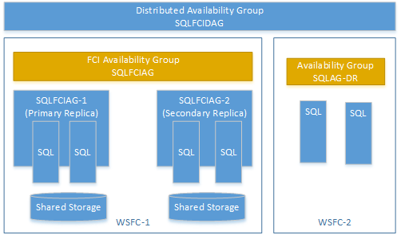

# Configure a distributed Always On availability group  
[!INCLUDE[appliesto-ss-xxxx-xxxx-xxx-md](../../../includes/appliesto-ss-xxxx-xxxx-xxx-md.md)]

To create a distributed availability group, you must create an availability group and listener on each Windows Server Failover Cluster (WSFC). You then combine these availability groups into a distributed availability group. The following steps provide a basic example in Transact-SQL. This example does not cover all of the details of creating availability groups and listeners; instead, it focuses on highlighting the key requirements. 

For a technical overview of distributed availability groups, see [Distributed availability groups](distributed-availability-groups.md).   

## Prerequisites

### Set the endpoint listeners to listen to all IP addresses

Make sure the endpoints can communicate between the different availability groups in the distributed availability group. If one availability group is set to a specific network on the endpoint, the distributed availability group does not work properly. On each server that hosts a replica in the distributed availability group, configure the listener to `LISTENER_IP = ALL`. 

#### Create a listener to listen to all IP addresses

For example, the following script creates a listener endpoint on TCP port 5022 that listens on all IP addresses.  

```sql
CREATE ENDPOINT [aodns-hadr] 
    STATE=STARTED
    AS TCP (LISTENER_PORT = 5022, LISTENER_IP = ALL)
FOR DATA_MIRRORING (
   ROLE = ALL, 
   AUTHENTICATION = WINDOWS NEGOTIATE,
   ENCRYPTION = REQUIRED ALGORITHM AES
)
GO
```

#### Alter a listener to listen to all IP addresses

For example, the following script changes a listener endpoint to listen on all IP addresses.  

```sql
ALTER ENDPOINT [aodns-hadr] 
    AS TCP (LISTENER_IP = ALL)
GO
```

## Create first availability group

### Create the primary availability group on the first cluster  
Create an availability group on the first WSFC.   In this example, the availability group is named `ag1` for the database `db1`. The primary replica of the primary availability group is known as the **global primary** in a distributed availability group. Server1 is the global primary in this example.        
  
```sql  
CREATE AVAILABILITY GROUP [ag1]   
FOR DATABASE db1   
REPLICA ON N'server1' WITH (ENDPOINT_URL = N'TCP://server1.contoso.com:5022',  
    FAILOVER_MODE = AUTOMATIC,  
    AVAILABILITY_MODE = SYNCHRONOUS_COMMIT,   
    BACKUP_PRIORITY = 50,   
    SECONDARY_ROLE(ALLOW_CONNECTIONS = NO),   
    SEEDING_MODE = AUTOMATIC),   
N'server2' WITH (ENDPOINT_URL = N'TCP://server2.contoso.com:5022',   
    FAILOVER_MODE = AUTOMATIC,   
    AVAILABILITY_MODE = SYNCHRONOUS_COMMIT,   
    BACKUP_PRIORITY = 50,   
    SECONDARY_ROLE(ALLOW_CONNECTIONS = NO),   
    SEEDING_MODE = AUTOMATIC);   
GO  
  
```  
  
>[!NOTE]
>The preceding example uses direct seeding, where **SEEDING_MODE** is set to **AUTOMATIC** for both the replicas and the distributed availability group. This configuration sets the secondary replicas and secondary availability group to be automatically populated without requiring a manual backup and restore of primary database.  
  
### Join the secondary replicas to the primary availability group  
Any secondary replicas must be joined to the availability group with **ALTER AVAILABILITY GROUP** with the **JOIN** option. Because direct seeding is used in this example, you must also call  **ALTER AVAILABILITY GROUP** with the **GRANT CREATE ANY DATABASE** option. This setting allows the availability group to create the database and begin seeding it automatically from the primary replica.  
  
In this example, the following commands are run on the secondary replica, `server2`, to join the `ag1` availability group. The availability group is then permitted to create databases on the secondary.  
  
```sql  
ALTER AVAILABILITY GROUP [ag1] JOIN   
ALTER AVAILABILITY GROUP [ag1] GRANT CREATE ANY DATABASE  
GO  
```  

>[!NOTE]
>When the availability group creates a database on a secondary replica, it sets the database owner as the account that ran the `ALTER AVAILABILITY GROUP` statement to grant permission to create any database. For complete information, see [Grant create database permission on secondary replica to availability group](automatic-seeding-secondary-replicas.md#grantCreate).
  
### Create a listener for the primary availability group  

Next add a listener for the primary availability group on the first WSFC. In this example, the listener is named `ag1-listener`. For detailed instructions on creating a listener, see [Create or Configure an Availability Group Listener &#40;SQL Server&#41;](../../../database-engine/availability-groups/windows/create-or-configure-an-availability-group-listener-sql-server.md).  
  
```sql
ALTER AVAILABILITY GROUP [ag1]    
    ADD LISTENER 'ag1-listener' ( 
        WITH IP ( ('2001:db88:f0:f00f::cf3c'),('2001:4898:e0:f213::4ce2') ) , 
        PORT = 60173);    
GO  
```  
  

## Create second availability group  
 Then on the second WSFC, create a second availability group, `ag2`. In this case, the database is not specified, because it is automatically seeded from the primary availability group.  The primary replica of the secondary availability group is known as the **forwarder** in a distributed availability group. In this example, server3 is the forwarder. 
  
```sql  
CREATE AVAILABILITY GROUP [ag2]   
FOR   
REPLICA ON N'server3' WITH (ENDPOINT_URL = N'TCP://server3.contoso.com:5022',   
    FAILOVER_MODE = MANUAL,   
    AVAILABILITY_MODE = SYNCHRONOUS_COMMIT,   
    BACKUP_PRIORITY = 50,   
    SECONDARY_ROLE(ALLOW_CONNECTIONS = NO),   
    SEEDING_MODE = AUTOMATIC),   
N'server4' WITH (ENDPOINT_URL = N'TCP://server4.contoso.com:5022',   
    FAILOVER_MODE = MANUAL,   
    AVAILABILITY_MODE = SYNCHRONOUS_COMMIT,   
    BACKUP_PRIORITY = 50,   
    SECONDARY_ROLE(ALLOW_CONNECTIONS = NO),   
    SEEDING_MODE = AUTOMATIC);   
GO  
```  
  
> [!NOTE]  
> The secondary availability group must use the same database mirroring endpoint (in this example port 5022). Otherwise, replication will stop after a local failover.  
  
### Join the secondary replicas to the secondary availability group  
 In this example, the following  commands are run on the secondary replica, `server4`, to join the `ag2` availability group. The availability group is then permitted to create databases on the secondary to support direct seeding.  
  
```sql  
ALTER AVAILABILITY GROUP [ag2] JOIN   
ALTER AVAILABILITY GROUP [ag2] GRANT CREATE ANY DATABASE  
GO  
```  
  
### Create a listener for  the secondary availability group  
 Next add a listener for the secondary availability group on the second WSFC. In this example, the listener is named `ag2-listener`. For detailed instructions on creating a listener, see [Create or Configure an Availability Group Listener &#40;SQL Server&#41;](../../../database-engine/availability-groups/windows/create-or-configure-an-availability-group-listener-sql-server.md).  
  
```  
ALTER AVAILABILITY GROUP [ag2]    
    ADD LISTENER 'ag2-listener' ( WITH IP ( ('2001:db88:f0:f00f::cf3c'),('2001:4898:e0:f213::4ce2') ) , PORT = 60173);    
GO  
```  
  
## Create distributed availability group on first cluster  
 On the first WSFC, create a distributed availability group (named `distributedag` in this example). Use the **CREATE AVAILABILITY GROUP** command with the **DISTRIBUTED** option. The **AVAILABILITY GROUP ON** parameter specifies the member availability groups `ag1` and `ag2`.  
  
```sql  
CREATE AVAILABILITY GROUP [distributedag]  
   WITH (DISTRIBUTED)   
   AVAILABILITY GROUP ON  
      'ag1' WITH    
      (   
         LISTENER_URL = 'tcp://ag1-listener.contoso.com:5022',    
         AVAILABILITY_MODE = ASYNCHRONOUS_COMMIT,   
         FAILOVER_MODE = MANUAL,   
         SEEDING_MODE = AUTOMATIC   
      ),   
      'ag2' WITH    
      (   
         LISTENER_URL = 'tcp://ag2-listener.contoso.com:5022',   
         AVAILABILITY_MODE = ASYNCHRONOUS_COMMIT,   
         FAILOVER_MODE = MANUAL,   
         SEEDING_MODE = AUTOMATIC   
      );    
GO   
```  
  
> [!NOTE]  
>  The **LISTENER_URL** specifies the listener for each availability group along with the database mirroring endpoint of the availability group. In this example, that is port `5022` (not port `60173` used to create the listener). If you are using a load balancer, for instance in Azure, [add a load balancing rule for the distributed availability group port](https://docs.microsoft.com/azure/virtual-machines/windows/sql/virtual-machines-windows-portal-sql-alwayson-int-listener#add-load-balancing-rule-for-distributed-availability-group). Add the rule for the listener port, in addition to the SQL Server instance port. 
  
## Join distributed availability group on second cluster  
 Then join the distributed availability group on the second WSFC.  
  
```sql  
ALTER AVAILABILITY GROUP [distributedag]   
   JOIN   
   AVAILABILITY GROUP ON  
      'ag1' WITH    
      (   
         LISTENER_URL = 'tcp://ag1-listener.contoso.com:5022',    
         AVAILABILITY_MODE = ASYNCHRONOUS_COMMIT,   
         FAILOVER_MODE = MANUAL,   
         SEEDING_MODE = AUTOMATIC   
      ),   
      'ag2' WITH    
      (   
         LISTENER_URL = 'tcp://ag2-listener.contoso.com:5022',   
         AVAILABILITY_MODE = ASYNCHRONOUS_COMMIT,   
         FAILOVER_MODE = MANUAL,   
         SEEDING_MODE = AUTOMATIC   
      );    
GO  
```  

## <a name="failover"></a> Join the database on the secondary of the second availability group
After the database on the secondary of the second availability group is in a restoring state you have to manually join it to the availability group.

```sql  
ALTER DATABASE [db1] SET HADR AVAILABILITY GROUP = [ag2];   
```
  
## <a name="failover"></a> Fail over to a secondary availability group  

Only manual failover is supported at this time. To manually fail over a distributed availability group:

1. Set the distribute availability group to synchronous commit. This ensures that data is not lost.
1. Wait until the distributed availability group is synchronized.
1. On the global primary replica, set the distributed availability group role to `SECONDARY`.
1. Test failover readiness.
1. Failover the primary availability group.

The following Transact-SQL examples demonstrate the detailed steps to fail over the distributed availability group named `distributedag`:

1. Set the distributed availability group to synchronous commit by running the following code on *both* the global primary and the forwarder.   
    
      ```sql  
      -- sets the distributed availability group to synchronous commit 
       ALTER AVAILABILITY GROUP [distributedag] 
       MODIFY 
       AVAILABILITY GROUP ON
       'ag1' WITH 
        ( 
        AVAILABILITY_MODE = SYNCHRONOUS_COMMIT 
        ), 
        'ag2' WITH  
        ( 
        AVAILABILITY_MODE = SYNCHRONOUS_COMMIT 
        );
       
       -- verifies the commit state of the distributed availability group
       select ag.name, ag.is_distributed, ar.replica_server_name, ar.availability_mode_desc, ars.connected_state_desc, ars.role_desc, 
       ars.operational_state_desc, ars.synchronization_health_desc from sys.availability_groups ag  
       join sys.availability_replicas ar on ag.group_id=ar.group_id
       left join sys.dm_hadr_availability_replica_states ars
       on ars.replica_id=ar.replica_id
       where ag.is_distributed=1
       GO

      ```  
   >[!NOTE]
   >In a distributed availability group, the synchronization status between the two availability groups depends on the availability mode of both replicas. For synchronous commit mode, both the current primary availability group, and the current secondary availability group must have `SYNCHRONOUS_COMMIT` availability mode. For this reason, you must run the script above on both the global primary replica, and the forwarder.

1. Wait until the status of the distributed availability group has changed to `SYNCHRONIZED`. Run the following query on the global primary, which is the primary replica of the primary availability group. 
    
      ```sql  
      SELECT ag.name
             , drs.database_id
             , drs.group_id
             , drs.replica_id
             , drs.synchronization_state_desc
             , drs.end_of_log_lsn 
        FROM sys.dm_hadr_database_replica_states drs,
        sys.availability_groups ag
          WHERE drs.group_id = ag.group_id;      
      ```  

    Proceed after the availability group **synchronization_state_desc** is `SYNCHRONIZED`. If **synchronization_state_desc** is not `SYNCHRONIZED`, run the command every five seconds until it changes. Do not proceed until the **synchronization_state_desc** = `SYNCHRONIZED`. 

1. On the global primary, set the distributed availability group role to `SECONDARY`. 

    ```sql
    ALTER AVAILABILITY GROUP distributedag SET (ROLE = SECONDARY); 
    ```  

    At this point, the distributed availability group is not available.

1. Test the failover readiness. Run the following query:

    ```sql
    SELECT ag.name, 
        drs.database_id, 
        drs.group_id, 
        drs.replica_id, 
        drs.synchronization_state_desc, 
        drs.end_of_log_lsn 
    FROM sys.dm_hadr_database_replica_states drs, sys.availability_groups ag
    WHERE drs.group_id = ag.group_id; 
    ```  
    The availability group is ready to fail over when the **synchronization_state_desc** is `SYNCHRONIZED` and the **end_of_log_lsn** is the same for both availability groups. 

1. Fail over from the primary availability group to the secondary availability group. Run the following command on the SQL Server that hosts the primary replica for the secondary availability group. 

    ```sql
    ALTER AVAILABILITY GROUP distributedag FORCE_FAILOVER_ALLOW_DATA_LOSS; 
    ```  

    After this step, the distributed availability group is available.
      
After completing the steps above, the distributed availability group fails over without any data loss. If the availability groups are across a geographical distance that causes latency, change the availability mode back to ASYNCHRONOUS_COMMIT. 
  
## Remove a distributed availability group  
 The following Transact-SQL statement removes a distributed availability group named `distributedag`:  
  
```sql  
DROP AVAILABILITY GROUP [distributedag]  
```  

## Create distributed availability group on failover cluster instances

You can create a distributed availability group using an availability group on a failover cluster instance (FCI). In this case, you don't need an availability group listener. Use the virtual network name (VNN) for the primary replica of the FCI instance. The following example shows a distributed availability group called SQLFCIDAG. One availability group is SQLFCIAG. SQLFCIAG has two FCI replicas. The VNN for the primary FCI replica is SQLFCIAG-1, and the VNN for the secondary FCI replica is SQLFCIAG-2. The distributed availability group also includes SQLAG-DR, for disaster recovery.



 
 
 The following DDL creates this distributed availability group. 

```sql  
CREATE AVAILABILITY GROUP [SQLFCIDAG]  
   WITH (DISTRIBUTED)   
   AVAILABILITY GROUP ON  
  'SQLFCIAG' WITH    
    (   
        LISTENER_URL = 'tcp://SQLFCIAG-1.contoso.com:5022',    
         AVAILABILITY_MODE = ASYNCHRONOUS_COMMIT,   
         FAILOVER_MODE = MANUAL,   
         SEEDING_MODE = AUTOMATIC
      ),   
  'SQLAG-DR' WITH    
       (   
         LISTENER_URL = 'tcp://SQLAG-DR.contoso.com:5022',   
         AVAILABILITY_MODE = ASYNCHRONOUS_COMMIT,   
         FAILOVER_MODE = MANUAL,   
         SEEDING_MODE = AUTOMATIC
      );   
```  

The listener URL is the VNN of the primary FCI instance.

## Manually fail over FCI in distributed availability group

To manually fail over the FCI availability group, update the distributed availability group to reflect the change of listener URL. For example, run the following DDL on both the primary AG and the secondary AG of SQLFCIAG:

```sql  
ALTER AVAILABILITY GROUP [SQLFCIDAG]  
   MODIFY AVAILABILITY GROUP ON  
 'SQLFCIAG' WITH    
    (   
        LISTENER_URL = 'tcp://SQLFCIAG-2.contoso.com:5022'
    )
```  
  
## Next steps

 [CREATE AVAILABILITY GROUP &#40;Transact-SQL&#41;](../../../t-sql/statements/create-availability-group-transact-sql.md)   
 [ALTER AVAILABILITY GROUP &#40;Transact-SQL&#41;](../../../t-sql/statements/alter-availability-group-transact-sql.md)  
  
  
