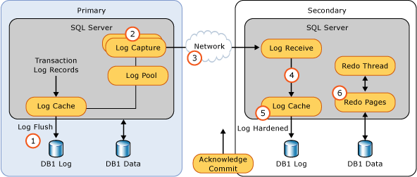
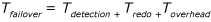
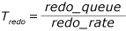
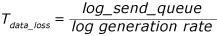
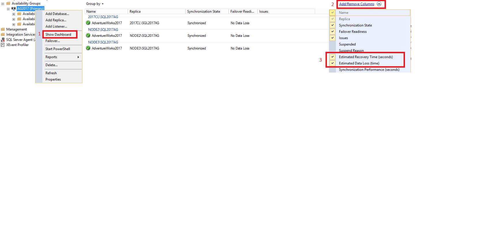
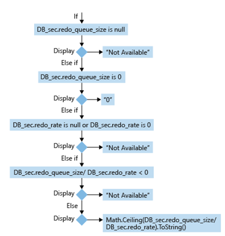
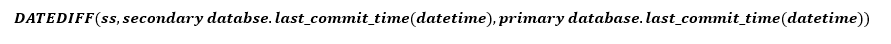
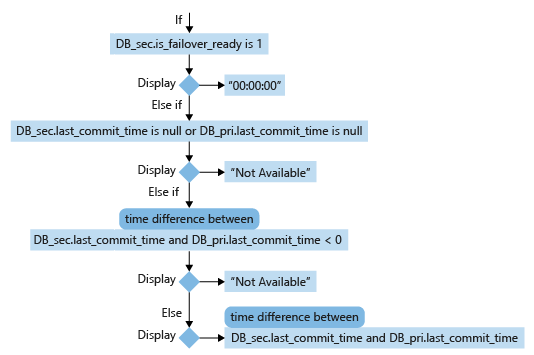

# Monitor performance for Always On availability groups
[!INCLUDE[appliesto-ss-xxxx-xxxx-xxx-md](../../../includes/appliesto-ss-xxxx-xxxx-xxx-md.md)]
  The performance aspect of Always On Availability Groups is crucial to maintaining the service-level agreement (SLA) for your mission-critical databases. Understanding how availability groups ship logs to secondary replicas can help you estimate the recovery time objective (RTO) and recovery point objective (RPO) of your availability implementation and identify bottlenecks in poorly performing availability groups or replicas. This article describes the synchronization process, shows you how to calculate some of the key metrics, and gives you the links to some of the common performance troubleshooting scenarios.  
   
##  Data synchronization process  
 To estimate the time to full synchronization and to identify the bottleneck, you need to understand the synchronization process. Performance bottleneck can be anywhere in the process, and locating the bottleneck can help you dig deeper into the underlying issues. The following figure and table illustrate the data synchronization process:  
  
   
  
|||||  
|-|-|-|-|  
|**Sequence**|**Step description**|**Comments**|**Useful metrics**|  
|1|Log generation|Log data is flushed to disk. This log must be replicated to the secondary replicas. The log records enter the send queue.|[SQL Server:Database > Log bytes flushed\sec](~/relational-databases/performance-monitor/sql-server-databases-object.md)|  
|2|Capture|Logs for each database is captured and sent to the corresponding partner queue (one per database-replica pair). This capture process runs continuously as long as the availability replica is connected and data movement is not suspended for any reason, and the database-replica pair is shown to be either Synchronizing or Synchronized. If the capture process is not able to scan and enqueue the messages fast enough, the log send queue builds up.|[SQL Server:Availability Replica > Bytes Sent to Replica\sec](~/relational-databases/performance-monitor/sql-server-availability-replica.md), which is an aggregation of the sum of all database messages queued for that availability replica.<br /><br /> [log_send_queue_size](~/relational-databases/system-dynamic-management-views/sys-dm-hadr-database-replica-states-transact-sql.md) (KB) and [log_bytes_send_rate](~/relational-databases/system-dynamic-management-views/sys-dm-hadr-database-replica-states-transact-sql.md) (KB/sec) on the primary replica.|  
|3|Send|The messages in each database-replica queue is dequeued and sent across the wire to the respective secondary replica.|[SQL Server:Availability Replica > Bytes sent to transport\sec](~/relational-databases/performance-monitor/sql-server-availability-replica.md) and [SQL Server:Availability Replica > Message Acknowledgement Time](~/relational-databases/performance-monitor/sql-server-availability-replica.md) (ms)|  
|4|Receive and cache|Each secondary replica receives and caches the message.|Performance counter [SQL Server:Availability Replica > Log Bytes Received/sec](~/relational-databases/performance-monitor/sql-server-availability-replica.md)|  
|5|Harden|Log is flushed on the secondary replica for hardening. After the log flush, an acknowledgement is sent back to the primary replica.<br /><br /> Once the log is hardened, data loss is avoided.|Performance counter [SQL Server:Database > Log Bytes Flushed/sec](~/relational-databases/performance-monitor/sql-server-databases-object.md)<br /><br /> Wait type [HADR_LOGCAPTURE_SYNC](~/relational-databases/system-dynamic-management-views/sys-dm-os-wait-stats-transact-sql.md)|  
|6|Redo|Redo the flushed pages on the secondary replica. Pages are kept in the redo queue as they wait to be redone.|[SQL Server:Database Replica > Redone Bytes/sec](~/relational-databases/performance-monitor/sql-server-database-replica.md)<br /><br /> [redo_queue_size](~/relational-databases/system-dynamic-management-views/sys-dm-hadr-database-replica-states-transact-sql.md) (KB) and [redo_rate](~/relational-databases/system-dynamic-management-views/sys-dm-hadr-database-replica-states-transact-sql.md).<br /><br /> Wait type [REDO_SYNC](~/relational-databases/system-dynamic-management-views/sys-dm-os-wait-stats-transact-sql.md)|  
  
##  Flow control gates  
 Availability groups are designed with flow control gates on the primary replica to avoid excessive resource consumption, such as network and memory resources, on all availability replicas. These flow control gates do not affect the synchronization health state of the availability replicas, but they can affect the overall performance of your availability databases, including RPO.  
  
 After the logs have been captured on the primary replica, they are subject to two levels of flow controls, as shown in the following table.  
  
|||||  
|-|-|-|-|  
|**Level**|**Number of gates**|**Number of messages**|**Useful metrics**|  
|Transport|1 per availability replica|8192|Extended event **database_transport_flow_control_action**|  
|Database|1 per availability database|11200 (x64)<br /><br /> 1600 (x86)|[DBMIRROR_SEND](~/relational-databases/system-dynamic-management-views/sys-dm-os-wait-stats-transact-sql.md)<br /><br /> Extended event **hadron_database_flow_control_action**|  
  
 Once the message threshold of either gate is reached, log messages are no longer sent to a specific replica or for a specific database. Messages can be sent once acknowledgement messages are received for the sent messages to bring the number of sent messages below the threshold.  
  
 In addition to the flow control gates, there is another factor that can prevent the log messages from being sent. The synchronization of replicas ensures that the messages are sent and applied in the order of the log sequence numbers (LSN). Before a log message is sent, its LSN also checked against the lowest acknowledged LSN number to make sure that it is less than one of thresholds (depending on the message type). If the gap between the two LSN numbers is larger than the threshold, the messages are not sent. Once the gap is below the threshold again, the messages are sent.  
  
 Two useful performance counters, [SQL Server:Availability Replica > Flow control/sec](~/relational-databases/performance-monitor/sql-server-availability-replica.md) and [SQL Server:Availability Replica > Flow Control Time (ms/sec)](~/relational-databases/performance-monitor/sql-server-availability-replica.md), show you, within the last second, how many times flow control was activated and how much time was spent waiting on flow control. Higher wait time on the flow control translate to higher RPO. For more information on the types of issues that can cause a high wait time on the flow control, see [Troubleshoot: Availability group exceeded RPO](troubleshoot-availability-group-exceeded-rpo.md).  
  
##  Estimating failover time (RTO)  
 The RTO in your SLA depends on the failover time of your Always On implementation at any given time, which can be expressed in the following formula:  
  
   
  
> [!IMPORTANT]  
>  If an availability group contains more than one availability database, then the availability database with the highest Tfailover becomes the limiting value for RTO compliance.  
  
 The failure detection time, Tdetection, is the time it takes for the system to detect the failure. This time depends on cluster-level settings and not on the individual availability replicas. Depending on the automatic failover condition that is configured, a failover can be triggered as an instant response to a critical SQL Server internal error, such as orphaned spinlocks. In this case, detection can be as fast as the [sp_server_diagnostics &#40;Transact-SQL&#41;](~/relational-databases/system-stored-procedures/sp-server-diagnostics-transact-sql.md) error report is sent to the WSFC cluster (the default interval is 1/3 of the health check timeout). A failover can also be triggered because of a timeout, such as the cluster health check timeout has expired (30 seconds by default) or the lease between the resource DLL and the SQL Server instance has expired (20 seconds by default). In this case, detection time is as long as the timeout interval. For more information, see [Flexible failover policy for automatic failover of an availability group &#40;SQL Server&#41;](https://msdn.microsoft.com/library/hh710061(SQL.120).aspx).  
  
 The only thing that the secondary replica needs to do to become ready for a failover is for the redo to catch up to the end of log. The redo time, Tredo, is calculated using the following formula:  
  
   
  
 where *redo_queue* is the value in [redo_queue_size](~/relational-databases/system-dynamic-management-views/sys-dm-hadr-database-replica-states-transact-sql.md) and *redo_rate* is the value in [redo_rate](~/relational-databases/system-dynamic-management-views/sys-dm-hadr-database-replica-states-transact-sql.md).  
  
 The failover overhead time, Toverhead, includes the time it takes to fail over the WSFC cluster and to bring the databases online. This time is usually short and constant.  
  
## Estimating potential data loss (RPO)  
 The RPO in your SLA depends on the possible data loss of your Always On implementation at any given time. This possible data loss can be expressed in the following formula:  
  
   
  
 where *log_send_queue* is the value of [log_send_queue_size](~/relational-databases/system-dynamic-management-views/sys-dm-hadr-database-replica-states-transact-sql.md) and *log generation rate* is the value of [SQL Server:Database > Log Bytes Flushed/sec](~/relational-databases/performance-monitor/sql-server-databases-object.md).  
  
> [!WARNING]  
>  If an availability group contains more than one availability database, then the availability database with the highest Tdata_loss becomes the limiting value for RPO compliance.  
  
 The log send queue represents all the data that can be lost from a catastrophic failure. At first glance, it is curious that the log generation rate is used instead of the log send rate (see [log_send_rate](~/relational-databases/system-dynamic-management-views/sys-dm-hadr-database-replica-states-transact-sql.md)). However, remember that using the log send rate only gives you the time to synchronize, while RPO measures data loss based on how fast it is generated, not on how fast it is synchronized.  
  
 A simpler way to estimate Tdata_loss is to use [last_commit_time](~/relational-databases/system-dynamic-management-views/sys-dm-hadr-database-replica-states-transact-sql.md). The DMV on the primary replica reports this value for all replicas. You can calculate the difference between the value for the primary replica and the value for the secondary replica to estimate how fast the log on the secondary replica is catching up to the primary replica. As stated previously, this calculation does not tell you the potential data loss based on how fast the log is generated, but it should be a close approximation.  

## Estimate RTO & RPO with the SSMS dashboard
In Always On Availability Groups, the RTO and RPO is calculated and displayed for the databases hosted on the secondary replicas. On the dashboard of the primary replica, the RTO and RPO is grouped by the secondary replica. 

To view the RTO and RPO within the dashboard, do the following:
1. In SQL Server Management Studio, expand the **Always On High Availability** node, right-click the name of your availability group, and select **Show Dashboard**. 
1. Select **Add/Remove Columns** under the **Group by** tab. Check both **Estimated Recovery Time(seconds)** [RTO] and **Estimated Data Loss (time)** [RPO]. 

   

### Calculation of secondary database RTO 
The recovery time calculation determines how much time is needed to recover the *secondary database* after a failover happens.  The failover time is usually short and constant. The detection time depends on cluster-level settings and not on the individual availability replicas. 


For a secondary database (DB_sec), calculation and display of its RTO is based on its **redo_queue_size** and **redo_rate**:



Except corner cases, the formula to calculate a secondary database's RTO is:




### Calculation of secondary database RPO

For a secondary database (DB_sec), calculation and display of its RPO is based on its is_failover_ready, last_commit_time and its correlated primary database (DB_pri)'s last_commit_time. When secondary database.is_failover_ready = 1, then daa is synchronized, and no data loss will occur upon failover. However, if this value is 0, then there is a gap between the **last_commit_time** on the primary database and the **last_commit_time** on the secondary database. 

For the primary database, the **last_commit_time** is the time when the latest transaction has been committed. For the secondary database, the **last_commit_time** is the latest commit time for the transaction on the primary database that has been successfully hardened on the secondary database as well. This number should be the same for both the primary and secondary database. A gap between these two values is the duration in which pending transactions have not been hardened on the secondary database, and will be lost in the event of a failover. 



### Performance Counters used in RTO/RPO formulas

- **redo_queue_size** (KB) [*used in RTO*]: The redo queue size is the size of transaction logs between its **last_received_lsn** and **last_redone_lsn**. **last_received_lsn** is the log block ID identifying the point up to which all log blocks have been received by the secondary replica that hosts this secondary database. **Last_redone_lsn** is the log sequence number of the last log record that was redone on the secondary database. Based on these two values, we can find IDs of the starting log block (**last_received_lsn**) and the end log block (**last_redone_lsn**). The space between these two log blocks then can represent how may transaction log blocks have not yet been redone. This is measured in Kilobytes(KB).
-  **redo_rate** (KB/sec) [*used in RTO*]: An accumulative value which represent at a period of elapsed time, how much of the transaction log (KB) has been redone on the secondary database in Kilobytes(KB)/escond. 
- **last_commit_time** (Datetime) [*used in RPO*]: For the primary database, **last_commit_time** is the time when the latest transaction has been committed. For the secondary database, the **last_commit_time** is the latest commit time for the transaction on the primary database that has been successfully hardened on the secondary database as well. Since this value on the secondary should be synchronized with the same value on the primary, any gap between these two values is the estimate of data loss (RPO).  
 
## Estimate RTO and RPO using DMVs

It is possible to query the DMVs [sys.dm_hadr_database_replica_states](../../../relational-databases/system-dynamic-management-views/sys-dm-hadr-database-replica-states-transact-sql.md) and [sys.dm_hadr_database_replica_cluster_states](../../../relational-databases/system-dynamic-management-views/sys-dm-hadr-database-replica-cluster-states-transact-sql.md) to estimate the RPO and RTO of a database. The below queries create stored procedures that accomplish both things. 

  >[!NOTE]
  > Be sure to create and run the stored procedure to estimate the RTO first, as the values it produces are necessary to run the stored procedure for estimating the RPO. 

### Create a stored procedure to estimate RTO 

1. On the target secondary replica, create stored procedure **proc_calculate_RTO**. If this stored procedure already exists, drop it first, and then recreate it. 

 ```sql
    if object_id(N'proc_calculate_RTO', 'p') is not null
        drop procedure proc_calculate_RTO
    go
    
    raiserror('creating procedure proc_calculate_RTO', 0,1) with nowait
    go
    --
    -- name: proc_calculate_RTO
    --
    -- description: Calculate RTO of a secondary database.
    -- 
    -- parameters:	@secondary_database_name nvarchar(max): name of the secondary database.
    --
    -- security: this is a public interface object.
    --
    create procedure proc_calculate_RTO
    (
    @secondary_database_name nvarchar(max)
    )
    as
    begin
  	  declare @db sysname
  	  declare @is_primary_replica bit 
  	  declare @is_failover_ready bit 
  	  declare @redo_queue_size bigint 
  	  declare @redo_rate bigint
  	  declare @replica_id uniqueidentifier
  	  declare @group_database_id uniqueidentifier
  	  declare @group_id uniqueidentifier
  	  declare @RTO float 

  	  select 
  	  @is_primary_replica = dbr.is_primary_replica, 
  	  @is_failover_ready = dbcs.is_failover_ready, 
  	  @redo_queue_size = dbr.redo_queue_size, 
  	  @redo_rate = dbr.redo_rate, 
  	  @replica_id = dbr.replica_id,
  	  @group_database_id = dbr.group_database_id,
  	  @group_id = dbr.group_id 
  	  from sys.dm_hadr_database_replica_states dbr join sys.dm_hadr_database_replica_cluster_states dbcs 	on dbr.replica_id = dbcs.replica_id and 
  	  dbr.group_database_id = dbcs.group_database_id  where dbcs.database_name = @secondary_database_name

  	  if  @is_primary_replica is null or @is_failover_ready is null or @redo_queue_size is null or @replica_id is null or @group_database_id is null or @group_id is null
  	  begin
  	  	print 'RTO of Database '+ @secondary_database_name +' is not available'
  	  	return
  	  end
  	  else if @is_primary_replica = 1
  	  begin
  	  	print 'You are visiting wrong replica';
  	  	return
  	  end

  	  if @redo_queue_size = 0 
  	  	set @RTO = 0 
  	  else if @redo_rate is null or @redo_rate = 0 
  	  begin
  	  	print 'RTO of Database '+ @secondary_database_name +' is not available'
  	  	return
  	  end
  	  else 
  	  	set @RTO = CAST(@redo_queue_size AS float) / @redo_rate
    
  	  print 'RTO of Database '+ @secondary_database_name +' is ' + convert(varchar, ceiling(@RTO))
  	  print 'group_id of Database '+ @secondary_database_name +' is ' + convert(nvarchar(50), @group_id)
  	  print 'replica_id of Database '+ @secondary_database_name +' is ' + convert(nvarchar(50), @replica_id)
  	  print 'group_database_id of Database '+ @secondary_database_name +' is ' + convert(nvarchar(50), @group_database_id)
    end
 ```

2. Execute **proc_calculate_RTO** with the target secondary database name:
  ```sql
   exec proc_calculate_RTO @secondary_database_name = N'DB_sec'
  ```
3. The output displays the RTO value of the target secondary replica database. Save the *group_id*, *replica_id*, and *group_database_id* to use with the RPO-estimation stored procedure. 
   
   Sample Output:
<br>RTO of Database DB_sec' is 0 
<br>group_id of Database DB4 is F176DD65-C3EE-4240-BA23-EA615F965C9B
<br>replica_id of Database DB4 is 405554F6-3FDC-4593-A650-2067F5FABFFD
<br>group_database_id of Database DB4 is 39F7942F-7B5E-42C5-977D-02E7FFA6C392

### Create a stored procedure to estimate RPO 
1. On the primary replica, create stored procedure **proc_calculate_RPO**. If it already exists, drop it first, and then recreate it. 

 ```sql
    if object_id(N'proc_calculate_RPO', 'p') is not null
    				drop procedure proc_calculate_RPO
    go
    
    raiserror('creating procedure proc_calculate_RPO', 0,1) with nowait
    go
    --
    -- name: proc_calculate_RPO
    --
    -- description: Calculate RPO of a secondary database.
    -- 
    -- parameters:	@group_id uniqueidentifier: group_id of the secondary database.
    --				@replica_id uniqueidentifier: replica_id of the secondary database.
    --				@group_database_id uniqueidentifier: group_database_id of the secondary database.
    --
    -- security: this is a public interface object.
    --
    create procedure proc_calculate_RPO
    (
     @group_id uniqueidentifier,
     @replica_id uniqueidentifier,
     @group_database_id uniqueidentifier
    )
    as
    begin
    	  declare @db_name sysname
    	  declare @is_primary_replica bit
    	  declare @is_failover_ready bit
    	  declare @is_local bit
    	  declare @last_commit_time_sec datetime 
    	  declare @last_commit_time_pri datetime      
    	  declare @RPO nvarchar(max) 

    	  -- secondary database's last_commit_time 
    	  select 
    	  @db_name = dbcs.database_name,
    	  @is_failover_ready = dbcs.is_failover_ready, 
    	  @last_commit_time_sec = dbr.last_commit_time 
    	  from sys.dm_hadr_database_replica_states dbr join sys.dm_hadr_database_replica_cluster_states dbcs on dbr.replica_id = dbcs.replica_id and 
    	  dbr.group_database_id = dbcs.group_database_id  where dbr.group_id = @group_id and dbr.replica_id = @replica_id and dbr.group_database_id = @group_database_id

    	  -- correlated primary database's last_commit_time 
    	  select
    	  @last_commit_time_pri = dbr.last_commit_time,
    	  @is_local = dbr.is_local
    	  from sys.dm_hadr_database_replica_states dbr join sys.dm_hadr_database_replica_cluster_states dbcs on dbr.replica_id = dbcs.replica_id and 
    	  dbr.group_database_id = dbcs.group_database_id  where dbr.group_id = @group_id and dbr.is_primary_replica = 1 and dbr.group_database_id = @group_database_id

    	  if @is_local is null or @is_failover_ready is null
    	  begin
    	  	print 'RPO of database '+ @db_name +' is not available'
    	  	return
    	  end

    	  if @is_local = 0
    	  begin
    	  	print 'You are visiting wrong replica'
    	  	return
    	  end  

    	  if @is_failover_ready = 1
    	  	set @RPO = '00:00:00'
    	  else if @last_commit_time_sec is null or  @last_commit_time_pri is null 
    	  begin
    	  	print 'RPO of database '+ @db_name +' is not available'
    	  	return
    	  end
    	  else
    	  begin
    	  	if DATEDIFF(ss, @last_commit_time_sec, @last_commit_time_pri) < 0
    	  	begin
    	  		print 'RPO of database '+ @db_name +' is not available'
    	  		return
    	  	end
    	  	else
    	  		set @RPO =  CONVERT(varchar, DATEADD(ms, datediff(ss ,@last_commit_time_sec, @last_commit_time_pri) * 1000, 0), 114)
    	  end
    	  print 'RPO of database '+ @db_name +' is ' + @RPO
      end
 ```

2. Execute **proc_calculate_RPO** with the target secondary database's *group_id*, *replica_id*, and *group_database_id*. 

 ```sql
   exec proc_calculate_RPO @group_id= 'F176DD65-C3EE-4240-BA23-EA615F965C9B',
        @replica_id =  '405554F6-3FDC-4593-A650-2067F5FABFFD',
        @group_database_id  = '39F7942F-7B5E-42C5-977D-02E7FFA6C392'
 ```
3. The output displays the RPO value of the target secondary replica database. 

  
##  Monitoring for RTO and RPO  
 This section demonstrates how to monitor your availability groups for RTO and RPO metrics. This demonstration is similar to the GUI tutorial given in [The Always On health model, part 2: Extending the health model](https://blogs.msdn.com/b/sqlalwayson/archive/2012/02/13/extending-the-alwayson-health-model.aspx).  
  
 Elements of the failover time and potential data loss calculations in [Estimating failover time (RTO)](#estimating-failover-time-rto) and [Estimating potential data loss (RPO)](#estimating-potential-data-loss-rpo) are conveniently provided as performance metrics in the policy management facet **Database Replica State** (see [View the policy-based management facets on a SQL Server object](~/relational-databases/policy-based-management/view-the-policy-based-management-facets-on-a-sql-server-object.md)). You can monitor these two metrics on a schedule and be alerted when the metrics exceed your RTO and RPO, respectively.  
  
 The demonstrated scripts create two system policies that are run on their respective schedules, with the following characteristics:  
  
-   An RTO policy that fails when estimated failover time exceeds 10 minutes, evaluated every 5 minutes  
  
-   An RPO policy that fails when estimated data loss exceeds 1 hour, evaluated every 30 minutes  
  
-   The two policies have identical configuration on all availability replicas  
  
-   Policies are evaluated on all servers, but only on the availability groups for which the local availability replica is the primary replica. If the local availability replica is not the primary replica, the policies are not evaluated.  
  
-   Policy failures are conveniently displayed in the Always On Dashboard when you view it on the primary replica.  

To create the policies, follow the instructions below on all server instances that participate in the availability group:  

1.  [Start the SQL Server Agent service](~/ssms/agent/start-stop-or-pause-the-sql-server-agent-service.md) if it is not already started.  
  
2.  In SQL Server Management Studio, from the **Tools** menu, click **Options**.  
  
3.  In the **SQL Server Always On** tab, select **Enable user-defined Always On policy** and click **OK**.  
  
     This setting enables you to display properly configured custom policies in the Always On Dashboard.  
  
4.  Create a [policy-based management condition](~/relational-databases/policy-based-management/create-a-new-policy-based-management-condition.md) using the following specifications:  
  
    -   **Name**: `RTO`  
  
    -   **Facet**: **Database Replica State**  
  
    -   **Field**: `Add(@EstimatedRecoveryTime, 60)`  
  
    -   **Operator**: **<=**  
  
    -   **Value**: `600`  
  
     This condition fails when potential failover time exceeds 10 minutes, including a 60 second overhead for both failure detection and failover.  
  
5.  Create a second [policy-based management condition](~/relational-databases/policy-based-management/create-a-new-policy-based-management-condition.md) using the following specifications:  
  
    -   **Name**: `RPO`  
  
    -   **Facet**: **Database Replica State**  
  
    -   **Field**: `@EstimatedDataLoss`  
  
    -   **Operator**: **<=**  
  
    -   **Value**: `3600`  
  
     This condition fails when potential data loss exceeds 1 hour.  
  
6.  Create a third [policy-based management condition](~/relational-databases/policy-based-management/create-a-new-policy-based-management-condition.md) using the following specifications:  
  
    -   **Name**: `IsPrimaryReplica`  
  
    -   **Facet**: **Availability Group**  
  
    -   **Field**: `@LocalReplicaRole`  
  
    -   **Operator**: **=**  
  
    -   **Value**: `Primary`  
  
     This condition checks whether the local availability replica for a given availability group is the primary replica.  
  
7.  Create a [policy-based management policy](~/relational-databases/policy-based-management/create-a-policy-based-management-policy.md) using the following specifications:  
  
    -   **General** page:  
  
        -   **Name**: `CustomSecondaryDatabaseRTO`  
  
        -   **Check condition**: `RTO`  
  
        -   **Against targets**: **Every DatabaseReplicaState** in **IsPrimaryReplica AvailabilityGroup**  
  
             This setting ensures that the policy is evaluated only on availability groups for which the local availability replica is the primary replica.  
  
        -   **Evaluation mode**: **On schedule**  
  
        -   **Schedule**: **CollectorSchedule_Every_5min**  
  
        -   **Enabled**: **selected**  
  
    -   **Description** page:  
  
        -   **Category**: **Availability database warnings**  
  
             This setting enables the policy evaluation results to be displayed in the Always On Dashboard.  
  
        -   **Description**: **The current replica has an RTO that exceeds 10 minutes, assuming an overhead of 1 minute for discovery and failover. You should investigate performance issues on the respective server instance immediately.**  
  
        -   **Text to display**: **RTO Exceeded!**  
  
8.  Create a second [policy-based management policy](~/relational-databases/policy-based-management/create-a-policy-based-management-policy.md) using the following specifications:  
  
    -   **General** page:  
  
        -   **Name**: `CustomAvailabilityDatabaseRPO`  
  
        -   **Check condition**: `RPO`  
  
        -   **Against targets**: **Every DatabaseReplicaState** in **IsPrimaryReplica AvailabilityGroup**  
  
        -   **Evaluation mode**: **On schedule**  
  
        -   **Schedule**: **CollectorSchedule_Every_30min**  
  
        -   **Enabled**: **selected**  
  
    -   **Description** page:  
  
        -   **Category**: **Availability database warnings**  
  
        -   **Description**: **The availability database has exceeded your RPO of 1 hour. You should investigate performance issues on the availability replicas immediately.**  
  
        -   **Text to display**: **RPO Exceeded!**  
  
 When you are done, two new SQL Server Agent jobs are created, one for each of the policy evaluation schedule. These jobs should have names that begin with **syspolicy_check_schedule**.  
  
 You can view the job history to inspect evaluation results. Evaluation failures are also recorded in the Windows application log (in the Event Viewer) with the Event ID 34052. You can also configure SQL Server Agent to send alerts on the policy failures. For more information, see [Configure alerts to notify policy administrators of policy failures](~/relational-databases/policy-based-management/configure-alerts-to-notify-policy-administrators-of-policy-failures.md).  
  
##  <a name="BKMK_SCENARIOS"></a> Performance troubleshooting scenarios  
 The following table lists the common performance-related troubleshooting scenarios.  
  
|Scenario|Description|  
|--------------|-----------------|  
|[Troubleshoot: Availability group exceeded RTO](troubleshoot-availability-group-exceeded-rto.md)|After an automatic failover or a planned manual failover without data loss, the failover time exceeds your RTO. Or, when you estimate the failover time of a synchronous-commit secondary replica (such as an automatic failover partner), you find that it exceeds your RTO.|  
|[Troubleshoot: Availability group exceeded RPO](troubleshoot-availability-group-exceeded-rpo.md)|After you perform a forced manual failover, your data loss is more than your RPO. Or, when you calculate the potential data loss of an asynchronous-commit secondary replica, you find that it exceeds your RPO.|  
|[Troubleshoot: Changes on the primary replica are not reflected on the secondary replica](troubleshoot-primary-changes-not-reflected-on-secondary.md)|The client application completes an update on the primary replica successfully, but querying the secondary replica shows that the change is not reflected.|  
  
##  <a name="BKMK_XEVENTS"></a> Useful extended events  
 The following extended events are useful when troubleshooting replicas in the **Synchronizing** state.  
  
|Event Name|Category|Channel|Availability replica|  
|----------------|--------------|-------------|--------------------------|  
|redo_caught_up|transactions|Debug|Secondary|  
|redo_worker_entry|transactions|Debug|Secondary|  
|hadr_transport_dump_message|`alwayson`|Debug|Primary|  
|hadr_worker_pool_task|`alwayson`|Debug|Primary|  
|hadr_dump_primary_progress|`alwayson`|Debug|Primary|  
|hadr_dump_log_progress|`alwayson`|Debug|Primary|  
|hadr_undo_of_redo_log_scan|`alwayson`|Analytic|Secondary|  
