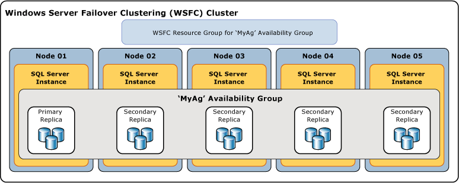

# Overview of Always On Availability Groups (SQL Server)
[!INCLUDE[appliesto-ss-xxxx-xxxx-xxx-md](../../../includes/appliesto-ss-xxxx-xxxx-xxx-md.md)]

 This topic introduces the [!INCLUDE[ssHADR](../../../includes/sshadr-md.md)] concepts that are central for configuring and managing one or more availability groups in [!INCLUDE[ssCurrent](../../../includes/sscurrent-md.md)]. For a summary of the benefits offered by availability groups and an overview of [!INCLUDE[ssHADR](../../../includes/sshadr-md.md)] terminology, see [Always On Availability Groups &#40;SQL Server&#41;](../../../database-engine/availability-groups/windows/always-on-availability-groups-sql-server.md).  
  
 An *availability group* supports a replicated environment for a discrete set of user databases, known as *availability databases*. You can create an availability group for high availability (HA) or for read-scale. An HA availability group is a group of databases that fail over together. A read-scale availability group is a group of databases that are copied to other instances of SQL Server for read-only workload. An availability group supports one set of primary databases and one to eight sets of corresponding secondary databases. Secondary databases are *not* backups. Continue to back up your databases and their transaction logs on a regular basis.  
  
> [!TIP]  
>  You can create any type of backup of a primary database. Alternatively, you can create log backups and copy-only full backups of secondary databases. For more information, see [Active Secondaries: Backup on Secondary Replicas &#40;Always On Availability Groups&#41;](../../../database-engine/availability-groups/windows/active-secondaries-backup-on-secondary-replicas-always-on-availability-groups.md).   

 Each set of availability database is hosted by an *availability replica*. Two types of availability replicas exist: a single *primary replica*. which hosts the primary databases, and one to eight *secondary replicas*, each of which hosts a set of secondary databases and serves as a potential failover targets for the availability group. An availability group fails over at the level of an availability replica. An availability replica provides redundancy only at the database level-for the set of databases in one availability group. Failovers are not caused by database issues such as a database becoming suspect due to a loss of a data file or corruption of a transaction log.  
  
 The primary replica makes the primary databases available for read-write connections from clients. The primary replica sends transaction log records of each primary database to every secondary database. This process - known as *data synchronization* - occurs at the database level. Every secondary replica caches the transaction log records (*hardens* the log) and then applies them to its corresponding secondary database. Data synchronization occurs between the primary database and each connected secondary database, independently of the other databases. Therefore, a secondary database can be suspended or fail without affecting other secondary databases, and a primary database can be suspended or fail without affecting other primary databases.  
  
 Optionally, you can configure one or more secondary replicas to support read-only access to secondary databases, and you can configure any secondary replica to permit backups on secondary databases.  

 SQL Server 2017 introduces two different architectures for availability groups. *Always On availability groups* provide high availability, disaster recovery, and read-scale balancing. These availability groups require a cluster manager. In Windows, failover clustering provides the cluster manager. In Linux, you can use Pacemaker. The other architecture is a *read-scale availability group*. A read scale availability group provides replicas for read-only workloads but not high availability. In a read-scale availability group there is no cluster manager. 
 
 Deploying [!INCLUDE[ssHADR](../../../includes/sshadr-md.md)] for HA on Windows requires a Windows Server Failover Cluster(WSFC). Each availability replica of a given availability group must reside on a different node of the same WSFC. The only exception is that while being migrated to another WSFC cluster, an availability group can temporarily straddle two clusters. 

 >[!NOTE]
 >For information about availability groups on Linux, see [Always On availability group for SQL Server on Linux](../../../linux/sql-server-linux-availability-group-overview.md). 

 In an HA configuration, a cluster role is created for every availability group that you create. The WSFC cluster monitors this role to evaluate the health of the primary replica. The quorum for [!INCLUDE[ssHADR](../../../includes/sshadr-md.md)] is based on all nodes in the WSFC cluster regardless of whether a given cluster node hosts any availability replicas. In contrast to database mirroring, there is no witness role in [!INCLUDE[ssHADR](../../../includes/sshadr-md.md)].  
  
> [!NOTE]  
>  For information about the relationship of SQL Server Always On components to the WSFC cluster, see [Windows Server Failover Clustering &#40;WSFC&#41; with SQL Server](../../../sql-server/failover-clusters/windows/windows-server-failover-clustering-wsfc-with-sql-server.md).  
  
 The following illustration shows an availability group that contains one primary replica and four secondary replicas. Up to eight secondary replicas are supported, including one primary replica and two synchronous-commit secondary replicas.  
  
   
  
##   Availability Databases  
 To add a database to an availability group, the database must be an online, read-write database that exists on the server instance that hosts the primary replica. When you add a database, it joins the availability group as a primary database, while remaining available to clients. No corresponding secondary database exists until backups of the new primary database are restored to the server instance that hosts the secondary replica (using RESTORE WITH NORECOVERY). The new secondary database is in the RESTORING state until it is joined to the availability group. For more information, see [Start Data Movement on an Always On Secondary Database &#40;SQL Server&#41;](../../../database-engine/availability-groups/windows/start-data-movement-on-an-always-on-secondary-database-sql-server.md).  
  
 Joining places the secondary database into the ONLINE state and initiates data synchronization with the corresponding primary database. *Data synchronization* is the process by which changes to a primary database are reproduced on a secondary database. Data synchronization involves the primary database sending transaction log records to the secondary database.  
  
> [!IMPORTANT]  
>  An availability database is sometimes called a *database replica* in [!INCLUDE[tsql](../../../includes/tsql-md.md)], PowerShell, and SQL Server Management Objects (SMO) names. For example, the term "database replica" is used in the names of the Always On dynamic management views that return information about availability databases:  **sys.dm_hadr_database_replica_states** and **sys.dm_hadr_database_replica_cluster_states**. However, in SQL Server Books Online, the term "replica" typically refers to availability replicas. For example, "primary replica" and "secondary replica" always refer to availability replicas.  
  
##   Availability Replicas  
 Each availability group defines a set of two or more failover partners known as availability replicas. *Availability replicas* are components of the availability group. Each availability replica hosts a copy of the availability databases in the availability group. For a given availability group, the availability replicas must be hosted by separate instances of [!INCLUDE[ssNoVersion](../../../includes/ssnoversion-md.md)] residing on different nodes of a WSFC cluster. Each of these server instances must be enabled for Always On.  
  
 A given instance can host only one availability replica per availability group. However, each instance can be used for many availability groups. A given instance can be either a stand-alone instance or a [!INCLUDE[ssNoVersion](../../../includes/ssnoversion-md.md)] failover cluster instance (FCI). If you require server-level redundancy, use Failover Cluster Instances.  
  
 Every availability replica is assigned an initial role-either the *primary role* or the *secondary role*, which is inherited by the availability databases of that replica. The role of a given replica determines whether it hosts read-write databases or read-only databases. One replica, known as the *primary replica*, is assigned the primary role and hosts read-write databases, which are known as *primary databases*. At least one other replica, known as a *secondary replica*, is assigned the secondary role. A secondary replica hosts read-only databases, known as secondary databases.  
  
> [!NOTE]  
>  When the role of an availability replica is indeterminate, such as during a failover, its databases are temporarily in a NOT SYNCHRONIZING state. Their role is set to RESOLVING until the role of the availability replica has resolved. If an availability replica resolves to the primary role, its databases become the primary databases. If an availability replica resolves to the secondary role, its databases become secondary databases.  
  
##   Availability Modes  
 The availability mode is a property of each availability replica. The availability mode determines whether the primary replica waits to commit transactions on a database until a given secondary replica has written the transaction log records to disk (hardened the log). [!INCLUDE[ssHADR](../../../includes/sshadr-md.md)] supports two availability modes-*asynchronous-commit mode* and *synchronous-commit mode*.  
  
-   **Asynchronous-commit mode**  
  
     An availability replica that uses this availability mode is known as an *asynchronous-commit replica*. Under asynchronous-commit mode, the primary replica commits transactions without waiting for acknowledgement that an asynchronous-commit secondary replica has hardened the log. Asynchronous-commit mode minimizes transaction latency on the secondary databases but allows them to lag behind the primary databases, making some data loss possible.  
  
-   **Synchronous-commit mode**  
  
     An availability replica that uses this availability mode is known as a *synchronous-commit replica*. Under synchronous-commit mode, before committing transactions, a synchronous-commit primary replica waits for a synchronous-commit secondary replica to acknowledge that it has finished hardening the log. Synchronous-commit mode ensures that once a given secondary database is synchronized with the primary database, committed transactions are fully protected. This protection comes at the cost of increased transaction latency.  
  
 For more information, see [Availability Modes &#40;Always On Availability Groups&#41;](../../../database-engine/availability-groups/windows/availability-modes-always-on-availability-groups.md).  
  
##   Types of Failover  
 Within the context of a session between the primary replica and a secondary replica, the primary and secondary roles are potentially interchangeable in a process known as *failover*. During a failover the target secondary replica transitions to the primary role, becoming the new primary replica. The new primary replica brings its databases online as the primary databases, and client applications can connect to them. When the former primary replica is available, it transitions to the secondary role, becoming a secondary replica. The former primary databases become secondary databases and data synchronization resumes.  
  
 Three forms of failover exist-automatic, manual, and forced (with possible data loss). The form or forms of failover supported by a given secondary replica depends on its availability mode, and, for synchronous-commit mode, on the failover mode on the primary replica and target secondary replica, as follows.  
  
-   Synchronous-commit mode supports two forms of failover-*planned manual failover* and *automatic failover*, if the target secondary replica is currently synchronized with the avt1. The support for these forms of failover depends on the setting of the *failover mode property* on the failover partners. If failover mode is set to "manual" on either the primary or secondary replica, only manual failover is supported for that secondary replica. If failover mode is set to "automatic" on both the primary and secondary replicas, both automatic and manual failover are supported on that secondary replica.  
  
    -   **Planned manual failover** (without data loss)  
  
         A manual failover occurs after a database administrator issues a failover command and causes a synchronized secondary replica to transition to the primary role (with guaranteed data protection) and the primary replica to transition to the secondary role. A manual failover requires that both the primary replica and the target secondary replica are running under synchronous-commit mode, and the secondary replica must already be synchronized.  
  
    -   **Automatic failover** (without data loss)  
  
         An automatic failover occurs in response to a failure that causes a synchronized secondary replica to transition to the primary role (with guaranteed data protection). When the former primary replica becomes available, it transitions to the secondary role. Automatic failover requires that both the primary replica and the target secondary replica are running under synchronous-commit mode with the failover mode set to "Automatic". In addition, the secondary replica must already be synchronized, have WSFC quorum, and meet the conditions specified by the [flexible failover policy](../../../database-engine/availability-groups/windows/flexible-automatic-failover-policy-availability-group.md)of the availability group.  
  
        > [!IMPORTANT]  
        >  SQL Server Failover Cluster Instances (FCIs) do not support automatic failover by availability groups, so any availability replica that is hosted by an FCI can only be configured for manual failover.  
  
    > [!NOTE]  
    >  Note that if you issue a forced failover command on a synchronized secondary replica, the secondary replica behaves the same as for a planned manual failover.  
  
-   Under asynchronous-commit mode, the only form of failover is forced manual failover (with possible data loss), typically called *forced failover*. Forced failover is considered a form of manual failover because it can only be initiated manually. Forced failover is a disaster recovery option. It is the only form of failover that is possible when the target secondary replica is not synchronized with the primary replica.  
  
 For more information, see [Failover and Failover Modes &#40;Always On Availability Groups&#41;](../../../database-engine/availability-groups/windows/failover-and-failover-modes-always-on-availability-groups.md).  
  
##   Client Connections  
 You can provide client connectivity to the primary replica of a given availability group by creating an availability group listener. An *availability group listener* provides a set of resources that is attached to a given availability group to direct client connections to the appropriate availability replica.  
  
 An availability group listener is associated with a unique DNS name that serves as a virtual network name (VNN), one or more virtual IP addresses (VIPs), and a TCP port number. For more information, see [Availability Group Listeners, Client Connectivity, and Application Failover &#40;SQL Server&#41;](../../../database-engine/availability-groups/windows/listeners-client-connectivity-application-failover.md).  
  
> [!TIP]  
>  If an availability group possesses only two availability replicas and is not configured to allow read-access to the secondary replica, clients can connect to the primary replica by using a [database mirroring connection string](../../../database-engine/database-mirroring/connect-clients-to-a-database-mirroring-session-sql-server.md). This approach can be useful temporarily after you migrate a database from database mirroring to [!INCLUDE[ssHADR](../../../includes/sshadr-md.md)]. Before you add additional secondary replicas, you will need to create an availability group listener the availability group and update your applications to use the network name of the listener.  
  
##   Active Secondary Replicas  
 [!INCLUDE[ssHADR](../../../includes/sshadr-md.md)] supports active secondary replicas. Active secondary capabilities include support for:  
  
-   **Performing backup operations on secondary replicas**  
  
     The secondary replicas support performing log backups and [copy-only](../../../database-engine/availability-groups/windows/active-secondaries-backup-on-secondary-replicas-always-on-availability-groups.md) backups of a full database, file, or filegroup. You can configure the availability group to specify a preference for where backups should be performed. It is important to understand that the preference is not enforced by SQL Server, so it has no impact on ad-hoc backups. The interpretation of this preference depends on the logic, if any, that you script into your back jobs for each of the databases in a given availability group. For an individual availability replica, you can specify your priority for performing backups on this replica relative to the other replicas in the same availability group. For more information, see [Active Secondaries: Backup on Secondary Replicas &#40;Always On Availability Groups&#41;](../../../database-engine/availability-groups/windows/active-secondaries-backup-on-secondary-replicas-always-on-availability-groups.md).  
  
-   **Read-only access to one or more secondary replicas (readable secondary replicas)**  
  
     Any availability replica can be configured to allow read-only access to its local databases when performing the secondary role, though some operations are not fully supported. Also, if you would like to prevent read-only workloads from running on the primary replica, you can configure the replicas to allow only read-write access when running under the primary role. For more information, see [Active Secondaries: Readable Secondary Replicas &#40;Always On Availability Groups&#41;](../../../database-engine/availability-groups/windows/active-secondaries-readable-secondary-replicas-always-on-availability-groups.md).  
  
     If an availability group currently possesses an availability group listener and one or more readable secondary replicas, [!INCLUDE[ssNoVersion](../../../includes/ssnoversion-md.md)] can route read-intent connection requests to one of them (*read-only routing*). For more information, see [Availability Group Listeners, Client Connectivity, and Application Failover &#40;SQL Server&#41;](../../../database-engine/availability-groups/windows/listeners-client-connectivity-application-failover.md).  
  
##   Session-Timeout Period  
 The session-timeout period is an availability-replica property that determines how long connection with another availability replica can remain inactive before the connection is closed. The primary and secondary replicas ping each other to signal that they are still active. Receiving a ping from the other replica during the timeout period indicates that the connection is still open and that the server instances are communicating. On receiving a ping, an availability replica resets its session-timeout counter on that connection.  
  
 The session-timeout period prevents either replica from waiting indefinitely to receive a ping from the other replica. If no ping is received from the other replica within the session-timeout period, the replica times out. Its connection is closed, and the timed-out replica enters the DISCONNECTED state. Even if a disconnected replica is configured for synchronous-commit mode, transactions will not wait for that replica to reconnect and resynchronize.  
  
 The default session-timeout period for each availability replica is 10 seconds. This value is user-configurable, with a minimum of 5 seconds. Generally, we recommend that you keep the time-out period at 10 seconds or greater. Setting the value to less than 10 seconds creates the possibility of a heavily loaded system declaring a false failure.  
  
> [!NOTE]  
>  In the resolving role, the session-timeout period does not apply because pinging does not occur.  
  
##   Automatic Page Repair  
 Each availability replica tries to automatically recover from corrupted pages on a local database by resolving certain types of errors that prevent reading a data page. If a secondary replica cannot read a page, the replica requests a fresh copy of the page from the primary replica. If the primary replica cannot read a page, the replica broadcasts a request for a fresh copy to all the secondary replicas and gets the page from the first to respond. If this request succeeds, the unreadable page is replaced by the copy, which usually resolves the error.  
  
 For more information, see [Automatic Page Repair &#40;Availability Groups: Database Mirroring&#41;](../../../sql-server/failover-clusters/automatic-page-repair-availability-groups-database-mirroring.md).  
  
##   Related Tasks  
  
-   [Getting Started with Always On Availability Groups &#40;SQL Server&#41;](../../../database-engine/availability-groups/windows/getting-started-with-always-on-availability-groups-sql-server.md)  
  
##   Related Content  
  
-   **Blogs:**  
  
     [Always On - HADRON Learning Series: Worker Pool Usage for HADRON Enabled Databases](https://blogs.msdn.com/b/psssql/archive/2012/05/17/Always%20On-hadron-learning-series-worker-pool-usage-for-hadron-enabled-databases.aspx)  
  
     [SQL Server Always On Team Blogs: The official SQL Server Always On Team Blog](https://blogs.msdn.microsoft.com/sqlalwayson/)  
  
     [CSS SQL Server Engineers Blogs](https://blogs.msdn.com/b/psssql/)  
  
-   **Videos:**  
  
     [Microsoft SQL Server Code-Named "Denali" Always On Series,Part 1: Introducing the Next Generation High Availability Solution](https://channel9.msdn.com/Events/TechEd/NorthAmerica/2011/DBI302)  
  
     [Microsoft SQL Server Code-Named "Denali" Always On Series,Part 2: Building a Mission-Critical High Availability Solution Using Always On](https://channel9.msdn.com/Events/TechEd/NorthAmerica/2011/DBI404)  
  
-   **Whitepapers:**  
  
     [Microsoft SQL Server Always On Solutions Guide for High Availability and Disaster Recovery](https://go.microsoft.com/fwlink/?LinkId=227600)  
  
     [Microsoft White Papers for SQL Server 2012](https://msdn.microsoft.com/library/hh403491.aspx)  
  
     [SQL Server Customer Advisory Team Whitepapers](https://sqlcat.com/)  
  
## See Also  
 [Availability Modes &#40;Always On Availability Groups&#41;](../../../database-engine/availability-groups/windows/availability-modes-always-on-availability-groups.md)   
 [Failover and Failover Modes &#40;Always On Availability Groups&#41;](../../../database-engine/availability-groups/windows/failover-and-failover-modes-always-on-availability-groups.md)   
 [Overview of Transact-SQL Statements for Always On Availability Groups &#40;SQL Server&#41;](../../../database-engine/availability-groups/windows/transact-sql-statements-for-always-on-availability-groups.md)   
 [Overview of PowerShell Cmdlets for Always On Availability Groups &#40;SQL Server&#41;](../../../database-engine/availability-groups/windows/overview-of-powershell-cmdlets-for-always-on-availability-groups-sql-server.md)   
 [High Availability Support for In-Memory OLTP databases](../../../relational-databases/in-memory-oltp/high-availability-support-for-in-memory-oltp-databases.md)   
 [Prerequisites, Restrictions, and Recommendations for Always On Availability Groups &#40;SQL Server&#41;](../../../database-engine/availability-groups/windows/prereqs-restrictions-recommendations-always-on-availability.md)   
 [Creation and Configuration of Availability Groups &#40;SQL Server&#41;](../../../database-engine/availability-groups/windows/creation-and-configuration-of-availability-groups-sql-server.md)   
 [Active Secondaries: Readable Secondary Replicas &#40;Always On Availability Groups&#41;](../../../database-engine/availability-groups/windows/active-secondaries-readable-secondary-replicas-always-on-availability-groups.md)   
 [Active Secondaries: Backup on Secondary Replicas &#40;Always On Availability Groups&#41;](../../../database-engine/availability-groups/windows/active-secondaries-backup-on-secondary-replicas-always-on-availability-groups.md)   
 [Availability Group Listeners, Client Connectivity, and Application Failover &#40;SQL Server&#41;](../../../database-engine/availability-groups/windows/listeners-client-connectivity-application-failover.md)  
  
   
