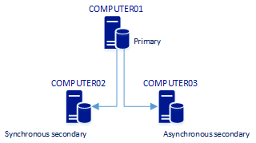
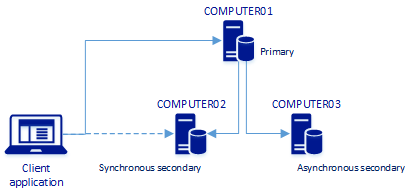
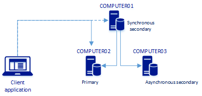

# Secondary to primary replica read/write connection redirection (Always On Availability Groups)

[!INCLUDE[appliesto](../../../includes/applies-to-version/sqlserver2019.md)]

[!INCLUDE[sssql19-md](../../../includes/sssql19-md.md)] CTP 2.0 introduces *secondary to primary replica read/write connection redirection* for Always On Availability Groups. Read/write connection redirection is available on any operating system platform. It allows client application connections to be directed to the primary replica regardless of the target server specified in the connections string. 

For  example, the connection string can target a secondary replica. Depending on the configuration of the availability group (AG) replica and the settings in the connection string, the connection can be automatically redirected to the primary replica. 

## Use cases

Prior to [!INCLUDE[sssql19-md](../../../includes/sssql19-md.md)], the AG listener and the corresponding cluster resource redirect user traffic to the primary replica to ensure reconnection after failover. [!INCLUDE[sssql19-md](../../../includes/sssql19-md.md)] continues to support the AG listener functionality and adds replica connection redirection for scenarios that cannot include a listener. For example:

* The cluster technology that SQL Server availability groups integrates with does not offer a listener like capability 
* A multi-subnet configuration like in the cloud or multi-subnet floating IP with Pacemaker where configurations become complex, prone to errors, and difficult to troubleshoot due to multiple components involved
* Read scale-out, or disaster recovery and cluster type is `NONE`, because there is no straightforward mechanism to ensure transparent reconnection upon manual failover

## Requirement

In order for a secondary replica to redirect read/write connection requests:
* The secondary replica must be online. 
* The replica spec `PRIMARY_ROLE` must include `READ_WRITE_ROUTING_URL`.
* The connection string must be `ReadWrite` either by defining `ApplicationIntent` as `ReadWrite` or by not setting `ApplicationIntent` and letting the default (`ReadWrite`) take effect.

## Set READ_WRITE_ROUTING_URL option

To configure read/write connection redirection, set `READ_WRITE_ROUTING_URL` for the primary replica when you create the AG. 

In [!INCLUDE[sssql19-md](../../../includes/sssql19-md.md)], `READ_WRITE_ROUTING_URL` has been added to the `<add_replica_option>` specification. See the following topics: 

* [CREATE AVAILABILITY GROUP](../../../t-sql/statements/create-availability-group-transact-sql.md)
* [ALTER AVAILABILITY GROUP](../../../t-sql/statements/alter-availability-group-transact-sql.md)


### PRIMARY_ROLE(READ_WRITE_ROUTING_URL) not set (default) 

By default, read/write replica connection redirection is not set for a replica. The way a secondary replica handles connection requests depends on whether or not the secondary replica is set to allow connections and on the `ApplicationIntent` setting in the connection string. The following table shows how a secondary replica handles connections based on `SECONDARY_ROLE (ALLOW CONNECTIONS = )` and `ApplicationIntent`.

|<code>ApplicationIntent</code> value|<code>SECONDARY_ROLE (ALLOW CONNECTIONS = NO)</code>|<code>SECONDARY_ROLE (ALLOW CONNECTIONS = READ_ONLY)</code>|<code>SECONDARY_ROLE (ALLOW CONNECTIONS = ALL)</code>|
|-----|-----|-----|-----|
|`ApplicationIntent=ReadWrite`<br/> Default|Connections fail|Connections fail|Connections succeed<br/>Reads succeed<br/>Writes fail|
|`ApplicationIntent=ReadOnly`|Connections fail|Connections succeed|Connections succeed

The preceding table shows the default behavior, which is the same as versions of SQL Server before [!INCLUDE[sssql19-md](../../../includes/sssql19-md.md)]. 

### PRIMARY_ROLE(READ_WRITE_ROUTING_URL) set 

After you set read/write connection redirection, the way the replica handles connection requests behaves differently. The connection behavior still depends on `SECONDARY_ROLE (ALLOW CONNECTIONS = )` and `ApplicationIntent` setting. The following table shows how a secondary replica with `READ_WRITE_ROUTING` set handles connections based on `SECONDARY_ROLE (ALLOW CONNECTIONS = )` and `ApplicationIntent`.

|<code>ApplicationIntent</code> value|<code>SECONDARY_ROLE (ALLOW CONNECTIONS = NO)</code>|<code>SECONDARY_ROLE (ALLOW CONNECTIONS = READ_ONLY)</code>|<code>SECONDARY_ROLE (ALLOW CONNECTIONS = ALL)</code>|
|-----|-----|-----|-----|
|`ApplicationIntent=ReadWrite`<br/>Default|Connections fail|Connections fail|Connections route to primary|
|`ApplicationIntent=ReadOnly`|Connections fail|Connections succeed|Connections succeed

The preceding table shows that when the primary replica has `READ_WRITE_ROUTING_URL` set, the secondary replica will redirect connections to the primary replica when `SECONDARY_ROLE (ALLOW CONNECTIONS = ALL)`, and the connection specifies `ReadWrite`.

## Example 

In this example, an availability group has three replicas:
* A primary replica on COMPUTER01
* A synchronous secondary replica on COMPUTER02
* A asynchronous secondary replica on COMPUTER03

The following picture represents the availability group.



The following transact-SQL script creates this AG. In this example, Each replica specifies the `READ_WRITE_ROUTING_URL`.
```sql
CREATE AVAILABILITY GROUP MyAg   
     WITH ( CLUSTER_TYPE =  NONE )  
   FOR   
     DATABASE  [<Database1>]   
   REPLICA ON   
      'COMPUTER01' WITH   
         (  
         ENDPOINT_URL = 'TCP://COMPUTER01.<domain>.<tld>:5022',  
         AVAILABILITY_MODE = SYNCHRONOUS_COMMIT,  
         FAILOVER_MODE = MANUAL,  
         SECONDARY_ROLE (ALLOW_CONNECTIONS = ALL,   
            READ_ONLY_ROUTING_URL = 'TCP://COMPUTER01.<domain>.<tld>:1433' ),
         PRIMARY_ROLE (ALLOW_CONNECTIONS = READ_WRITE,   
            READ_ONLY_ROUTING_LIST = ('COMPUTER02', 'COMPUTER03'),
            READ_WRITE_ROUTING_URL = 'TCP://COMPUTER01.<domain>.<tld>:1433' ),   
         SESSION_TIMEOUT = 10  
         ),   
      'COMPUTER02' WITH   
         (  
         ENDPOINT_URL = 'TCP://COMPUTER02.<domain>.<tld>:5022',  
         AVAILABILITY_MODE = SYNCHRONOUS_COMMIT,  
         FAILOVER_MODE = MANUAL, 
         SECONDARY_ROLE (ALLOW_CONNECTIONS = ALL,   
            READ_ONLY_ROUTING_URL = 'TCP://COMPUTER02.<domain>.<tld>:1433' ),  
         PRIMARY_ROLE (ALLOW_CONNECTIONS = READ_WRITE,   
            READ_ONLY_ROUTING_LIST = ('COMPUTER01', 'COMPUTER03'),  
            READ_WRITE_ROUTING_URL = 'TCP://COMPUTER02.<domain>.<tld>:1433' ),
         SESSION_TIMEOUT = 10  
         ),   
      'COMPUTER03' WITH   
         (  
         ENDPOINT_URL = 'TCP://COMPUTER03.<domain>.<tld>:5022',  
         AVAILABILITY_MODE = ASYNCHRONOUS_COMMIT,  
         FAILOVER_MODE = MANUAL,  
         SECONDARY_ROLE (ALLOW_CONNECTIONS = ALL,   
            READ_ONLY_ROUTING_URL = 'TCP://COMPUTER03.<domain>.<tld>:1433' ),  
         PRIMARY_ROLE (ALLOW_CONNECTIONS = READ_WRITE,   
            READ_ONLY_ROUTING_LIST = ('COMPUTER01', 'COMPUTER02'),  
            READ_WRITE_ROUTING_URL = 'TCP://COMPUTER03.<domain>.<tld>:1433' ),
         SESSION_TIMEOUT = 10  
         );
GO  
```
   - `<domain>.<tld>`
      - Domain and top-level domain of the fully qualified domain name. For example, `corporation.com`.


### Connection behaviors

In the following diagram, a client application connects to COMPUTER02, with `ApplicationIntent=ReadWrite`. The connection is redirected to the primary replica. 



The secondary replica redirects read/write calls to the primary replica. A read write connection to either replica will redirect to the primary replica. 

In the following diagram, the primary replica has been manually failed over to COMPUTER02. A client application connects to COMPUTER01, with `ApplicationIntent=ReadWrite`. The connection is redirected to the primary replica. 



## See Also

[Overview of Always On Availability Groups &#40;SQL Server&#41;](../../../database-engine/availability-groups/windows/overview-of-always-on-availability-groups-sql-server.md)   
 
[About Client Connection Access to Availability Replicas &#40;SQL Server&#41;](../../../database-engine/availability-groups/windows/about-client-connection-access-to-availability-replicas-sql-server.md)   

[Availability Group Listeners, Client Connectivity, and Application Failover &#40;SQL Server&#41;](../../../database-engine/availability-groups/windows/listeners-client-connectivity-application-failover.md)
