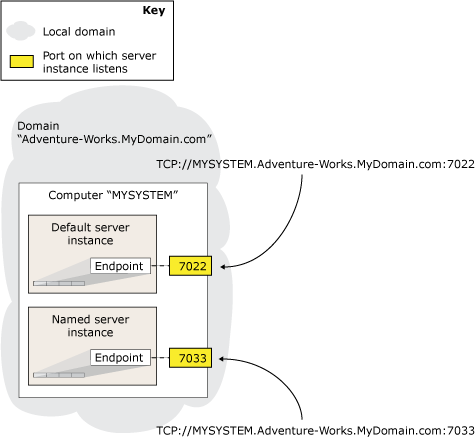

# Specify Endpoint URL - Adding or Modifying Availability Replica
[!INCLUDE [SQL Server](../../../includes/applies-to-version/sqlserver.md)]
  To host an availability replica for an availability group, a server instance must possess a database mirroring endpoint. The server instance uses this endpoint to listen for [!INCLUDE[ssHADR](../../../includes/sshadr-md.md)] messages from availability replicas hosted by other server instances. To define an availability replica for an availability group, you must specify the endpoint URL of the server instance that will host the replica. The *endpoint URL* identifies the transport protocol of the database mirroring endpoint-TCP, the system address of the server instance, and the port number associated with the endpoint.  
  
> [!NOTE]  
>  The term "endpoint URL" is synonymous with the term "server network address" used by the database mirroring user interface and documentation.  
  
  
##  <a name="SyntaxOfURL"></a> Syntax for an Endpoint URL  
 The syntax for an endpoint URL is of the form:  
  
 TCP<strong>://</strong>*\<system-address>*<strong>:</strong>*\<port>*  
  
 where  
  
-   *\<system-address>* is a string that unambiguously identifies the target computer system. Typically, the server address is a system name (if the systems are in the same domain), a fully qualified domain name, or an IP address:  
  
    -   Because the nodes of Windows Server Failover Clustering (WSFC) cluster are the same domain, you can use the name of the computer system; for example, `SYSTEM46`.  
  
    -   To use an IP address, it must be unique in your environment. We recommend that you use an IP address only if it is static. The IP address can be IP Version 4 (IPv4) or IP Version 6 (IPv6). An IPv6 address must be enclosed within square brackets, for example: **[**_<IPv6_address>_**]**.  
  
         To learn the IP address of a system, at the Windows command prompt, enter the **ipconfig** command.  
  
    -   The fully qualified domain name is guaranteed to work. This is a locally defined address string that takes different forms in different places. Often, but not always, a fully qualified domain name is a compound name that includes the computer name and a series of period-separated domain segments of the form:  
  
         _computer_name_ **.** _domain_segment_[...**.**_domain_segment_]  
  
         where *computer_name i*s the network name of the computer running the server instance, and *domain_segment*[...**.**_domain_segment_] is the remaining domain information of the server; for example: `localinfo.corp.Adventure-Works.com`.  
  
         The content and number of domain segments are determined within the company or organization. For more information, see [Finding the Fully Qualified Domain Name](#Finding_FQDN), later in this topic.  
  
-   *\<port>* is the port number used by the mirroring endpoint of the partner server instance.  
  
     A database mirroring endpoint can use any available port on the computer system. Each port number must be associated with only one endpoint, and each endpoint is associated with a single server instance; thus, different server instances on the same server listen on different endpoints with different ports. Therefore, the port you specify in the endpoint URL when you specify an availability replica will always direct incoming messages to the server instance whose endpoint is associated with that port.  
  
     IIn the endpoint URL, only the number of the port identifies the server instance that is associated with the mirroring endpoint on the target computer. The following figure illustrates the endpoint URLs of two server instances on a single computer. The default instance uses port `7022` and the named instance uses port `7033`. The endpoint URL for these two server instances are, respectively: `TCP://MYSYSTEM.Adventure-works.MyDomain.com:7022` and `TCP://MYSYSTEM.Adventure-works.MyDomain.com:7033`. Note that the address does not contain the name of the server instance.  
  
       
  
     To identify the port currently associated with database mirroring endpoint of a server instance, use the following [!INCLUDE[tsql](../../../includes/tsql-md.md)] statement:  
  
    ```  
    SELECT type_desc, port FROM sys.TCP_endpoints  
    ```  
  
     Find the row whose **type_desc** value is "DATABASE_MIRRORING," and use the corresponding port number.  
  
### Examples  
  
#### A. Using a system name  
 The following endpoint URL specifies a system name, `SYSTEM46`, and port `7022`.  
  
 `TCP://SYSTEM46:7022`  
  
#### B. Using a fully qualified domain name  
 The following endpoint URL specifies a fully qualified domain name, `DBSERVER8.manufacturing.Adventure-Works.com`, and port `7024`.  
  
 `TCP://DBSERVER8.manufacturing.Adventure-Works.com:7024`  
  
#### C. Using IPv4  
 The following endpoint URL specifies an IPv4 address, `10.193.9.134`, and port `7023`.  
  
 `TCP://10.193.9.134:7023`  
  
#### D. Using IPv6  
 The following endpoint URL contains an IPv6 address, `2001:4898:23:1002:20f:1fff:feff:b3a3`, and port `7022`.  
  
 `TCP://[2001:4898:23:1002:20f:1fff:feff:b3a3]:7022`  
  
##  <a name="Finding_FQDN"></a> Finding the Fully Qualified Domain Name of A System  
 To find the fully qualified domain name of a system, at the Windows command prompt on that system, enter:  
  
 **IPCONFIG /ALL**  
  
 To form the fully qualified domain name, concatenate the values of*<host_name>* and *<Primary_Dns_Suffix>* as follows:  
  
 _<host_name>_ **.** _<Primary_Dns_Suffix>_  
  
 For example, the IP configuration  
  
 `Host Name  .  .  .  .  .  .  : MYSERVER`  
  
 `Primary Dns Suffix  .  .  .  : mydomain.Adventure-Works.com`  
  
 equates to the following fully qualified domain name:  
  
 `MYSERVER.mydomain.Adventure-Works.com`  
  
> [!NOTE]  
>  If you need more information about a fully qualified domain name, see your system administrator.  
  
##  <a name="RelatedTasks"></a> Related Tasks  
 **To Configure a Database Mirroring Endpoint**  
  
-   [Create a Database Mirroring Endpoint for Always On Availability Groups &#40;SQL Server PowerShell&#41;](../../../database-engine/availability-groups/windows/database-mirroring-always-on-availability-groups-powershell.md)  
  
-   [Create a Database Mirroring Endpoint for Windows Authentication &#40;Transact-SQL&#41;](../../../database-engine/database-mirroring/create-a-database-mirroring-endpoint-for-windows-authentication-transact-sql.md)  
  
-   [Use Certificates for a Database Mirroring Endpoint &#40;Transact-SQL&#41;](../../../database-engine/database-mirroring/use-certificates-for-a-database-mirroring-endpoint-transact-sql.md)  
  
    -   [Allow a Database Mirroring Endpoint to Use Certificates for Outbound Connections &#40;Transact-SQL&#41;](../../../database-engine/database-mirroring/database-mirroring-use-certificates-for-outbound-connections.md)  
  
    -   [Allow a Database Mirroring Endpoint to Use Certificates for Inbound Connections &#40;Transact-SQL&#41;](../../../database-engine/database-mirroring/database-mirroring-use-certificates-for-inbound-connections.md)  
  
-   [Specify a Server Network Address &#40;Database Mirroring&#41;](../../../database-engine/database-mirroring/specify-a-server-network-address-database-mirroring.md)  
  
-   Specify the Endpoint URL When Adding or Modifying an Availability Replica (SQL Server)  
  
-   [Troubleshoot Always On Availability Groups Configuration &#40;SQL Server&#41;](../../../database-engine/availability-groups/windows/troubleshoot-always-on-availability-groups-configuration-sql-server.md)  
  
 **To View Information About the Database Mirroring Endpoint**  
  
-   [sys.database_mirroring_endpoints &#40;Transact-SQL&#41;](../../../relational-databases/system-catalog-views/sys-database-mirroring-endpoints-transact-sql.md)  
  
 **To add an availability replica**  
  
-   [Add a Secondary Replica to an Availability Group &#40;SQL Server&#41;](../../../database-engine/availability-groups/windows/add-a-secondary-replica-to-an-availability-group-sql-server.md)  
  
-   [Join a Secondary Replica to an Availability Group &#40;SQL Server&#41;](../../../database-engine/availability-groups/windows/join-a-secondary-replica-to-an-availability-group-sql-server.md)  
  
##  <a name="RelatedContent"></a> Related Content  
  
-   [Microsoft SQL Server Always On Solutions Guide for High Availability and Disaster Recovery](/previous-versions/sql/sql-server-2012/hh781257(v=msdn.10))  
  
## See Also  
 [Creation and Configuration of Availability Groups &#40;SQL Server&#41;](../../../database-engine/availability-groups/windows/creation-and-configuration-of-availability-groups-sql-server.md)   
 [Overview of Always On Availability Groups &#40;SQL Server&#41;](../../../database-engine/availability-groups/windows/overview-of-always-on-availability-groups-sql-server.md)   
 [CREATE ENDPOINT &#40;Transact-SQL&#41;](../../../t-sql/statements/create-endpoint-transact-sql.md)  
  
