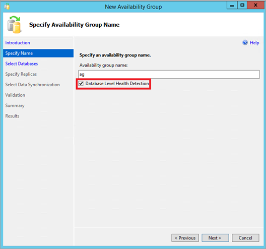
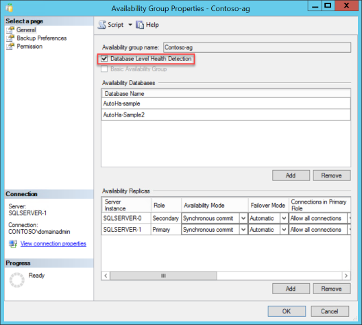

# Availability group database level health detection failover option
[!INCLUDE[appliesto-ss-xxxx-xxxx-xxx-md](../../../includes/appliesto-ss-xxxx-xxxx-xxx-md.md)]
Starting in SQL Server 2016, database level health detection (DB_FAILOVER) option is available when configuring an Always On availability group. The database level health detection notices when a database is no longer in the online status, when something goes wrong, and will trigger the automatic failover of the availability group.

The database level health detection is enabled for the availability group as a whole, therefore database level health detection monitors every database in the availability group. It cannot be enabled selectively for specific databases in the availability group.

## Benefits of database level health detection option
---
The availability group database level health detection option is widely recommended as a good option to help guarantee the high availability for your databases. You should consider turning it on for all availability groups. If your application depends on several databases to be highly available, group them into an availability group with the database health option turned on.

For example, with database level health detection option on, if SQL Server was unable to write to the transaction log file for one of the databases, the status of that database would change to indicate failure, and the availability group would soon fail over, and your application could reconnect and continue working with minimal interruption once the databases are online again.

Enabling database level health detection
----
Though it is generally recommended, the Database Health option is **off by default**, in effort to keep backward compatibility with the default settings in prior versions.

There are several easy ways to enable database level health detection setting:

1. In SQL Server Management Studio, connect to your SQL Server database engine. Using the Object Explorer window, right click on the AlwaysOn High Availability node, and run the **New Availability Group Wizard**. Check the **Database Level Health Detection** checkbox on the Specify Name page. Then complete the rest of the pages in the wizard.

   

2. View the **Properties** of an existing Availability Group in SQL Server Management Studio. Connect to your SQL Server. Using the Object Explorer window, expand AlwaysOn High Availability node. Expand Availability Groups. Right click on the availability group, and choose Properties. Check the option **Database Level Health Detection**, then click OK or Script the change.

   


3. Transact-SQL Syntax to **CREATE AVAILABILITY GROUP**. The DB_FAILOVER parameter accepts values ON or OFF.

   ```Transact-SQL
   CREATE AVAILABILITY GROUP [Contoso-ag]
   WITH (DB_FAILOVER=ON)
   FOR DATABASE [AutoHa-Sample]
   REPLICA ON
       N'SQLSERVER-0' WITH (ENDPOINT_URL = N'TCP://SQLSERVER-0.DOMAIN.COM:5022',
         FAILOVER_MODE = AUTOMATIC, AVAILABILITY_MODE = SYNCHRONOUS_COMMIT),
       N'SQLSERVER-1' WITH (ENDPOINT_URL = N'TCP://SQLSERVER-1.DOMAIN.COM:5022',
        FAILOVER_MODE = AUTOMATIC, AVAILABILITY_MODE = SYNCHRONOUS_COMMIT);
    ```

4. Transact-SQL Syntax to **ALTER AVAILABILITY GROUP**. The DB_FAILOVER parameter accepts values ON or OFF.

   ```Transact-SQL
   ALTER AVAILABILITY GROUP [Contoso-ag] SET (DB_FAILOVER = ON);

   ALTER AVAILABILITY GROUP [Contoso-ag] SET (DB_FAILOVER = OFF);
   ```

### Caveats

It is important to note that the Database Level Heath Detection option currently does not cause SQL Server to monitor disk uptime and SQL Server does not directly monitor database file availability. Should a disk drive fail or become unavailable, that alone will not necessarily trigger the availability group to automatically failover.

As an example, when a database is idle with no active transactions, and with no physical writes occurring, should some of the database files become inaccessible, SQL Server may not do any read or write IO to the files, and may not change the status for that database immediately, so no failover would be triggered. Later, when a database checkpoint occurs, or a physical read or write occurs for fulfilling a query, then SQL Server may then notice the file issue, and react by changing the database status, and subsequently the availability group with database level health detection set on would failover due to the database health change.

As another example, when the SQL Server database engine needs to read a data page to fulfill a query, if the data page is cached in the buffer pool memory, then no disk read with physical access may be required to fulfill the query request. Therefore, a missing or unavailable data file may not immediately trigger an automatic failover even when database health option is enabled, since database status is not immediately.


## Database failover is separate from flexible failover policy
Database level health detection implements a flexible failover policy which configures the thresholds of the SQL Server process health for failover policy. The database level health detection is configured using the DB_FAILOVER parameter, whereas the availability group option FAILURE_CONDITION_LEVEL is separate for configuring SQL Server process health detection. The two options are independent.

## Managing and monitoring database level health detection

### Dynamic Management Views

The system DMV sys.availability_groups shows a column db_failover which indicates if the database level health detection option is off (0) or on (1).

```Transact-SQL
select name, db_failover from sys.availability_groups
```


Example dmv output:

name  |  db_failover
---------|---------
| Contoso-ag |	1  |

### ErrorLog
The SQL Server Errorlog (or text from sp_readerrorlog) will show the error message 41653 when an availability group has failed over, due to the database level health detection checks.

For example, this errorlog excerpt shows that a transaction log write had failed due to a disk issue, and subsequently the database named AutoHa-Sample was shutdown, which triggered the database level health detection to failover the availability group.

>2016-04-25 12:20:21.08 spid1s      Error: 17053, Severity: 16, State: 1.
>
>2016-04-25 12:20:21.08 spid1s      SQLServerLogMgr::LogWriter: Operating system error 21(The device is not ready.) encountered.
>2016-04-25 12:20:21.08 spid1s      Write error during log flush.
>
>2016-04-25 12:20:21.08 spid79      Error: 9001, Severity: 21, State: 4.
>
>2016-04-25 12:20:21.08 spid79      The log for database 'AutoHa-Sample' is not available. Check the event log for related error messages. Resolve any errors and restart the database.
>
>**2016-04-25 12:20:21.15 spid79      Error: 41653, Severity: 21, State: 1.**
>
>**2016-04-25 12:20:21.15 spid79      Database 'AutoHa-Sample' encountered an error (error type: 2 'DB_SHUTDOWN') causing failure of the availability group 'Contoso-ag'.  Refer to the SQL Server error log for information about the errors that were encountered.  If this condition persists, contact the system administrator.**
>
>2016-04-25 12:20:21.17 spid79      State information for database 'AutoHa-Sample' - Hardened Lsn: '(34:664:1)'    Commit LSN: '(34:656:1)'    Commit Time: 'Apr 25 2016 12:19PM'
>
>2016-04-25 12:20:21.19 spid15s     Always On Availability Groups connection with secondary database terminated for primary database 'AutoHa-Sample' on the availability replica 'SQLServer-0' with Replica ID: {c4ad5ea4-8a99-41fa-893e-189154c24b49}. This is an informational message only. No user action is required.
>
>2016-04-25 12:20:21.21 spid75      Always On: The local replica of availability group 'Contoso-ag' is preparing to transition to the resolving role in response to a request from the Windows Server Failover Clustering (WSFC) cluster. This is an informational message only. No user action is required.
>
>2016-04-25 12:20:21.21 spid75      The state of the local availability replica in availability group 'ag' has changed from 'PRIMARY_NORMAL' to 'RESOLVING_NORMAL'.  The state changed because the availability group is going offline.  The replica is going offline because the associated availability group has been deleted, or the user has taken the associated availability group offline in Windows Server Failover Clustering (WSFC) management console, or the availability group is failing over to another SQL Server instance.  For more information, see the SQL Server error log, Windows Server Failover Clustering (WSFC) management console, or WSFC log.

### Extended Event sqlserver.availability_replica_database_fault_reporting

There is a new Extended Event defined starting in SQL Server 2016 that is triggered by database level health detection.  The event name is **sqlserver.availability_replica_database_fault_reporting**

This XEvent is triggered on the primary replica only. This XEvent is triggered when database level health issue is detected for a database hosted in an availability group.

Here is a example to create an XEvent session that captures this event. As no path is specified, the XEvent output file should be located in the default SQL Server error log path. Execute this on the primary replica of your availability group:

Example Extended Event Session Script
```
CREATE EVENT SESSION [AlwaysOn_dbfault] ON SERVER
ADD EVENT sqlserver.availability_replica_database_fault_reporting
ADD TARGET package0.event_file(SET filename=N'dbfault.xel',max_file_size=(5),max_rollover_files=(4))
WITH (MAX_MEMORY=4096 KB,EVENT_RETENTION_MODE=ALLOW_SINGLE_EVENT_LOSS,MAX_DISPATCH_LATENCY=30 SECONDS,
    MAX_EVENT_SIZE=0 KB,MEMORY_PARTITION_MODE=NONE,TRACK_CAUSALITY=OFF,STARTUP_STATE=ON)
GO
ALTER EVENT SESSION AlwaysOn_dbfault ON SERVER STATE=START
GO
```

#### Extended Event Output
Using SQL Server Management Studio, connect to the primary SQL Server, and expand the Management node, then expand Extended Events. Locate the session (AlwaysOn_dbfault was the name in the sample above) and expand it to see the output files. Click on the output file and the event file will open into a new tab.

Explanation of the fields:

|Column Data	| Description
|---------|---------
|availability_group_id	|The ID of the availability group.
|availability_group_name	|The name of the availability group.
|availability_replica_id	|The ID of the availability replica.
|availability_replica_name	|The name of the availability replica.
|database_name	|The name of the database reporting the fault.
|database_replica_id	|The ID of the availability replica database.
|failover_ready_replicas	|The number of automatic failover secondary replicas that are synchronized.
|fault_type 	| The fault id reported. Possible values:  <br/> 0 - NONE <br/>1 - Unknown<br/>2 - Shutdown
|is_critical	| This  value should always return true for the XEvent as of SQL Server 2016.


In this example output, the fault_type shows that a critical event happened on the availability group Contoso-ag, on replica named SQLSERVER-1, due to database name AutoHa-Sample2, with fault type 2- Shutdown.

|Field  | Value
|---------|---------
|availability_group_id |	24E6FE58-5EE8-4C4E-9746-491CFBB208C1
|availability_group_name |	Contoso-ag
|availability_replica_id	| 3EAE74D1-A22F-4D9F-8E9A-DEFF99B1F4D1
|availability_replica_name |	SQLSERVER-1
|database_name |	AutoHa-Sample2
|database_replica_id | 39971379-8161-4607-82E7-098590E5AE00
|failover_ready_replicas |	1
|fault_type |	2
|is_critical	| True


### Related References

* [CREATE AVAILABILITY GROUP](../../../t-sql/statements/create-availability-group-transact-sql.md)

* [ALTER AVAILABILITY GROUP](../../../t-sql/statements/alter-availability-group-transact-sql.md)

* [Flexible Failover Policy for Automatic Failover of an Availability Group (SQL Server)](../../../database-engine/availability-groups/windows/flexible-automatic-failover-policy-availability-group.md)

* [Enhance AlwaysOn Failover Policy to Test SQL Server Database Data and Log Drives](https://blogs.msdn.microsoft.com/alwaysonpro/2016/01/14/enhance-alwayson-failover-policy-to-test-sql-server-database-data-and-log-drives/)

* [Extended Events](../../../relational-databases/extended-events/extended-events.md)


