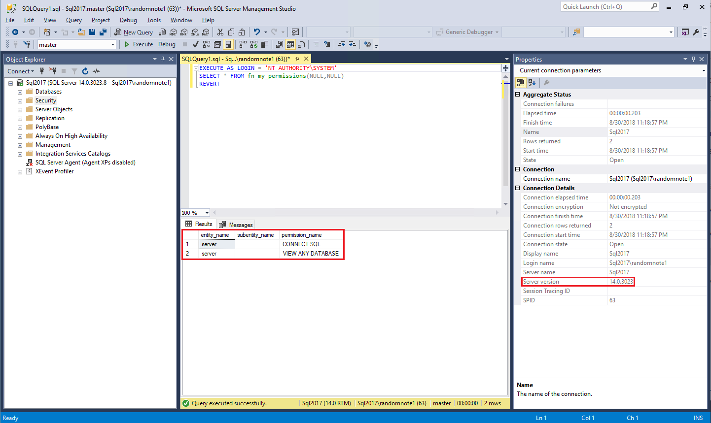
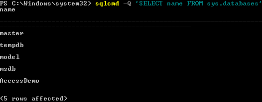
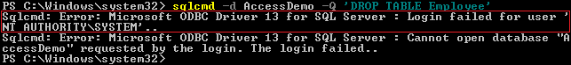
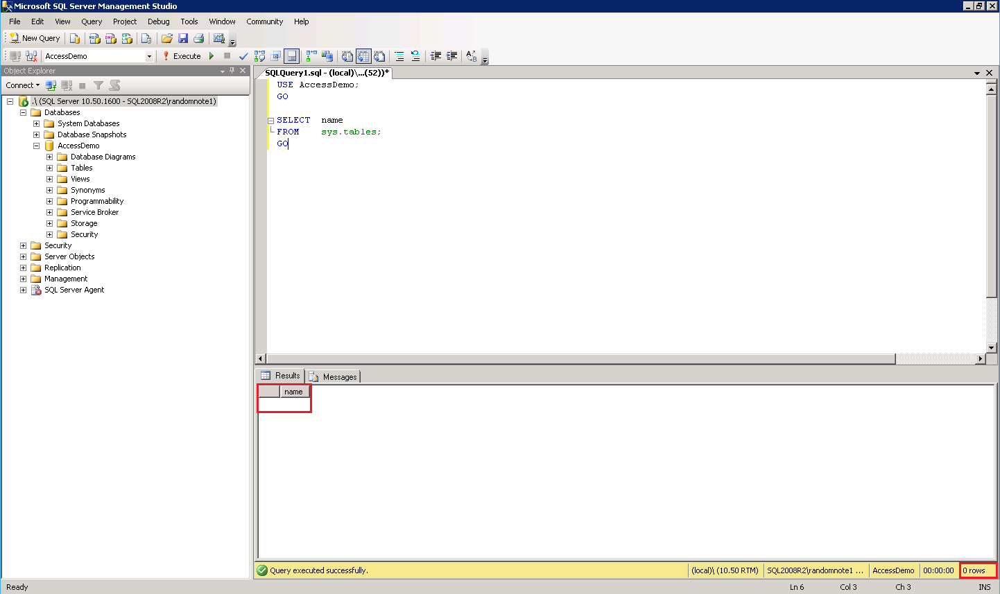
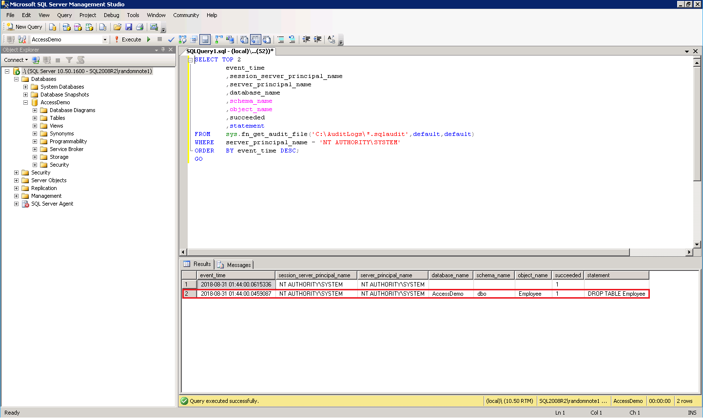
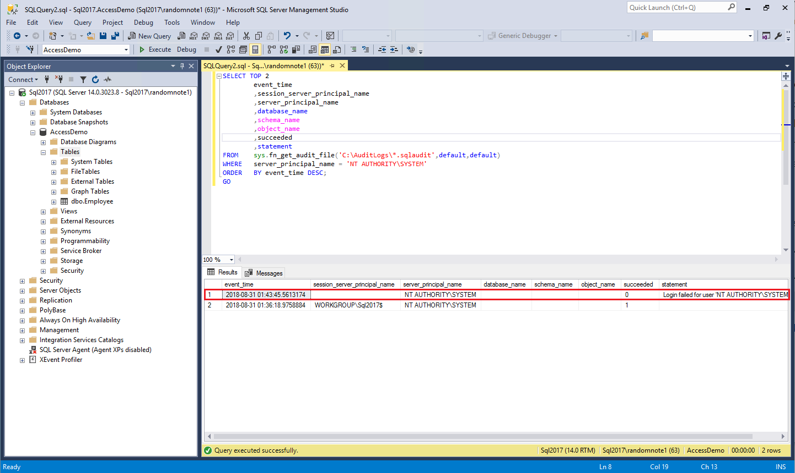

# SYSTEM Permissions in SQL Server

Okay folks, we need to have a conversation about [SYSTEM](https://msdn.microsoft.com/en-us/library/windows/desktop/ms684190(v=vs.85).aspx) permissions in SQL Server. SYSTEM is constantly over-permissioned in SQL Server . Some of the reasons given for why SYSTEM is over-permissioned are:

- My backup application runs as SYSTEM and needs to log into SQL.
- This application or service runs as SYSTEM and needs access to SQL.
- Windows Server Failover Clustering (WSFC) needs access to SQL, therefore I need to grant SYSTEM access.
- Always On Availability Groups use WSFC, therefore SYSTEM requires access to SQL.

While these reasons are legitimate, there are better ways to grant permissions. This article will discuss what SYSTEM is, why granting SYSTEM additional permissions in SQL Server is bad, and the appropriate methods to grant permission to system resources.

## What is SYSTEM

[SYSTEM](https://msdn.microsoft.com/en-us/library/windows/desktop/ms684190) (NT AUTHORITY\SYSTEM in en-us) is the account the operating system runs as. Any process that is executed as SYSTEM is running in the highest level permissions that can be granted.

## The History of SYSTEM in SQL Server

Prior to SQL Server 2012, SYSTEM was a member of the sysadmin server-level role. SQL Server 2012 introduced drastic changes to the permissions granted to SYSTEM. SYSTEM has the following permissions and group memberships in SQL Server version 2012 through current (SQL 2017 as of this writing):

- Server Role Memberships
  - public
- Server Permission Grants
  - Alter any availability group
  - Connect SQL
  - View Server State

As you can see, the only changes SYSTEM can make in SQL is to Availability Groups. This is far more restrictive than it used to be.

## Why Were the Permissions Changed

A large portion of the running processes on a server are executing with SYSTEM as the owner. When a process is executing as SYSTEM, the process can do anything on the server.

Members of the Local Administrators group can easily configure workloads to execute as SYSTEM. Some examples include [Services](https://msdn.microsoft.com/en-us/library/windows/desktop/ms685141), [Scheduled Tasks](https://msdn.microsoft.com/en-us/library/windows/desktop/aa383614), and utilities like [PsExec](https://docs.microsoft.com/en-us/sysinternals/downloads/psexec). An Administrator could unintentionally or intentionally configure a rogue workload to execute as SYSTEM.

When a workload is running as SYSTEM, it is difficult (if not impossible) to trace the actions taken by SYSTEM back to the workload because all the actions show they were run as SYSTEM in the audit logs.

## Demos

The following demos will demonstrate the permissions differences between SQL Server 2008 R2 and SQL Server 2017.

### Setup

The following items were used in the demos:

- A SQL Server 2017 Instance. I spun up a VM in Azure using the [SQL Server 2017](https://azuremarketplace.microsoft.com/en-us/marketplace/apps/Microsoft.SQLServer2017EnterpriseWindowsServer2016) template from the [Azure Marketplace](https://azuremarketplace.microsoft.com/en-us/marketplace).
- A SQL Server 2008 R2 Instance. I used the [Windows Server 2008 R2 SP1](https://azuremarketplace.microsoft.com/en-us/marketplace/apps/Microsoft.WindowsServe) template from the [Azure Marketplace](https://azuremarketplace.microsoft.com/en-us/marketplace) and installed SQL Server 2008 R2 RTM.
- Configure a [SQL Server Audit](#sql-server-audit) on both instances.
- Obtain a copy of [PsExec64](https://docs.microsoft.com/en-us/sysinternals/downloads/psexec).

### SQL Server Audit

The following query can be used to create a server audit and specify which events to log. Ensure the SQL Server service has full control to the audit log directory.

```SQL
USE [master]
GO

CREATE SERVER AUDIT [TestAudit]
TO FILE
(
    FILEPATH = N'C:\AuditLogs'
    ,MAXSIZE = 20 MB
    ,MAX_ROLLOVER_FILES = 10
    ,RESERVE_DISK_SPACE = OFF
)
WITH
(
    QUEUE_DELAY = 1000
    ,ON_FAILURE = CONTINUE
)

CREATE SERVER AUDIT SPECIFICATION [TestAuditSpecification]
FOR SERVER AUDIT [TestAudit]
    ADD (APPLICATION_ROLE_CHANGE_PASSWORD_GROUP),
    ADD (AUDIT_CHANGE_GROUP),
    ADD (BACKUP_RESTORE_GROUP),
    ADD (DATABASE_CHANGE_GROUP),
    ADD (DATABASE_OBJECT_CHANGE_GROUP),
    ADD (DATABASE_OBJECT_OWNERSHIP_CHANGE_GROUP),
    ADD (DATABASE_OBJECT_PERMISSION_CHANGE_GROUP),
    ADD (DATABASE_OPERATION_GROUP),
    ADD (DATABASE_OWNERSHIP_CHANGE_GROUP),
    ADD (DATABASE_PERMISSION_CHANGE_GROUP),
    ADD (DATABASE_PRINCIPAL_CHANGE_GROUP),
    ADD (DATABASE_PRINCIPAL_IMPERSONATION_GROUP),
    ADD (DATABASE_ROLE_MEMBER_CHANGE_GROUP),
    ADD (DBCC_GROUP),
    ADD (FAILED_LOGIN_GROUP),
    ADD (LOGIN_CHANGE_PASSWORD_GROUP),
    ADD (LOGOUT_GROUP),
    ADD (SCHEMA_OBJECT_ACCESS_GROUP),
    ADD (SCHEMA_OBJECT_CHANGE_GROUP),
    ADD (SCHEMA_OBJECT_OWNERSHIP_CHANGE_GROUP),
    ADD (SCHEMA_OBJECT_PERMISSION_CHANGE_GROUP),
    ADD (SERVER_OBJECT_CHANGE_GROUP),
    ADD (SERVER_OBJECT_OWNERSHIP_CHANGE_GROUP),
    ADD (SERVER_OBJECT_PERMISSION_CHANGE_GROUP),
    ADD (SERVER_OPERATION_GROUP),
    ADD (SERVER_PERMISSION_CHANGE_GROUP),
    ADD (SERVER_PRINCIPAL_CHANGE_GROUP),
    ADD (SERVER_PRINCIPAL_IMPERSONATION_GROUP),
    ADD (SERVER_ROLE_MEMBER_CHANGE_GROUP),
    ADD (SERVER_STATE_CHANGE_GROUP),
    ADD (SUCCESSFUL_LOGIN_GROUP),
    ADD (TRACE_CHANGE_GROUP)
WITH (STATE = ON)

ALTER SERVER AUDIT [TestAudit] WITH (STATE = ON)
GO
```

### Get SYSTEM Permissions

Execute the following query to get the permissions granted to SYSTEM in each instance:

```SQL
EXECUTE AS LOGIN = 'NT AUTHORITY\SYSTEM'
SELECT * FROM fn_my_permissions(NULL,NULL)
REVERT
```

Note that SQL Server 2008 R2 grants everything to SYSTEM by default and SQL Server 2017 instance only grants CONNECT SQL and VIEW ANY DATABASE to SYSTEM by default.

|   |   |
| - | - |
| [](./media/grant-permissions-to-system-SQL-Server-2008-R2-SYSTEM-Default-Permissions.png) | [](./media/grant-permissions-to-system-SQL-Server-2017-SYSTEM-Default-Permissions.png) |

### Create a Database

- Log into the instance using SQL Server Management Studio (SSMS).
- Open a new query editor.
- Execute the following query to create a database:

```SQL
USE master;
GO

CREATE DATABASE AccessDemo;
GO

USE AccessDemo;
GO
CREATE TABLE dbo.Employee
(
    EmployeeID int
    PRIMARY KEY CLUSTERED
);
GO
```

- Query the audit log by executing the following query:

```SQL
SELECT  event_time
        ,session_server_principal_name
        ,server_principal_name
        ,database_name
        ,schema_name
        ,object_name
        ,statement
FROM    sys.fn_get_audit_file('C:\AuditLogs\*.sqlaudit',default,default)
WHERE   statement LIKE 'CREATE%';
GO
```

- Note the session_server_principal_name and the server_principal_name are the SQL Server login account used to log into the instance.

[](./media/grant-permissions-to-system-Query-Audit-Log-for-CREATE-Statements.png)

### Delete a Table Using SYSTEM

Run PowerShell as Administrator and change directories to the directory where PsExec64.exe is stored. Launch PowerShell as SYSTEM using the following command. A new PowerShell window will open.

```PowerShell
.\PsExec64.exe -i -d -s powershell.exe
```

In the new PowerShell window, execute the following command:

```PowerShell
sqlcmd -Q 'SELECT name FROM sys.databases'
```

This will return a list of all the databases in both SQL Server 2008 R2 and SQL Server 2017.

[](./media/grant-permissions-to-system-SQLCMD-SELECT-Database-Names.png)

Now try dropping the Employee table from the AccessDemo database

```PowerShell
sqlcmd -d AccessDemo -Q 'DROP TABLE Employee'
```

SQL Server 2008 R2 provides no feedback, indicating a successful operation.

[](./media/grant-permissions-to-system-SQL-Server-2008-R2-SYSTEM-DROP-TABLE.png)

SQL Server 2017, on the other hand, throws a "Login failed for user" error message.

[](./media/grant-permissions-to-system-SQL-Server-2017-SYSTEM-DROP-TABLE.png)

To validate the table has been deleted from the AccessDemo database in SQL Server 2008 R2, execute the following query:

```SQL
USE AccessDemo;
GO

SELECT  name
FROM    sys.tables;
GO
```

Note the Employee table is not returned in SQL Server 2008 R2 and it is returned in SQL Server 2017.

|   |   |
| - | - |
| [](./media/grant-permissions-to-system-SQL-Server-2008-R2-SELECT-tables.png) | [](./media/grant-permissions-to-system-SQL-Server-2017-SELECT-tables.png) |

Execute the following query to see what actions SYSTEM performed:

```SQL
SELECT  TOP 2
        event_time
        ,session_server_principal_name
        ,server_principal_name
        ,database_name
        ,schema_name
        ,object_name
        ,succeeded
        ,statement
FROM    sys.fn_get_audit_file('C:\AuditLogs\*.sqlaudit',default,default)
WHERE   server_principal_name = 'NT AUTHORITY\SYSTEM'
ORDER   BY event_time DESC;
GO
```

The audit log clearly shows in SQL Server 2008 R2 that SYSTEM was able to drop the table where in SQL Server 2017, SYSTEM was denied access to the AccessDemo database.

|   |   |
| - | - |
| [](./media/grant-permissions-to-system-SQL-Server-2008-R2-SYSTEM-Audit-Result.png) | [](./media/grant-permissions-to-system-SQL-Server-2017-SYSTEM-Audit-Result.png) |

Note, if the investigation into the audit logs is done forensically after-the-fact, the investigator would not know who or what initiated the DROP TABLE command when executed as SYSTEM.

## A Better Way to Grant Permissions

SQL Server 2008 introduced the use of [per-service Security Identifiers (SID)](https://support.microsoft.com/en-us/help/2620201/sql-server-uses-a-service-sid-to-provide-service-isolation) to allow permissions to be granted directly to a specific service. This is the method used by SQL Server to grant permissions to the engine and agent services (e.g. NT SERVICE\MSSQL$<InstanceName> and NT SERVICE\SQLAGENT$<InstanceName> respectively). Using this method, those services can access the database engine only when the services are running.

This same method can be utilized when granting permissions to other services. Some examples I have used include:

- NetBackup services (NT SERVICE\NetBackup Client Service and NT Service\NetBackup Legacy Client Service)
- System Center Operations Manager (SCOM) Health Service (NT SERVICE\HealthService)
- Windows Server Failover Clustering (WSFC) service (NT SERVICE\ClusSvc)

Some services will require the creation of the service SID using [SC.exe](https://docs.microsoft.com/en-us/windows/desktop/services/configuring-a-service-using-sc). [This method](https://blogs.technet.microsoft.com/kevinholman/2016/08/25/sql-mp-run-as-accounts-no-longer-required-2/) has been adopted by Microsoft System Center Operations Manager (SCOM) administrators to grant permission to the HealthService within SQL server.

### Create a Service SID

The following command will create a service SID on the NetBackup Client Service.

```PowerShell
sc.exe --% sidtype "NetBackup Client Service" unrestricted
```

_Note: `--%` tells PowerShell to stop parsing the rest of the command. This is particularly useful when using legacy commands and applications._

### Query a Service SID

To check a service SID or to ensure a service SID exists, execute the following command.

```PowerShell
sc.exe --% qsidtype "NetBackup Client Service"
```

_Note: `--%` tells PowerShell to stop parsing the rest of the command. This is particularly useful when using legacy commands and applications._

### Add a Service SID as a Login

Once the service SID has been created and confirmed, it must be granted permission within SQL Server. This is accomplished by creating a Windows login using either SSMS or a query. The following example creates a login for the NetBackup Client Service using T-SQL:

```SQL
CREATE LOGIN [NT SERVICE\NetBackup Client Service] FROM WINDOWS
GO
```

Once the login is created, it can be granted permissions, added to roles, and mapped to databases just like any other login.

_Note: If the service SID has been created on the service and login failures are still occurring for SYSTEM, ensure the login for the service SID was created and has been permissioned correctly._

## Conclusion

In the world we live in it is imperative we limit access to our data, and can track who is accessing it. By limiting SYSTEM's access to the data and utilizing service SIDs, a DBA can accomplish both of these tasks with little to no effort.
