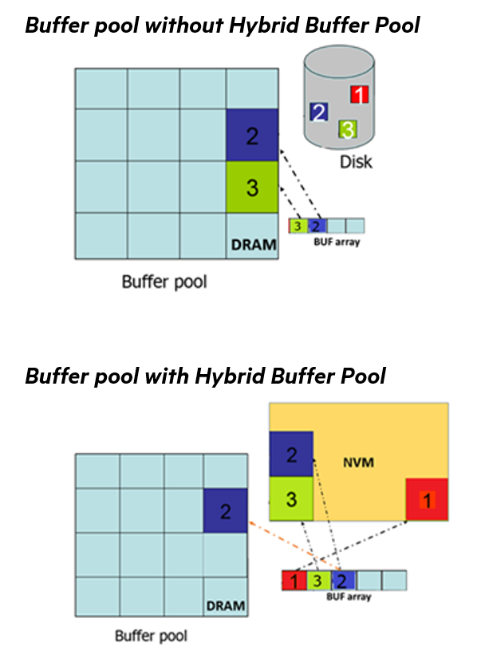

# Hybrid Buffer Pool

 [!INCLUDE [SQL Server](../../includes/applies-to-version/sqlserver.md)]

Hybrid Buffer Pool enables buffer pool objects to reference data pages in database files residing on persistent memory (PMEM) devices, instead of having to fetch copies of the data pages from disk and caching them in volatile DRAM. This feature was introduced in [!INCLUDE[sqlv15](../../includes/sssql19-md.md)] and is further enhanced in [!INCLUDE[sqlv16](../../includes/sssql22-md.md)].



Persistent memory (PMEM) devices are byte-addressable and if a direct access (DAX) persistent-memory aware file system (such as XFS, EXT4, or NTFS) is used, files on the file system can be accessed using the usual file system APIs in the OS. Alternatively, SQL Server can perform what are known as load and store operations against memory maps of the files on the PMEM device. This allows PMEM aware applications such as SQL Server to access files on the device without traversing the traditional storage stack.

The hybrid buffer pool uses this ability to perform load and store operations against memory mapped files, to leverage the PMEM device both as a cache for the buffer pool and a storage location for the database files. This creates the unique situation where both a logical read and a physical read become essentially the same operation. Persistent memory devices are accessible via the memory bus just like regular volatile DRAM.

By default, only clean data pages are cached on the PMEM module for the hybrid buffer pool. For a page to be modified and marked as dirty, it must be copied from the PMEM device to a DRAM buffer pool, modified and then eventually a copy of the modified page is written from DRAM back to the PMEM module, at which point it can be marked as clean again. This process occurs using normal background operations such as checkpoint, or the lazy writer, just as though the PMEM module were a standard block device.

The hybrid buffer pool feature is available for both Windows and Linux. The PMEM device must use a filesystem that supports DAX (DirectAccess). XFS, EXT4, and the NTFS file systems all have support for DAX extensions, which provides access to the filesystem directly from user space. SQL Server will detect if any database data files reside on an appropriately configured PMEM disk device and automatically perform the necessary memory mapping of the database files upon database startup, or whenever a database is attached, restored, or created.

For more information, see:

* [Configure persistent memory (PMEM) for SQL Server on Windows](../configure-windows/configure-persistent-memory.md)(Beginning with SQL Server 2022).
* [Configure persistent memory (PMEM) for SQL Server on Linux](../../linux/sql-server-linux-configure-pmem.md).

## Enable hybrid buffer pool

[!INCLUDE[sqlv15](../../includes/sssql19-md.md)] introduces dynamic data language (DDL) to control hybrid buffer pool.

The following example enables hybrid buffer pool for an instance of SQL Server:

```sql
ALTER SERVER CONFIGURATION SET MEMORY_OPTIMIZED HYBRID_BUFFER_POOL = ON;
```

By default, hybrid buffer pool is disabled at the instance scope. Note that in order for the setting change to take effect, the SQL Server instance must be restarted. A restart is needed to facilitate allocating sufficient hash pages, to account for the total PMEM capacity on the server.

The following example enables hybrid buffer pool for a specific database.

```sql
ALTER DATABASE <databaseName> SET MEMORY_OPTIMIZED = ON;
```

By default, hybrid buffer pool is enabled at the database scope.

## Disable hybrid buffer pool

The following example disables hybrid buffer pool at the instance level:

```sql
ALTER SERVER CONFIGURATION SET MEMORY_OPTIMIZED HYBRID_BUFFER_POOL = OFF;
```

By default, hybrid buffer pool is disabled at the instance level. In order for this change to take effect, the instance must be restarted. The restart ensures enough hash pages are allocated for the buffer pool, as PMEM capacity on the server now needs to be accounted for.

The following example disables hybrid buffer pool for a specific database.

```sql
ALTER DATABASE <databaseName> SET MEMORY_OPTIMIZED = OFF;
```

By default, hybrid buffer pool is enabled at the database scope.

## View hybrid buffer pool configuration

The following example returns the current hybrid buffer pool configuration status of the instance.

```sql
SELECT * FROM
sys.server_memory_optimized_hybrid_buffer_pool_configuration;
```

The following example lists the databases and the database level setting for hybrid buffer pool (`is_memory_optimized_enabled`).

```sql
SELECT name, is_memory_optimized_enabled FROM sys.databases;
```

## Hybrid buffer pool with direct write

Hybrid buffer pool with `Direct Write` behavior reduces the number of `memcpy` commands that need to be performed on modified data or index pages residing on PMEM devices. It does this by leveraging the durable persisted log buffer as a means to modify the page without having to copy it into one of the DRAM buffer pools. Instead pages in database files residing on PMEM devices are modified directly without the need to cache in a DRAM buffer pool and later asynchronously flush to disk. This behavior still adheres to write ahead logging (WAL) semantics, as the (log) records in the persisted transaction log buffer have been written, or hardened, to durable media. Considerable performance gains have been observed for transactional workloads using hybrid buffer pool and persisted log buffer together in this manner.

To enable direct write mode, enable hybrid buffer pool and [persisted log buffer](../../relational-databases/databases/add-persisted-log-buffer.md) for a database and enable startup [trace flag 809](../../t-sql/database-console-commands/dbcc-traceon-trace-flags-transact-sql.md).

## Best Practices for hybrid buffer pool

 - When formatting your PMEM device on Windows, use the largest allocation unit size available for NTFS (2 MB in Windows Server 2019 and later) and ensure the device has been formatted for DAX (Direct Access).

 - Use [Locked Pages in Memory](./enable-the-lock-pages-in-memory-option-windows.md) on Windows.

 - Files sizes should be a multiple of 2 MB (modulo 2 MB should equal zero).

 - If the server scoped setting for hybrid buffer pool is disabled, the feature will not be used by any user database.

 - If the server scoped setting for hybrid buffer pool is enabled, you can use the database scoped setting to disable the feature for individual user databases.

 - When using [Persisted Log Buffer](../../relational-databases/databases/add-persisted-log-buffer.md), consider enabling start-up [trace flag 809](../../t-sql/database-console-commands/dbcc-traceon-trace-flags-transact-sql.md) to reduce CPU overhead and improve overall performance. Especially, if the workload is highly transactional, involving multiple data and index page modifications.

 - As of [KB4538118](https://support.microsoft.com/en-us/topic/kb4538118-improvement-enable-hybrid-buffer-pool-read-caching-in-sql-server-2019-fb60b715-d1c6-5212-59f9-b76e546eacbd) read caching is enabled by default, with the hottest pages in the Hybrid buffer pool automatically promoted to a DRAM buffer pool to improve performance.
