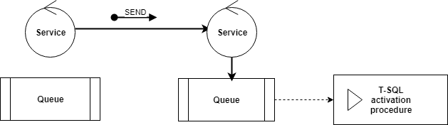

# Service Broker
[!INCLUDE [SQL Server SQL MI](../../includes/applies-to-version/sql-asdbmi.md)]

  [!INCLUDE[ssNoVersion](../../includes/ssnoversion-md.md)] [!INCLUDE[ssSB](../../includes/sssb-md.md)] provide native support for messaging and queuing in the [!INCLUDE[ssDEnoversion](../../includes/ssdenoversion-md.md)] and [Azure SQL Database Managed Instance](https://docs.microsoft.com/azure/sql-database/sql-database-managed-instance-index). Developers can easily create sophisticated applications that use the [!INCLUDE[ssDE](../../includes/ssde-md.md)] components to communicate between disparate databases, and build distributed and reliable applications.  
  
## When to use Service Broker

 Use Service Broker components to implement native in-database asynchronous message processing functionalities. Application developers who use [!INCLUDE[ssSB](../../includes/sssb-md.md)] can distribute data workloads across several databases without programming complex communication and messaging internals. Service Broker reduces development and test work because [!INCLUDE[ssSB](../../includes/sssb-md.md)] handles the communication paths in the context of a conversation. It also improves performance. For example, front-end databases supporting Web sites can record information and send process intensive tasks to queue in back-end databases. [!INCLUDE[ssSB](../../includes/sssb-md.md)] ensures that all tasks are managed in the context of transactions to assure reliability and technical consistency.  
  
## Overview

  Service Broker is a message delivery framework that enables you to create native in-database service-oriented applications. Unlike classic query processing functionalities that constantly read data from the tables and process them during the query lifecycle, in service-oriented application you have database services that are exchanging the messages. Every service has a queue where the messages are placed until they are processed.
  

  
  The messages in the queues can be fetched using the Transact-SQL `RECEIVE` command or by the activation procedure that will be called whenever the message arrives in the queue.
  
### Creating services
 
  Database services are created by using the [CREATE SERVICE](../../t-sql/statements/create-service-transact-sql.md) Transact SQL statement. Service can be associated with the message queue create by using the [CREATE QUEUE](../../t-sql/statements/create-queue-transact-sql.md) statement:
  
```sql
CREATE QUEUE dbo.ExpenseQueue;
GO
CREATE SERVICE ExpensesService
    ON QUEUE dbo.ExpenseQueue; 
```

### Sending messages
  
  Messages are sent on the conversation between the services using the [SEND](../../t-sql/statements/send-transact-sql.md) Transact-SQL statement. A conversation is a communication channel that is established between the services using the `BEGIN DIALOG` Transact-SQL statement. 
  
```sql
DECLARE @dialog_handle UNIQUEIDENTIFIER;

BEGIN DIALOG @dialog_handle  
FROM SERVICE ExpensesClient  
TO SERVICE 'ExpensesService';  
  
SEND ON CONVERSATION @dialog_handle (@Message) ;  
```
   The message will be sent to the `ExpenssesService` and placed in `dbo.ExpenseQueue`. Because there is no activation procedure associated to this queue, the message will remain in the queue until someone reads it.

### Processing messages

   The messages that are placed in the queue can be selected by using a standard `SELECT` query. The `SELECT` statement will not modify the queue and remove the messages. To read and pull the messages from the queue, you can use the [RECEIVE](../../t-sql/statements/receive-transact-sql.md) Transact-SQL statement.

```sql
RECEIVE conversation_handle, message_type_name, message_body  
FROM ExpenseQueue; 
```

  Once you process all messages from the queue, you should close the conversation using the [END CONVERSATION](../../t-sql/statements/end-conversation-transact-sql.md) Transact-SQL statement.

## Where is the documentation for Service Broker?  
 The reference documentation for [!INCLUDE[ssSB](../../includes/sssb-md.md)] is included in the [!INCLUDE[ssCurrent](../../includes/sscurrent-md.md)] documentation. This reference documentation includes the following sections:  
  
-   [Data Definition Language &#40;DDL&#41; Statements &#40;Transact-SQL&#41;](../../t-sql/statements/statements.md) for CREATE, ALTER, and DROP statements  
  
-   [Service Broker Statements](../../t-sql/statements/service-broker-statements.md)  
  
-   [Service Broker Catalog Views &#40;Transact-SQL&#41;](../../relational-databases/system-catalog-views/service-broker-catalog-views-transact-sql.md)  
  
-   [Service Broker Related Dynamic Management Views &#40;Transact-SQL&#41;](../../relational-databases/system-dynamic-management-views/service-broker-related-dynamic-management-views-transact-sql.md)  
  
-   [ssbdiagnose Utility &#40;Service Broker&#41;](../../tools/ssbdiagnose/ssbdiagnose-utility-service-broker.md)  
  
 See the [previously published documentation](https://go.microsoft.com/fwlink/?LinkId=231312) for [!INCLUDE[ssSB](../../includes/sssb-md.md)] concepts and for development and management tasks. This documentation is not reproduced in the [!INCLUDE[ssCurrent](../../includes/sscurrent-md.md)] documentation due to the small number of changes in [!INCLUDE[ssSB](../../includes/sssb-md.md)] in [!INCLUDE[ssCurrent](../../includes/sscurrent-md.md)].  
  
## What's new in Service Broker  
 No significant changes are introduced in [!INCLUDE[ssCurrent](../../includes/sscurrent-md.md)].  The following changes were introduced in [!INCLUDE[ssSQL11](../../includes/sssql11-md.md)].  

### Service broker and Azure SQL Database Managed Instance

- Cross-instance service broker is not supported 
 - `sys.routes` - Prerequisite: select address from sys.routes. Address must be LOCAL on every route. See [sys.routes](../../relational-databases/system-catalog-views/sys-routes-transact-sql.md).
 - `CREATE ROUTE` - you cannot use `CREATE ROUTE` with `ADDRESS` other than `LOCAL`. See [CREATE ROUTE](https://docs.microsoft.com/sql/t-sql/statements/create-route-transact-sql).
 - `ALTER ROUTE` cannot use `ALTER ROUTE` with `ADDRESS` other than `LOCAL`. See [ALTER ROUTE](../../t-sql/statements/alter-route-transact-sql.md).  
  
### Messages can be sent to multiple target services (multicast)  
 The syntax of the [SEND &#40;Transact-SQL&#41;](../../t-sql/statements/send-transact-sql.md) statement has been extended to enable multicast by supporting multiple conversation handles.  
  
### Queues expose the message enqueued time  
 Queues have a new column, **message_enqueue_time**, that shows how long a message has been in the queue.  
  
### Poison message handling can be disabled  
 The [CREATE QUEUE &#40;Transact-SQL&#41;](../../t-sql/statements/create-queue-transact-sql.md) and [ALTER QUEUE &#40;Transact-SQL&#41;](../../t-sql/statements/alter-queue-transact-sql.md) statements now have the ability to enable or disable poison message handling by adding the clause, `POISON_MESSAGE_HANDLING (STATUS = ON | OFF)`. The catalog view **sys.service_queues** now has the column **is_poison_message_handling_enabled** to indicate whether poison message is enabled or disabled.  
  
### Always On support in Service Broker  
 For more information, see [Service Broker with Always On Availability Groups (SQL Server)](../../database-engine/availability-groups/windows/service-broker-with-always-on-availability-groups-sql-server.md).  
  
  
## Next steps

The most common use of Service Broker is for [event notifications](../../relational-databases/service-broker/event-notifications.md). Learn how to [implement event notifications](../../relational-databases/service-broker/implement-event-notifications.md), [configure dialog security](../../relational-databases/service-broker/configure-dialog-security-for-event-notifications.md), or [get more information](../../relational-databases/service-broker/get-information-about-event-notifications.md). 


