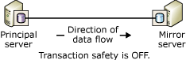
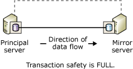

# Database Mirroring Operating Modes
[!INCLUDE[appliesto-ss-xxxx-xxxx-xxx-md](../../includes/appliesto-ss-xxxx-xxxx-xxx-md.md)]
  This topic describes the synchronous and asynchronous operating modes for database mirroring sessions.  
  
> [!NOTE]  
>  For an introduction to database mirroring, see [Database Mirroring &#40;SQL Server&#41;](../../database-engine/database-mirroring/database-mirroring-sql-server.md).  
  
  
##  <a name="TermsAndDefinitions"></a> Terms and Definitions  
 This section introduces a few terms that are central to this topic.  
  
 High-performance mode  
 The database mirroring session operates asynchronously and uses only the principal server and mirror server. The only form of role switching is forced service (with possible data loss).  
  
 High-safety mode  
 The database mirroring session operates synchronously and, optionally, uses a witness, as well as the principal server and mirror server.  
  
 Transaction safety  
 A mirroring-specific database property that determines whether a database mirroring session operates synchronously or asynchronously. There are two safety levels: FULL and OFF.  
  
 Witness  
 For use only with high-safety mode, an optional instance of SQL Server that enables the mirror server to recognize whether to initiate an automatic failover. Unlike the two failover partners, the witness does not serve the database. Supporting automatic failover is the only role of the witness.  
  
## Asynchronous Database Mirroring (High-Performance Mode)  
 This section describes how asynchronous database mirroring works, when it is appropriate to use high-performance mode, and how to respond if the principal server fails.  
  
> [!NOTE]  
>  Most editions of [!INCLUDE[ssCurrent](../../includes/sscurrent-md.md)] support only synchronous database mirroring ("Safety Full Only"). For information about editions that fully support database mirroring, see "High Availability (Always On)" in [Editions and Supported Features for SQL Server 2016](../../sql-server/editions-and-supported-features-for-sql-server-2016.md).
  
 When transaction safety is set to OFF, the database mirroring session operates asynchronously. Asynchronous operation supports only one operating mode-high-performance mode. This mode enhances performance at the expense of high availability. High-performance mode uses just the principal server and the mirror server. Problems on the mirror server never impact the principal server. On the loss of the principal server, the mirror database is marked DISCONNECTED but is available as a warm standby.  
  
 High-performance mode, supports only one form of role switching: forced service (with possible data loss), which uses the mirror server as a warm standby server. Forced service is one of the possible responses to the failure of the principal server. Because data loss is possible, you should consider other alternatives before forcing service to the mirror. For more information, see [Responding to Failure of the Principal](#WhenPrincipalFails), later in this topic.  
  
 The following figure shows the configuration of a session using high-performance mode.  
  
   
  
 In high-performance mode, as soon as the principal server sends the log for a transaction to the mirror server, the principal server sends a confirmation to the client, without waiting for an acknowledgement from the mirror server. Transactions commit without waiting for the mirror server to write the log to disk. Asynchronous operation permits the principal server to run with minimum transaction latency.  
  
 The mirror server attempts to keep up with the log records sent by the principal server. But the mirror database might lag somewhat behind the principal database, though typically the gap between the databases is small. However, the gap can become substantial if the principal server is under a heavy work load or the system of the mirror server is over loaded.  
  
 **In This Section:**  
  
-   [When Is High-Performance Mode Appropriate?](#WhenUseHighPerf)  
  
-   [The Impact of a Witness on High-Performance Mode](#WitnessImpactOnHighPerf)  
  
-   [Responding to Failure of the Principal](#WhenPrincipalFails)  
  
###  <a name="WhenUseHighPerf"></a> When Is High-Performance Mode Appropriate?  
 High-performance mode can be useful in a disaster-recovery scenario in which the principal and mirror servers are separated by a significant distance and where you do not want small errors to impact the principal server.  
  
> [!NOTE]  
>  Log shipping can be a supplement to database mirroring and is a favorable alternative to asynchronous database mirroring. For information about the advantages of log shipping, see [High Availability Solutions &#40;SQL Server&#41;](../../database-engine/sql-server-business-continuity-dr.md). For information on using log shipping with database mirroring, see [Database Mirroring and Log Shipping &#40;SQL Server&#41;](../../database-engine/database-mirroring/database-mirroring-and-log-shipping-sql-server.md).  
  
###  <a name="WitnessImpactOnHighPerf"></a> The Impact of a Witness on High-Performance Mode  
 If you use Transact-SQL to configure high-performance mode, whenever the SAFETY property is set to OFF, we strongly recommend that the WITNESS property also be set to OFF. A witness can coexist with high-performance mode, but the witness provides no benefit and introduces risk.  
  
 If the witness is disconnected from the session when either partner goes down, the database becomes unavailable. This is because, even though high-performance mode does not require a witness, if one is set, the session requires a quorum consisting of two or more server instances. If the session losses quorum, it cannot serve the database.  
  
 When a witness is set in a high-performance mode session, the enforcement of quorum means that:  
  
-   If the mirror server is lost, the principal server must be connected to the witness. Otherwise, the principal server takes its database offline until either the witness or mirror server rejoins the session.  
  
-   If the principal server is lost, forcing service to the mirror server requires that the mirror server be connected to the witness.  
  
> [!NOTE]  
>  For information about the types of quorums, see [Quorum: How a Witness Affects Database Availability &#40;Database Mirroring&#41;](../../database-engine/database-mirroring/quorum-how-a-witness-affects-database-availability-database-mirroring.md).  
  
###  <a name="WhenPrincipalFails"></a> Responding to Failure of the Principal  
 When the principal fails, the database owner has several choices, as follows:  
  
-   Leave the database unavailable until the principal becomes available again.  
  
     If the principal database and its transaction log are intact, this choice preserves all of the committed transactions at the expense of availability.  
  
-   Stop the database mirroring session, manually update the database, and then begin a new database mirroring session.  
  
     If the principal database is lost but the principal server is still running, immediately attempt to back up the tail of the log on the principal database. If the tail-log backup succeeds, removing mirroring may be your best alternative. After removing mirroring, you can restore the log onto the former mirror database, which preserves all of the data.  
  
    > [!NOTE]  
    >  If the tail-log backup failed and you cannot wait for the principal server to recover, consider forcing service, which has the advantage of maintaining the session state.  
  
-   Force service (with possible data loss) on the mirror server.  
  
     Forced service is strictly a disaster recovery method and should be used sparingly. Forcing service is possible only if the principal server is down, the session is asynchronous (transaction safety is set to OFF), and either the session does not have any witness (the WITNESS property is set to OFF) or the witness is connected to the mirror server (that is, they have quorum).  
  
     Forcing service causes the mirror server to assume the role of principal and serve its copy of the database for clients. When service is forced, whatever transaction logs the principal has not yet sent to the mirror server are lost. Therefore, you should limit forced service to situations where possible data loss is acceptable and immediate database availability is critical. For information on how forced service works and on best practices for using it, see [Role Switching During a Database Mirroring Session &#40;SQL Server&#41;](../../database-engine/database-mirroring/role-switching-during-a-database-mirroring-session-sql-server.md).  
  
##  <a name="Sync"></a> Synchronous Database Mirroring (High-Safety Mode)  
 This section describes how synchronous database mirroring works, including the alternative high-safety modes (with automatic failover and without automatic failover), and contains information about the role of the witness in automatic failover.  
  
 When transaction safety is set to FULL, the database mirroring session runs in high-safety mode and operates synchronously after an initial synchronizing phase. This section describes the details of database mirroring sessions that are configured for synchronous operation.  
  
 To achieve synchronous operation for a session, the mirror server must synchronize the mirror database with the principal database. When the session begins, the principal server begins sending its active log to the mirror server. The mirror server writes all of the incoming log records to disk as quickly as possible. As soon as all of the received log records have been written to disk, the databases are synchronized. As long as the partners remain in communication, the databases remain synchronized.  
  
> [!NOTE]  
>  To monitor state changes in a database mirroring session, use the **Database Mirroring State Change** event class. For more information, see [Database Mirroring State Change Event Class](../../relational-databases/event-classes/database-mirroring-state-change-event-class.md).  
  
 After synchronization finishes, every transaction committed on the principal database is also committed on the mirror server, guaranteeing protection of the data. This is achieved by waiting to commit a transaction on the principal database, until the principal server receives a message from the mirror server stating that it has hardened the transaction's log to disk. Note the wait for this message increases the latency of the transaction.  
  
 The time required for synchronization depends essentially on how far the mirror database was behind the principal database at the start of the session (measured by the number of log records initially received from the principal server), the work load on the principal database, and the speed of the mirror system. After a session is synchronized, the hardened log that has yet to be redone on the mirror database remains in the redo queue.  
  
 As soon as the mirror database becomes synchronized, the state of both the copies of the database changes to SYNCHRONIZED.  
  
 Synchronous operation is maintained in the following manner:  
  
1.  On receiving a transaction from a client, the principal server writes the log for the transaction to the transaction log.  
  
2.  The principal server writes the transaction to the database and, concurrently, sends the log record to the mirror server. The principal server waits for an acknowledgement from the mirror server before confirming either of the following to the client: a transaction commit or a rollback.  
  
3.  The mirror server hardens the log to disk and returns an acknowledgement to the principal server.  
  
4.  On receiving the acknowledgement from the mirror server, the principal server sends a confirmation message to the client.  
  
 High-safety mode protects your data by requiring the data to be synchronized between two places. All the committed transactions are guaranteed to be written to disk on the mirror server.  
  
 **In This Section:**  
  
-   [High-Safety Mode Without Automatic Failover](#HighSafetyWithOutAutoFailover)  
  
-   [High-Safety Mode with Automatic Failover](#HighSafetyWithAutoFailover)  
  
###  <a name="HighSafetyWithOutAutoFailover"></a> High-Safety Mode Without Automatic Failover  
 The following figure shows the configuration of high-safety mode without automatic failover. The configuration consists of only the two partners.  
  
   
  
 When the partners are connected and the database is already synchronized, manual failover is supported. If the mirror server instance goes down, the principal server instance is unaffected and runs exposed (that is without mirroring the data). If the principal server is lost, the mirror is suspended, but service can be forced to the mirror server (with possible data loss). For more information, see [Role Switching During a Database Mirroring Session &#40;SQL Server&#41;](../../database-engine/database-mirroring/role-switching-during-a-database-mirroring-session-sql-server.md).  
  
###  <a name="HighSafetyWithAutoFailover"></a> High-Safety Mode with Automatic Failover  
 Automatic failover provides high availability by ensuring that the database is still served after the loss of one server. Automatic failover requires that the session possess a third server instance, the *witness*, which ideally resides on a third computer. The following figure shows the configuration of a high-safety mode session that supports automatic failover.  
  
   
  
 Unlike the two partners, the witness does not serve the database. The witness simply supports automatic failover by verifying whether the principal server is up and functioning. The mirror server initiates automatic failover only if the mirror and the witness remain connected to each other after both have been disconnected from the principal server.  
  
 When a witness is set, the session requires *quorum*-a relationship between at least two server instances that allows the database to be made available. For more information, see [Database Mirroring Witness](../../database-engine/database-mirroring/database-mirroring-witness.md) and [Quorum: How a Witness Affects Database Availability &#40;Database Mirroring&#41;](../../database-engine/database-mirroring/quorum-how-a-witness-affects-database-availability-database-mirroring.md).  
  
 Automatic failover requires the following conditions:  
  
-   The database is already synchronized.  
  
-   The failure occurs while all three server instances are connected, and the witness and mirror server remain connected.  
  
 The loss of a partner has the following effect:  
  
-   If the principal server becomes unavailable under the above conditions, automatic failover occurs. The mirror server switches to the role of principal, and it offers its database as the principal database.  
  
-   If the principal server becomes unavailable when those conditions are not met, forcing service (with possible data loss) might be possible. For more information, see [Role Switching During a Database Mirroring Session &#40;SQL Server&#41;](../../database-engine/database-mirroring/role-switching-during-a-database-mirroring-session-sql-server.md).  
  
-   If the only mirror server becomes unavailable, the principal and witness continue.  
  
 If the session loses its witness, quorum requires both partners. If either partner loses quorum, both partners lose quorum, and the database becomes unavailable until quorum is re-established. This quorum requirement makes sure that in the absence of a witness the database never runs *exposed*, that is without being mirrored.  
  
> [!NOTE]  
>  If you expect the witness to remain disconnected for a significant amount of time, we recommend that you remove the witness from the session until it becomes available.  
  
##  <a name="TsqlSettingsAndOpModes"></a> Transact-SQL Settings and Database Mirroring Operating Modes  
 This section describes a database mirroring session in terms of the ALTER DATABASE settings and states of the mirrored database and witness, if any. The section is aimed at users who manage database mirroring primarily or exclusively using [!INCLUDE[tsql](../../includes/tsql-md.md)], rather than using [!INCLUDE[ssManStudioFull](../../includes/ssmanstudiofull-md.md)].  
  
> [!TIP]  
>  As an alternative to using [!INCLUDE[tsql](../../includes/tsql-md.md)], you can control the operating mode of a session in Object Explorer using the **Mirroring** page of the **Database Properties** dialog box. For more information, see [Establish a Database Mirroring Session Using Windows Authentication &#40;SQL Server Management Studio&#41;](../../database-engine/database-mirroring/establish-database-mirroring-session-windows-authentication.md).  
  
 **In This Section:**  
  
-   [How Transaction Safety and Witness State Affect the Operating Mode](#TxnSafetyAndWitness)  
  
-   [Viewing the Safety Setting and State of the Witness](#ViewWitness)  
  
-   [Factors Affecting Behavior on Loss of the Principal Server](#FactorsOnLossOfPrincipal)  
  
###  <a name="TxnSafetyAndWitness"></a> How Transaction Safety and Witness State Affect the Operating Mode  
 The operating mode of a session is determined by the combination of its transaction safety setting and the state of the witness. At any time, the database owner can change the transaction safety level, and can add or remove the witness.  
  
 **In This Section:**  
  
-   [Transaction Safety](#TxnSafety)  
  
-   [Witness State](#WitnessState)  
  
####  <a name="TxnSafety"></a> Transaction Safety  
 Transaction safety is a mirroring-specific database property that determines whether a database mirroring session operates synchronously or asynchronously. There are two safety levels: FULL and OFF.  
  
-   SAFETY FULL  
  
     Full transaction safety causes the session to operate synchronously in high-safety mode. If a witness is present, a session supports automatic failover.  
  
     When you establish a session using ALTER DATABASE statements, the session begins with the SAFETY property set to FULL; that is, the session begins in high-safety mode. After the session begins, you can add a witness.  
  
     For more information, see [Synchronous Database Mirroring (High-Safety Mode)](#Sync), earlier in this topic.  
  
-   SAFETY OFF  
  
     Turning off transaction safety causes the session to operate asynchronously, in high-performance mode. If the SAFETY property is set to OFF, the WITNESS property should also be set to OFF (the default). For information about the impact of the witness in high-performance mode, see [The State of the Witness](#WitnessState), later in this topic. For more information about running with transaction safety turned off, see [Asynchronous Database Mirroring (High-Performance Mode)](#asynchronous-database-mirroring-high-performance-mode), earlier in this topic.  
  
 The transaction safety setting of the database is recorded on each partner in the **sys.database_mirroring** catalog view in the **mirroring_safety_level** and **mirroring_safety_level_desc** columns. For more information, see [sys.database_mirroring &#40;Transact-SQL&#41;](../../relational-databases/system-catalog-views/sys-database-mirroring-transact-sql.md).  
  
 The database owner can change the transaction safety level at any time.  
  
####  <a name="WitnessState"></a> The State of the Witness  
 If a witness has been set, quorum is required, so the state of the witness is always significant.  
  
 If it exists, the witness has one of two states:  
  
-   When the witness is connected to a partner, the witness is in the CONNECTED state relative to that partner and has quorum with that partner. In this case, the database can be made available, even if one of the partners is unavailable.  
  
-   When the witness exists but is not connected to a partner, the witness is in the UNKOWN or DISCONNECTED state relative to that partner. In this case, the witness lacks quorum with that partner, and if the partners are not connected to each other, the database becomes unavailable.  
  
 For information about quorum, see [Quorum: How a Witness Affects Database Availability &#40;Database Mirroring&#41;](../../database-engine/database-mirroring/quorum-how-a-witness-affects-database-availability-database-mirroring.md).  
  
 The state of each witness on a server instance is recorded in the **sys.database_mirroring** catalog view in the **mirroring_witness_state** and **mirroring_witness_state_desc** columns. For more information, see [sys.database_mirroring &#40;Transact-SQL&#41;](../../relational-databases/system-catalog-views/sys-database-mirroring-transact-sql.md).  
  
 The following table summarizes how the operating mode of a session depends upon its transaction safety setting and on state of the witness.  
  
|Operating mode|Transaction safety|Witness state|  
|--------------------|------------------------|-------------------|  
|High-performance mode|OFF|NULL (no witness)**|  
|High-safety mode without automatic failover|FULL|NULL (no witness)|  
|High-safety mode with automatic failover*|FULL|CONNECTED|  
  
 *If the witness becomes disconnected, we recommend that you set WITNESS OFF until the witness server instance becomes available.  
  
 **If a witness is present in high-performance mode, the witness does not participate in the session. However, to make the database available, at least two of the server instances must remain connected. Therefore, we recommend keeping the WITNESS property set to OFF in high-performance mode sessions. For more information, see [Quorum: How a Witness Affects Database Availability &#40;Database Mirroring&#41;](../../database-engine/database-mirroring/quorum-how-a-witness-affects-database-availability-database-mirroring.md).  
  
###  <a name="ViewWitness"></a> Viewing the Safety Setting and State of the Witness  
 To view the safety setting and the state of the witness for a database, use the **sys.database_mirroring** catalog view. The relevant columns are as follows:  
  
|Factor|Columns|Description|  
|------------|-------------|-----------------|  
|Transaction safety|**mirroring_safety_level** or **mirroring_safety_level_desc**|Transaction safety setting for updates on the mirror database, one of:<br /><br /> UNKNOWN<br /><br /> OFF<br /><br /> FULL<br /><br /> NULL= database is not online.|  
|Does a witness exist?|**mirroring_witness_name**|Server name of the database mirroring witness or NULL, indicating that no witness exists.|  
|Witness state|**mirroring_witness_state** or **mirroring_witness_state_desc**|State of the witness in the database on a given partner:<br /><br /> UNKNOWN<br /><br /> CONNECTED<br /><br /> DISCONNECTED<br /><br /> NULL = no witness exists or the database is not online.|  
  
 For example, on either the principal or mirror server, enter:  
  
```  
SELECT mirroring_safety_level_desc, mirroring_witness_name, mirroring_witness_state_desc FROM sys.database_mirroring  
```  
  
 For more information about this catalog view, see [sys.database_mirroring &#40;Transact-SQL&#41;](../../relational-databases/system-catalog-views/sys-database-mirroring-transact-sql.md).  
  
###  <a name="FactorsOnLossOfPrincipal"></a> Factors Affecting Behavior on Loss of the Principal Server  
 The following table summarizes the combined effect of the transaction safety setting, the state of the database, and the state of the witness on the behavior of a mirroring session on the loss of the principal server.  
  
|Transaction safety|Mirroring state of mirror database|Witness state|Behavior when principal is lost|  
|------------------------|----------------------------------------|-------------------|-------------------------------------|  
|FULL|SYNCHRONIZED|CONNECTED|Automatic failover occurs.|  
|FULL|SYNCHRONIZED|DISCONNECTED|Mirror server stops; failover is not possible, and the database cannot be made available.|  
|OFF|SUSPENDED or DISCONNECTED|NULL (no witness)|Service can be forced to the mirror server (with possible data loss).|  
|FULL|SYNCHRONIZING or SUSPENDED|NULL (no witness)|Service can be forced to the mirror server (with possible data loss).|  
  
##  <a name="RelatedTasks"></a> Related Tasks  
  
-   [Add or Replace a Database Mirroring Witness &#40;SQL Server Management Studio&#41;](../../database-engine/database-mirroring/add-or-replace-a-database-mirroring-witness-sql-server-management-studio.md)  
  
-   [Establish a Database Mirroring Session Using Windows Authentication &#40;SQL Server Management Studio&#41;](../../database-engine/database-mirroring/establish-database-mirroring-session-windows-authentication.md)  
  
-   [Add a Database Mirroring Witness Using Windows Authentication &#40;Transact-SQL&#41;](../../database-engine/database-mirroring/add-a-database-mirroring-witness-using-windows-authentication-transact-sql.md)  
  
-   [Remove the Witness from a Database Mirroring Session &#40;SQL Server&#41;](../../database-engine/database-mirroring/remove-the-witness-from-a-database-mirroring-session-sql-server.md)  
  
-   [Change Transaction Safety in a Database Mirroring Session &#40;Transact-SQL&#41;](../../database-engine/database-mirroring/change-transaction-safety-in-a-database-mirroring-session-transact-sql.md)  
  
## See Also  
 [Monitoring Database Mirroring &#40;SQL Server&#41;](../../database-engine/database-mirroring/monitoring-database-mirroring-sql-server.md)   
 [Database Mirroring Witness](../../database-engine/database-mirroring/database-mirroring-witness.md)  
  
  
