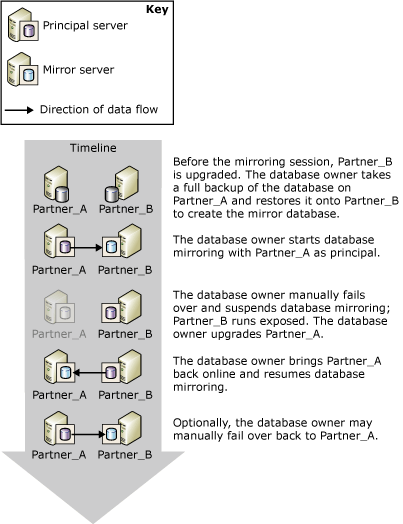
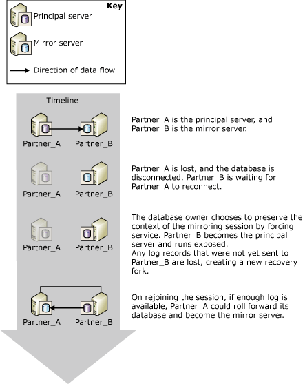

# Role Switching During a Database Mirroring Session (SQL Server)
[!INCLUDE[appliesto-ss-xxxx-xxxx-xxx-md](../../includes/appliesto-ss-xxxx-xxxx-xxx-md.md)]
  Within the context of a database mirroring session, the principal and mirror roles are typically interchangeable in a process known as *role switching*. In role switching, the mirror server acts as the *failover partner* for the principal server, taking over the principal role, recovering its copy of the database and bringing it online as the new principal database. The former principal server, when available, assumes the mirror role, and its database becomes the new mirror database. Potentially, the roles can switch back and forth either in response to multiple failures or for administrative purposes.  
  
> [!NOTE]  
>  This topic assumes that you are familiar with the database mirroring operating modes. For more information, see [Database Mirroring Operating Modes](../../database-engine/database-mirroring/database-mirroring-operating-modes.md).  
  
 The following illustration shows mirroring partners, **Partner_A** and **Partner_B**, switching the principal and mirror roles over a series of automatic or manual failovers.  
  
   
  
> [!IMPORTANT]  
>  After a role switch, jobs that ran on the former principal database must be recreated on the new principal server to run there. For more information, see [Management of Logins and Jobs After Role Switching &#40;SQL Server&#41;](../../sql-server/failover-clusters/management-of-logins-and-jobs-after-role-switching-sql-server.md).  
  
 Three types of role switching exist: automatic failover, manual failover, and forced service (with possible data loss). Support for each form depends on the operating mode of the session.  
  
> [!NOTE]  
>  If you are unfamiliar with these operating modes, see [Database Mirroring Operating Modes](../../database-engine/database-mirroring/database-mirroring-operating-modes.md).  
  
-   **Manual failover**  
  
     High-safety mode supports manual failover. Whenever the database is synchronized, the database owner can initiate a manual failover.  
  
     Manual failover is provided for administrative purposes. For more information, see [Manual Failover](#ManualFailover), later in this topic.  
  
-   **Automatic failover**  
  
     In the presence of a witness, high-safety mode supports automatic failover. Automatic failover occurs only on the loss of the principal server when the witness and mirror server are still connected to each other and the database is already synchronized. For more information, see [Automatic Failover](#AutomaticFailover), later in this topic.  
  
-   **Forced service (with possible data loss)**  
  
     Forcing service is supported in high-safety mode when no witness is set and in high-performance mode. On the loss of the principal server, the database owner can make the database available by forcing service to the mirror server (with possible data loss).  
  
    > [!NOTE]  
    >  We recommend that the WITNESS property be set to OFF in high-performance mode. Otherwise, to bring the database online, the mirror server must connected to the witness.  
  
     For more information, see [Forced Service (with Possible Data Loss)](#ForcedService), later in this topic.  
  
 The following table summarizes which forms of failover are supported under each of the operating modes.  
  
||High performance|High-safety mode without a witness|High-safety mode with a witness|  
|-|----------------------|-----------------------------------------|--------------------------------------|  
|Automatic failover|No|No|Yes|  
|Manual failover|No|Yes|Yes|  
|Forced service|Yes|Yes|No|  
  
 After a role switch, certain metadata must exist on both partners to ensure that all of the database users can access the new principal database. In addition, backup jobs must be created on the new principal server, to ensure that the database continues to be backed up on its regular schedule. For more information, see [Management of Logins and Jobs After Role Switching &#40;SQL Server&#41;](../../sql-server/failover-clusters/management-of-logins-and-jobs-after-role-switching-sql-server.md).  
  
 During a role switch, the amount of time that database mirroring will be out of service depends on the type of role switching and on the cause. For more information, see [Estimate the Interruption of Service During Role Switching &#40;Database Mirroring&#41;](../../database-engine/database-mirroring/estimate-the-interruption-of-service-during-role-switching-database-mirroring.md).  
  
##   Manual Failover  
 Manual failover disconnects the clients from the database and reverses the roles of the partners. Only high-safety mode supports manual failover.  
  
 **In This Section:**  
  
-   [Maintaining Availability During Upgrades](#AvailabilityDuringUpgrades)  
  
-   [Conditions Required for a Manual Failover](#ConditionsForManualFo)  
  
-   [How Manual Failover Works](#HowManualFoWorks)  
  
###   Maintaining Availability During Upgrades  
 The database administrator can use manual failover for upgrading hardware or software without sacrificing availability. To use database mirroring for software upgrades, the mirror server and/or system must have already received the upgrades.  
  
> [!NOTE]  
>  Database mirroring should be able to do a rolling upgrade, but this is not guaranteed, because future changes are unknown. For more information, see [Upgrading Mirrored Instances](../../database-engine/database-mirroring/upgrading-mirrored-instances.md).  
  
 The following figure illustrates an instance of using manual failover to maintain database availability while you upgrade a database server instance. When the upgrade is completed, an administrator may optionally fail over back to the original server instance. This is useful when the administrator wants to stop the mirroring session and use the mirror server elsewhere. In this way, a single server instance can be used repeatedly when updating a series of database server instances.  
  
   
  
###   Conditions Required for a Manual Failover  
 Manual failover requires transaction safety to be set to FULL (that is, high-safety mode). When the partners are connected and the database is already synchronized, manual failover is supported.  
  
###   How Manual Failover Works  
 Manual failover initiates the following sequence of actions:  
  
1.  The principal server disconnects clients from the principal database, sends the tail of the log to the mirror server, and, in preparation for switching to the mirror role, sets the mirroring state to SYNCHRONIZING.  
  
2.  The mirror server records the log sequence number (LSN) of the last log record received from the principal as the failover LSN.  
  
    > [!NOTE]  
    >  To view this LSN, select the **mirroring_failover_lsn** column from [sys.database_mirroring &#40;Transact-SQL&#41;](../../relational-databases/system-catalog-views/sys-database-mirroring-transact-sql.md).  
  
3.  If any log is waiting in the redo queue, the mirror server finishes rolling forward the mirror database. The amount of time required depends on the speed of the system, the recent workload, and the amount of log in the redo queue. For a synchronous operating mode, the failover time can be regulated by limiting the size of the redo queue. However, this can cause the principal server to slow down to allow the mirror server to keep up.  
  
    > [!NOTE]  
    >  To learn the current size of the redo queue, use the **Redo Queue** performance counter in the database mirroring performance object (for more information, see [Monitoring Database Mirroring &#40;SQL Server&#41;](../../database-engine/database-mirroring/monitoring-database-mirroring-sql-server.md)).  
  
4.  The mirror server becomes the new principal server, and the former principal server becomes the new mirror server.  
  
5.  The new principal server rolls back any uncommitted transactions and brings its copy of the database online as the principal database.  
  
6.  The former principal takes on the mirror role, and the former principal database becomes the mirror database. The new mirror server quickly resynchronizes the new mirror database with the new principal database.  
  
    > [!NOTE]  
    >  As soon as the new mirror server has resynchronized the databases, failover is again possible, but in the reverse direction.  
  
 After failover, clients must reconnect to the current principal database. For more information, see [Connect Clients to a Database Mirroring Session &#40;SQL Server&#41;](../../database-engine/database-mirroring/connect-clients-to-a-database-mirroring-session-sql-server.md).  
  
 **To initiate manual failover**  
  
-   [Manually Fail Over a Database Mirroring Session &#40;SQL Server Management Studio&#41;](../../database-engine/database-mirroring/manually-fail-over-a-database-mirroring-session-sql-server-management-studio.md)  
  
-   [Manually Fail Over a Database Mirroring Session &#40;Transact-SQL&#41;](../../database-engine/database-mirroring/manually-fail-over-a-database-mirroring-session-transact-sql.md).  
  
##   Automatic Failover  
 Automatic failover is supported only in database mirroring sessions running with a witness in high-safety mode (*high-safety mode with automatic failover*). In high-safety mode with automatic failover, once the database is synchronized, if the principal database becomes unavailable, an automatic failover occurs. An automatic failover causes the mirror server to take over the role of principal server and bring its copy of the database online as the principal database. Requiring that the database be synchronized prevents data loss during failover, because every transaction committed on the principal database is also committed on the mirror database.  
  
> [!IMPORTANT]  
>  For automatic failover to improve reliability, the mirror and principal databases must reside on different computers.  
  
 **In This Section:**  
  
-   [Conditions Required for an Automatic Failover](#ConditionsForAutoFo)  
  
-   [How Automatic Failover Works](#HowAutoFoWorks)  
  
-   [To Disable Automatic Failover (SQL Server Management Studio)](#DisableAutoSSMS)  
  
-   [To Disable Automatic Failover (Using Transact-SQL)](#DisableAutoTsql)  
  
###   Conditions Required for an Automatic Failover  
 Automatic failover requires the following conditions:  
  
-   The database mirroring session must be running in high-safety mode and must possess a witness. For more information, see [Database Mirroring Operating Modes](../../database-engine/database-mirroring/database-mirroring-operating-modes.md).  
  
-   The mirror database must already be synchronized. This guarantees that all of the log sent to the mirror server has been written to disk.  
  
-   The principal server has lost communication with the rest of the database mirroring configuration, while the mirror and witness retain quorum. If all server instances lose communication, however, and the witness and the mirror server later regain communication, automatic failover does not occur.  
  
    > [!NOTE]  
    >  For more information, see [Quorum: How a Witness Affects Database Availability &#40;Database Mirroring&#41;](../../database-engine/database-mirroring/quorum-how-a-witness-affects-database-availability-database-mirroring.md).  
  
-   The mirror server has detected the loss of the principal server.  
  
     How the mirror server detects a failure of the principal server depends on whether it is a hard or soft failure. For more information, see [Possible Failures During Database Mirroring](../../database-engine/database-mirroring/possible-failures-during-database-mirroring.md).  
  
###   How Automatic Failover Works  
 Under the preceding conditions, automatic failover initiates the following sequence of actions:  
  
1.  If the principal server is still running, it changes the state of the principal database to DISCONNECTED and disconnects all clients from the principal database.  
  
2.  The witness and mirror servers register that the principal server is unavailable.  
  
3.  If any log is waiting in the redo queue, the mirror server finishes rolling forward the mirror database.  
  
    > [!NOTE]  
    >  The amount of time required to apply the log depends on the speed of the system, the recent work load, and the amount of log in the redo queue.  
  
4.  The former mirror database moves online as the new principal database, and recovery cleans up all uncommitted transactions by rolling them back as quickly as possible. Locks isolate those transactions.  
  
5.  When the former principal server rejoins the session, it recognizes that its failover partner now owns the principal role. The former principal server takes on the role of mirror, making its database the mirror database. The new mirror server synchronizes the new mirror database with the principal database as quickly as possible. As soon as the new mirror server has resynchronized the databases, failover is again possible, but in the reverse direction.  
  
 The following illustration shows a single instance of automatic failover.  
  
   
  
 Initially, all three servers are connected (the session has full quorum). **Partner_A** is the principal server and **Partner_B** is the mirror server. **Partner_A** (or the principal database on **Partner_A**) becomes unavailable. The witness and **Partner_B** both recognize that the principal is no longer available the session retains quorum. **Partner_B** becomes the principal server and makes its copy of the database available as the new principal database. Eventually, **Partner_A** reconnects to the session and discovers that **Partner_B** now owns the principal role. **Partner_A** then takes on the mirror role.  
  
 After failover, clients must reconnect to the current principal database. For more information, see [Connect Clients to a Database Mirroring Session &#40;SQL Server&#41;](../../database-engine/database-mirroring/connect-clients-to-a-database-mirroring-session-sql-server.md).  
  
> [!NOTE]  
>  Transactions that have been prepared using the [!INCLUDE[msCoName](../../includes/msconame-md.md)] Distributed Transaction Coordinator but are still not committed when a failover occurs, are considered aborted after the database has failed over.  
  
###   To Disable Automatic Failover (SQL Server Management Studio)  
 Open the **Database PropertiesMirroring** page, and change the operating mode by selecting one of the following options:  
  
-   **High safety without automatic failover (synchronous)**  
  
     In this mode, the database continues to be synchronized, and manual failover remains possible.  
  
-   **High performance (asynchronous)**  
  
     In this mode, the mirror database might lag somewhat behind the principal database, and manual failover is no longer possible.  
  
###   To Disable Automatic Failover (Using Transact-SQL)  
 At any point in a database mirroring session, the database owner can disable automatic failover by turning off the witness.  
  
 **To turn off the witness**  
  
-   [Remove the Witness from a Database Mirroring Session &#40;SQL Server&#41;](../../database-engine/database-mirroring/remove-the-witness-from-a-database-mirroring-session-sql-server.md)  
  
    > [!NOTE]  
    >  Turning off the witness while retaining full transaction safety puts the session into high-safety mode without automatic failover.  
  
##   Forced Service (with Possible Data Loss)  
 Database mirroring provides forcing service (with possible data loss) as a disaster recovery method to allow you to use a mirror server as a warm standby server. Forcing service is possible only if the principal server is disconnected from the mirror server in a mirroring session. Because forcing service risks possible data loss, it should be used cautiously and sparingly.  
  
 Support for forced service depends on the operating mode and the state of the session, as follows:  
  
-   Typically, high-performance mode supports forcing service whenever the principal server is disconnected. However, though unnecessary, a witness can exist for a high-performance mode session. In this case, forcing service requires that the mirror server and witness are connected to each other.  
  
-   High-safety mode without automatic failover supports forcing service whenever the principal server is disconnected.  
  
-   High-safety mode with automatic failover supports forcing service whenever the mirror server and witness are connected to each other and neither is connected to the principal server (as long as the mirror server was not in the process of rolling back the mirror database when it was last connected to the principal).  
  
 We recommend forcing service only if you must restore service to the database immediately and are willing to risk losing data. The effect of forcing service is similar to removing mirroring, except that forcing service facilitates resynchronizing the databases when mirroring is resumed, at the risk of possible data loss. Forcing service initiates a smooth transition of the principal role to the mirror database. The mirror server assumes the role of principal server and immediately serves its copy of the database to clients. The new principal database runs without a mirror (that is, it runs exposed).  
  
> [!IMPORTANT]  
>  If the principal server was merely disconnected from the database mirroring session and is still running, some clients might continue to access the original principal database. Before you force service, it is important to prevent clients from accessing the original principal server. Otherwise, after service is forced, the original principal database and the current principal database could be updated independently of the other.  
  
 **In This Section:**  
  
-   [Typical Case of Forced Service](#TypicalCaseFS)  
  
-   [Risks of Forcing Service](#FSrisks)  
  
-   [Managing the Potential Data Loss](#ManageDataLoss)  
  
-   [Related Tasks For Managing a Forced Failover](#RelatedTasksForFS)  
  
###   Typical Case of Forced Service  
 The following figure illustrates a typical case of forced service (with possible data loss).  
  
   
  
 In the figure, the original principal server, **Partner_A**, becomes unavailable to the mirror server, **Partner_B**, causing the mirror database to be disconnected. After ensuring that **Partner_A** is not available to clients, the database administrator forces service, with possible data loss, on **Partner_B**. **Partner_B** becomes the principal server and runs with the database *exposed* (that is, unmirrored). At this point, clients can reconnect to **Partner_B**.  
  
 When **Partner_A** becomes available, it reconnects to the new principal server, rejoining the session and assuming the mirror role. The mirroring session is suspended immediately, without having synchronized the new mirror database. Suspending the session allows the database administrator to decide whether to resume the session or, in extreme cases, remove mirroring and attempt to salvage data from the former principal database. In this case, the database administrator chooses to resume mirroring. At that point, **Partner_A** takes over the role of mirror server and rolls back the former principal database to the point in time of the last successfully synchronized transaction; if any committed transactions were not written to disk on the mirror server before service was forced, they are lost. **Partner_A** then rolls forward the new mirror database by applying any changes made on the new principal database since the former mirror server became the new principal server.  
  
> [!NOTE]  
>  Although high-performance mode does not require a witness, if one is configured, forcing service is possible only if the witness is currently connected to the mirror server.  
  
###   Risks of Forcing Service  
 It is essential to understand that forcing service can cause data loss. Data loss is possible because the mirror server cannot communicate with the principal server and, therefore, cannot guarantee that the two databases are synchronized. Forcing service starts a new recovery fork. Because the original principal database and mirror database are on different recovery forks, each database now contains data that the other database does not: the original principal database contains whatever changes were not yet sent from its send queue to the former mirror database (the unsent log); the former mirror database contains whatever changes occur after service was forced.  
  
 If service is forced because the principal server has failed, potential data loss is depends on whether any transaction logs were not sent to the mirror server before the failure. Under high-safety mode, this is possible only until the mirror database becomes synchronized. Under the high-performance mode, accumulated unsent log is always a possibility.  
  
 The implications of forcing service depend partly on whether the session has a witness:  
  
-   In the absence of a witness, service can be forced if the partners become disconnected, for example, because their network connection is broken. If the original principal server is still running, both partners own the principal role. Clients connecting to the new principal server will access the current version of the database, while clients connecting to the original principal server will access the original principal database. This situation increases the potential for data loss. If the partners are allowed to reconnect, the original principal server assumes the mirror role and changes the status of its database to "recovering," before mirroring is suspended. If the session is resumed, transactions on the original principal database whose log was in the send queue as of the most recent disconnection are lost. In addition, any the transactions that occurred after service was forced are also lost.  
  
-   In the presence of a witness, if the mirror server is disconnected from both the principal server and the witness, as long as the latter two remain connected to each other, the principal runs exposed. If the principal server then becomes disconnected from the witness, it stops serving the database. Thereafter, if the mirror server reconnects to the witness, forcing service becomes possible. If service is forced, all the changes made while the original principal server was running exposed will be lost if the original principal server reconnects.  
  
 For more information, see [Managing the Potential Data Loss](#ManageDataLoss), later in this topic.  
  
###   Managing the Potential Data Loss  
 After service is forced, once the former principal server is available, assuming that its database is undamaged, you can attempt to manage the potential data loss. The available approach for managing potential data loss depends on whether the original principal server has reconnected to its partner and rejoined the mirroring session. Assuming that the original principal server can access the new principal instance, reconnecting occurs automatically and transparently.  
  
#### The Original Principal Server Has Reconnected  
 Typically, after a failure, when the original principal server restarts it quickly reconnects to its partner. On reconnecting, the original principal server becomes the mirror server. Its database becomes the mirror database and enters the recovering state before the session is suspended. The mirror database will not be not rolled back unless you resume mirroring.  
  
 However, the recovering database is inaccessible; therefore, you cannot inspect it to evaluate what data would be lost if you were to resume mirroring. Therefore, the decision on whether to resume or remove mirroring depends on whether you are willing to accept any data loss at all.  
  
-   If losing any data would be unacceptable, you should remove mirroring to salvage them.  
  
     Removing mirroring would allow the database administrator to recover the original principal database and attempt to recover the data that would have been lost. However, when the former mirror database comes online, the former partners will be serving divergent databases with the same name. The database administrator needs to make one of the databases inaccessible to clients to avoid further divergence of the database and to prevent client-failover issues.  
  
-   If losing any data would be acceptable, you can resume mirroring.  
  
     Resuming mirroring causes the new mirror database to be rolled back as the first step in synchronizing the database. If any log records were waiting in the send queue at the time of failure, the corresponding transactions are lost, even if they were committed.  
  
#### The Original Principal Server Has Not Reconnected  
 If you can temporarily prevent the original principal server from reconnecting over the network to the new principal server, you can inspect the original principal database to evaluate what data would be lost if mirroring were resumed.  
  
-   If the potential data loss is acceptable  
  
     Allow the original principal server to reconnect to its partner. Reconnecting causes mirroring to be suspended. To proceed with mirroring, simply resume the session. The former principal server assumes the mirror role. The new mirror server drops the original recovery fork, losing any transactions that were never sent to or received by the former mirror server.  
  
-   If the data loss is unacceptable  
  
     If the original principal database contains critical data that would be lost if you resumed the session, you can preserve the data on the original principal server by removing mirroring. We recommend that you attempt to back up the tail of the principal's log at this point. Then, you can update the current principal (the former mirror database) by exporting the data you want to salvage from the original principal database and importing it into the current principal database. We recommend taking a full database backup of the updated database as quickly as possible.  
  
     To re-establish mirroring with the updated database as the initial principal database, use this backup (and least one subsequent log backup) to create a new mirror database. Every log backup taken after mirroring was removed must be applied. Therefore, we recommend delaying additional log backups of the principal database until the new mirroring session starts.  
  
###   Related Tasks For Managing a Forced Failover  
 **To force service**  
  
-   [Force Service in a Database Mirroring Session &#40;Transact-SQL&#41;](../../database-engine/database-mirroring/force-service-in-a-database-mirroring-session-transact-sql.md).  
  
 **To resume database mirroring**  
  
-   [Pause or Resume a Database Mirroring Session &#40;SQL Server&#41;](../../database-engine/database-mirroring/pause-or-resume-a-database-mirroring-session-sql-server.md)  
  
 **To create a new mirror database**  
  
 [Prepare a Mirror Database for Mirroring &#40;SQL Server&#41;](../../database-engine/database-mirroring/prepare-a-mirror-database-for-mirroring-sql-server.md)  
  
 **To start up database mirroring**  
  
-   [Setting Up Database Mirroring &#40;SQL Server&#41;](../../database-engine/database-mirroring/setting-up-database-mirroring-sql-server.md)  
  
-   [Establish a Database Mirroring Session Using Windows Authentication &#40;SQL Server Management Studio&#41;](../../database-engine/database-mirroring/establish-database-mirroring-session-windows-authentication.md)  
  
## See Also  
 [Estimate the Interruption of Service During Role Switching &#40;Database Mirroring&#41;](../../database-engine/database-mirroring/estimate-the-interruption-of-service-during-role-switching-database-mirroring.md)   
 [Possible Failures During Database Mirroring](../../database-engine/database-mirroring/possible-failures-during-database-mirroring.md)   
 [Connect Clients to a Database Mirroring Session &#40;SQL Server&#41;](../../database-engine/database-mirroring/connect-clients-to-a-database-mirroring-session-sql-server.md)   
 [Database Mirroring Witness](../../database-engine/database-mirroring/database-mirroring-witness.md)   
 [Complete Database Restores &#40;Full Recovery Model&#41;](../../relational-databases/backup-restore/complete-database-restores-full-recovery-model.md)   
 [Database Mirroring Operating Modes](../../database-engine/database-mirroring/database-mirroring-operating-modes.md)   
 [Mirroring States &#40;SQL Server&#41;](../../database-engine/database-mirroring/mirroring-states-sql-server.md)  
  
  
