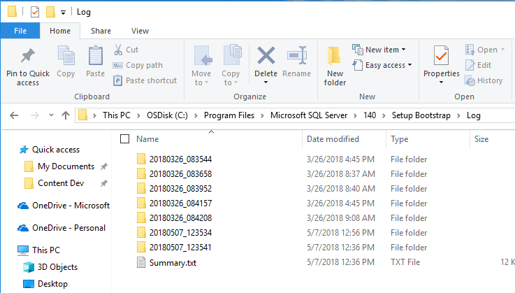

# View and Read SQL Server Setup Log Files

[!INCLUDE [SQL Server -Windows Only](../../includes/applies-to-version/sql-windows-only.md)]

SQL Server Setup creates log files in a dated and time-stamped folder within **\%programfiles%\Microsoft SQL Server\\*nnn*\Setup Bootstrap\Log** by default, where *nnn* are numbers that correspond to the version of SQL that's being installed. The time-stamped log folder name format is YYYYMMDD_hhmmss. When Setup is executed in unattended mode, the logs are created within %temp%\sqlsetup*.log. All files in the log folder are archived into the Log\*.cab file in their respective log folder.  

   | File           | Path |
   | :------        | :----------------------------- |
   | **Summary.txt**    | \%programfiles%\Microsoft SQL Server\\*nnn*\Setup Bootstrap\Log |
   | **Summary_\<MachineName>\_Date.txt**  | \%programfiles%\Microsoft SQL Server\\*nnn*\Setup Bootstrap\Log\YYYYMMDD_hhmmss |
   | **Detail.txt** | \%programfiles%\Microsoft SQL Server\\*nnn*\Setup Bootstrap\Log\YYYYMMDD_hhmmss|
   | **Datastore** | \%programfiles%\Microsoft SQL Server\\*nnn*\Setup Bootstrap\Log\YYYYMMDD_hhmmss\Datastore
   | **MSI Log Files** | \%programfiles%\Microsoft SQL Server\\*nnn*\Setup Bootstrap\Log\YYYYMMDD_hhmmss\\\<Name>.log|
   | **ConfigurationFile.ini** | \%programfiles%\Microsoft SQL Server\\*nnn*\Setup Bootstrap\Log\YYYYMMDD_hhmmss |
   | **SystemConfigurationCheck_Report.htm** | \%programfiles%\Microsoft SQL Server\\*nnn*\Setup Bootstrap\Log\YYYYMMDD_hhmmss |
   | **For unattended installations** | %temp%\sqlsetup*.log |

 

 >[!NOTE]
 > The numbers in the path *nnn* correspond to the version of SQL being installed. In the above picture, SQL 2017 was installed, so the folder is 140. For SQL 2016, the folder would be 130, and for SQL 2014 the folder would be 120.
  
 SQL server setup completes three basic phases: 
  
1.  Global Rules verification: validates basic system requirements
2.  Component update: checks to see if there are any updates available for the media being installed
3.  User-requested action: allows the user to select and customize features
  

This workflow produces a single summary log, and either a single detail log for a base SQL Server installation, or two detail logs for when update, such as a service pack, is installed along with the base installation. 
  
Additionally, there are datastore files that contain a snapshot of the state of all the configuration objects that are being tracked by the setup process, and are useful for troubleshooting configuration errors. XML dump files are created for each execution phase and are saved in the Datastore log subfolder under the time-stamped log folder. 

The following sections describe [!INCLUDE[ssNoVersion](../../includes/ssnoversion-md.md)] Setup log files.  
  
## Summary.txt file 
  
### Overview  
 This file shows the [!INCLUDE[ssNoVersion](../../includes/ssnoversion-md.md)] components that were detected during Setup, the operating system environment, command-line parameter values if they are specified, and the overall status of each MSI/MSP that was executed.
  
 The log is organized into the following sections:
  
-   An overall summary of the execution  
-   Properties and the configuration of the computer where [!INCLUDE[ssNoVersion](../../includes/ssnoversion-md.md)] Setup was run  
-   [!INCLUDE[ssNoVersion](../../includes/ssnoversion-md.md)] product features previously installed on the computer  
-   Description of the installation version and installation package properties
-   Runtime input settings that are provided during install  
-   Location of the configuration file  
-   Details of the execution results  
-   Global rules  
-   Rules specific to the installation scenario  
-   Failed rules  
-   Location of the rules report file

  >[!NOTE]
  > Note that when patching there can be a number of sub folders (one for each instance being patched, and one for shared features) which contain a similar set of files (i.e. %programfiles%\MicrosoftSQL Server\130\Setup Bootstrap\Log\<YYYYMMDD_HHMM>\MSSQLSERVER). 
  
### Location  
 The summary.txt is located within %programfiles%\\[!INCLUDE[msCoName](../../includes/msconame-md.md)] [!INCLUDE[ssNoVersion](../../includes/ssnoversion-md.md)]\\*nnn*\Setup Bootstrap\Log\\.
  
 To find errors in the summary text file, search the file by using the "error" or "failed" keywords.
  
## Summary_\<MachineName>_YYYYMMDD_HHMMss.txt file
  
### Overview  
 The summary_engine base file is similar to the summary file and is generated during the main workflow.
  
### Location  
 The Summary_\<MachineName>_YYYYMMDD_HHMMss.txt file is located at %programfiles%\\[!INCLUDE[msCoName](../../includes/msconame-md.md)] [!INCLUDE[ssNoVersion](../../includes/ssnoversion-md.md)]\\*nnn*\Setup Bootstrap\Log\\<YYYYMMDD_HHMM>\\.
  
  
## Detail.txt file
  
### Overview
 Detail.txt is generated for the main workflow such as install or upgrade, and provides the details of the execution. The logs in the file are generated based on the time when each action for the installation was invoked. The text file shows the order in which the actions were executed, as well as their dependencies.  
  
### Location  
 The detail.txt file is located within %programfiles%\\[!INCLUDE[msCoName](../../includes/msconame-md.md)] [!INCLUDE[ssNoVersion](../../includes/ssnoversion-md.md)]\\*nnn*\Setup Bootstrap\Log\\<YYYYMMDD_HHMM>\Detail.txt.  
  
 If an error occurs during the Setup process, the exception or error is logged at the end of this file. To find the errors in this file, first examine the end of the file followed by a search of the file for the "error" or "exception" keywords
    
## MSI log files
  
### Overview  
 The MSI log files provide details of the installation package process. They are generated by the MSIEXEC during the installation of the specified package.  
  
 Types of MSI log files:
  
-   \<Feature>_\<Architecture>\_\<Interaction>.log   
-   \<Feature>_\<Architecture>\_\<Language>\_\<Interaction>.log   
-   \<Feature>_\<Architecture>\_\<Interaction>\_\<workflow>.log  
  
### Location  
 The MSI log files are located at %programfiles%\\[!INCLUDE[msCoName](../../includes/msconame-md.md)] [!INCLUDE[ssNoVersion](../../includes/ssnoversion-md.md)]\\*nnn*\Setup Bootstrap\Log\\<YYYYMMDD_HHMM>\\<Name\>.log.  
  
 At the end of the file is a summary of the execution, which includes the success or failure status and properties. To find the error in the MSI file, search for "value 3" and review the text before and after.  
  
## ConfigurationFile.ini file
  
### Overview  
 The configuration file contains the input settings that are provided during installation. It can be used to restart the installation without having to enter the settings manually. However, passwords for the accounts, PID, and some parameters are not saved in the configuration file. The settings can be either added to the file or provided by using the command line or the Setup user interface. For more information, see [Install SQL Server 2016 Using a Configuration File](./install-sql-server-using-a-configuration-file.md).  
  
### Location  
 The ConfigurationFile.ini is located at %programfiles%\\[!INCLUDE[msCoName](../../includes/msconame-md.md)] [!INCLUDE[ssNoVersion](../../includes/ssnoversion-md.md)]\\*nnn*\Setup Bootstrap\Log\\<YYYYMMDD_HHMM>\\.  
  
## SystemConfigurationCheck_Report.htm file
  
### Overview  
 The system configuration check report contains a short description for each executed rule, and the execution status.
  
### Location  
The SystemConfigurationCheck_Report.htm is located at %programfiles%\\[!INCLUDE[msCoName](../../includes/msconame-md.md)] [!INCLUDE[ssNoVersion](../../includes/ssnoversion-md.md)]\\*nnn*\Setup Bootstrap\Log\\<YYYYMMDD_HHMM>\\.

[!INCLUDE[get-help-options](../../includes/paragraph-content/get-help-options.md)]
  
## See also  
 [Install SQL Server 2019](../../database-engine/install-windows/install-sql-server.md)