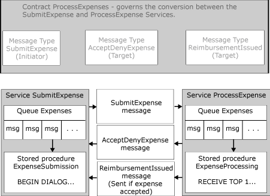

# Building Applications with Service Broker

[!INCLUDE [sql-asdbmi](../../includes/applies-to-version/sql-asdbmi.md)]

Any program that can run Transact-SQL statements can use Service Broker. A Service Broker application can be implemented as a program running outside of SQL Server, or as a stored procedure written in Transact-SQL or a .NET language.

A program that uses Service Broker is typically composed of a number of components working together to accomplish a task. A program that initiates a conversation creates and sends a message to another service. That program may wait for a response, or exit immediately and rely on another program to process the response. For a service that is the target of a conversation, the program receives an incoming message from the queue for the service, reads the message data, does any necessary processing, and then creates and sends a response message if appropriate.

Service Broker extends Transact-SQL. An application does not need a special object model or library to work with Service Broker. Instead, programs send Transact-SQL commands to SQL Server and process the results of those commands. An application can be activated by Service Broker, can run as a background service, can run as a scheduled job, or can be started in response to an event. For more information on strategies for starting an application that uses Service Broker, see [Choosing a Startup Strategy](choosing-a-startup-strategy.md).

For information on creating applications with Service Broker, see [Benefits of Programming with Service Broker](benefits-of-programming-with-service-broker.md).

## Service Broker Application Overview

The following illustration shows the interaction in an application that uses Service Broker:

As shown in the illustration, the **SubmitExpense**, **AcceptDenyExpense**, and **ReimbursementIssued** message types are created first. The **ProcessExpenses** contract is created based on these message types and provides a schema for having a conversation to complete an expense reimbursement task. The **ProcessExpenses** contract governs all conversations between the **ProcessExpense** service and the **SubmitExpense** service. The **ProcessExpenses** contract and the message types that it uses must exist in the databases of all services that have conversations based on this contract.

Service Broker stores messages sent to the **SubmitExpense** service on the queue for that service. The **ExpenseSubmission** stored procedure receives messages from this queue, processes them, and sends messages to another service if a reply is necessary.

Service Broker stores messages sent to the **ProcessExpense** service on the queue for that service. The **ExpenseProcessing** stored procedure receives messages from this queue, processes them, and sends messages to another service if a reply is necessary.

A conversation between these two services would be structured as follows:

- A user submits an expense reimbursement request through a user interface. The application runs the **ExpenseSubmission** stored procedure, which creates a **SubmitExpense** message. The **SubmitExpense** service starts a conversation with the **ProcessExpense** service, then sends the **SubmitExpense** message to the **ProcessExpense** service.

- Service Broker receives the **SubmitExpense** message for the **ProcessExpense** service and puts the message on the **ExpenseQueue** queue. The **ExpenseQueue** queue activates the **ProcessExpense** stored procedure, which dequeues and processes the **SubmitExpense** message. The **ProcessExpense** stored procedure then creates an **AcceptDenyExpense** message and sends this message to the **SubmitExpense** service. If the expense is denied, the **ProcessExpense** stored procedure ends the conversation.

- Service Broker puts the **AcceptDenyExpense** message for the **SubmitExpense** service on the queue for the service. If the **ProcessExpense** procedure ended the conversation, Service Broker puts an **EndDialog** message on the **Expenses** queue. The queue activates the **ExpenseSubmission** stored procedure, which dequeues and processes the **AcceptDenyExpense** message. If the **ExpenseSubmission** stored procedure finds an **EndDialog** message on the queue, the procedure ends the conversation.

- If the expense was accepted, the **ProcessExpense** service creates and sends a **ReimbursementIssued** message confirming that the expense payment has been issued, and then ends the conversation. Service Broker puts these messages on the queue for the service. The queue activates the **ExpenseSubmission** procedure, and the procedure processes the **ReimbursementIssued** message. The procedure then processes the **EndDialog** message and ends the conversation.

## See also

- [Creating Service Broker Applications](creating-service-broker-applications.md)
- [Benefits of Programming with Service Broker](benefits-of-programming-with-service-broker.md)