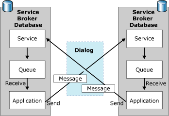

# Dialog Conversations

[!INCLUDE [sql-asdbmi](../../includes/applies-to-version/sql-asdbmi.md)]

All messages sent by Service Broker are part of a conversation. A dialog is a conversation between two services. A dialog is a reliable, persistent bidirectional stream of messages between two services.

Dialogs provide exactly-once-in-order (EOIO) message delivery. Dialogs use the conversation identifier and sequence numbers that are contained in each message to identify related messages and deliver messages in the correct order. A dialog is a reliable, persistent stream of messages between two services.

A dialog conversation has two participants. The initiator starts the conversation. The target accepts a conversation begun by the initiator. Whether a participant starts the conversation determines the messages that the participant can send, as specified in the contract for the conversation. The following diagram shows the message flow of a dialog:

Applications exchange messages as part of the dialog. When SQL Server receives a message for a dialog, SQL Server puts the message in the queue for the dialog. The application receives the message from the queue and processes the message as necessary. As part of the processing, the application might send messages to the other participant in the dialog.

## Reliable Delivery

Dialogs incorporate automatic message receipt acknowledgments to ensure reliable delivery. Service Broker saves each outgoing message in the transmission queue until the message is acknowledged by the remote service. These automatic acknowledgments save time and resources by making it unnecessary for an application to explicitly acknowledge each message. Where possible, acknowledgment messages are included as part of return messages for the dialog.

> [!NOTE]
> Service Broker handles acknowledgment messages internally. These messages do not appear in a queue, and are not delivered to the application.Service Broker does not consider it to be an error for a remote service to become unreachable. When a remote service is unreachable, Service Broker holds messages for that service until the service becomes reachable or the dialog lifetime expires.

## Dialog Lifetime

Messages can be exchanged between applications during the lifetime of the dialog. The lifetime of a dialog lasts from the time that the local SQL Server instance creates the dialog until an application either explicitly ends the dialog or receives an error message associated with the dialog. Each participant is responsible for explicitly ending the conversation when the application receives a message that indicates an error or the end of the conversation. In most services, one participant is responsible for indicating that the conversation is complete and successful by ending the conversation without an error. Whether this is done by the target or the initiator depends on the purpose of the conversation.

The local Service Broker for an initiating application creates a conversation endpoint for the dialog when the application starts the dialog. The local Service Broker for a target application creates a conversation endpoint for the dialog when the instance receives the first message on the dialog.

Dialogs can also guarantee that the lifetime of a conversation does not exceed a specified limit. The initiating application can optionally specify a maximum lifetime for the dialog. Both the local Service Broker and the remote Service Broker keep track of this lifetime. When a dialog remains active at the maximum lifetime, each side of the conversation puts a time-out error message on the service queue and refuses new messages for the dialog. Conversations never live beyond the maximum lifetime that is established when the dialog starts. Notice that, while an application can still receive messages for the conversation after the conversation ends, no new messages can arrive for that conversation The application cannot send messages about the conversation.

Applications are responsible for indicating when they are finished with a dialog by explicitly ending the dialog. Service Broker never ends a dialog automatically. The dialog remains in the database until an application explicitly ends the conversation. Therefore, even when the dialog times out or the broker reports an error, each participant in the conversation must explicitly issue the END CONVERSATION statement.

## Conversation Timer

A conversation timer allows an application to receive a message at a specific time. When the conversation timer expires, SQL Server inserts a message for the conversation into the queue for the conversation, at the endpoint that started the conversation timer. An application can use a conversation timer for any purpose. One common use for a conversation timer is to respond to delays in responses from the remote service. Another common use is to create a service that sends messages to the remote service at set intervals. For example, a service might use a conversation timer to report on the current state of SQL Server every few minutes. Applications can also use a conversation timer to activate a stored procedure at a certain time. This allows Service Broker to support scheduled activities.

Each participant in a conversation can set one conversation timer per conversation. The conversation timer is not shared with the other participant, and the conversation timer does not affect the lifetime of the conversation. Instead, when the timer expires, the local Service Broker adds a time-out message to the queue for the local service. A time-out message has the type name `https://schemas.microsoft.com/SQL/ServiceBroker/DialogTimer`

## See also

- [BEGIN DIALOG CONVERSATION (Transact-SQL)](../../t-sql/statements/begin-dialog-conversation-transact-sql.md)
- [BEGIN CONVERSATION TIMER (Transact-SQL)](../../t-sql/statements/begin-conversation-timer-transact-sql.md)
- [END CONVERSATION (Transact-SQL)](../../t-sql/statements/end-conversation-transact-sql.md)
- [SEND (Transact-SQL)](../../t-sql/statements/send-transact-sql.md)
- [RECEIVE (Transact-SQL)](../../t-sql/statements/receive-transact-sql.md)
- [sys.transmission_queue (Transact-SQL)](../../relational-databases/system-catalog-views/sys-transmission-queue-transact-sql.md)
- [Broker System Messages](broker-system-messages.md)
