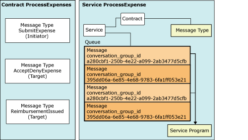

# Service Architecture

[!INCLUDE [sql-asdbmi](../../includes/applies-to-version/sql-asdbmi.md)]

This section describes the database objects that specify the basic design of an application that uses Service Broker.

At design time, Service Broker applications specify the following objects:

- Message types - Define the names of the messages exchanged between applications. Optionally provide validation for the messages.

- Contracts- Specify the direction and type of messages in a given conversation.

- Queues- Store messages. This storage mechanism allows for asynchronous communication between services. Service Broker queues provide additional benefits, such as automatically locking messages in the same conversation group.

- Services- Are addressable endpoints for conversations. Service Broker messages are sent from one service to another service. A service specifies a queue to hold messages, and specifies the contracts for which the service can be the target. A contract provides a service with a well-defined set of message types.

A Service Broker application uses the SQL Server objects in the preceding list to conduct a conversation. Any program that can run Transact-SQL statements in SQL Server can use Service Broker. Applications can be stored procedures written in Transact-SQL or a CLR-compliant language, or they can be external programs that connect to an instance of SQL Server.

The following diagram shows a Service Broker service:

As shown in the illustration, the **ProcessExpenses** contract specifies three message types: **SubmitExpense**, **AcceptDenyExpense**, and **ReimbursementIssued**. The contract lists the message types required for a conversation that performs an expense reimbursement task. The **ProcessExpenses** contract governs all conversations between the **ProcessExpense** service and any services that initiate a conversation with the **ProcessExpense** service. The **ProcessExpense** service stores incoming and outgoing messages in the **ExpenseQueue** queue. The **ExpenseProcessing** stored procedure receives messages from this queue, processes the messages, and sends messages back to the queue for routing to the appropriate broker if a reply is necessary.

## In This Section

- [Message Types](message-types.md)  
    Participants in a conversation must agree on the name and content of each message. Message types define names and content.

- [Contracts](contracts.md)  
    Contracts defines which message types an application uses to accomplish a particular task.

- [Queues](queues.md)  
    Queues store Service Broker messages.

- [Services](services.md)  
    Service Broker services are names for specific business tasks or sets of business tasks.

## See also

- [Building Applications with Service Broker](building-applications-with-service-broker.md)
