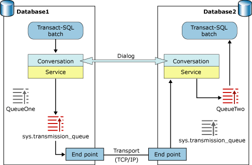

# Service Broker Communication Protocols

[!INCLUDE [sql-asdbmi](../../includes/applies-to-version/sql-asdbmi.md)]

Service Broker uses a broker-specific protocol to communicate with remote brokers. The broker manages connections separately from the normal pool of client connections. In order for two SQL Server instances to exchange Service Broker messages, each instance must be able to send TCP/IP traffic to the port that the other instance uses for Service Broker communications. By convention, Service Broker often uses port 4022 for broker-to-broker communication. However, the exact port is specified when the endpoint is created.

## Protocol Layers

Service Broker takes a layered approach to communication. Each layer builds on the underlying layer to help ensure reliable delivery. This approach allows an application to operate without knowledge of the location of the remote service or the physical transport that the broker uses to communicate. In most cases, these protocols are transparent to an application. However, understanding the role each protocol layer plays may help in troubleshooting problems with an application.

The highest-level protocol that the broker uses is the dialog protocol. The dialog protocol layer handles reliable, sequenced message transmission. The dialog protocol layer generates sequence numbers for messages, generates acknowledgment messages, delivers messages to the proper queues, and fragments and reassembles messages. The dialog protocol handles authentication and encryption for a dialog.

The dialog protocol uses the adjacent broker protocol to transmit message fragments. The adjacent broker protocol handles the network transmissions exchanged between two broker instances.

The adjacent broker protocol uses a transport protocol, such as TCP/IP, to move messages from broker to broker.

### Dialog Protocol

The dialog protocol manages the exactly-once-in-order (EOIO) delivery pattern for messages on a conversation. This protocol does not describe the format that Service Broker messages use on the network. Instead, the protocol specifies the logical steps required for a reliable conversation. The dialog protocol handles the tasks required for reliable delivery, including generating and processing acknowledgment messages.

Each side of a conversation is an endpoint in the dialog protocol layer The catalog view **sys.conversation_endpoints** shows information about dialog protocol endpoints. A conversation endpoint exists for the lifetime of the conversation.

### Adjacent Broker Protocol

The adjacent broker protocol layer handles the mechanics of communication between two SQL Server instances. This layer encodes each message fragment into a standard format suitable for transmission over the network. Unlike the dialog protocol layer, the adjacent protocol layer is aware of the network transport used, and formats the message fragments appropriately. In effect, the adjacent broker protocol layer provides an abstraction layer between the dialog protocol layer and the transport protocol layer.

Each Service Broker network connection is an endpoint in the adjacent protocol layer. The dynamic management view **sys.dm_broker_connections** shows information about Service Broker network connections. Service Broker maintains the network connection while messages are actively exchanged. Service Broker closes the network connection when no messages have been sent or received over the network connection for a short period of time.

### Transport Protocol

The transport protocol layer handles the actual network transmission. This layer is outside of Service Broker. For example, messages to a broker running in a different instance of SQL Server use TCP/IP as the transport protocol layer.

Service Broker endpoints set options for the transport protocol. SQL Server does not contain Service Broker endpoints by default. For more information on creating a Service Broker endpoint, see [How to: Activate Service Broker Networking (Transact-SQL)](how-to-activate-service-broker-networking-transact-sql.md).

## Service Broker Message Processing

Service Broker uses two distinct categories of message. A sequenced message is a message that must be delivered to an application exactly once, in order. An unsequenced message is a message that can be processed immediately, regardless of the sequence in which the message arrives.

Service Broker uses sequenced messages for all user-defined message types, end dialog messages, and error messages created by an application. Each sequenced message has a sequence number. The instance that originates the message creates the message sequence number and assigns the sequence number to the message. The receiving broker uses the message sequence number to order the messages it provides to an application. For a given dialog, the application always receives the message with the lowest sequence number first. Service Broker also uses the message sequence number to detect duplicate messages. When the dialog protocol layer receives two messages on the same dialog with the same sequence number, the dialog protocol layer considers the messages to be duplicates and discards one.

Service Broker uses unsequenced messages for dedicated acknowledgment messages and error messages created by Service Broker. Service Broker takes no special precautions to deliver an unsequenced message. Notice, however, that Service Broker creates unsequenced messages in response to incoming messages. Therefore, if the unsequenced message is lost, the sender will retry the original message; the recipient then generates another unsequenced message.

### Message Fragmentation

Service Broker splits outgoing messages into fragments, and combines incoming fragments into the original message. For small messages, the entire message is contained in one fragment. For large messages, Service Broker creates many fragments.

Fragmenting messages has several advantages. Sending a large message in small fragments improves overall speed and reliability when communicating over relatively slow and unreliable networks such as Wide-Area Networks (WANs). If a fragment of the message is lost, the protocol retransmits only one fragment instead of the complete message. Fragmenting large messages can also reduce the time required for a small message to reach the destination. Service Broker can send a fragment that contains a complete small message between fragments of a large message. This slows down the large message slightly in order to reduce the time that the small message waits to be transmitted.

While a message is being reassembled, the partial message is stored in the destination queue. If the destination queue is not available, it is stored in the transmission queue. A partial message cannot be received by an application. The **status** column for a partial message is set to **2** (Disabled). This value is also used for messages received out of order.

### Message Acknowledgement

Service Broker acknowledges each message received. An acknowledgment can acknowledge one or several message fragments. If possible, an acknowledgment is included in the header of a message returned on the same conversation. If no other messages are ready to be sent, Service Broker returns a dedicated acknowledgment message. Message acknowledgment is handled entirely by Service Broker; an application that uses Service Broker does not receive these messages.

A sender retains message fragments that the receiver has not acknowledged. If no acknowledgment is received within a system-defined wait time, the sender sends the message fragment again. If no acknowledgment is received during the wait time, Service Broker exponentially increases the amount of time before the next retry, up to a maximum wait time. The initial wait time for a retry is a few seconds. The maximum wait time is approximately one minute. Notice that the wait time is not intended to be precise; depending on network traffic and the other activity in the SQL Server instance, a message fragment may not be retried for a few seconds after the wait time expires.

If an acknowledgment is lost or delayed, the recipient may receive duplicate messages. In this case, the recipient acknowledges receipt of the duplicate message, but does not deliver the duplicate message to the queue.

Service Broker uses message acknowledgment to provide reliable messaging without distributed transactions. A recipient sends an acknowledgment only after adding the message or message fragment to the queue. The sender holds the message in the transmission queue until the acknowledgment for that message arrives. Although the sender and the recipient never share a transaction, the protocol guarantees that the sender does not remove the message from the transmission queue until the recipient has successfully received the message.

### Message Integrity Check

The format that Service Broker uses to transmit messages includes a message integrity check to determine whether a given message has been altered or corrupted during transport.

The message integrity check is an MD5 signature for the contents of the message. SQL Server encrypts the signature with the session key for the message, and includes the signature in the message headers.

The destination for the message decrypts the message, and then compares the signature in the message to a new signature computed over the actual contents received. If the signatures do not match, the message has been damaged or tampered with during transmission. The message fails the message integrity check. SQL Server discards the message and does not acknowledge the message to the sender. The **Broker:Corrupted Message** event class reports information when a message fails the message integrity check.

## Service Broker Transmission Objects

A Service Broker transmission object is an in-memory object that manages and records the state of message transmissions for a dialog. Each conversation endpoint has one transmission object.

A dialog requests a transmission object when it does the following:

- Sends a message through the transmission queue. This includes the following:

    - All messages sent to a remote instance of the Database Engine

    - Messages to sent queues in the local instance if the message cannot be directly inserted into the destination queue

- Receives either a remote message or a message that comes from a local transmission queue.

A transmission object is created the first time that a dialog requests one. Service Broker uses the same transmission object for subsequent requests from that dialog. Transmission objects are modified every time that Service Broker has to record a change in the state of transmissions for the dialog. Transmission objects are about 1 KB.

To free memory, Service Broker periodically stores batches of inactive transmission objects in **tempdb** work tables. When a transmission object is first modified in memory it is marked as dirty. The transmission object remains marked as dirty until it is flushed to a work table.

Transmission objects are not used for either sending or receiving local messages that can be inserted directly into the destination queue.

## Network Communication Flow

The following illustration presents a high-level view of Service Broker network communication between two SQL Server instances.

Notice that the conversation is a persistent, logical connection. The conversation can occur over any period of time, and during that period of time, the conversation can use any number of network connections.

Network connections occur between two Service Broker endpoints. These connections use TCP/IP. If the connection is inactive for a short time, SQL Server closes the network connection.

To deliver a message, Service Broker holds the message in the transmission queue for the database that sent the message. The recipient delivers the message directly to the queue for the destination service. If that queue is OFF, the message is held temporarily in the transmission queue for the receiving database. The queue for the sending service is not involved in the operation. The transmission queue for the database that hosts the receiving service is only involved if the destination queue is OFF.

## See also

- [Service Broker Routing](service-broker-routing.md)
