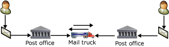

# What Does Service Broker Do?

[!INCLUDE [sql-asdbmi](../../includes/applies-to-version/sql-asdbmi.md)]

Service Broker helps developers build asynchronous, loosely coupled applications in which independent components work together to accomplish a task. These application components exchange messages that contain the information that is required to complete the task. This topic describes the following aspects of Service Broker:

- Conversations

- Message ordering and coordination

- Transactional asynchronous programming

- Support for loosely coupled applications

- Service Broker components

## Conversations

Service Broker is designed around the basic functions of sending and receiving messages. Each message forms part of a conversation. Each conversation is a reliable, persistent communication channel. Each message and conversation has a specific type that Service Broker enforces to help developers write reliable applications.

New Transact-SQL statements let applications reliably send and receive these messages. An application sends messages to a service, which is a name for a set of related tasks. An application receives messages from a queue, which is a view of an internal table.

Messages for the same task are part of the same conversation. Within each conversation, Service Broker guarantees that an application receives each message exactly once, in the order in which the message was sent. The program that implements a service can associate related conversations for the same service in a conversation group.

Certificate-based security helps you protect sensitive messages and control access to services. An analogy is to think of Service Broker being like a postal service. To hold a conversation with a distant colleague, you can communicate by sending letters through the postal service. The postal service sorts and delivers the letters. You and your colleague then retrieve the letters from your mailboxes, read them, write responses, and send new letters until the conversation has ended. Letter delivery occurs asynchronously while you and your colleague handle other tasks.

Programs can use Service Broker like a postal service to support asynchronous conversations with other programs. The Service Broker messages function like letters. A Service Broker service is the address where the post office delivers the letters. Queues are the mailboxes that hold the letters after they are delivered. Applications receive the messages, act on the messages, and send responses.

When an application sends a message to a Service Broker service, it is isolated from the implementation details of the application on the other end of the conversation. The receiving application can be dynamically reconfigured or replaced with new code without affecting the sending application. The receiving application can even be shut down temporarily; the only impact will be that Service Broker keeps adding new messages to the queue until the receiving application is restarted.

## Message Ordering and Coordination

Service Broker handles queuing, a common database programming technique, differently from traditional products in two key respects:

- Service Broker queues are integrated into the database.

- The queues coordinate and order related messages.

Integrated queuing means that regular database maintenance and administration also include Service Broker. Typically an administrator has no routine maintenance tasks related to Service Broker.

The Service Broker framework provides a simple Transact-SQL interface for sending and receiving messages combined with a set of strong guarantees for message delivery and processing. Service Broker guarantees that a program receives each message in a conversation exactly once in the order in which the message was sent, not the order in which the message entered the queue. Traditional queuing products provide messages in the order in which the messages entered the queue. This requires an application to determine the order and grouping of messages. Service Broker guarantees that two queue readers cannot simultaneously process messages from the same conversation or the same group of related conversations.

Each Service Broker conversation has two sides. The side that starts the conversation is called the initiator; the other side is called the target. Each side has a service; the initiator service and the target service. Each service has an associated message queue.

The following illustrates the exchange of messages in a typical dialog conversation:

- At the initiator:

- A program begins the conversation.

- The program builds a message that contains the data required to perform a task.

- The program sends the message to the target service.

- At the target:

  - The message is placed in the queue associated with the target service.

  - A program receives the message from the queue and performs the work.

  - The program responds by sending a message to the initiator service.

- At the initiator:

  - The response message is placed in the queue associated with the initiator service.

  - A program receives the response and processes it.

This cycle repeats until the initiator ends the conversation because it has no more requests to send to the target.

Service Broker supports setting priorities from 10 (high) to 1 (low) for each conversation. This ensures that low priority work does not block higher priority work. Service Broker systems can be configured to offer varying levels of service. For more information, see [Conversation Priorities](conversation-priorities.md).

Service Broker handles the most difficult tasks involved in writing messaging applications. These difficult tasks include message coordination, reliable message delivery, locking, and starting queue readers. This lets database developers concentrate on how to solve business problems.

## Transactional Asynchronous Programming

In the Service Broker infrastructure, message delivery between applications is transactional and asynchronous. Because Service Broker messaging is transactional, if a transaction rolls back, all Service Broker operations in the transaction roll back. These include send and receive operations. In asynchronous delivery, the Database Engine handles delivery while the application continues to run. To improve scalability, Service Broker provides mechanisms for automatically starting programs that process a queue when there is useful work for the program to do. For more information, see [Service Broker Activation](service-broker-activation.md).

Asynchronous programming helps developers write applications that use queuing. Many database applications include tables that function as queues of work to be accomplished as resources allow. Queues can deliver two benefits to database applications:

- An application can respond to an interactive user immediately after placing their work request in a queue. The application does not have to wait for all of the work associated with the request to be completed before responding. The queued request is processed when resources are available. This lets the database remain responsive for interactive users and efficiently use available resources.

- The work involved in a single request can sometimes be divided into multiple units of work processed as separate transactions. In this case, a database application can launch each unit of work by placing a request in a queue. Service Broker extends this idea, letting applications spread work across multiple instances of the Service Broker on separate computers.

Coding applications to correctly sequence and process items in queues is often complicated. Developers can use the Service Broker functionality built into the Database Engine to simplify the coding needed to successfully implement database queues.

## Support for Loosely Coupled Applications

Service Broker supports loosely coupled applications. Loosely coupled applications are composed of multiple programs that send and receive messages independently of each other. Such applications must contain the same definitions for the exchanged messages, and must define the same overall structure for the interaction between the services. However, the applications do not have to run at the same time, run in the same SQL Server instance, or share implementation details. An application does not have to know the physical location or the implementation of the other participant in the conversation.

## Service Broker Components

Service Broker has three types of components:

- **Conversation components.** Conversation groups, conversations, and messages form the run-time structure of a Service Broker application. Applications exchange messages as part of a conversation. Each conversation is part of one conversation group, and a conversation group can contain multiple conversations. Each Service Broker conversation is a dialog. A dialog is a conversation where exactly two participants exchange messages. For more information about conversation components, see [Conversation Architecture](conversation-architecture.md).

- **Service definition components.** These are design-time components that specify the basic structure of the conversations that the application uses. They define the message types for the application, the conversation flow for the application, and the database storage for the application. For more information about service definition components, see [Service Architecture](service-architecture.md).

- **Networking and security components.** These components define the infrastructure used to exchange messages between instances of the Database Engine. To help database administrators manage changing environments, Service Broker lets administrators configure these components independently of the application code. For more information about networking and security components, see [Networking and Remote Security](networking-and-remote-security.md).

Service definition components, networking components, and security components are part of the metadata for the database and the SQL Server instance. Conversation groups, conversations, and messages are part of the data that the database contains.

## See also

- [Service Broker Scalability](service-broker-scalability.md)
- [Service Broker Activation](service-broker-activation.md)
- [Logical Architecture](logical-architecture.md)