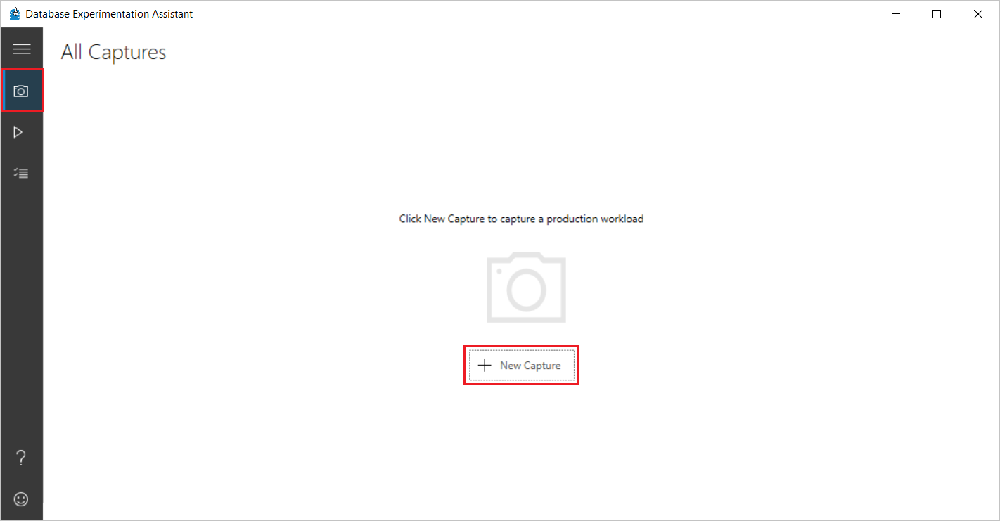
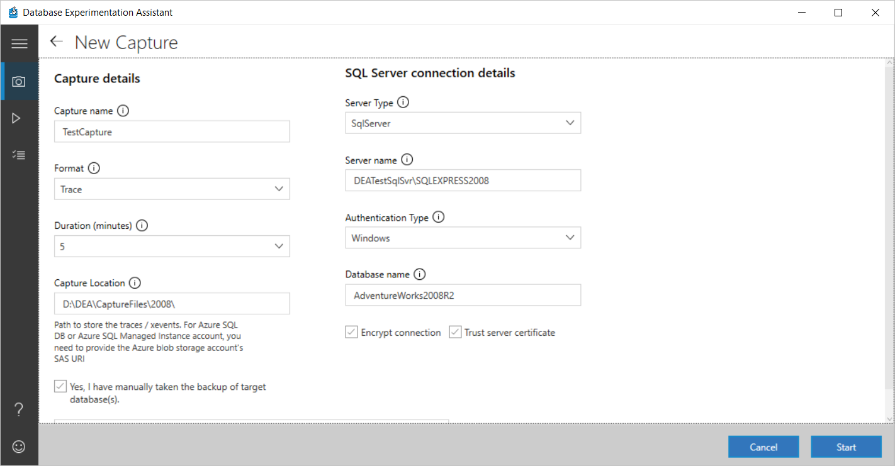
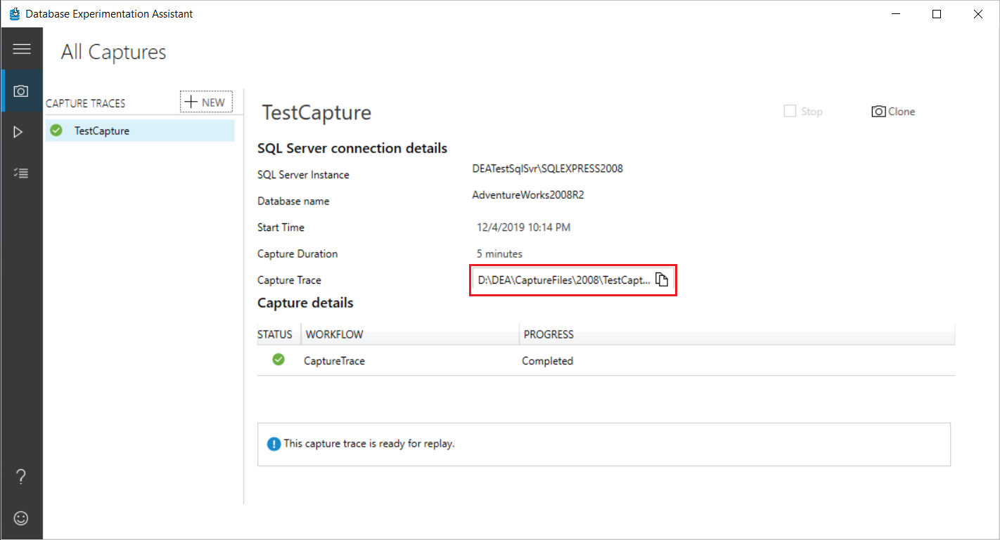

# Capture a trace in Database Experimentation Assistant

You can use Database Experimentation Assistant (DEA) to create a trace file with a log of captured server events. A captured server event is an event that occurs on a specific server during a specific time period. A trace capture must be run one time per server.

Before you start a trace capture, make sure that you back up all target databases.

Query caching in SQL Server might affect evaluation results. We recommend that you restart the SQL Server service (MSSQLSERVER) in the services application to improve the consistency of evaluation results.

## Configure a trace capture

1. In DEA, on the left-hand navigation bar, select the camera icon, and then on the **All Captures** page, select **New Capture**.

    

2. On the **New Capture** page, under **Capture details**, enter or select the following information:

    - **Capture name**: Enter a name for the trace file for your capture.
    - **Format**: Specify the format (Trace or XEvents) for the capture.
    - **Duration**: Select the length of time (in minutes) that you want the trace capture to run.
    - **Capture Location**: Select the destination path for the trace file.

        > [!NOTE]
        > The file path to the trace file must be on the computer that's running SQL Server. If the SQL Server service isn't set for a specific account, the service might need write permissions to the specified folder for the trace file to be written.

3. Verify that you have taken a backup by selecting the **Yes, I have manually taken the backup…** check box.

4. Under **Capture details**, enter or select the following information:

    - **Server Type**: Specify the type of the SQL server (**SqlServer**, **AzureSqlDb**, **AzureSqlManagedInstance**).
    - **Server name**: Specify the server name or IP address of your SQL Server.
    - **Authentication Type**: For the authentication type, select **Windows**.
    - **Database name**: Enter a name for a database on which to start a database trace. If you don't specify a database, trace is captured on all the databases on the server.

5. Select or deselect the **Encrypt connection** and **Trust server certificate** check boxes as appropriate for your scenario.

    

## Start the trace capture

1. After you enter or select the required information, select **Start** to initiate the trace capture.

    If the information you entered is valid, the trace capture process begins. Otherwise, text boxes with invalid entries are highlighted in red. If you do encounter errors, correct any necessary entries, and then select **Start** again.

    While the trace capture is running, under **Capture details**, the status and progress of the trace capture process is displayed.

    

2. When the trace capture is finished running, the new trace (.trc) file is saved in the **Capture location** you specific during initial configuration.

    

    The trace file includes trace results of the activity of a SQL Server database. .trc files are designed to provide more information about errors that are detected and reported by SQL Server.

## Frequently asked questions about trace capture

Following are some frequently asked questions about trace capture in DEA.

**Q: What events are captured when I run a trace capture on a production database?**

The following table lists the events and corresponding column data that DEA collects for traces:
  
|Event Name|Text Data (1)|Binary Data (2)|Database ID (3)|Host Name (8)|Application Name (10)|Login Name (11)|SPID (12)|Start Time (14)|End Time (15)|Database Name (35)|Event Sequence (51)|IsSystem (60)|  
|---|---|---|---|---|---|---|---|---|---|---|---|---|  
|**RPC:Completed (10)**||*|*|*|*|*|*|*|*|*|*|*|  
|**RPC:Starting (11)**||*|*|*|*|*|*|*||*|*|*|  
|**RPC Output Parameter (100)**|*||*|*|*|*|*|*||*|*|*|  
|**SQL:BatchCompleted (12)**|*||*|*|*|*|*|*|*|*|*|*|  
|**SQL:BatchStarting (13)**|*||*|*|*|*|*|*||*|*|*|  
|**Audit Login (14)**|*|*|*|*|*|*|*|*||*|*|*|  
|**Audit Logout (15)**|*||*|*|*|*|*|*|*|*|*|*|  
|**ExistingConnection (17)**|*|*|*|*|*|*|*|*||*|*|*|  
|**CursorOpen (53)**|*||*|*|*|*|*|*||*|*|*|  
|**CursorPrepare (70)**|*||*|*|*|*|*|*||*|*|*|  
|**Prepare SQL (71)**|||*|*|*|*|*|*||*|*|*|  
|**Exec Prepared SQL (72)**|||*|*|*|*|*|*||*|*|*|  
|**CursorExecute (74)**|*||*|*|*|*|*|*||*|*|*|  
|**CursorUnprepare (77)**|*||*|*|*|*|*|*||*|*|*|  
|**CursorClose (78)**|*||*|*|*|*|*|*||*|*|*|  

**Q: Is there a performance effect on my production server when trace capture is running?**

Yes, there's a minimal performance effect during trace collection. In our tests, we found about a 3% memory pressure.

**Q: What kind of permissions are required for capturing traces on a production workload?**

- The Windows user that runs the trace operation in the DEA application must have sysadmin rights on the computer that's running SQL Server.
- The service account used on the computer running SQL Server must have write access to the specified trace file path.

**Q: Can I capture traces for the entire server or only on a single database?**

You can use DEA to capture traces for all databases in the server or for a single database.

**Q: I have a linked server configured in my production environment. Do those queries show up in the traces?**

If you're running a trace capture for the entire server, the trace captures all queries, including the linked server queries. To run a trace capture for the entire server, leave the **Database name** box under **New Capture** empty.

**Q:  What's the minimum recommended time for production workload traces?**

We recommend that you choose a time that best represents the entirety of your workload. That way, the analysis runs on all the queries in your workload.

**Q: How important is to take a database backup right before I start a trace capture?**

Before you start a trace capture, make sure that you back up all your target databases. The captured trace in Target 1 and Target 2 is replayed. If the database state isn't the same, the results of the experimentation are skewed.

**Q: Can I collect XEvents instead of traces, and can I replay XEvents?**

Yes. DEA supports XEvents. Download the latest version of DEA and give it a try.

## Troubleshoot trace captures

If you see an error when you run a trace capture, confirm that:

- The name of the computer running SQL Server is valid. To confirm, try to connect to the computer running SQL Server by using SQL Server Management Studio (SSMS).
- Your firewall configuration doesn't block connections to the computer running SQL Server.
- The user has the permissions that are listed in the [Replay FAQ](./database-experimentation-assistant-replay-trace.md#frequently-asked-questions-about-trace-replay).
- The trace name doesn't follow the standard rollover convention (Capture\_1). Instead, try trace names like Capture\_1A or Capture1.

Following are some possible errors you might see and solutions for resolving them:

|Possible errors|Solution|  
|---|---|  
|Unable to start the trace on the target SQL Server, check whether you have the required permissions and that the SQL Server account has write access to the specified trace file path Sql Error Code (53)|The user running the DEA tool must have access to the computer running SQL Server. The user must be assigned the sysadmin role.|  
|Unable to start the trace on the target SQL Server, check whether you have the required permissions and that the SQL Server account has write access to the specified trace file path Sql Error Code (19062)|The trace path specified might not exist or the folder doesn't have write permissions for the account under which SQL Server services are running (for example, NETWORK SERVICE). The path must exist, and it must have the required permissions for the trace to start.|  
|A DEA trace currently is running on the target server.|An active trace is already running on the target server. You can't start a new trace when a server-wide trace is already running.|  
|Can't open the requested database for capturing trace. This error might be caused by an incorrect database name.|The specified database doesn't exist, or it's not accessible to the current user. Use the correct database name.|  

If you see any other errors labeled *Sql Error Code*, see [Database Engine Errors](../relational-databases/errors-events/database-engine-events-and-errors.md) for detailed descriptions.

## See also

- To learn how to configure the Distributed Replay tools in SQL Server before you replay a captured trace, see [Configure Distributed Replay for Database Experimentation Assistant](database-experimentation-assistant-configure-replay.md).