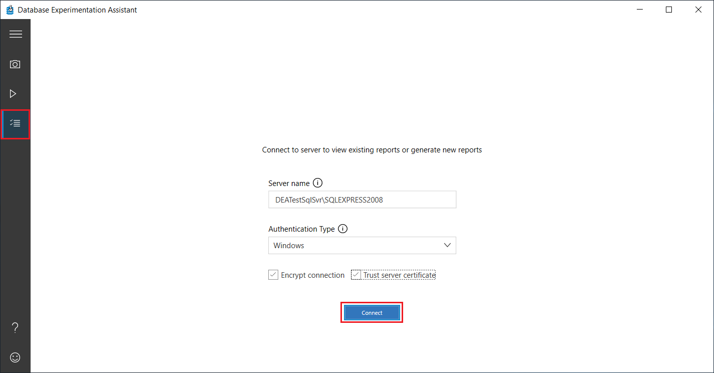
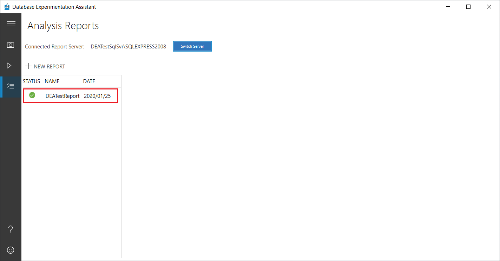

# Create analysis reports in Database Experimentation Assistant (SQL Server)

After you replay the source trace on both of your target servers, you can generate an analysis report in Database Experimentation Assistant (DEA). Analysis reports help you gain insights about the performance implications of proposed changes.

## Create an analysis report

1. In DEA, select the list icon, specify the server name and authentication type, select or deselect the **Encrypt connection** and **Trust server certificate** check boxes as appropriate for your scenario, and then select **Connect**.

   

2. On the **Analysis Reports** screen, select **New analysis report**.

   

3. On the **New analysis report** screen, specify a name for the report, the storage location and path to the Target 1 and Target 2 trace files, and then select **Start**.

   

   If the information you entered is valid, the analysis report is created.

   

      > [!NOTE]
      > If any of the the information you entered is invalid, the text boxes containing the incorrect  information are highlighted in red. Make any necessary corrections, and then select **Start** again.

## Frequently asked questions about analysis reports

**Q: What does my analysis report tell me?**

DEA uses statistical tests to analyze your workload and determine how each query ran from Target 1 to Target 2. It provides performance details for each query. Learn more about DEA in [Get started](database-experimentation-assistant-get-started.md).

**Q: Can I create a new analysis report while another report is being generated?**

No.  Currently, only one report can be generated at a time to prevent conflicts. However, you can run more than one capture and replay at the same time.

**Q: Can I generate an analysis report by using the command prompt?**

Yes. You can generate an analysis report at the command prompt. You can then view the report in the UI. For more information, see [Run at command prompt](database-experimentation-assistant-run-command-prompt.md).

## Troubleshoot analysis reports

**Q: What security permissions do I need to generate and view an analysis report on my server?**

The user who is logged in to DEA must have sysadmin rights on the analysis server. If the user is part of a group, make sure the group has sysadmin rights.

|Possible errors|Solution|  
|---|---|  
|Unable to connect to the database. Make sure you have sysadmin rights for analyzing and viewing the reports.|You might not have access or sysadmin rights to the server or database. Confirm your login rights and try again.|  
|Unable to generate **Report Name** on the server **Server Name**. For details, check the **Report Name** report.|You might not have the sysadmin rights needed to generate a new report. To see detailed errors, select the errored-out report and check the logs in %temp%\\DEA.|  
|The current user doesn't have the required permissions to run the operation. Make sure you have sysadmin rights for performing trace and analyzing the reports.|You don't have the sysadmin rights needed to generate a new report.|  

**Q: I can't connect to the computer running SQL Server**

- Confirm that the name of the computer running SQL Server is valid. To confirm, try to connect to the server by using SQL Server Management Studio (SSMS).
- Confirm that your firewall configuration doesn't block connections to the computer running SQL Server.
- Confirm that the user has the required user rights.

You can see more details in the logs in %temp%\\DEA. If the problem persists, contact the product team.

**Q: I see an error when I generate an analysis report**

Internet access is required the first time you generate an analysis report after installing DEA. Internet access is required to download packages that are required for statistical analysis.

If an error occurs while the report is created, the progress page shows the specific step at which analysis generation failed. You can see more details in the logs in %temp%\\DEA. Verify that you have a valid connection to the server with the required user rights, and then retry. If the problem persists, contact the product team.

|Possible errors|Solution|  
|---|---|  
|RInterop hit an error on startup. Check RInterop logs and try again.|DEA requires internet access to download dependent R packages. Check RInterop logs in %temp%\\RInterop and DEA logs in %temp%\\DEA. If RInterop was initialized incorrectly or if it initialized without the correct R packages, you might see the exception "Failed to generate new analysis report" after the InitializeRInterop step in the DEA logs.  The RInterop logs also might show an error similar to "there's no jsonlite package available." If your machine doesn't have internet access, you can manually download the required jsonlite R package:  <li>Go to the %userprofile%\\DEARPackages folder on the machine's file system. This folder consists of the packages used by R for DEA.</li> <li>If the jsonlite folder is missing in the list of installed packages, you need a machine with internet access to download the release version of jsonlite\_1.4.zip from [https://cran.r-project.org/web/packages/jsonlite/index.html](https://cran.r-project.org/web/packages/jsonlite/index.html).</li> <li>Copy the .zip file to the machine where you're running DEA.  Extract the jsonlite folder and copy it to %userprofile%\\DEARPackages. This step automatically installs the jsonlite package in R. The folder should be named **jsonlite** and the contents should be directly inside the folder, not one level below.</li> <li>Close DEA, reopen, and try analysis again.</li> You can also use the RGUI. Go to **packages** > **install from zip**. Go to the package you downloaded earlier and install.  If RInterop was initialized and set up correctly, you should see "Installing dependent R package jsonlite" in the RInterop logs.|  
|Unable to connect to the SQL Server instance, make sure the server name is correct and check for the required access for the user who is logged in.|You might not have access or user rights to the server, or the server name might be incorrect.|
|RInterop process timed out. Check DEA and RInterop logs, stop the RInterop process in Task Manager, and then try again.  or  RInterop is in faulted state. Stop the RInterop process in Task Manager, and then try again.|Check logs in %temp%\\RInterop to confirm the error. Remove the RInterop process from Task Manager before you try again. Contact the product team if the problem persists.|

**Q: The report is generated, but data appears to be missing**

Check the database on the analysis computer that's running SQL Server to confirm that data exists. Check that the analysis database exists and check its tables. For example, check these tables: TblBatchesA, TblBatchesB, and TblSummaryStats.

If data doesn't exist, the data might not have copied correctly or the database might be corrupt. If only some data is missing, the trace files created in capture or replay might not have captured your workload accurately. If the data is there, check the log files in %temp%\\DEA to see if any errors were logged. Then, try again to generate the analysis report.

More questions or feedback? Submit feedback through the DEA tool by choosing the smiley icon in the lower-left corner.

## See also

- To learn how to view the analysis report, see [View reports](database-experimentation-assistant-view-report.md).
